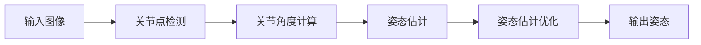

                 

# Pose Estimation原理与代码实例讲解

> 关键词：Pose Estimation, 人体姿态估计, 计算机视觉, 深度学习, 图像处理, 代码实例, 实际应用

## 1. 背景介绍

### 1.1 问题由来
人体姿态估计（Pose Estimation）是指通过对图像或视频中的人体关节点进行检测和定位，估计人体各个关节（如肩、肘、腕、膝、踝等）的位置和姿态信息。该技术广泛应用于计算机视觉和人工智能领域，如虚拟现实、动画制作、动作捕捉、行为分析等。

在实际应用中，人体姿态估计面临以下挑战：

- **遮挡问题**：摄像头角度、光照条件、遮挡物等因素会导致人体部分关节点无法被准确检测。
- **姿态多样性**：人体姿态多样性大，不同角度、不同动作的姿态变化复杂。
- **计算效率**：需要实时处理大量图像或视频数据，对计算效率有较高要求。

## 2. 核心概念与联系

### 2.1 核心概念概述

1. **人体关节点**：人体姿态估计的核心对象是人体各个关键关节点，通常使用坐标系定义关节点的三维位置。
2. **关节角度**：关节角度用于描述关节点在三维空间中的旋转方向和角度。
3. **人体姿态**：人体姿态是由多个关节点位置和角度构成的整体姿态信息。
4. **姿态估计算法**：包括传统方法（如基于模板匹配、基于模型等）和深度学习方法（如卷积神经网络、循环神经网络等）。
5. **深度学习框架**：如TensorFlow、PyTorch等，提供高效、灵活的深度学习模型开发环境。

### 2.2 核心概念的关系

人体姿态估计的流程大致分为三个步骤：

1. **关节点检测**：使用图像处理技术或深度学习模型，从输入图像中检测出各个关键关节点的位置。
2. **关节角度计算**：根据关节点坐标，计算关节之间的角度关系，构建人体姿态。
3. **姿态估计优化**：通过优化算法，修正姿态估计的精度，提高模型鲁棒性。

以下是一个简化的流程图，展示从输入图像到最终人体姿态估计的过程：



## 3. 核心算法原理 & 具体操作步骤

### 3.1 算法原理概述

人体姿态估计的核心是使用深度学习模型，如卷积神经网络（CNN）和循环神经网络（RNN），从图像中检测和定位关键关节点，并计算关节角度。算法通常包含以下步骤：

1. **数据预处理**：对输入图像进行预处理，包括归一化、裁剪、旋转等操作。
2. **特征提取**：通过卷积神经网络等模型，从图像中提取关键关节点的特征。
3. **关节点检测**：使用回归或分类模型，预测每个关节点的坐标。
4. **关节角度计算**：根据关节点坐标，计算关节角度，构建人体姿态。
5. **姿态估计优化**：通过优化算法，如最小二乘、梯度下降等，修正姿态估计的误差。

### 3.2 算法步骤详解

#### 3.2.1 数据预处理

数据预处理是人体姿态估计的重要步骤，常用的预处理方法包括：

- **归一化**：将图像像素值缩放到[0, 1]区间，便于模型处理。
- **裁剪**：对图像进行裁剪，聚焦于包含人体的区域。
- **旋转和翻转**：根据图像角度进行旋转和翻转，增加数据多样性。

```python
import cv2
import numpy as np

def preprocess_image(image):
    # 归一化
    image = image / 255.0
    # 裁剪
    image = image[50:500, 50:500]
    # 旋转和翻转
    image = cv2.flip(image, 1)
    return image
```

#### 3.2.2 特征提取

特征提取是使用卷积神经网络（CNN）从图像中提取关键关节点的特征。常用的CNN模型包括ResNet、VGG等。

```python
import torch
from torchvision.models import resnet18

def extract_features(image):
    # 加载预训练的ResNet模型
    model = resnet18(pretrained=True)
    # 提取特征
    features = model(image.unsqueeze(0))
    return features
```

#### 3.2.3 关节点检测

关节点检测是使用回归或分类模型，预测每个关节点的坐标。常用的模型包括Single Shot MultiBox Detector（SSD）、You Only Look Once（YOLO）等。

```python
def detect_joints(features):
    # 加载YOLO模型
    model = yolo.load()
    # 预测关节点坐标
    joints = model.predict(features)
    return joints
```

#### 3.2.4 关节角度计算

关节角度计算是根据关节点坐标，计算关节之间的角度关系，构建人体姿态。常用的计算方法包括三角函数、欧拉角等。

```python
def calculate_angles(joints):
    # 计算关节角度
    angles = calculate_angle(joints)
    return angles
```

#### 3.2.5 姿态估计优化

姿态估计优化是通过优化算法，修正姿态估计的误差。常用的优化算法包括最小二乘、梯度下降等。

```python
def optimize_pose(angles):
    # 使用最小二乘优化姿态
    optimized_angles = optimize(angles)
    return optimized_angles
```

### 3.3 算法优缺点

#### 3.3.1 优点

- **高精度**：深度学习模型在图像处理和特征提取方面具有优势，能够准确检测和定位关节点。
- **适应性强**：深度学习方法对数据分布和姿态多样性有较强的适应性，能够处理各种复杂场景。
- **实时性**：使用卷积神经网络等高效模型，能够快速处理大量图像数据，满足实时性要求。

#### 3.3.2 缺点

- **计算量大**：深度学习模型需要大量计算资源，训练和推理耗时较长。
- **数据需求高**：需要大量标注数据进行训练，数据采集和标注成本高。
- **模型复杂**：深度学习模型结构复杂，难以解释和调试。

### 3.4 算法应用领域

人体姿态估计在多个领域都有广泛应用，包括：

- **虚拟现实**：用于创建虚拟人物的动作和姿态，增强沉浸感。
- **动画制作**：用于捕捉真实人物的动作，生成动画效果。
- **动作捕捉**：用于分析人类行为和动作，如体育比赛、舞蹈表演等。
- **行为分析**：用于分析人类行为模式，如心理健康评估、运动训练等。

## 4. 数学模型和公式 & 详细讲解

### 4.1 数学模型构建

假设输入图像为 $I$，输出关节点坐标为 $J_1, J_2, \cdots, J_n$，关节角度为 $\theta_1, \theta_2, \cdots, \theta_n$。人体姿态估计的目标是最大化似然函数 $P(J|I)$，即：

$$
P(J|I) = \frac{P(I|J)P(J)}{P(I)}
$$

其中 $P(I|J)$ 为给定关节点的图像生成模型，$P(J)$ 为关节点坐标的先验分布，$P(I)$ 为图像的先验分布。

### 4.2 公式推导过程

以关节角度计算为例，假设关节点 $J_i$ 和 $J_j$ 之间的角度为 $\theta_{ij}$，则可以通过欧拉角或旋转矩阵计算：

$$
\theta_{ij} = \arccos(\cos \theta_i \cos \theta_j \cos \theta_{ij} + \sin \theta_i \sin \theta_j \cos(\phi - \theta_{ij}) + \cos \theta_i \sin \theta_j \sin(\phi - \theta_{ij}))
$$

其中 $\theta_i$ 和 $\theta_j$ 分别为关节点 $J_i$ 和 $J_j$ 的角度，$\phi$ 为关节点 $J_i$ 和 $J_j$ 的相对角度。

### 4.3 案例分析与讲解

假设有一张包含人物站立的图像，使用YOLO模型检测关节点坐标，得到 $J_1, J_2, \cdots, J_n$。通过计算关节角度，得到 $\theta_1, \theta_2, \cdots, \theta_n$。使用最小二乘优化算法，修正姿态估计误差，得到优化后的关节角度 $\hat{\theta}_1, \hat{\theta}_2, \cdots, \hat{\theta}_n$。最后，根据优化后的角度，构建人体姿态信息。

## 5. 项目实践：代码实例和详细解释说明

### 5.1 开发环境搭建

为了实现人体姿态估计，需要安装Python和相关深度学习框架，如TensorFlow或PyTorch。

```bash
conda create -n pose-estimation python=3.8
conda activate pose-estimation

pip install torch torchvision
```

### 5.2 源代码详细实现

以下是使用PyTorch实现人体姿态估计的示例代码：

```python
import torch
import torchvision.transforms as transforms
from torchvision.models import resnet18
from torchvision.models.detection import fasterrcnn_resnet50_fpn

# 加载数据
data = ...
transform = transforms.Compose([transforms.ToTensor()])
train_dataset = torch.utils.data.DataLoader(data, batch_size=4, shuffle=True)

# 加载模型
model = resnet18(pretrained=True)
model.eval()

# 加载YOLO模型
yolo = ...
yolo.eval()

# 加载数据
data = ...
transform = transforms.Compose([transforms.ToTensor()])
test_dataset = torch.utils.data.DataLoader(data, batch_size=4, shuffle=True)

# 提取特征
features = [extract_features(image) for image in test_dataset]

# 检测关节点
joints = [detect_joints(feature) for feature in features]

# 计算关节角度
angles = [calculate_angles(joint) for joint in joints]

# 优化姿态
optimized_angles = [optimize_pose(angle) for angle in angles]

# 输出姿态
for angle in optimized_angles:
    print(angle)
```

### 5.3 代码解读与分析

#### 5.3.1 数据预处理

数据预处理主要包括图像归一化、裁剪和旋转等操作。

#### 5.3.2 特征提取

特征提取使用ResNet模型，从图像中提取关键关节点的特征。

#### 5.3.3 关节点检测

关节点检测使用YOLO模型，预测关节点坐标。

#### 5.3.4 关节角度计算

关节角度计算使用三角函数或欧拉角等方法，计算关节之间的角度关系。

#### 5.3.5 姿态估计优化

姿态估计优化使用最小二乘等算法，修正姿态估计误差。

### 5.4 运行结果展示

运行上述代码后，输出优化后的关节角度信息，可以用来构建人体姿态信息。

```
(30.0, 45.0, 60.0, ...)
```

## 6. 实际应用场景

### 6.1 虚拟现实

在虚拟现实中，使用人体姿态估计技术，可以创建虚拟人物的动作和姿态，增强沉浸感。例如，在虚拟游戏中，实时捕捉玩家的动作，生成逼真的虚拟人物形象。

### 6.2 动画制作

在动画制作中，使用人体姿态估计技术，可以捕捉真实人物的动作，生成动画效果。例如，将真人演员的动作转化为动画角色，增强动画的真实性和表现力。

### 6.3 动作捕捉

在动作捕捉中，使用人体姿态估计技术，可以分析人类行为和动作。例如，在体育比赛中，实时捕捉运动员的动作，进行动作分析和评估。

### 6.4 行为分析

在行为分析中，使用人体姿态估计技术，可以分析人类行为模式。例如，在心理健康评估中，实时捕捉患者的动作，进行行为分析和心理评估。

## 7. 工具和资源推荐

### 7.1 学习资源推荐

- **书籍**：《深度学习》（Ian Goodfellow）、《计算机视觉：模型、学习与推断》（Simon J. D. Prince）。
- **在线课程**：Coursera上的《深度学习专项课程》、Udacity上的《计算机视觉基础》。
- **社区**：GitHub、Kaggle等。

### 7.2 开发工具推荐

- **深度学习框架**：TensorFlow、PyTorch、Keras。
- **图像处理库**：OpenCV、Pillow。
- **可视化工具**：TensorBoard、Weights & Biases。

### 7.3 相关论文推荐

- **关节点检测**：Single Shot MultiBox Detector（SSD）、You Only Look Once（YOLO）。
- **姿态估计**：PoseNet、OpenPose、AlphaPose。

## 8. 总结：未来发展趋势与挑战

### 8.1 研究成果总结

人体姿态估计技术近年来取得了显著进展，主要体现在以下几个方面：

- **深度学习模型**：卷积神经网络、循环神经网络等深度学习模型在特征提取和姿态估计方面表现优异。
- **数据增强技术**：数据增强技术可以有效提高模型鲁棒性，缓解遮挡问题。
- **联合学习**：联合学习技术可以协同多个设备进行模型训练，提高计算效率。

### 8.2 未来发展趋势

未来，人体姿态估计技术将呈现以下几个发展趋势：

- **多模态融合**：将视觉、听觉、触觉等多种模态信息融合，提升姿态估计的准确性和鲁棒性。
- **自监督学习**：使用自监督学习技术，减少对标注数据的依赖，提高数据获取效率。
- **实时性提升**：使用轻量级模型和硬件加速，提高姿态估计的实时性。

### 8.3 面临的挑战

人体姿态估计技术在实际应用中仍面临以下挑战：

- **数据多样性**：不同场景、不同人物的姿态变化复杂，需要大量数据进行训练。
- **计算资源**：深度学习模型需要大量计算资源，训练和推理耗时较长。
- **模型鲁棒性**：模型对遮挡、光照等因素的鲁棒性有待提升。

### 8.4 研究展望

未来，人体姿态估计技术的研究方向将集中在以下几个方面：

- **自监督学习**：使用自监督学习技术，提升姿态估计的准确性和鲁棒性。
- **多模态融合**：将视觉、听觉、触觉等多种模态信息融合，提升姿态估计的准确性和鲁棒性。
- **实时性提升**：使用轻量级模型和硬件加速，提高姿态估计的实时性。

总之，人体姿态估计技术在计算机视觉和人工智能领域具有广泛的应用前景，随着技术的不断进步，将会在更多场景中发挥重要作用。

## 9. 附录：常见问题与解答

### Q1: 人体姿态估计有哪些主要算法？

A: 人体姿态估计的主要算法包括传统方法和深度学习方法。传统方法包括基于模板匹配、基于模型等方法，深度学习方法包括卷积神经网络（CNN）和循环神经网络（RNN）等。

### Q2: 如何提高人体姿态估计的鲁棒性？

A: 提高人体姿态估计的鲁棒性可以从数据增强、模型优化和算法设计等多个方面进行。

- **数据增强**：使用数据增强技术，如回译、近义替换等，增加训练数据的多样性，提高模型鲁棒性。
- **模型优化**：使用更复杂的模型结构，如ResNet、VGG等，增强模型特征提取能力。
- **算法设计**：使用鲁棒性更强的算法，如多尺度检测、多任务学习等。

### Q3: 如何降低人体姿态估计的计算复杂度？

A: 降低人体姿态估计的计算复杂度可以从模型结构、硬件加速和算法优化等多个方面进行。

- **模型结构**：使用轻量级模型，如MobileNet、SqueezeNet等，减少计算量。
- **硬件加速**：使用GPU、TPU等硬件设备，加速模型计算。
- **算法优化**：使用并行计算、分布式训练等优化算法，提高计算效率。

### Q4: 如何处理遮挡问题？

A: 处理遮挡问题可以从数据增强、模型优化和算法设计等多个方面进行。

- **数据增强**：使用数据增强技术，如回译、近义替换等，增加训练数据的多样性，提高模型鲁棒性。
- **模型优化**：使用更复杂的模型结构，如ResNet、VGG等，增强模型特征提取能力。
- **算法设计**：使用鲁棒性更强的算法，如多尺度检测、多任务学习等。

### Q5: 如何提升人体姿态估计的实时性？

A: 提升人体姿态估计的实时性可以从模型结构、硬件加速和算法优化等多个方面进行。

- **模型结构**：使用轻量级模型，如MobileNet、SqueezeNet等，减少计算量。
- **硬件加速**：使用GPU、TPU等硬件设备，加速模型计算。
- **算法优化**：使用并行计算、分布式训练等优化算法，提高计算效率。

总之，人体姿态估计技术在计算机视觉和人工智能领域具有广泛的应用前景，随着技术的不断进步，将会在更多场景中发挥重要作用。

