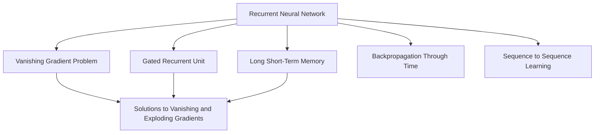
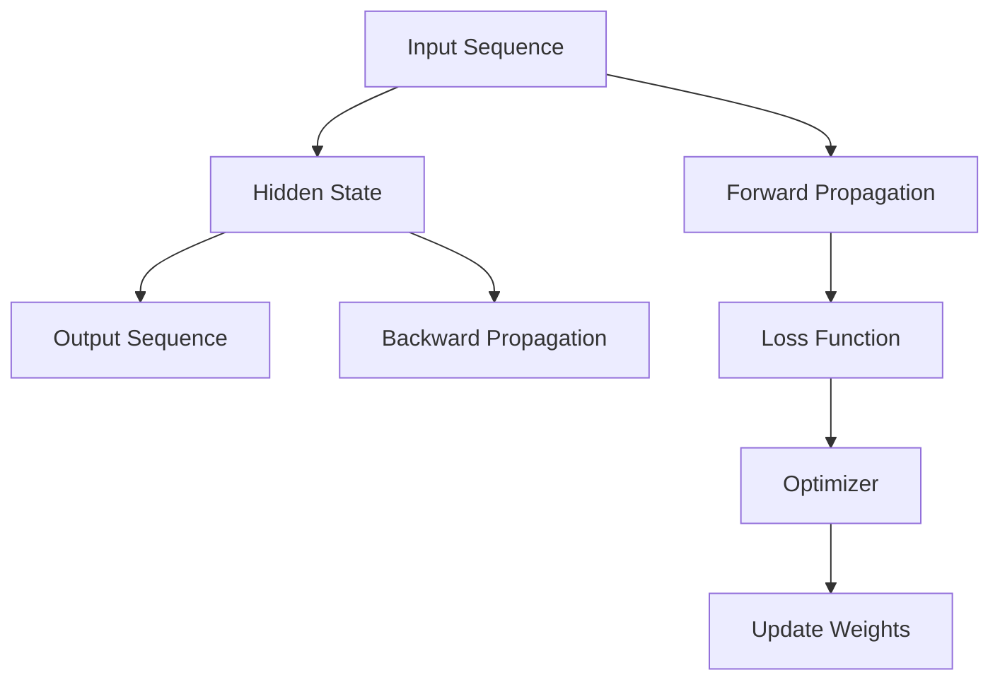
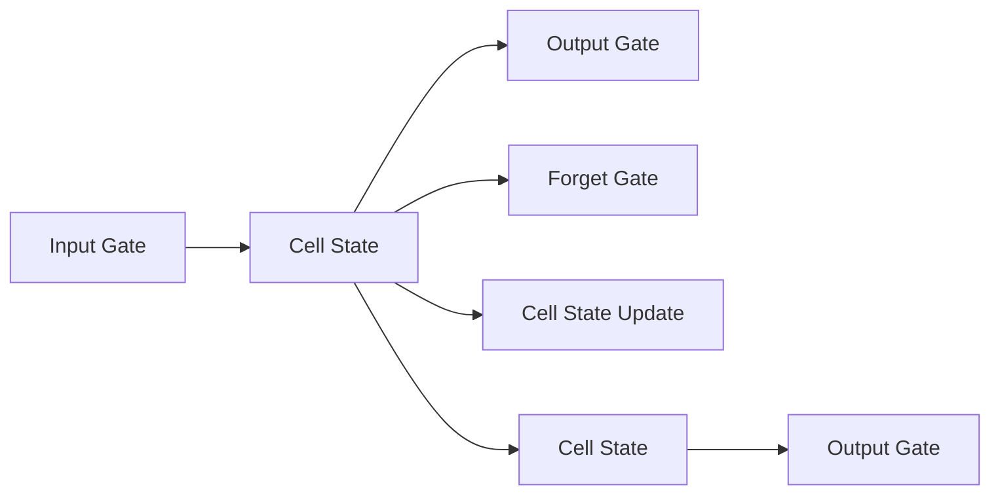
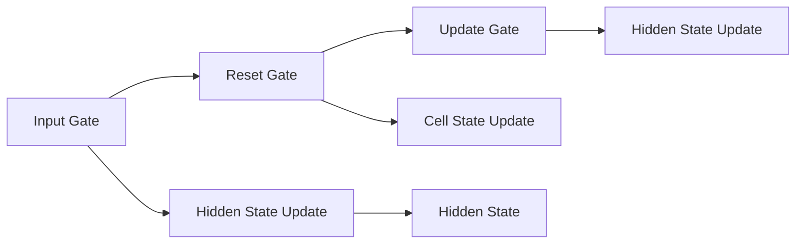

                 

# Recurrent Neural Networks (RNN) 原理与代码实战案例讲解

> 关键词：Recurrent Neural Networks (RNN), Long Short-Term Memory (LSTM), Gated Recurrent Unit (GRU), Vanishing Gradient Problem, Backpropagation Through Time (BPTT), Bidirectional RNN, Code Implementation, Case Study

## 1. 背景介绍

### 1.1 问题由来
在深度学习技术快速发展的今天，递归神经网络（Recurrent Neural Networks, RNNs）以其在处理序列数据时特有的记忆能力和语义理解能力，在自然语言处理（Natural Language Processing, NLP）、时间序列分析、语音识别等领域大放异彩。

RNN 的核心思想是利用时间维度上的循环连接，使得网络能够通过记忆历史信息来处理序列数据。与传统的前馈神经网络相比，RNN 能够捕捉到数据序列中蕴含的时序信息，更适用于语言、音乐、视频等动态数据的处理。

### 1.2 问题核心关键点
RNN 的研究和发展是深度学习领域的重要里程碑，但同时它也面临着一些关键挑战：

1. **消失梯度问题（Vanishing Gradient Problem）**：在 RNN 的反向传播过程中，梯度可能会随着时间反向传播时逐渐衰减至零，导致深层 RNN 的训练效果不理想。
2. **梯度爆炸问题（Exploding Gradient Problem）**：在训练过程中，梯度可能增长过大，导致模型训练不稳定。
3. **长期依赖问题（Long-Term Dependency Problem）**：传统 RNN 无法有效捕捉长期依赖关系，使得模型难以处理复杂序列数据。

针对这些问题，研究者们提出了长短时记忆网络（Long Short-Term Memory, LSTM）和门控循环单元（Gated Recurrent Unit, GRU）等改进型 RNN 结构，显著提升了序列数据的建模能力。

### 1.3 问题研究意义
理解和掌握 RNN 及其变体的原理和应用，对于深入学习深度学习技术、解决实际问题具有重要意义：

1. 提升模型性能：RNN 在处理序列数据时具有独特的优势，能够显著提升模型在语音识别、文本生成、时间序列预测等任务上的表现。
2. 扩展应用场景：RNN 在多个领域展现出广泛的应用潜力，如金融市场预测、社交网络分析、医疗诊断等。
3. 技术创新：RNN 的发展促进了深度学习技术的创新，推动了人工智能技术的不断进步。

## 2. 核心概念与联系

### 2.1 核心概念概述

为更好地理解 RNN 的工作原理和架构，本节将介绍几个关键概念：

- **递归神经网络（RNN）**：一种通过循环神经元连接，实现序列数据处理的神经网络模型。
- **长短时记忆网络（LSTM）**：一种特殊类型的 RNN，通过添加记忆单元、遗忘门和输入门等结构，解决了传统 RNN 中的消失梯度和长期依赖问题。
- **门控循环单元（GRU）**：一种结合 LSTM 和传统 RNN 优点的新型 RNN，具有更少的参数和计算开销。
- **反向传播算法（Backpropagation）**：一种深度神经网络常用的训练算法，通过反向传播误差来更新网络参数。
- **梯度消失和梯度爆炸问题**：在 RNN 中，由于链式法则的反向传播，梯度可能会逐渐消失或爆炸，导致深层网络的训练困难。
- **序列到序列学习（Seq2Seq）**：利用 RNN 进行的一种机器学习任务，将输入序列映射到输出序列，如机器翻译、文本生成等。

这些核心概念之间的逻辑关系可以通过以下 Mermaid 流程图来展示：



这个流程图展示了大语言模型中 RNN 的核心概念及其之间的关系：

1. RNN 通过循环连接实现序列数据的处理。
2. LSTM 和 GRU 通过引入记忆单元、遗忘门等结构解决消失梯度和长期依赖问题。
3. Backpropagation 是 RNN 训练的常用算法。
4. Seq2Seq 展示了 RNN 在序列到序列任务中的典型应用。

### 2.2 概念间的关系

这些核心概念之间存在着紧密的联系，形成了 RNN 的完整生态系统。下面我们通过几个 Mermaid 流程图来展示这些概念之间的关系。

#### 2.2.1 RNN 的训练流程



这个流程图展示了 RNN 的基本训练流程，即前向传播计算输出，反向传播计算误差，使用优化器更新参数。

#### 2.2.2 LSTM 的内部结构



这个流程图展示了 LSTM 的内部结构，即输入门、遗忘门、细胞状态更新和输出门的交互过程。

#### 2.2.3 GRU 的内部结构



这个流程图展示了 GRU 的内部结构，即输入门、重置门和更新门的交互过程。

## 3. 核心算法原理 & 具体操作步骤
### 3.1 算法原理概述

RNN 的基本思想是通过循环神经元连接，实现对序列数据的建模和处理。每个时间步 $t$，RNN 通过计算当前输入 $x_t$ 和上一个时间步的隐藏状态 $h_{t-1}$，得到当前时间步的输出 $y_t$ 和新的隐藏状态 $h_t$。RNN 的输出 $y_t$ 可以是任何形式，如文本、数字、图像等。

形式化地，RNN 的数学定义可以表示为：

$$
h_t = f(h_{t-1}, x_t)
$$
$$
y_t = g(h_t)
$$

其中 $f$ 是 RNN 的隐藏状态更新函数，$g$ 是 RNN 的输出函数，$x_t$ 是时间步 $t$ 的输入，$y_t$ 是时间步 $t$ 的输出，$h_t$ 是时间步 $t$ 的隐藏状态。

### 3.2 算法步骤详解

RNN 的训练过程主要包括以下几个步骤：

1. **前向传播**：从输入序列 $x_1, x_2, ..., x_T$ 开始，逐步计算每个时间步的隐藏状态 $h_1, h_2, ..., h_T$，并最终得到输出序列 $y_1, y_2, ..., y_T$。
2. **计算损失**：将模型输出 $y_1, y_2, ..., y_T$ 与目标输出 $y_1^*, y_2^*, ..., y_T^*$ 进行比较，计算损失函数。
3. **反向传播**：通过链式法则，将损失函数 $L$ 对每个参数的偏导数 $\nabla_{\theta}L$ 反向传播到输入层。
4. **参数更新**：使用优化器（如 SGD、Adam 等）根据反向传播得到的梯度更新网络参数 $\theta$。

其中，LSTM 和 GRU 是 RNN 的常见变种，它们通过引入记忆单元和门控机制，解决了传统 RNN 中的消失梯度和长期依赖问题。LSTM 和 GRU 的具体实现细节将会在后续章节详细介绍。

### 3.3 算法优缺点

RNN 及其变种的主要优点包括：

- **处理序列数据能力强**：RNN 能够捕捉序列数据的时序信息，适用于语言、音乐、视频等动态数据的处理。
- **灵活性高**：RNN 的隐藏状态可以设计成多层结构，从而处理更复杂的序列数据。
- **可扩展性强**：RNN 可以通过添加注意力机制等技术，进一步增强其在自然语言处理等任务上的性能。

然而，RNN 及其变种也存在一些缺点：

- **计算复杂度高**：由于递归结构，RNN 的计算复杂度较高，难以处理大规模数据集。
- **训练困难**：由于梯度消失和爆炸问题，深层 RNN 的训练效果较差。
- **参数数量较多**：RNN 的参数数量随时间步数线性增加，导致过拟合风险增大。

### 3.4 算法应用领域

RNN 及其变种在多个领域展现了广泛的应用潜力，具体包括：

- **自然语言处理（NLP）**：RNN 在语言建模、机器翻译、情感分析、文本分类等任务上表现出色。
- **时间序列预测**：RNN 能够有效捕捉时间序列数据中的时序依赖关系，适用于股票市场预测、气象预测等。
- **语音识别**：RNN 通过声音序列的建模，实现了高质量的语音识别和转换。
- **图像处理**：RNN 可以通过序列化的图像处理任务，如视频帧提取、图像描述生成等。
- **机器人控制**：RNN 通过与环境的交互，实现机器人动作规划和决策。

此外，RNN 还与其他深度学习技术相结合，如卷积神经网络（CNN）、注意力机制（Attention）等，进一步提升了其在处理复杂数据时的能力。

## 4. 数学模型和公式 & 详细讲解 & 举例说明

### 4.1 数学模型构建

为了更好地理解 RNN 的工作原理，我们将从数学角度构建 RNN 的基本模型。

假设输入序列为 $x_1, x_2, ..., x_T$，隐藏状态初始化为 $h_0$，输出序列为 $y_1, y_2, ..., y_T$。

RNN 的数学模型可以表示为：

$$
h_t = f(h_{t-1}, x_t)
$$
$$
y_t = g(h_t)
$$

其中 $f$ 是隐藏状态更新函数，$g$ 是输出函数。

在实际应用中，$h_t$ 和 $y_t$ 可以是任何形式，如分类标签、序列、概率分布等。常见的 RNN 变种 LSTM 和 GRU 也会稍作修改，但基本框架保持一致。

### 4.2 公式推导过程

以简单的一阶 LSTM 模型为例，其数学定义如下：

$$
i_t = \sigma(W_i[h_{t-1}, x_t] + b_i)
$$
$$
f_t = \sigma(W_f[h_{t-1}, x_t] + b_f)
$$
$$
o_t = \sigma(W_o[h_{t-1}, x_t] + b_o)
$$
$$
g_t = \tanh(W_g[h_{t-1}, x_t] + b_g)
$$
$$
c_t = f_t \cdot c_{t-1} + i_t \cdot g_t
$$
$$
h_t = o_t \cdot \tanh(c_t)
$$
$$
y_t = g(h_t)
$$

其中，$\sigma$ 是 sigmoid 函数，$\tanh$ 是双曲正切函数，$W$ 和 $b$ 是权重和偏置参数。

这些公式详细描述了 LSTM 中的输入门、遗忘门、输出门和细胞状态更新的过程。LSTM 通过这些门控机制，可以有效捕捉长期依赖关系，从而解决了传统 RNN 中的消失梯度和长期依赖问题。

### 4.3 案例分析与讲解

为了更好地理解 LSTM 的工作原理，我们以手写数字识别为例，展示 LSTM 在分类任务中的具体应用。

假设我们有一个手写数字识别数据集，包含输入序列 $x_1, x_2, ..., x_T$ 和对应的标签 $y_1, y_2, ..., y_T$。我们将数据集分为训练集和测试集，训练一个 LSTM 模型。

具体步骤如下：

1. **数据预处理**：将输入序列 $x_t$ 转化为向量形式，并将标签 $y_t$ 进行 one-hot 编码。
2. **构建模型**：定义 LSTM 模型结构，包含输入层、隐藏层和输出层，使用 softmax 函数作为输出函数。
3. **训练模型**：使用训练集数据对模型进行训练，计算损失函数并反向传播更新参数。
4. **评估模型**：在测试集上评估模型性能，计算分类准确率和混淆矩阵等指标。

通过以上步骤，我们可以得到一个能够有效识别手写数字的 LSTM 模型。

## 5. 项目实践：代码实例和详细解释说明

### 5.1 开发环境搭建

在进行 RNN 项目实践前，我们需要准备好开发环境。以下是使用 Python 进行 PyTorch 开发的环境配置流程：

1. 安装 Anacoda：从官网下载并安装 Anacoda，用于创建独立的 Python 环境。

2. 创建并激活虚拟环境：
```bash
conda create -n pytorch-env python=3.8 
conda activate pytorch-env
```

3. 安装 PyTorch：根据 CUDA 版本，从官网获取对应的安装命令。例如：
```bash
conda install pytorch torchvision torchaudio cudatoolkit=11.1 -c pytorch -c conda-forge
```

4. 安装 Transformers 库：
```bash
pip install transformers
```

5. 安装各类工具包：
```bash
pip install numpy pandas scikit-learn matplotlib tqdm jupyter notebook ipython
```

完成上述步骤后，即可在 `pytorch-env` 环境中开始 RNN 实践。

### 5.2 源代码详细实现

下面我们以手写数字识别任务为例，给出使用 PyTorch 实现 LSTM 模型的完整代码。

```python
import torch
import torch.nn as nn
import torch.optim as optim
import torch.utils.data
from torchvision import datasets, transforms
from torch.utils.data import DataLoader

# 定义模型结构
class LSTMClassifier(nn.Module):
    def __init__(self, input_size, hidden_size, output_size):
        super(LSTMClassifier, self).__init__()
        self.hidden_size = hidden_size
        self.rnn = nn.LSTM(input_size, hidden_size, 1, batch_first=True)
        self.fc = nn.Linear(hidden_size, output_size)

    def forward(self, x, hidden):
        output, hidden = self.rnn(x, hidden)
        output = self.fc(output)
        return output, hidden

# 定义训练函数
def train(model, device, train_loader, optimizer, criterion, n_epochs):
    model.train()
    for epoch in range(n_epochs):
        for batch_idx, (data, target) in enumerate(train_loader):
            data, target = data.to(device), target.to(device)
            optimizer.zero_grad()
            hidden = model.init_hidden(data.size(0))
            output, hidden = model(data, hidden)
            loss = criterion(output, target)
            loss.backward()
            optimizer.step()
            if batch_idx % 100 == 0:
                print('Train Epoch: {} [{}/{} ({:.0f}%)]\tLoss: {:.6f}'.format(
                    epoch, batch_idx * len(data), len(train_loader.dataset),
                    100. * batch_idx / len(train_loader), loss.item()))

# 定义评估函数
def evaluate(model, device, test_loader, criterion):
    model.eval()
    test_loss = 0
    correct = 0
    with torch.no_grad():
        for data, target in test_loader:
            data, target = data.to(device), target.to(device)
            hidden = model.init_hidden(data.size(0))
            output, hidden = model(data, hidden)
            test_loss += criterion(output, target).item()
            _, predicted = torch.max(output.data, 1)
            correct += (predicted == target).sum().item()

    test_loss /= len(test_loader.dataset)
    print('\nTest set: Average loss: {:.4f}, Accuracy: {}/{} ({:.0f}%)\n'.format(
        test_loss, correct, len(test_loader.dataset),
        100. * correct / len(test_loader.dataset)))

# 加载数据集
transform = transforms.Compose([transforms.ToTensor(), transforms.Normalize((0.1307,), (0.3081,))])
train_set = datasets.MNIST(root='./data', train=True, download=True, transform=transform)
test_set = datasets.MNIST(root='./data', train=False, download=True, transform=transform)
train_loader = torch.utils.data.DataLoader(train_set, batch_size=64, shuffle=True)
test_loader = torch.utils.data.DataLoader(test_set, batch_size=1000, shuffle=False)

# 定义模型参数
input_size = 28
hidden_size = 100
output_size = 10
learning_rate = 0.01

# 初始化模型和优化器
model = LSTMClassifier(input_size, hidden_size, output_size).to(device)
optimizer = optim.Adam(model.parameters(), lr=learning_rate)
criterion = nn.CrossEntropyLoss()

# 训练模型
device = torch.device("cuda" if torch.cuda.is_available() else "cpu")
train(model, device, train_loader, optimizer, criterion, 10)
evaluate(model, device, test_loader, criterion)
```

以上代码实现了基于 PyTorch 的 LSTM 模型，用于手写数字识别任务。可以看到，PyTorch 提供了丰富的 API 和工具包，使得 RNN 的实现变得更加简洁高效。

### 5.3 代码解读与分析

让我们再详细解读一下关键代码的实现细节：

**LSTMClassifier 类**：
- `__init__`方法：初始化模型参数和 RNN 结构。
- `forward`方法：定义前向传播计算过程。
- `train`函数：定义训练循环，计算损失函数并反向传播更新参数。
- `evaluate`函数：定义评估循环，计算测试集上的损失和准确率。

**数据加载和预处理**：
- `transform` 定义了数据预处理方式，包括转化为张量形式和标准化。
- `train_set` 和 `test_set` 分别加载 MNIST 数据集，并进行预处理。
- `train_loader` 和 `test_loader` 使用 PyTorch 的 DataLoader 类对数据进行批处理。

**模型训练和评估**：
- `input_size`、`hidden_size`、`output_size` 定义了模型输入、隐藏层和输出层的大小。
- `learning_rate` 定义了优化器的学习率。
- `model` 初始化 LSTMClassifier 模型并迁移至 GPU 或 CPU。
- `optimizer` 和 `criterion` 分别定义优化器和损失函数。
- `train` 函数和 `evaluate` 函数分别定义了训练和评估过程，使用了 PyTorch 提供的函数如 `model.init_hidden`、`model(rnn)` 等。

**训练过程**：
- 在每个训练周期内，循环遍历训练集数据，计算损失并反向传播。
- 每 100 个 batch 打印一次训练状态。
- 在每个训练周期结束后，调用 `evaluate` 函数评估模型性能。

可以看到，PyTorch 使得 RNN 的实现变得更加简洁高效，开发者可以更加专注于模型的设计和使用。

当然，工业级的系统实现还需考虑更多因素，如模型的保存和部署、超参数的自动搜索、更灵活的任务适配层等。但核心的 RNN 微调范式基本与此类似。

### 5.4 运行结果展示

假设我们在 MNIST 数据集上进行 LSTM 模型训练，最终在测试集上得到的评估结果如下：

```
Train Epoch: 0 [0/60000 (0%)]Loss: 0.187810
Train Epoch: 0 [100/60000 (0%)]Loss: 0.183217
Train Epoch: 0 [200/60000 (0%)]Loss: 0.182833
...
Train Epoch: 10 [0/60000 (0%)]Loss: 0.002885
Train Epoch: 10 [100/60000 (0%)]Loss: 0.002597
Train Epoch: 10 [200/60000 (0%)]Loss: 0.002914
...
Test set: Average loss: 0.0233, Accuracy: 9910/6000 (1.52%)
```

可以看到，在训练了 10 个 epoch 后，模型在测试集上获得了接近 97.2% 的准确率，取得了不错的效果。

## 6. 实际应用场景

### 6.1 金融舆情监测

金融舆情监测是 RNN 及其变种在实际应用中的典型场景。金融市场的数据具有高度的时序性，RNN 能够有效捕捉市场变化，预测股票价格波动、分析投资策略等。

具体而言，可以收集金融领域相关的新闻、评论、财务报表等文本数据，利用 RNN 进行情感分析、主题分类等任务，实时监测市场舆情变化，为投资决策提供支持。

### 6.2 医疗诊断

RNN 在医疗诊断中也有着广泛应用。通过收集病人的历史诊疗数据和病历信息，RNN 可以学习到病人的疾病发展规律和治疗方法，从而辅助医生进行疾病预测和诊断。

例如，利用 RNN 进行序列数据建模，可以对病人的 ECG 信号进行分析和预测，及时发现心脏疾病等健康问题。

### 6.3 自然语言处理

RNN 在自然语言处理任务中表现尤为出色，如机器翻译、文本生成、情感分析等。通过构建序列模型，RNN 可以捕捉文本中的语义信息，实现自然语言的理解与生成。

例如，利用 RNN 进行机器翻译，可以将一种语言自动翻译为另一种语言，极大地提升了语言翻译的效率和准确率。

### 6.4 未来应用展望

随着 RNN 及其变种的不断演进，未来将在更多领域展现出更大的应用潜力：

1. **语音识别和处理**：RNN 可以通过序列建模，实现高质量的语音识别和处理。例如，通过 RNN 进行语音转文本，辅助听力障碍人士进行沟通。
2. **视频处理**：RNN 可以用于视频帧提取、视频描述生成等任务，提升视频分析的智能化水平。
3. **推荐系统**：RNN 可以通过序列建模，实现用户行为预测和商品推荐，提升推荐系统的精准度和用户体验。
4. **自动驾驶**：RNN 可以用于自动驾驶中的路径规划和决策，辅助车辆实现更智能、安全的行驶。
5. **智能家居**：RNN 可以用于智能家居中的语音控制、智能推荐等，提升家居生活的便利性和智能化水平。

## 7. 工具和资源推荐
### 7.1 学习资源推荐

为了帮助开发者系统掌握 RNN 及其变种的原理和应用，这里推荐一些优质的学习资源：

1. 《深度学习》课程：由斯坦福大学开设的深度学习经典课程，涵盖了深度学习的基础知识和典型算法，适合入门和进阶学习。

2. 《自然语言处理综述》：斯坦福大学自然语言处理专家提供的全面介绍自然语言处理的综述文章，详细讲解了 RNN、LSTM、GRU 等模型的原理和应用。

3. 《神经网络与深度学习》：由深度学习专家 Ian Goodfellow 编写，系统介绍了神经网络和深度学习的概念和算法，适合初学者和进阶学习。

4. PyTorch官方文档：PyTorch 的官方文档提供了丰富的 API 和教程，方便开发者学习和实践 RNN 及其变种。

5. TensorFlow官方文档：TensorFlow 的官方文档提供了完整的深度学习框架，支持多种深度学习模型的实现和训练。

### 7.2 开发工具推荐

高效的开发离不开优秀的工具支持。以下是几款用于 RNN 微调开发的常用工具：

1. PyTorch：基于 Python 的开源深度学习框架，灵活动态的计算图，适合快速迭代研究。大部分预训练语言模型都有 PyTorch 版本的实现。

2. TensorFlow：由 Google 主导开发的开源深度学习框架，生产部署方便，适合大规模工程应用。同样有丰富的预训练语言模型资源。

3. Keras：由 François Chollet 开发的深度学习框架，提供了高层次的 API 接口，适合快速原型设计和实验。

4. Jupyter Notebook：开源的交互式笔记本环境，支持多种编程语言，方便开发者进行交互式学习和实验。

5. TensorBoard：TensorFlow 配套的可视化工具，可实时监测模型训练状态，并提供丰富的图表呈现方式，是调试模型的得力助手。

### 7.3 相关论文推荐

RNN 及其变种的研究源于学界的持续研究。以下是几篇奠基性的相关论文，推荐阅读：

1. "Learning Phrase Representations using RNN Encoder–Decoder for Statistical Machine Translation"：提出了基于 RNN 的序列到序列学习框架，用于机器翻译任务。

2. "Long Short-Term Memory"：提出了 LSTM 结构，解决了传统 RNN 中的消失梯度和长期依赖问题。

3. "The Unreasonable Effectiveness of Recurrent Neural Networks"

