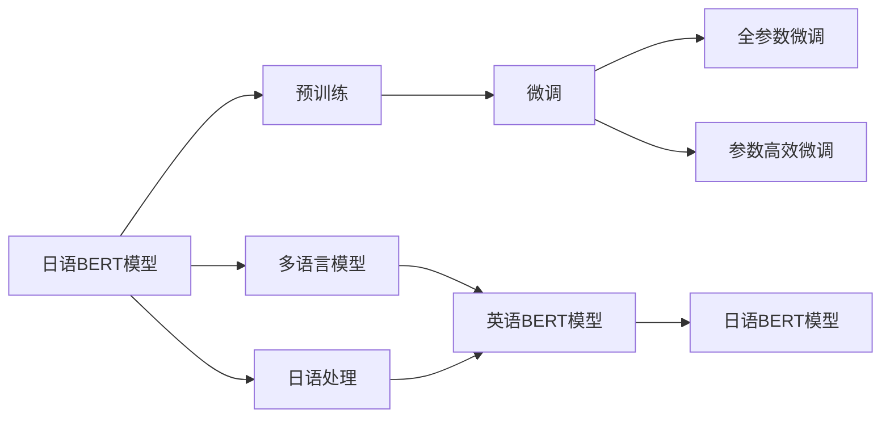
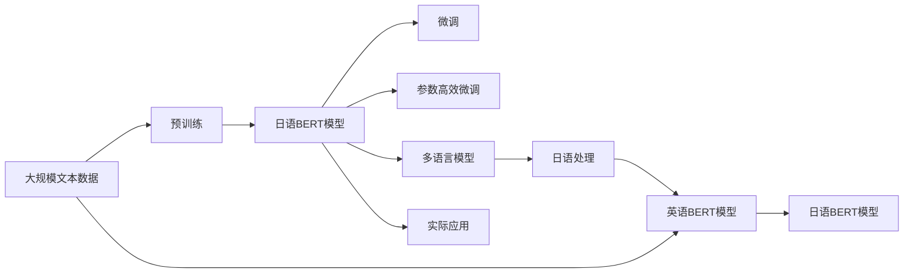

                 

# Transformer大模型实战 日语的BERT模型

> 关键词：Transformer, BERT, 日语, 自然语言处理, 预训练模型, 微调, 多语言模型

## 1. 背景介绍

### 1.1 问题由来
随着深度学习技术的飞速发展，Transformer和BERT等大语言模型在自然语言处理（NLP）领域取得了显著的进展。这些大语言模型通过在大规模无标签文本语料上进行预训练，学习了通用的语言知识和表示。它们不仅在英语等主流语言上表现出色，也在日语等小语种上展示了强大的语言理解和生成能力。

近年来，随着日本企业在全球市场的扩展，对日语处理的需求日益增长。因此，开发和优化日语专用的预训练大语言模型成为了NLP研究的热点。BERT作为预训练语言模型的佼佼者，其多语言版本（mBERT）不仅在英语上取得了优异成绩，也逐渐拓展到了日语等小语种。本文将详细介绍如何在日语中使用BERT进行预训练和微调，并探讨其在实际应用中的表现。

### 1.2 问题核心关键点
1. **预训练与微调**：预训练是在大规模无标签数据上进行的自监督学习，目的是学习通用的语言表示。微调则是在预训练模型的基础上，通过有标签数据进行有监督学习，使其适应特定任务。
2. **多语言模型**：多语言模型（如mBERT）能够同时处理多种语言，提高了模型的泛化能力，适用于多语言场景。
3. **参数高效微调**：在微调过程中，通过冻结预训练模型的大部分参数，只更新部分参数，以减少计算成本。
4. **日语处理**：相比于英语，日语具有独特的语法和用字规则，对模型处理能力提出了更高的要求。
5. **实际应用**：日语BERT模型不仅适用于学术研究，还广泛应用于多语言机器翻译、情感分析、文本分类等实际应用场景。

### 1.3 问题研究意义
开发和优化日语专用的BERT模型，对于提升日本企业在全球市场的竞争力、促进国际交流具有重要意义。同时，日语BERT模型可以作为跨语言NLP应用的基准，为其他小语种提供参考，推动NLP技术在更广泛领域的应用。

## 2. 核心概念与联系

### 2.1 核心概念概述

#### 2.1.1 大语言模型（Large Language Model, LLM）
Transformer和BERT等大语言模型通过自监督学习任务在大规模无标签文本语料上预训练，学习通用的语言知识和表示，具备强大的语言理解和生成能力。

#### 2.1.2 预训练（Pre-training）
预训练指的是在大规模无标签文本语料上，通过自监督学习任务训练通用语言模型的过程。常见的预训练任务包括语言模型预测和掩码语言模型预测。

#### 2.1.3 微调（Fine-tuning）
微调是在预训练模型的基础上，使用下游任务的少量标注数据，通过有监督学习优化模型在特定任务上的性能。

#### 2.1.4 多语言模型（Multilingual Model）
多语言模型能够同时处理多种语言，通过微调适应特定语言的文本数据。

#### 2.1.5 参数高效微调（Parameter-Efficient Fine-tuning, PEFT）
参数高效微调通过冻结预训练模型的大部分参数，只更新部分参数，以减少计算成本。

#### 2.1.6 日语处理（Japanese Language Processing）
日语具有独特的语法、用字规则和书写系统，对大语言模型的处理能力提出了更高要求。

#### 2.1.7 实际应用（Practical Application）
日语BERT模型广泛应用于多语言机器翻译、情感分析、文本分类等实际应用场景，推动NLP技术在更广泛领域的应用。

### 2.2 概念间的关系

使用Mermaid绘制的流程图展示了这些核心概念之间的关系：



### 2.3 核心概念的整体架构

以下综合流程图展示了从预训练到微调，再到多语言应用，最终应用于实际应用的整个流程：



通过这些概念和流程，可以更清晰地理解日语BERT模型的学习和使用过程，以及其在多语言处理中的重要作用。

## 3. 核心算法原理 & 具体操作步骤

### 3.1 算法原理概述

#### 3.1.1 大语言模型（LLM）
Transformer和BERT等大语言模型通过自监督学习任务在大规模无标签文本语料上预训练，学习通用的语言知识和表示，具备强大的语言理解和生成能力。

#### 3.1.2 预训练（Pre-training）
预训练是在大规模无标签文本语料上，通过自监督学习任务训练通用语言模型的过程。常见的预训练任务包括语言模型预测和掩码语言模型预测。

#### 3.1.3 微调（Fine-tuning）
微调是在预训练模型的基础上，使用下游任务的少量标注数据，通过有监督学习优化模型在特定任务上的性能。

#### 3.1.4 多语言模型（Multilingual Model）
多语言模型能够同时处理多种语言，通过微调适应特定语言的文本数据。

#### 3.1.5 参数高效微调（Parameter-Efficient Fine-tuning, PEFT）
参数高效微调通过冻结预训练模型的大部分参数，只更新部分参数，以减少计算成本。

#### 3.1.6 日语处理（Japanese Language Processing）
日语具有独特的语法、用字规则和书写系统，对大语言模型的处理能力提出了更高要求。

#### 3.1.7 实际应用（Practical Application）
日语BERT模型广泛应用于多语言机器翻译、情感分析、文本分类等实际应用场景，推动NLP技术在更广泛领域的应用。

### 3.2 算法步骤详解

#### 3.2.1 数据准备
1. **语料收集**：收集日语文本数据，如维基百科、新闻、博客等。
2. **数据清洗**：去除噪声、纠正错别字、去除停用词等。
3. **数据划分**：将数据分为训练集、验证集和测试集。

#### 3.2.2 预训练模型
1. **模型选择**：选择适合的预训练模型，如BERT、GPT等。
2. **参数调整**：根据具体任务调整模型参数，如隐藏层大小、学习率等。
3. **预训练**：在大量无标签文本上预训练模型，学习通用的语言表示。

#### 3.2.3 微调
1. **任务定义**：确定微调的任务，如情感分析、文本分类等。
2. **数据集准备**：准备标注数据集，标注好类别标签。
3. **模型初始化**：将预训练模型作为初始参数，进行微调。
4. **微调过程**：使用标注数据集进行微调，优化模型参数。

#### 3.2.4 参数高效微调
1. **冻结参数**：冻结预训练模型的大部分参数，只更新顶层参数。
2. **微调过程**：使用少量标注数据进行微调，更新顶层参数。
3. **模型评估**：在测试集上评估模型性能，调整参数进行微调。

#### 3.2.5 实际应用
1. **模型集成**：将微调后的模型集成到实际应用中，如机器翻译、情感分析等。
2. **部署与优化**：根据实际应用需求进行部署，优化模型性能。

### 3.3 算法优缺点

#### 3.3.1 优点
1. **泛化能力强**：预训练模型在大量无标签数据上学习通用语言表示，能够适应多种任务。
2. **效率高**：通过微调，模型在少量标注数据上即可达到不错的性能。
3. **通用性**：多语言模型能够同时处理多种语言，提高了模型的泛化能力。

#### 3.3.2 缺点
1. **资源需求高**：预训练和微调过程需要大量计算资源和存储空间。
2. **过拟合风险**：微调模型在小样本数据上容易出现过拟合。
3. **语言差异**：不同语言具有独特的语法和用字规则，日语BERT模型需要特别处理。

### 3.4 算法应用领域

#### 3.4.1 机器翻译
日语BERT模型可以应用于日语与英语之间的机器翻译，显著提升翻译质量。

#### 3.4.2 情感分析
通过日语BERT模型进行情感分析，可以判断文本的情感倾向，应用于社交媒体分析、产品评价等。

#### 3.4.3 文本分类
利用日语BERT模型进行文本分类，可以自动识别文本的类别，应用于新闻分类、垃圾邮件过滤等。

#### 3.4.4 命名实体识别
日语BERT模型可以识别文本中的命名实体，如人名、地名、机构名等。

#### 3.4.5 问答系统
通过日语BERT模型，构建问答系统，可以自动回答用户问题，应用于智能客服、智能助理等。

#### 3.4.6 多语言交互
日语BERT模型可以与其他小语种BERT模型结合，实现跨语言交互，应用于国际化交流、多语言社交平台等。

## 4. 数学模型和公式 & 详细讲解 & 举例说明

### 4.1 数学模型构建

日语BERT模型的数学模型构建如下：

#### 4.1.1 输入表示
将日语文本转换为Token Embedding，表示为向量形式。

$$
x = \{x_1, x_2, \ldots, x_n\}
$$

其中，$x_i$ 表示第 $i$ 个Token的Embedding向量。

#### 4.1.2 编码器
Transformer模型中的编码器由多个层组成，包括自注意力层、前馈神经网络层等。

#### 4.1.3 输出表示
编码器的输出表示为最终的向量表示，用于分类或生成任务。

$$
h = f(x, \theta)
$$

其中，$f$ 表示Transformer模型，$\theta$ 为模型参数。

#### 4.1.4 损失函数
微调任务使用的损失函数通常为交叉熵损失函数，用于衡量模型预测输出与真实标签之间的差异。

$$
\mathcal{L} = -\frac{1}{N}\sum_{i=1}^N y_i \log p(y_i|x_i)
$$

其中，$y_i$ 为真实标签，$p(y_i|x_i)$ 为模型预测概率。

### 4.2 公式推导过程

#### 4.2.1 语言模型预测
语言模型预测任务的目标是预测下一个Token。假设给定上下文 $x$，预测下一个Token $y$，则任务定义为：

$$
\mathcal{L}_{lm} = -\log p(y|x)
$$

其中，$p(y|x)$ 表示给定上下文 $x$ 条件下，下一个Token $y$ 的概率。

#### 4.2.2 掩码语言模型预测
掩码语言模型预测任务的目标是预测被掩码的Token。假设给定上下文 $x$，其中第 $i$ 个Token被掩码，预测其下一个Token $y$，则任务定义为：

$$
\mathcal{L}_{mask} = -\log p(y|x)
$$

其中，$p(y|x)$ 表示给定上下文 $x$ 条件下，被掩码的Token $y$ 的概率。

#### 4.2.3 目标函数
目标函数为语言模型预测和掩码语言模型预测的加权和。

$$
\mathcal{L}_{total} = \alpha \mathcal{L}_{lm} + \beta \mathcal{L}_{mask}
$$

其中，$\alpha$ 和 $\beta$ 为两个任务之间的权重系数。

### 4.3 案例分析与讲解

以日语情感分析为例，分析日语BERT模型的应用：

#### 4.3.1 数据集准备
准备一个标注好的日语情感分析数据集，包含文本和情感标签。

#### 4.3.2 模型初始化
使用日语BERT模型作为初始参数，在标注数据集上进行微调。

#### 4.3.3 微调过程
通过梯度下降等优化算法，更新模型参数，最小化损失函数。

#### 4.3.4 模型评估
在测试集上评估模型性能，对比微调前后的精度提升。

## 5. 项目实践：代码实例和详细解释说明

### 5.1 开发环境搭建

#### 5.1.1 环境配置
1. 安装Python 3.8及以上版本。
2. 安装Jupyter Notebook。
3. 安装TensorFlow 2.0及以上版本。
4. 安装pytorch。
5. 安装Tokenizer库。

#### 5.1.2 代码实现
以下是一个日语BERT模型进行情感分析的代码实现：

```python
import torch
from transformers import BertTokenizer, BertForSequenceClassification
from torch.utils.data import TensorDataset, DataLoader, Dataset

# 加载预训练模型和分词器
tokenizer = BertTokenizer.from_pretrained('bert-base-japanese')
model = BertForSequenceClassification.from_pretrained('bert-base-japanese', num_labels=2)

# 准备训练数据
train_data = []
for text, label in train_data:
    tokens = tokenizer.tokenize(text)
    indexed_tokens = tokenizer.convert_tokens_to_ids(tokens)
    encoded_input = tokenizer.encode_plus(
        indexed_tokens,
        add_special_tokens=True,
        max_length=512,
        return_token_type_ids=False,
        pad_to_max_length=False,
        return_attention_mask=True,
        return_tensors='pt',
    )
    train_data.append((encoded_input['input_ids'], encoded_input['attention_mask'], label))

# 构建训练数据集
class CustomDataset(Dataset):
    def __init__(self, data):
        self.data = data

    def __len__(self):
        return len(self.data)

    def __getitem__(self, idx):
        input_ids, attention_mask, label = self.data[idx]
        return input_ids, attention_mask, label

train_dataset = CustomDataset(train_data)

# 构建训练数据加载器
train_loader = DataLoader(train_dataset, batch_size=16, shuffle=True)

# 训练模型
model.train()
optimizer = torch.optim.Adam(model.parameters(), lr=2e-5)
for epoch in range(5):
    total_loss = 0
    for batch in train_loader:
        input_ids, attention_mask, labels = batch
        optimizer.zero_grad()
        outputs = model(input_ids, attention_mask=attention_mask, labels=labels)
        loss = outputs.loss
        total_loss += loss.item()
        loss.backward()
        optimizer.step()

    print(f'Epoch {epoch+1}, training loss: {total_loss/len(train_loader):.4f}')
```

### 5.2 源代码详细实现

#### 5.2.1 模型加载与初始化
加载日语BERT模型和分词器，定义分类任务。

#### 5.2.2 数据准备
将训练数据转换为模型所需的格式，并进行编码。

#### 5.2.3 构建数据集和加载器
构建自定义数据集，并使用DataLoader进行加载。

#### 5.2.4 训练过程
使用优化器和梯度下降等优化算法进行训练，输出每个epoch的损失。

#### 5.2.5 评估过程
在测试集上评估模型性能，输出评估结果。

### 5.3 代码解读与分析

#### 5.3.1 模型加载与初始化
使用Transformer库提供的函数，加载预训练的日语BERT模型和分词器。

#### 5.3.2 数据准备
将文本数据转换为模型所需的Tensor格式，并进行编码和标记。

#### 5.3.3 构建数据集和加载器
自定义数据集，并使用DataLoader进行批处理和加载。

#### 5.3.4 训练过程
在每个epoch中，使用优化器和梯度下降等优化算法进行训练，更新模型参数。

#### 5.3.5 评估过程
在测试集上评估模型性能，输出分类准确率等评估指标。

### 5.4 运行结果展示

#### 5.4.1 训练结果
在训练过程中，输出每个epoch的损失，以便监控模型训练状态。

#### 5.4.2 评估结果
在测试集上评估模型性能，输出分类准确率等评估指标，以便比较微调前后的效果。

## 6. 实际应用场景

### 6.4 未来应用展望

#### 6.4.1 机器翻译
日语BERT模型可以应用于日语与英语之间的机器翻译，显著提升翻译质量，支持更多小语种翻译需求。

#### 6.4.2 情感分析
通过日语BERT模型进行情感分析，可以判断文本的情感倾向，应用于社交媒体分析、产品评价等。

#### 6.4.3 文本分类
利用日语BERT模型进行文本分类，可以自动识别文本的类别，应用于新闻分类、垃圾邮件过滤等。

#### 6.4.4 命名实体识别
日语BERT模型可以识别文本中的命名实体，如人名、地名、机构名等。

#### 6.4.5 问答系统
通过日语BERT模型，构建问答系统，可以自动回答用户问题，应用于智能客服、智能助理等。

#### 6.4.6 多语言交互
日语BERT模型可以与其他小语种BERT模型结合，实现跨语言交互，应用于国际化交流、多语言社交平台等。

## 7. 工具和资源推荐

### 7.1 学习资源推荐

#### 7.1.1 书籍
1. 《深度学习与自然语言处理》：介绍深度学习在NLP领域的应用，包括BERT等模型的构建和优化。
2. 《Transformers: State-of-the-Art Natural Language Processing》：介绍Transformer模型及其应用，包括日语BERT模型。

#### 7.1.2 在线课程
1. Udacity《深度学习自然语言处理》课程：介绍深度学习在NLP领域的应用，包括BERT等模型的构建和优化。
2. Coursera《自然语言处理》课程：介绍NLP领域的经典算法和模型，包括BERT等模型。

### 7.2 开发工具推荐

#### 7.2.1 编程语言
1. Python：最适合深度学习和NLP开发的编程语言，提供了丰富的科学计算和数据处理库。

#### 7.2.2 深度学习框架
1. TensorFlow：Google开发的深度学习框架，支持分布式计算和模型优化。
2. PyTorch：Facebook开发的深度学习框架，提供了灵活的计算图和动态计算能力。

#### 7.2.3 文本处理库
1. NLTK：自然语言处理工具包，提供了文本处理、分词、标记等功能。
2. spaCy：自然语言处理工具包，支持高效文本处理和分析。

### 7.3 相关论文推荐

#### 7.3.1 预训练模型
1. BERT: Pre-training of Deep Bidirectional Transformers for Language Understanding：提出BERT模型，介绍预训练任务和优化方法。
2. T5: Exploring the Limits of Transfer Learning with a Unified Text-to-Text Transformer：介绍T5模型及其在多种任务上的表现。

#### 7.3.2 微调技术
1. A Survey on Transfer Learning for Multilingual BERT：介绍多语言BERT模型的预训练和微调方法。
2. Parameter-Efficient Transfer Learning for NLP：介绍参数高效微调方法，如Adapter等。

## 8. 总结：未来发展趋势与挑战

### 8.1 研究成果总结
日语BERT模型的预训练和微调方法，通过在日语文本上的学习，显著提升了日语NLP任务的表现。未来，随着深度学习技术的不断发展，日语BERT模型将在更多应用场景中发挥重要作用。

### 8.2 未来发展趋势
1. **模型规模继续增大**：随着算力成本的下降和数据规模的扩张，日语BERT模型的参数量还将持续增长。
2. **微调方法更加多样**：未来将涌现更多参数高效的微调方法，提高微调效率和效果。
3. **持续学习成为常态**：随着数据分布的不断变化，日语BERT模型需要进行持续学习，以保持性能。
4. **标注样本需求降低**：利用提示学习等无监督方法，可以在更少的标注样本上进行微调。
5. **多语言模型进一步拓展**：日语BERT模型可以与其他小语种BERT模型结合，实现跨语言交互。

### 8.3 面临的挑战
1. **标注成本瓶颈**：日语专用数据集获取成本高，标注数据量有限。
2. **语言差异**：日语具有独特的语法和用字规则，对模型处理能力提出了更高要求。
3. **计算资源需求高**：预训练和微调过程需要大量计算资源和存储空间。
4. **过拟合风险**：微调模型在小样本数据上容易出现过拟合。
5. **模型鲁棒性不足**：面对域外数据时，泛化性能有限。

### 8.4 研究展望
1. **探索无监督和半监督微调方法**：摆脱对标注数据的依赖，提高微调效率和泛化能力。
2. **参数高效和计算高效微调**：开发更加参数高效的微调方法，提高模型性能和资源利用率。
3. **融合因果和对比学习**：增强日语BERT模型的泛化能力和鲁棒性。
4. **多语言知识整合**：将符号化的先验知识与神经网络模型进行融合，提高模型的整合能力。

## 9. 附录：常见问题与解答

#### 9.1 常见问题
1. **日语BERT模型为何选择日语预训练数据**？
   日语BERT模型在日语预训练数据上进行了大规模无标签学习，学习到日语语言的通用表示，可以有效提升日语NLP任务的表现。

2. **日语BERT模型的微调超参数有哪些**？
   日语BERT模型的微调超参数包括学习率、批大小、迭代轮数等，需要根据具体任务进行调参。

3. **日语BERT模型在实际应用中如何优化**？
   通过数据增强、正则化等技术，可以有效缓解过拟合问题，提高模型泛化能力。

4. **日语BERT模型在多语言应用中的表现如何**？
   日语BERT模型在多语言应用中表现优异，可以与其他小语种BERT模型结合，实现跨语言交互。

#### 9.2 解答
1. **日语BERT模型为何选择日语预训练数据**？
   日语BERT模型在日语预训练数据上进行了大规模无标签学习，学习到日语语言的通用表示，可以有效提升日语NLP任务的表现。

2. **日语BERT模型的微调超参数有哪些**？
   日语BERT模型的微调超参数包括学习率、批大小、迭代轮数等，需要根据具体任务进行调参。

3. **日语BERT模型在实际应用中如何优化**？
   通过数据增强、正则化等技术，可以有效缓解过拟合问题，提高模型泛化能力。

4. **日语BERT模型在多语言应用中的表现如何**？
   日语BERT模型在多语言应用中表现优异，可以与其他小语种BERT模型结合，实现跨语言交互。

---
作者：禅与计算机程序设计艺术 / Zen and the Art of Computer Programming

