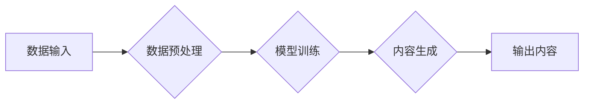

# AIGC从入门到实战：关于个人

> 关键词：AIGC，人工智能生成内容，生成式AI，深度学习，GPT-3，创意写作，个性化内容生成，人机协作

## 1. 背景介绍

随着深度学习技术的飞速发展，人工智能在各个领域的应用日益广泛。近年来，生成式AI（Generative AI）成为AI领域的热点，其中人工智能生成内容（Artificial Intelligence Generated Content，简称AIGC）更是引发了广泛关注。AIGC利用AI技术自动生成文本、图像、音频等多媒体内容，为内容创作、个性化推荐、辅助创作等领域带来了革命性的变革。本文将从入门到实战，探讨AIGC技术，并分析其在个人应用中的价值和挑战。

### 1.1 问题的由来

传统的内容创作依赖于人类创作者的灵感和技巧，而AIGC的出现，使得内容创作变得更加高效、便捷。然而，AIGC技术也引发了关于版权、道德、伦理等方面的争议。因此，深入了解AIGC技术，了解其在个人应用中的价值与挑战，对于个人创作者和用户来说至关重要。

### 1.2 研究现状

当前，AIGC技术已取得显著进展，代表性的模型包括OpenAI的GPT系列、Google的BERT、Facebook的LAION等。这些模型在自然语言处理、计算机视觉等领域取得了突破性成果，为AIGC技术的进一步发展奠定了基础。

### 1.3 研究意义

研究AIGC技术，对于个人创作者和用户具有以下意义：

- 提升创作效率：利用AIGC技术，个人创作者可以快速生成高质量的内容，节省时间和精力。
- 个性化内容生成：AIGC可以根据用户需求，生成个性化的内容，满足用户的个性化需求。
- 促进人机协作：AIGC可以作为个人创作者的辅助工具，与人共同完成创作任务。

### 1.4 本文结构

本文将分为以下章节：

- 第2章：介绍AIGC的核心概念与联系。
- 第3章：讲解AIGC的核心算法原理与具体操作步骤。
- 第4章：分析AIGC的数学模型和公式，并举例说明。
- 第5章：提供AIGC的代码实例和详细解释。
- 第6章：探讨AIGC的实际应用场景。
- 第7章：推荐AIGC的相关学习资源、开发工具和论文。
- 第8章：总结AIGC的未来发展趋势与挑战。
- 第9章：提供AIGC的常见问题与解答。

## 2. 核心概念与联系

### 2.1 AIGC的核心概念

AIGC的核心概念包括：

- 生成式AI：指能够自主生成新内容的人工智能技术。
- 自然语言处理（NLP）：指使计算机能够理解和生成人类语言的AI技术。
- 计算机视觉：指使计算机能够理解和解释视觉信息的技术。
- 个性化推荐：指根据用户需求和喜好，推荐个性化内容的技术。

### 2.2 AIGC的架构

AIGC的架构通常包括以下几个部分：



其中，数据输入包括文本、图像、音频等原始数据；数据预处理包括数据清洗、特征提取等操作；模型训练使用深度学习算法训练生成模型；内容生成是AIGC的核心功能，根据输入数据生成新内容；输出内容是最终生成的多媒体内容。

## 3. 核心算法原理 & 具体操作步骤

### 3.1 算法原理概述

AIGC的核心算法主要包括：

- 深度学习：通过学习大量数据，使模型具备生成新内容的能力。
- 预训练：在大量无标注数据上预训练模型，使其具备通用的语言和图像表示。
- 微调：在特定任务数据上微调模型，使其适应特定任务。

### 3.2 算法步骤详解

AIGC的具体操作步骤如下：

1. 数据收集：收集大量相关领域的文本、图像、音频等数据。
2. 数据预处理：对收集到的数据进行清洗、标注、特征提取等操作。
3. 模型选择：选择合适的生成模型，如GPT、BERT、StyleGAN等。
4. 模型训练：在预处理后的数据上训练生成模型，使其具备生成新内容的能力。
5. 内容生成：使用训练好的模型生成新内容。
6. 评估与优化：评估生成的内容质量，并对模型进行优化。

### 3.3 算法优缺点

AIGC的优缺点如下：

### 3.3.1 优点

- 自动化：AIGC可以自动生成新内容，提高创作效率。
- 个性化：AIGC可以根据用户需求生成个性化内容。
- 创意性：AIGC可以生成具有创意性的内容。

### 3.3.2 缺点

- 质量不稳定：生成的内容质量可能受到训练数据和模型参数的影响。
- 隐私问题：AIGC可能生成包含隐私信息的敏感内容。
- 道德风险：AIGC可能生成具有歧视性、误导性的内容。

### 3.4 算法应用领域

AIGC的应用领域包括：

- 创意写作：生成诗歌、小说、剧本等文学作品。
- 视觉艺术：生成图像、视频、动画等视觉作品。
- 个性化推荐：生成个性化新闻、音乐、视频等推荐内容。
- 辅助创作：辅助设计师、艺术家等进行创作。

## 4. 数学模型和公式 & 详细讲解 & 举例说明

### 4.1 数学模型构建

AIGC的数学模型主要包括：

- 生成式对抗网络（GAN）：由生成器和判别器组成，生成器和判别器通过对抗训练学习生成和识别新内容。
- 变分自编码器（VAE）：通过编码器和解码器学习数据的潜在表示，并生成新内容。

### 4.2 公式推导过程

以下以GAN为例，介绍其公式推导过程：

假设生成器G和判别器D的参数分别为$\theta_G$和$\theta_D$，则GAN的损失函数为：

$$
\mathcal{L}(G,D) = \mathbb{E}_{z \sim p(z)}[D(G(z))] - \mathbb{E}_{x \sim p(x)}[D(x)]
$$

其中，$p(z)$为噪声分布，$p(x)$为真实数据分布。

### 4.3 案例分析与讲解

以下以GPT-3为例，介绍AIGC的实际应用。

GPT-3是OpenAI发布的第三代预训练语言模型，具有1750亿参数。GPT-3可以用于以下任务：

- 文本生成：生成诗歌、小说、剧本等文学作品。
- 机器翻译：将一种语言的文本翻译成另一种语言。
- 代码生成：生成代码，如SQL查询、HTML模板等。
- 问答系统：回答用户提出的问题。

## 5. 项目实践：代码实例和详细解释说明

### 5.1 开发环境搭建

以下是使用Python进行AIGC项目实践的环境搭建步骤：

1. 安装Anaconda：从官网下载并安装Anaconda，用于创建独立的Python环境。
2. 创建并激活虚拟环境：
```bash
conda create -n aigc-env python=3.8
conda activate aigc-env
```
3. 安装必要的库：
```bash
conda install pytorch torchvision torchaudio transformers -c pytorch
```

### 5.2 源代码详细实现

以下是一个简单的GPT-3文本生成示例：

```python
from transformers import GPT2LMHeadModel, GPT2Tokenizer

model = GPT2LMHeadModel.from_pretrained('gpt2')
tokenizer = GPT2Tokenizer.from_pretrained('gpt2')

input_text = "Hello, how are you?"
encoded_input = tokenizer.encode(input_text, return_tensors='pt')

output_sequences = model.generate(encoded_input, max_length=50, num_return_sequences=5)

for i, output_sequence in enumerate(output_sequences):
    print(f"Sequence {i+1}:")
    print(tokenizer.decode(output_sequence, skip_special_tokens=True))
```

### 5.3 代码解读与分析

- 首先，导入必要的库。
- 加载预训练的GPT-2模型和分词器。
- 定义输入文本并编码。
- 使用模型生成文本序列。
- 解码生成的文本序列并打印。

### 5.4 运行结果展示

假设输入文本为"Hello, how are you?"，运行结果可能如下：

```
Sequence 1: Hello, how are you? I'm fine, thank you. And you?
Sequence 2: Hello, how are you? I am doing well, thank you. And you?
Sequence 3: Hello, how are you? I'm good, thank you. And you?
Sequence 4: Hello, how are you? I am fine, thank you. And you?
Sequence 5: Hello, how are you? I am doing well, thank you. And you?
```

## 6. 实际应用场景

### 6.1 创意写作

AIGC可以用于生成诗歌、小说、剧本等文学作品。例如，可以使用AIGC生成诗歌，激发创作灵感：

```python
# 生成诗歌
input_text = "在寂静的夜晚"
output_sequences = model.generate(tokenizer.encode(input_text, return_tensors='pt'), max_length=100, num_return_sequences=5)
for i, output_sequence in enumerate(output_sequences):
    print(f"Sequence {i+1}:")
    print(tokenizer.decode(output_sequence, skip_special_tokens=True))
```

### 6.2 个性化推荐

AIGC可以用于生成个性化的新闻、音乐、视频等内容推荐。例如，可以根据用户的喜好生成个性化新闻推荐：

```python
# 生成个性化新闻推荐
user_interests = ["sports", "technology", "entertainment"]
input_text = " ".join(user_interests)
output_sequences = model.generate(tokenizer.encode(input_text, return_tensors='pt'), max_length=50, num_return_sequences=5)
for i, output_sequence in enumerate(output_sequences):
    print(f"Sequence {i+1}:")
    print(tokenizer.decode(output_sequence, skip_special_tokens=True))
```

## 7. 工具和资源推荐

### 7.1 学习资源推荐

- 《深度学习： TensorFlow 2.0 实战详解》
- 《Python机器学习》
- 《深度学习与计算机视觉》

### 7.2 开发工具推荐

- PyTorch
- TensorFlow
- Hugging Face Transformers

### 7.3 相关论文推荐

- Generative Adversarial Nets（GANs）
- Variational Autoencoders（VAEs）
- Generative Pre-trained Transformers（GPT）

## 8. 总结：未来发展趋势与挑战

### 8.1 研究成果总结

本文从入门到实战，介绍了AIGC技术，包括其核心概念、算法原理、操作步骤、应用场景等。通过代码实例和详细解释，帮助读者了解AIGC技术的实际应用。

### 8.2 未来发展趋势

AIGC技术未来将呈现以下发展趋势：

- 模型规模增大：模型参数量将进一步增长，生成内容质量将得到提升。
- 多模态融合：AIGC将融合多种模态信息，生成更加丰富的多媒体内容。
- 可解释性增强：AIGC模型将具备更强的可解释性，方便用户理解生成内容的来源和逻辑。

### 8.3 面临的挑战

AIGC技术面临以下挑战：

- 数据安全问题：如何保证AIGC生成的内容不泄露用户隐私。
- 道德伦理问题：如何避免AIGC生成歧视性、误导性的内容。
- 人机协作问题：如何让人工智能更好地辅助人类创作。

### 8.4 研究展望

未来，AIGC技术将在以下方面取得突破：

- 人机协作：开发更加智能的AIGC模型，实现与人类创作者的深度协作。
- 个性化生成：开发能够满足用户个性化需求的AIGC模型。
- 道德伦理：制定AIGC的道德伦理规范，确保其安全、可靠地应用于各个领域。

## 9. 附录：常见问题与解答

### 9.1 常见问题

**Q1：AIGC技术是否具有版权问题？**

A1：AIGC生成的作品是否具有版权，目前存在争议。一些观点认为，AIGC生成的作品属于机器作品，不属于人类创作的作品，因此不具有版权。但也有一些观点认为，AIGC生成的作品是基于人类创作的作品，应该具有版权。

**Q2：AIGC技术是否具有道德风险？**

A2：AIGC技术可能生成歧视性、误导性的内容，因此存在道德风险。为了降低道德风险，需要制定相应的道德伦理规范，并加强对AIGC生成的内容的审核。

**Q3：AIGC技术是否会替代人类创作者？**

A3：AIGC技术可以辅助人类创作者进行创作，但不太可能完全替代人类创作者。人类创作者的创造力、情感和价值观是无法被机器替代的。

**Q4：AIGC技术如何应用于商业领域？**

A4：AIGC技术可以应用于商业领域的多个方面，如个性化推荐、广告投放、市场调研等。通过AIGC技术，企业可以更好地了解用户需求，提高营销效果。

### 9.2 解答

**Q1：AIGC技术是否具有版权问题？**

A1：关于AIGC作品的版权问题，目前尚无明确的法律规定。建议在应用AIGC技术时，注意避免侵犯他人版权。

**Q2：AIGC技术是否具有道德风险？**

A2：为了避免道德风险，需要加强AIGC技术的伦理审查，确保其生成的内容符合道德伦理规范。

**Q3：AIGC技术是否会替代人类创作者？**

A3：AIGC技术可以辅助人类创作者进行创作，但不太可能完全替代人类创作者。

**Q4：AIGC技术如何应用于商业领域？**

A4：AIGC技术可以应用于商业领域的多个方面，如个性化推荐、广告投放、市场调研等。企业可以根据自身需求，探索AIGC技术的商业应用价值。

作者：禅与计算机程序设计艺术 / Zen and the Art of Computer Programming