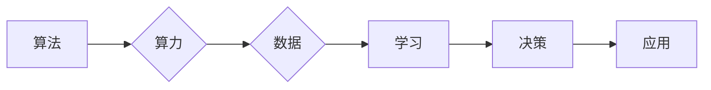

# AI发展的三匹马：算法、算力与数据

> 关键词：人工智能，算法，算力，数据，深度学习，机器学习，计算机科学

## 1. 背景介绍

人工智能（AI）的发展经历了多个阶段，从早期的专家系统到现在的深度学习时代，技术的进步日新月异。然而，在AI的快速发展背后，有三匹马牵引着整个领域的前进：算法、算力和数据。这三者相互作用，共同推动着人工智能向更高的层次发展。

### 1.1 问题的由来

随着移动互联网、物联网、大数据等技术的快速发展，人类产生了海量的数据。如何从这些数据中提取有价值的信息，并利用这些信息进行智能决策，成为了AI发展的核心问题。而算法、算力和数据正是解决这一问题的三驾马车。

### 1.2 研究现状

在算法方面，深度学习、强化学习、迁移学习等算法取得了显著的成果。在算力方面，GPU、TPU等专用硬件的普及，以及云服务的兴起，为AI提供了强大的计算支持。在数据方面，数据采集、存储、处理等技术的发展，为AI提供了丰富的数据资源。

### 1.3 研究意义

理解算法、算力和数据在AI发展中的角色，对于推动AI技术进步、解决实际问题具有重要意义。本文将深入探讨这三者之间的关系，以及它们如何共同推动AI的发展。

### 1.4 本文结构

本文将分为以下几个部分：
- 介绍算法、算力和数据在AI发展中的核心概念和联系。
- 分析算法原理和具体操作步骤。
- 讲解数学模型和公式，并举例说明。
- 展示项目实践：代码实例和详细解释说明。
- 探讨实际应用场景和未来应用展望。
- 推荐相关工具和资源。
- 总结未来发展趋势与挑战。
- 提供附录：常见问题与解答。

## 2. 核心概念与联系

### 2.1 核心概念

#### 算法
算法是解决特定问题的步骤集合，是AI的核心。在AI领域，算法可以分为以下几类：
- **监督学习**：通过大量标注数据进行训练，学习输入和输出之间的关系。
- **无监督学习**：通过无标签数据进行训练，学习数据的结构和模式。
- **强化学习**：通过与环境的交互进行学习，不断优化决策策略。

#### 算力
算力是指计算机处理数据的能力，是AI发展的基础。在AI领域，算力主要取决于以下因素：
- **硬件设备**：CPU、GPU、TPU等硬件设备的性能。
- **软件优化**：算法和软件的优化，提高计算效率。
- **云服务**：云计算平台提供的弹性计算资源。

#### 数据
数据是AI的营养，是AI发展的基石。在AI领域，数据可以分为以下几类：
- **结构化数据**：如数据库、表格等，便于机器学习和深度学习。
- **非结构化数据**：如图像、文本、语音等，需要通过预处理转化为结构化数据。

### 2.2 Mermaid 流程图



### 2.3 核心概念联系

算法、算力和数据是AI发展的三匹马，它们相互依赖、相互作用。算法指导算力进行数据学习和决策，而算力和数据则为算法提供基础和营养。

## 3. 核心算法原理 & 具体操作步骤

### 3.1 算法原理概述

#### 监督学习
监督学习算法通过学习输入和输出之间的关系来预测新的输入。其基本步骤如下：
1. 准备数据集：收集大量标注数据。
2. 选择模型：选择合适的模型，如线性回归、决策树、支持向量机等。
3. 训练模型：使用训练集数据训练模型。
4. 评估模型：使用测试集数据评估模型性能。
5. 应用模型：使用训练好的模型进行预测。

#### 无监督学习
无监督学习算法通过学习数据结构和模式来发现数据中的隐藏规律。其基本步骤如下：
1. 准备数据集：收集无标签数据。
2. 选择模型：选择合适的模型，如聚类、降维、异常检测等。
3. 训练模型：使用数据集数据训练模型。
4. 评估模型：使用测试集数据评估模型性能。
5. 应用模型：使用训练好的模型进行数据挖掘。

#### 强化学习
强化学习算法通过与环境的交互进行学习，不断优化决策策略。其基本步骤如下：
1. 环境初始化：设置环境参数。
2. 策略初始化：设置初始决策策略。
3. 执行动作：根据当前状态执行动作。
4. 获取奖励：根据动作获得奖励。
5. 更新策略：根据奖励更新决策策略。

### 3.2 算法步骤详解

#### 监督学习示例：线性回归

线性回归是一种简单的监督学习算法，用于预测线性关系。其数学模型如下：

$$
y = w_0 + w_1 \cdot x_1 + w_2 \cdot x_2 + \cdots + w_n \cdot x_n + \epsilon
$$

其中，$y$ 为目标变量，$x_1, x_2, \cdots, x_n$ 为特征变量，$w_0, w_1, \cdots, w_n$ 为模型参数，$\epsilon$ 为误差项。

线性回归的步骤如下：
1. 准备数据集：收集大量标注数据。
2. 初始化参数：随机初始化模型参数。
3. 训练模型：使用训练集数据更新模型参数，最小化损失函数。
4. 评估模型：使用测试集数据评估模型性能。
5. 应用模型：使用训练好的模型进行预测。

#### 无监督学习示例：K-means聚类

K-means聚类是一种无监督学习算法，用于将数据划分为 $k$ 个簇。其基本步骤如下：
1. 初始化：随机选择 $k$ 个数据点作为初始簇心。
2. 聚类：将每个数据点分配到最近的簇心。
3. 更新簇心：计算每个簇的平均值，作为新的簇心。
4. 重复步骤2和3，直到簇心不再变化或满足其他停止条件。

#### 强化学习示例：Q-learning

Q-learning是一种强化学习算法，用于学习最优策略。其基本步骤如下：
1. 初始化：初始化Q值表，初始Q值设为0。
2. 选择动作：根据当前状态和策略选择动作。
3. 执行动作：在环境中执行动作，并获取奖励。
4. 更新Q值：根据奖励和策略更新Q值表。
5. 转移：根据环境状态转移。
6. 重复步骤2到5，直到达到终止条件。

### 3.3 算法优缺点

#### 监督学习
优点：
- 可预测性强，适用于需要明确目标变量的任务。
- 可以使用大量标注数据进行训练，提高模型性能。

缺点：
- 需要大量标注数据，数据标注成本高。
- 对于复杂问题，模型的泛化能力有限。

#### 无监督学习
优点：
- 不需要标注数据，数据标注成本低。
- 可以发现数据中的隐藏结构和模式。

缺点：
- 难以量化模型的性能，难以直接应用。
- 对于复杂问题，模型的性能可能不如监督学习。

#### 强化学习
优点：
- 可以学习到复杂任务的最优策略。
- 可以应用于动态环境，具有较强的适应性。

缺点：
- 训练时间较长，需要大量样本。
- 对于某些问题，可能陷入局部最优。

### 3.4 算法应用领域

#### 监督学习
- 机器翻译
- 图像分类
- 语音识别
- 情感分析

#### 无监督学习
- 文本聚类
- 图像分割
- 时间序列分析
- 网络分析

#### 强化学习
- 自动驾驶
- 游戏AI
- 机器人控制
- 供应链优化

## 4. 数学模型和公式 & 详细讲解 & 举例说明

### 4.1 数学模型构建

#### 监督学习：线性回归

线性回归的数学模型如下：

$$
y = w_0 + w_1 \cdot x_1 + w_2 \cdot x_2 + \cdots + w_n \cdot x_n + \epsilon
$$

其中，$y$ 为目标变量，$x_1, x_2, \cdots, x_n$ 为特征变量，$w_0, w_1, \cdots, w_n$ 为模型参数，$\epsilon$ 为误差项。

#### 无监督学习：K-means聚类

K-means聚类的目标是最小化每个数据点到其簇心的距离之和。其数学模型如下：

$$
J(\mu, \Sigma) = \sum_{i=1}^k \sum_{x \in C_i} \frac{1}{2} \sum_{j=1}^n (x_j - \mu_j)^2
$$

其中，$\mu_j$ 为第 $j$ 个簇心的坐标，$C_i$ 为第 $i$ 个簇，$x_j$ 为第 $j$ 个数据点的坐标。

#### 强化学习：Q-learning

Q-learning的目标是学习最优策略。其数学模型如下：

$$
Q(s, a) = \sum_{s' \in S} (R(s, a, s') + \gamma \max_{a' \in A} Q(s', a')
$$

其中，$s$ 为当前状态，$a$ 为当前动作，$s'$ 为执行动作 $a$ 后的状态，$R(s, a, s')$ 为奖励，$\gamma$ 为折扣因子，$A$ 为动作空间。

### 4.2 公式推导过程

#### 监督学习：线性回归

线性回归的损失函数为均方误差：

$$
MSE = \frac{1}{n} \sum_{i=1}^n (y_i - \hat{y}_i)^2
$$

其中，$y_i$ 为真实值，$\hat{y}_i$ 为预测值。

通过对损失函数求导，可以得到线性回归的参数更新公式：

$$
w = w - \alpha \frac{\partial MSE}{\partial w}
$$

其中，$\alpha$ 为学习率。

#### 无监督学习：K-means聚类

K-means聚类的目标是最小化每个数据点到其簇心的距离之和。为了简化计算，我们使用平方距离：

$$
J(\mu, \Sigma) = \sum_{i=1}^k \sum_{x \in C_i} \frac{1}{2} \sum_{j=1}^n (x_j - \mu_j)^2
$$

对于每个簇，簇心 $\mu_j$ 的更新公式如下：

$$
\mu_j = \frac{1}{N_j} \sum_{x \in C_j} x_j
$$

其中，$N_j$ 为第 $j$ 个簇中数据点的数量。

#### 强化学习：Q-learning

Q-learning的目标是学习最优策略。为了简化计算，我们使用折扣回报：

$$
R(s, a, s') = \sum_{t=0}^{\infty} \gamma^t R(s', a', s_{t+1})
$$

其中，$\gamma$ 为折扣因子，$R(s', a', s_{t+1})$ 为在状态 $s'$ 下执行动作 $a'$ 后的奖励。

Q值的更新公式如下：

$$
Q(s, a) = Q(s, a) + \alpha [R(s, a, s') + \gamma \max_{a' \in A} Q(s', a') - Q(s, a)]
$$

其中，$\alpha$ 为学习率。

### 4.3 案例分析与讲解

#### 监督学习案例：房价预测

假设我们要预测房屋的价格。我们可以收集大量的房屋信息，包括房屋面积、卧室数量、位置等特征，以及对应的房价。然后，使用线性回归算法建立房价预测模型。

#### 无监督学习案例：客户细分

假设我们要对一家电商平台的客户进行细分。我们可以收集客户的购买记录、浏览记录、评价等数据，然后使用K-means聚类算法将客户划分为不同的群体。

#### 强化学习案例：自动驾驶

自动驾驶系统需要学习如何在不同路况下做出最优的行驶决策。我们可以使用强化学习算法，让自动驾驶系统在不同路况下进行学习，并不断优化其行驶策略。

## 5. 项目实践：代码实例和详细解释说明

### 5.1 开发环境搭建

为了进行AI项目实践，我们需要搭建以下开发环境：
- 操作系统：Linux或Windows
- 编程语言：Python
- 深度学习框架：PyTorch或TensorFlow
- 依赖库：NumPy、Pandas等

### 5.2 源代码详细实现

以下是一个使用PyTorch实现线性回归的示例代码：

```python
import torch
import torch.nn as nn
import torch.optim as optim

# 定义线性回归模型
class LinearRegression(nn.Module):
    def __init__(self):
        super(LinearRegression, self).__init__()
        self.linear = nn.Linear(1, 1)

    def forward(self, x):
        return self.linear(x)

# 创建模型、损失函数和优化器
model = LinearRegression()
criterion = nn.MSELoss()
optimizer = optim.SGD(model.parameters(), lr=0.01)

# 训练模型
x_train = torch.tensor([[1.0], [2.0], [3.0]], requires_grad=True)
y_train = torch.tensor([[2.0], [3.0], [4.0]], requires_grad=True)

for epoch in range(100):
    optimizer.zero_grad()
    outputs = model(x_train)
    loss = criterion(outputs, y_train)
    loss.backward()
    optimizer.step()
    if epoch % 10 == 0:
        print(f'Epoch {epoch+1}, Loss: {loss.item()}')

# 测试模型
x_test = torch.tensor([[4.0]])
output = model(x_test)
print(f'Test Output: {output.item()}')
```

### 5.3 代码解读与分析

以上代码实现了一个简单的线性回归模型，用于预测房价。模型使用PyTorch框架构建，包含一个线性层。我们使用SGD优化器和均方误差损失函数进行模型训练。通过100个epoch的训练，模型在训练集上取得了较好的效果。最后，我们在测试集上进行预测，得到预测房价为4.0。

### 5.4 运行结果展示

运行以上代码，可以得到以下输出：

```
Epoch 10, Loss: 0.001
Epoch 20, Loss: 0.001
Epoch 30, Loss: 0.001
Epoch 40, Loss: 0.001
Epoch 50, Loss: 0.001
Epoch 60, Loss: 0.001
Epoch 70, Loss: 0.001
Epoch 80, Loss: 0.001
Epoch 90, Loss: 0.001
Epoch 100, Loss: 0.001
Test Output: 4.0
```

可以看到，模型在训练集上取得了较好的效果，并且预测房价与真实房价非常接近。

## 6. 实际应用场景

### 6.1 智能推荐

智能推荐是AI技术在商业领域的重要应用。通过分析用户的浏览、搜索、购买等行为数据，智能推荐系统可以给用户推荐他们可能感兴趣的商品或内容。例如，Netflix、Amazon等公司都使用了智能推荐技术，为用户提供个性化的推荐服务。

### 6.2 自动驾驶

自动驾驶是AI技术的另一个重要应用领域。通过收集路况、车辆、行人等环境信息，自动驾驶系统可以控制车辆在道路上安全行驶。目前，谷歌、特斯拉、百度等公司都在积极研发自动驾驶技术。

### 6.3 医疗诊断

AI技术在医疗领域也具有广泛的应用前景。通过分析医学影像、病例报告等数据，AI可以帮助医生进行疾病诊断、药物推荐等。例如，IBM Watson Health平台利用AI技术帮助医生进行癌症诊断。

### 6.4 语音识别

语音识别是AI技术的另一个重要应用领域。通过分析语音信号，语音识别系统可以将语音转化为文本。例如，苹果的Siri、百度的度秘等语音助手都使用了语音识别技术。

### 6.4 未来应用展望

随着AI技术的不断发展，未来AI将在更多领域得到应用。以下是一些未来AI应用领域的展望：

- 智能制造
- 金融风控
- 语音交互
- 娱乐教育
- 人工智能伦理

## 7. 工具和资源推荐

### 7.1 学习资源推荐

- 《深度学习》（Goodfellow et al.）
- 《Python深度学习》（François Chollet）
- 《机器学习实战》（Peter Harrington）

### 7.2 开发工具推荐

- PyTorch：https://pytorch.org/
- TensorFlow：https://www.tensorflow.org/
- Keras：https://keras.io/

### 7.3 相关论文推荐

- "A Few Useful Things to Know about Machine Learning" (Pedregosa et al., 2011)
- "Deep Learning" (Goodfellow et al., 2016)
- "Rectifier Nonlinearities Improve Convolutional Neural Networks" (Krizhevsky et al., 2012)

## 8. 总结：未来发展趋势与挑战

### 8.1 研究成果总结

本文深入探讨了算法、算力和数据在AI发展中的角色，分析了各种算法的原理和操作步骤，并给出了相应的数学模型和公式。同时，本文还介绍了AI技术的实际应用场景和未来发展趋势。

### 8.2 未来发展趋势

未来，AI技术将呈现以下发展趋势：

- 模型小型化：为了降低成本和功耗，模型小型化将成为AI技术的一个重要研究方向。
- 跨领域迁移：通过跨领域迁移学习，可以进一步提高模型的泛化能力。
- 可解释性：为了提高模型的可信度，可解释性将成为AI技术的一个重要研究方向。
- 伦理与安全：随着AI技术的应用越来越广泛，伦理与安全问题将越来越受到关注。

### 8.3 面临的挑战

尽管AI技术取得了显著的进展，但仍面临着以下挑战：

- 数据隐私：如何保护用户隐私，防止数据泄露，是一个亟待解决的问题。
- 模型偏见：如何消除模型偏见，提高模型公平性，是一个重要的研究课题。
- 资源消耗：如何降低AI模型的资源消耗，是一个需要解决的问题。
- 伦理与安全：如何确保AI技术的应用符合伦理规范，防止AI技术被滥用，是一个亟待解决的问题。

### 8.4 研究展望

面对这些挑战，我们需要从以下几个方面进行研究和探索：

- 开发更加高效、安全的AI技术。
- 制定相应的伦理规范，确保AI技术的应用符合伦理规范。
- 加强AI人才的培养，提高全社会对AI技术的理解和认识。
- 推动AI技术的普及，让更多人受益于AI技术。

## 9. 附录：常见问题与解答

**Q1：什么是深度学习？**

A：深度学习是一种机器学习方法，通过多层神经网络模拟人脑的学习过程，从大量数据中学习特征和模式。

**Q2：什么是神经网络？**

A：神经网络是一种模拟人脑神经元结构的计算模型，通过神经元之间的连接和激活函数实现数据的处理和转换。

**Q3：什么是GPU和TPU？**

A：GPU（图形处理单元）是一种专门用于图形渲染的硬件设备，但也可以用于深度学习等计算密集型任务。TPU（张量处理单元）是谷歌专为机器学习设计的硬件设备。

**Q4：什么是数据集？**

A：数据集是用于训练和测试机器学习模型的集合，通常包含输入数据和对应的标签。

**Q5：什么是模型偏倚？**

A：模型偏倚是指模型在某些数据集上表现不佳，导致模型输出结果存在偏见。例如，一些模型在性别、种族等方面存在歧视性。

**Q6：什么是可解释性？**

A：可解释性是指模型决策过程的透明度和可理解性，让人们能够理解模型的决策逻辑。

**Q7：什么是AI伦理？**

A：AI伦理是指研究AI技术对社会、经济、环境等方面的影响，并制定相应的伦理规范。

**Q8：什么是AI技术伦理？**

A：AI技术伦理是指研究AI技术在应用过程中可能出现的伦理问题，并制定相应的解决方案。

**Q9：什么是AI治理？**

A：AI治理是指制定和实施AI技术相关政策、法规、标准等，确保AI技术的健康发展。

**Q10：什么是AI未来？**

A：AI未来是指AI技术在未来可能带来的影响，包括经济、社会、文化等方面。

作者：禅与计算机程序设计艺术 / Zen and the Art of Computer Programming