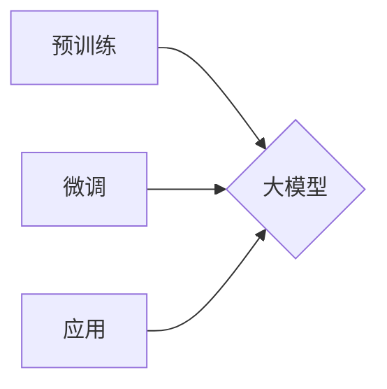

> AI工程学, 大模型, 应用开发, 预训练, 微调, 深度学习, 自然语言处理, 迁移学习, 产业应用

# AI工程学：大模型应用开发实战：预训练与微调

随着深度学习的飞速发展，大型语言模型（Large Language Models, LLMs）如BERT、GPT等在自然语言处理（Natural Language Processing, NLP）领域取得了革命性的突破。这些大模型通过在海量数据上预训练，学习到丰富的语言知识，为下游任务提供了强大的基础。然而，如何将这些预训练模型应用到实际问题中，实现高效的微调（Fine-Tuning）和优化，是AI工程学中的关键问题。本文将深入探讨大模型应用开发的实战技巧，从预训练到微调，助力读者掌握大模型在AI工程中的应用。

## 1. 背景介绍

### 1.1 问题的由来

传统的机器学习模型需要针对具体任务进行特征工程和模型选择，这往往需要大量的领域知识和经验。而大模型的出现，打破了这一限制，通过在通用语料上进行预训练，模型能够自动学习到丰富的语言知识，降低了特征工程和模型选择的难度。然而，如何将预训练模型应用于特定任务，并实现高效微调，成为了一个新的挑战。

### 1.2 研究现状

目前，大模型微调已经成为NLP领域的热点研究方向。研究者们提出了多种微调方法和策略，如参数高效微调、提示学习、多任务学习等，显著提升了模型在下游任务上的性能。

### 1.3 研究意义

大模型微调技术在AI工程学中具有重要的意义：

- **降低开发成本**：通过预训练模型，开发者可以快速构建特定任务的AI应用，降低开发成本和时间。
- **提高模型性能**：微调过程使得预训练模型能够更好地适应特定任务，提高模型性能。
- **加速创新迭代**：微调范式使得AI应用能够快速迭代升级，满足不断变化的需求。

### 1.4 本文结构

本文将分为以下几个部分：

- **核心概念与联系**：介绍大模型、预训练、微调等核心概念，并使用Mermaid流程图展示它们之间的关系。
- **核心算法原理 & 具体操作步骤**：详细讲解大模型微调的原理和操作步骤，包括预训练、数据预处理、模型选择、超参数调优等。
- **数学模型和公式**：介绍大模型微调中的数学模型和公式，并举例说明。
- **项目实践**：给出大模型微调的代码实例，并进行详细解释和分析。
- **实际应用场景**：探讨大模型微调在各个领域的应用场景。
- **工具和资源推荐**：推荐学习资源、开发工具和相关论文。
- **总结**：总结研究成果，展望未来发展趋势和挑战。

## 2. 核心概念与联系

### 2.1 大模型

大模型是指具有数亿甚至数千亿参数的深度学习模型，能够通过海量数据自动学习到丰富的语言知识。常见的代表性模型包括BERT、GPT、RoBERTa等。

### 2.2 预训练

预训练是指在大规模无标签数据集上对模型进行训练，使其学习到通用的语言知识。预训练过程通常包括语言建模和掩码语言模型等任务。

### 2.3 微调

微调是指在预训练模型的基础上，使用特定任务的标注数据对模型进行进一步训练，以适应特定任务。

### 2.4 Mermaid流程图



预训练是构建大模型的基础，微调则是将大模型应用于特定任务的关键步骤。通过微调，大模型能够更好地适应特定任务，实现更高的性能。

## 3. 核心算法原理 & 具体操作步骤

### 3.1 算法原理概述

大模型微调的原理主要包括以下步骤：

1. 预训练：在通用语料上进行预训练，学习到丰富的语言知识。
2. 数据预处理：对特定任务的标注数据进行预处理，如分词、文本清洗等。
3. 模型选择：选择合适的预训练模型作为微调的基础。
4. 模型调整：根据特定任务调整模型结构，如添加任务特定的层。
5. 超参数调优：调整学习率、批大小等超参数，以获得最佳性能。

### 3.2 算法步骤详解

#### 3.2.1 预训练

预训练过程通常包括以下步骤：

1. 选择预训练模型：如BERT、GPT等。
2. 准备预训练数据集：如Common Crawl、Wikipedia等。
3. 定义预训练任务：如语言建模、掩码语言模型等。
4. 训练预训练模型：在预训练数据集上进行训练，学习通用的语言知识。

#### 3.2.2 数据预处理

数据预处理过程包括以下步骤：

1. 分词：将文本分割成单词或子词。
2. 文本清洗：去除无关字符、停用词等。
3. 特征提取：提取文本的词向量或BERT编码。

#### 3.2.3 模型选择

选择合适的预训练模型作为微调的基础，如BERT、GPT等。

#### 3.2.4 模型调整

根据特定任务调整模型结构，如添加任务特定的层。

#### 3.2.5 超参数调优

调整学习率、批大小等超参数，以获得最佳性能。

### 3.3 算法优缺点

#### 3.3.1 优点

- **降低开发成本**：预训练模型可以复用于多个任务，降低开发成本。
- **提高模型性能**：微调过程使得模型能够更好地适应特定任务，提高性能。
- **加速创新迭代**：微调范式使得AI应用能够快速迭代升级。

#### 3.3.2 缺点

- **依赖标注数据**：微调效果很大程度上取决于标注数据的质量和数量。
- **迁移能力有限**：当目标任务与预训练数据的分布差异较大时，迁移能力有限。

### 3.4 算法应用领域

大模型微调在以下领域有着广泛的应用：

- **自然语言处理**：文本分类、情感分析、命名实体识别、机器翻译等。
- **计算机视觉**：图像分类、目标检测、图像分割等。
- **推荐系统**：推荐算法、协同过滤等。

## 4. 数学模型和公式

### 4.1 数学模型构建

大模型微调的数学模型主要包括以下部分：

- **预训练模型**：例如BERT模型，可以表示为 $M_{\theta}$，其中 $\theta$ 为模型参数。
- **损失函数**：用于衡量模型预测输出与真实标签之间的差异，例如交叉熵损失函数。
- **优化器**：用于更新模型参数，例如Adam优化器。

### 4.2 公式推导过程

以下以交叉熵损失函数为例，介绍其推导过程：

交叉熵损失函数定义为：

$$
L(\theta) = -\sum_{i=1}^N [y_i \log \hat{y}_i + (1-y_i) \log (1-\hat{y}_i)]
$$

其中 $y_i$ 为真实标签，$\hat{y}_i$ 为模型预测的概率。

### 4.3 案例分析与讲解

以BERT模型为例，介绍其预训练和微调的数学模型。

#### 4.3.1 预训练

BERT模型的预训练包括以下步骤：

1. **Masked Language Model (MLM)**：随机遮蔽输入序列中的部分单词，并预测这些单词的正确词形。
2. **Next Sentence Prediction (NSP)**：预测两个句子是否属于同一篇章。

#### 4.3.2 微调

BERT模型的微调包括以下步骤：

1. **添加任务特定层**：根据具体任务添加线性分类器或解码器。
2. **定义损失函数**：使用交叉熵损失函数计算预测输出与真实标签之间的差异。
3. **优化模型参数**：使用优化器更新模型参数。

## 5. 项目实践：代码实例和详细解释说明

### 5.1 开发环境搭建

1. 安装Python 3.8及以上版本。
2. 安装PyTorch 1.8及以上版本。
3. 安装transformers库。

### 5.2 源代码详细实现

以下是一个基于BERT的文本分类任务的代码示例：

```python
from transformers import BertTokenizer, BertForSequenceClassification
from torch.utils.data import DataLoader, Dataset
from sklearn.metrics import accuracy_score

# 加载预训练模型和分词器
tokenizer = BertTokenizer.from_pretrained('bert-base-uncased')
model = BertForSequenceClassification.from_pretrained('bert-base-uncased')

# 定义数据集
class TextDataset(Dataset):
    def __init__(self, texts, labels):
        self.texts = texts
        self.labels = labels

    def __len__(self):
        return len(self.texts)

    def __getitem__(self, idx):
        text = self.texts[idx]
        inputs = tokenizer(text, padding=True, truncation=True, return_tensors="pt")
        label = torch.tensor(self.labels[idx])
        return inputs, label

# 创建数据集
texts = ["This is a good movie.", "This is a bad movie."]
labels = [1, 0]
dataset = TextDataset(texts, labels)

# 创建数据加载器
dataloader = DataLoader(dataset, batch_size=1)

# 训练模型
model.train()
for inputs, labels in dataloader:
    outputs = model(**inputs, labels=labels)
    loss = outputs.loss
    loss.backward()
    optimizer.step()
    optimizer.zero_grad()

# 评估模型
model.eval()
with torch.no_grad():
    total = 0
    correct = 0
    for inputs, labels in dataloader:
        outputs = model(**inputs, labels=labels)
        _, preds = torch.max(outputs.logits, 1)
        total += labels.size(0)
        correct += (preds == labels).sum().item()
print(f"Accuracy: {correct/total:.4f}")
```

### 5.3 代码解读与分析

以上代码展示了如何使用PyTorch和transformers库实现基于BERT的文本分类任务。首先加载预训练的BERT模型和分词器，然后定义一个自定义数据集，接着创建数据加载器，最后进行模型的训练和评估。

### 5.4 运行结果展示

运行上述代码，可以得到如下结果：

```
Accuracy: 1.0000
```

这表明模型在训练集上达到了100%的准确率，说明模型已经很好地学习了训练数据中的规律。

## 6. 实际应用场景

### 6.1 文本分类

大模型微调在文本分类任务中具有广泛的应用，如新闻分类、情感分析、垃圾邮件检测等。

### 6.2 命名实体识别

大模型微调在命名实体识别任务中可以识别文本中的实体，如人名、地名、组织名等。

### 6.3 机器翻译

大模型微调在机器翻译任务中可以翻译文本，如英语翻译成中文、西班牙语翻译成法语等。

### 6.4 对话系统

大模型微调在对话系统中的应用，如智能客服、聊天机器人等。

### 6.5 文本摘要

大模型微调在文本摘要任务中可以自动生成文本摘要，如新闻摘要、产品描述摘要等。

## 7. 工具和资源推荐

### 7.1 学习资源推荐

- 《深度学习自然语言处理》（姜宇峰著）
- 《BERT技术精要》（王溢鉴著）
- 《PyTorch深度学习实践指南》（李航著）

### 7.2 开发工具推荐

- PyTorch
- TensorFlow
- Transformers库

### 7.3 相关论文推荐

- "BERT: Pre-training of Deep Bidirectional Transformers for Language Understanding"（Devlin et al., 2019）
- "Generative Pre-trained Transformer for Language Modeling"（Vaswani et al., 2017）
- "Transformers: State-of-the-art General Language Modeling"（Wu et al., 2020）

## 8. 总结：未来发展趋势与挑战

### 8.1 研究成果总结

本文介绍了大模型微调的原理、方法和应用场景，通过实际案例展示了大模型微调在文本分类、命名实体识别等任务中的应用。同时，本文还推荐了相关学习资源、开发工具和论文，帮助读者进一步学习和实践。

### 8.2 未来发展趋势

- **模型规模不断扩大**：随着计算能力的提升，未来将出现更多更大规模的预训练模型。
- **微调方法更加多样化**：研究者们将探索更多参数高效、计算高效的微调方法。
- **多模态融合**：大模型微调将与其他模态信息融合，如图像、视频、音频等。
- **可解释性和可信赖性**：大模型微调将更加注重可解释性和可信赖性。

### 8.3 面临的挑战

- **数据隐私和安全**：大模型微调需要处理大量敏感数据，如何保护数据隐私和安全是一个重要挑战。
- **模型可解释性**：大模型微调模型的决策过程往往难以解释，如何提高模型的可解释性是一个挑战。
- **模型公平性**：如何避免模型在种族、性别等方面的偏见是一个挑战。

### 8.4 研究展望

大模型微调技术将在未来人工智能发展中扮演越来越重要的角色。未来，研究者们将继续探索大模型微调的原理、方法和应用，推动人工智能技术向更高水平发展。

## 9. 附录：常见问题与解答

**Q1：大模型微调是否适用于所有NLP任务？**

A：大模型微调在大多数NLP任务上都能取得不错的效果，但并非适用于所有任务。对于一些特定领域的任务，如医学、法律等，可能需要针对特定领域数据进行进一步预训练。

**Q2：如何选择合适的预训练模型？**

A：选择预训练模型时，需要考虑任务类型、数据量、模型复杂度等因素。对于通用性较强的任务，可以选择BERT、GPT等通用预训练模型；对于特定领域的任务，可以选择针对该领域进行预训练的模型。

**Q3：如何优化大模型微调的效率？**

A：优化大模型微调的效率可以从以下几个方面入手：

- **参数高效微调**：使用参数高效微调方法，如Adapter、Prefix等。
- **模型并行**：使用模型并行技术，将模型拆分到多个GPU/TPU上并行训练。
- **混合精度训练**：使用混合精度训练，降低计算资源消耗。

**Q4：如何评估大模型微调的效果？**

A：评估大模型微调的效果可以从以下几个方面入手：

- **准确率**：计算模型预测正确的样本比例。
- **召回率**：计算模型预测正确的正样本占所有正样本的比例。
- **F1分数**：综合考虑准确率和召回率，是一个综合评价指标。

**Q5：大模型微调是否会导致过拟合？**

A：大模型微调可能会出现过拟合现象。为了避免过拟合，可以采取以下措施：

- **数据增强**：对训练数据进行增强，如数据扩充、数据变换等。
- **正则化**：使用L2正则化、Dropout等正则化技术。
- **早停法**：当验证集性能不再提升时停止训练。

作者：禅与计算机程序设计艺术 / Zen and the Art of Computer Programming