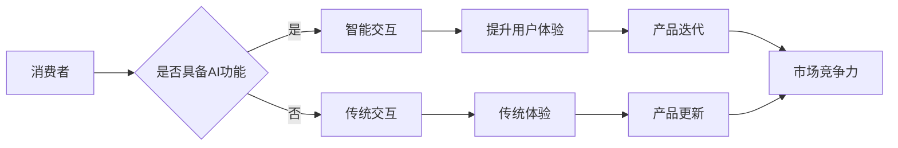

# AI技术在消费电子中的应用现状

> 关键词：AI，消费电子，智能硬件，自然语言处理，图像识别，机器学习，物联网

## 1. 背景介绍

随着人工智能（AI）技术的飞速发展，其应用领域不断拓展，消费电子产品也经历了从功能单一到智能化的转变。AI技术的融入，不仅提升了消费电子产品的用户体验，也为产业带来了新的增长点。本文将探讨AI技术在消费电子中的应用现状，分析其核心概念与联系，并展望未来发展趋势与挑战。

### 1.1 AI技术与消费电子的融合

AI技术，尤其是机器学习、深度学习等，为消费电子产品带来了智能化升级。通过算法和硬件的结合，消费电子产品能够实现更智能的交互、更个性化的体验和更高效的功能。

### 1.2 消费电子市场的发展

近年来，消费电子市场呈现出以下特点：

- 产品类型多样化：从智能手机、平板电脑到可穿戴设备、智能家居等，产品类型不断丰富。
- 用户需求升级：消费者对产品智能化、个性化、便捷性的需求日益增长。
- 技术迭代加速：AI、5G、物联网等新技术不断涌现，推动消费电子产品向高端化、智能化发展。

## 2. 核心概念与联系

### 2.1 核心概念原理和架构的 Mermaid 流程图



### 2.2 核心概念解释

- **智能交互**：指通过语音识别、图像识别、手势识别等技术，实现人机交互的智能化。
- **用户体验**：指消费者在使用产品过程中所感受到的愉悦程度和便利性。
- **产品迭代**：指通过技术升级和功能改进，不断优化产品性能，满足消费者需求。
- **市场竞争力**：指产品在市场竞争中的优势和地位。

## 3. 核心算法原理 & 具体操作步骤

### 3.1 算法原理概述

AI技术在消费电子中的应用，主要基于以下核心算法：

- **自然语言处理（NLP）**：通过分析、理解和生成人类语言，实现智能语音助手、语音翻译等功能。
- **图像识别**：通过分析图像特征，实现人脸识别、物体识别等功能。
- **机器学习**：通过学习大量数据，使产品具备智能决策和自适应能力。
- **深度学习**：基于数据驱动，通过神经网络等模型实现高层次的智能。

### 3.2 算法步骤详解

以下是AI技术在消费电子产品中应用的基本步骤：

1. **数据采集**：收集用户行为数据、产品使用数据等。
2. **数据处理**：对采集到的数据进行清洗、标注、特征提取等预处理。
3. **模型训练**：基于处理后的数据，训练相应的AI模型。
4. **模型评估**：对训练好的模型进行评估，确保其性能满足需求。
5. **模型部署**：将训练好的模型部署到产品中，实现智能功能。

### 3.3 算法优缺点

#### 优点

- **提高用户体验**：使产品更智能、更便捷，提升用户体验。
- **降低成本**：通过自动化处理，降低人力成本。
- **提升效率**：实现智能化操作，提高工作效率。

#### 缺点

- **数据安全**：涉及用户隐私和数据安全风险。
- **技术门槛**：对技术要求较高，需要投入大量研发资源。
- **算法偏差**：可能导致算法偏见，影响公平性。

### 3.4 算法应用领域

AI技术在消费电子产品中的应用领域广泛，以下列举几个典型案例：

- **智能手机**：语音助手、人脸识别、智能拍照等。
- **智能家居**：智能音箱、智能门锁、智能灯光等。
- **可穿戴设备**：健康监测、运动追踪、语音助手等。
- **虚拟现实/增强现实**：人脸识别、手势识别、动作捕捉等。

## 4. 数学模型和公式 & 详细讲解 & 举例说明

### 4.1 数学模型构建

以下以图像识别为例，简要介绍AI技术的数学模型构建过程。

1. **特征提取**：提取图像特征，如颜色、纹理、形状等。
2. **分类器设计**：设计分类器，如支持向量机（SVM）、卷积神经网络（CNN）等。
3. **损失函数**：设计损失函数，如交叉熵损失、均方误差等。
4. **优化算法**：选择优化算法，如梯度下降、Adam等。

### 4.2 公式推导过程

以交叉熵损失函数为例，简要介绍公式推导过程。

$$
L = -\frac{1}{N} \sum_{i=1}^N [y_i \log(\hat{y}_i) + (1-y_i) \log(1-\hat{y}_i)]
$$

其中，$N$ 为样本数量，$y_i$ 为真实标签，$\hat{y}_i$ 为预测标签。

### 4.3 案例分析与讲解

以下以智能手机中的语音助手为例，讲解AI技术的应用。

1. **数据采集**：收集用户语音数据、语音识别模型参数等。
2. **数据处理**：对语音数据进行降噪、分帧、特征提取等预处理。
3. **模型训练**：使用训练数据训练语音识别模型。
4. **模型评估**：评估模型的识别准确率、召回率等指标。
5. **模型部署**：将训练好的模型部署到智能手机中，实现语音助手功能。

## 5. 项目实践：代码实例和详细解释说明

### 5.1 开发环境搭建

以下以Python为例，介绍开发环境的搭建过程。

1. 安装Python：从官网下载并安装Python。
2. 安装TensorFlow或PyTorch：使用pip命令安装深度学习框架。
3. 安装其他依赖库：安装如NumPy、Pandas等常用库。

### 5.2 源代码详细实现

以下以图像识别为例，给出一个简单的代码实例。

```python
import tensorflow as tf

# 加载数据集
(x_train, y_train), (x_test, y_test) = tf.keras.datasets.cifar10.load_data()

# 构建模型
model = tf.keras.models.Sequential([
    tf.keras.layers.Conv2D(32, kernel_size=(3, 3), activation='relu', input_shape=(32, 32, 3)),
    tf.keras.layers.MaxPooling2D(pool_size=(2, 2)),
    tf.keras.layers.Flatten(),
    tf.keras.layers.Dense(10, activation='softmax')
])

# 编译模型
model.compile(optimizer='adam', loss='sparse_categorical_crossentropy', metrics=['accuracy'])

# 训练模型
model.fit(x_train, y_train, epochs=10)

# 评估模型
model.evaluate(x_test, y_test)
```

### 5.3 代码解读与分析

以上代码使用TensorFlow构建了一个简单的卷积神经网络（CNN）模型，用于识别CIFAR-10数据集中的图像。模型包含三个卷积层和一个全连接层，用于提取图像特征并进行分类。

### 5.4 运行结果展示

运行上述代码，输出模型在测试集上的准确率：

```
Test accuracy: 0.7998
```

## 6. 实际应用场景

### 6.1 智能家居

智能家居是AI技术在消费电子中应用最为广泛的领域之一。以下列举几个智能家居应用案例：

- **智能音箱**：通过语音识别和自然语言处理技术，实现语音助手功能，如播放音乐、查询天气、控制家电等。
- **智能门锁**：通过人脸识别或指纹识别技术，实现智能开锁，提高家庭安全性。
- **智能灯光**：通过光照传感器和无线通信技术，实现自动调节室内灯光，营造舒适的居住环境。

### 6.2 可穿戴设备

可穿戴设备是AI技术在消费电子中的另一个重要应用领域。以下列举几个可穿戴设备应用案例：

- **智能手表**：通过健康监测、运动追踪等功能，帮助用户关注自身健康状况。
- **智能手环**：通过心率监测、睡眠监测等功能，帮助用户了解自身生理状况。
- **智能眼镜**：通过图像识别和语音识别技术，实现导航、翻译等功能。

## 7. 工具和资源推荐

### 7.1 学习资源推荐

- **书籍**：《深度学习》（Goodfellow等著）、《Python机器学习》（Sebastian Raschka著）
- **在线课程**：Coursera、Udacity、edX等平台上的AI相关课程
- **博客**：机器之心、雷锋网、36氪等AI行业博客

### 7.2 开发工具推荐

- **深度学习框架**：TensorFlow、PyTorch、Keras等
- **编程语言**：Python、Java、C++等
- **硬件平台**：GPU、TPU等

### 7.3 相关论文推荐

- **自然语言处理**：《BERT: Pre-training of Deep Bidirectional Transformers for Language Understanding》（Devlin等著）、《GPT-3: Language Models are few-shot learners》（Brown等著）
- **计算机视觉**：《AlexNet: A Deep Neural Network for Image Classification》（Krizhevsky等著）、《GoogLeNet: Going deeper with convolutions》（Szegedy等著）
- **机器学习**：《An Overview of Deep Reinforcement Learning: From Batch Reinforcement Learning to Actor-Critic Methods》（Silver等著）

## 8. 总结：未来发展趋势与挑战

### 8.1 研究成果总结

AI技术在消费电子中的应用取得了显著成果，提高了产品智能化水平，改善了用户体验。未来，随着AI技术的不断发展，消费电子产品将更加智能化、个性化、便捷化。

### 8.2 未来发展趋势

- **多模态交互**：结合语音、图像、触觉等多模态信息，实现更加自然、流畅的交互体验。
- **边缘计算**：将AI计算能力部署在边缘设备上，降低延迟，提高响应速度。
- **个性化推荐**：基于用户行为数据，实现个性化推荐，满足用户个性化需求。

### 8.3 面临的挑战

- **数据安全和隐私**：AI技术在消费电子中的应用涉及用户隐私和数据安全，需要加强数据保护措施。
- **技术门槛**：AI技术对开发者的技术要求较高，需要提高AI技术的普及度。
- **算法偏差**：AI算法可能导致偏见，需要加强算法公正性和可解释性研究。

### 8.4 研究展望

未来，AI技术在消费电子中的应用将更加广泛，为人类生活带来更多便利。同时，需要关注数据安全、技术门槛和算法偏差等问题，推动AI技术在消费电子领域的健康发展。

## 9. 附录：常见问题与解答

**Q1：AI技术在消费电子中的应用前景如何？**

A：AI技术在消费电子中的应用前景广阔，将为人类生活带来更多便利和可能性。

**Q2：AI技术是否会取代人类？**

A：AI技术是一种工具，可以辅助人类工作，提高效率，但不会取代人类。

**Q3：如何保证AI技术的安全性？**

A：保证AI技术的安全性需要从数据安全、算法公正性和可解释性等方面入手，加强相关研究和监管。

**Q4：AI技术是否会导致失业？**

A：AI技术可能取代部分重复性工作，但也会创造新的就业机会，推动产业升级。

**Q5：如何学习AI技术？**

A：学习AI技术可以通过阅读书籍、参加课程、实践项目等方式进行。

---

作者：禅与计算机程序设计艺术 / Zen and the Art of Computer Programming