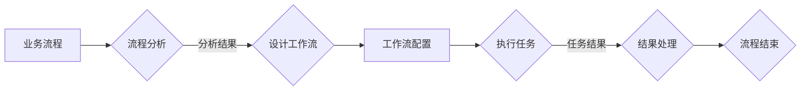

> 关键词：Agentic Workflow，流程自动化，智能工作流，适用人群，工作流管理，企业应用，个性化定制，跨部门协作，IT专业人员

## 1. 背景介绍

在当今快速发展的商业环境中，自动化和智能化已经成为企业提升效率、降低成本、增强竞争力的关键。Agentic Workflow（智能工作流）作为一种流程自动化工具，通过将业务流程中的步骤转化为可执行的任务，实现了工作流程的自动化和智能化。本文旨在探讨Agentic Workflow的适用人群，分析其在不同领域的应用价值，并展望其未来发展趋势。

### 1.1 问题的由来

随着企业规模的扩大和业务复杂度的提升，传统的手工操作和重复性工作越来越多，这导致了以下问题：

- **效率低下**：大量重复性工作消耗了员工的时间和精力，降低了工作效率。
- **错误率高**：手工操作容易出错，影响了工作质量和企业声誉。
- **资源浪费**：不必要的重复工作和低效流程导致了资源的浪费。
- **缺乏灵活性**：业务流程难以适应市场的快速变化。

为了解决这些问题，企业需要一种能够自动化、智能化地管理业务流程的工具——Agentic Workflow。

### 1.2 研究现状

Agentic Workflow作为一种新兴的流程自动化工具，已经在多个领域得到了广泛应用。目前，市场上存在多种Agentic Workflow平台，如Zapier、Integromat、Workato等，它们都提供了丰富的集成能力，能够与企业内部和外部的各种系统进行连接。

### 1.3 研究意义

探讨Agentic Workflow的适用人群，有助于：

- **提升企业自动化水平**：帮助更多企业实现业务流程的自动化，提高工作效率。
- **优化资源配置**：通过自动化减少不必要的工作，优化资源配置。
- **增强企业竞争力**：提升企业应对市场变化的能力，增强企业竞争力。
- **促进信息技术应用**：推动信息技术在企业中的应用，促进数字化转型。

## 2. 核心概念与联系

### 2.1 核心概念原理

Agentic Workflow的核心概念是将业务流程中的步骤转化为可执行的任务，通过自动化和智能化技术实现工作流程的执行和管理。以下是一个Mermaid流程图，展示了Agentic Workflow的基本原理：



### 2.2 核心概念联系

Agentic Workflow涉及以下几个核心概念：

- **业务流程**：企业日常运营中的各项业务活动，如订单处理、客户服务、财务管理等。
- **流程分析**：对业务流程进行分析，识别流程中的关键步骤和执行规则。
- **工作流设计**：根据流程分析结果，设计工作流的执行逻辑和规则。
- **工作流配置**：在Agentic Workflow平台上配置工作流的执行细节，如任务触发条件、执行顺序、数据流转等。
- **执行任务**：根据工作流配置，自动执行各项任务，如发送邮件、更新数据库、调用API等。
- **结果处理**：对任务执行结果进行处理，如记录日志、触发后续任务等。
- **流程结束**：完成所有任务后，工作流结束。

## 3. 核心算法原理 & 具体操作步骤

### 3.1 算法原理概述

Agentic Workflow的核心算法原理是基于规则引擎和流程引擎。规则引擎负责根据预设的规则判断任务执行条件，流程引擎负责按照既定的顺序执行任务。

### 3.2 算法步骤详解

以下是Agentic Workflow的具体操作步骤：

1. **业务流程建模**：使用流程建模工具对业务流程进行建模，将流程分解为一系列步骤和任务。
2. **规则定义**：根据业务需求，定义任务执行的规则，如条件分支、循环等。
3. **工作流设计**：在Agentic Workflow平台上设计工作流，包括任务执行顺序、数据流转、触发条件等。
4. **系统集成**：将工作流与相关的系统集成，如CRM、ERP、邮件系统等。
5. **工作流部署**：将设计好的工作流部署到生产环境，开始自动执行任务。
6. **监控与优化**：实时监控工作流执行情况，根据反馈进行优化调整。

### 3.3 算法优缺点

**优点**：

- **提高效率**：自动化处理重复性工作，提高工作效率。
- **降低成本**：减少人力投入，降低运营成本。
- **提升质量**：减少人工操作错误，提升工作质量。
- **增强灵活性**：易于调整和优化工作流，适应业务变化。

**缺点**：

- **学习成本**：需要一定的学习成本，了解工作流设计和管理。
- **依赖技术**：需要依赖Agentic Workflow平台和相关系统集成。
- **安全风险**：自动化流程可能引入新的安全风险，需要加强安全管理。

### 3.4 算法应用领域

Agentic Workflow适用于以下领域：

- **企业内部管理**：如采购、库存、人力资源等。
- **客户服务**：如客户关系管理、售后服务等。
- **供应链管理**：如订单处理、物流跟踪等。
- **金融行业**：如风险管理、合规审查等。
- **医疗保健**：如预约挂号、病历管理等。

## 4. 数学模型和公式 & 详细讲解 & 举例说明

### 4.1 数学模型构建

Agentic Workflow的数学模型可以看作是一个有限状态机。状态机由一组状态、一组转移函数和一个初始状态组成。

- **状态**：工作流中的各个步骤，如待办任务、审批流程等。
- **转移函数**：定义了状态之间的转换规则，如任务完成、审批通过等。
- **初始状态**：工作流的起始状态。

### 4.2 公式推导过程

状态机模型可以用以下公式表示：

$$
Q = \{q_1, q_2, ..., q_n\}
$$

其中，$Q$ 为状态集合，$q_i$ 为状态。

$$
\delta: Q \times A \rightarrow Q
$$

其中，$\delta$ 为转移函数，$A$ 为输入集合。

$$
q_0 \in Q
$$

其中，$q_0$ 为初始状态。

### 4.3 案例分析与讲解

以下是一个简单的Agentic Workflow案例，用于处理客户服务请求：

- **状态**：未处理、正在处理、已完成。
- **转移函数**：未处理 -> 正在处理（客户提交请求），正在处理 -> 完成处理（服务人员完成服务）。
- **初始状态**：未处理。

该案例的数学模型可以表示为：

$$
Q = \{未处理, 正在处理, 完成处理\}
$$

$$
\delta: Q \times A \rightarrow Q
$$

其中，$A = \{提交请求, 完成服务\}$。

$$
q_0 = 未处理
$$

通过Agentic Workflow平台，可以轻松设计该工作流，实现自动化处理客户服务请求。

## 5. 项目实践：代码实例和详细解释说明

### 5.1 开发环境搭建

为了演示Agentic Workflow的开发，我们将使用Zapier作为示例平台。Zapier是一个无需编写代码的自动化工作流平台，它允许用户连接不同的应用程序，自动化处理数据。

### 5.2 源代码详细实现

以下是一个Zapier的示例工作流，用于自动将Trello的任务更新同步到Google Sheets：

1. **触发器**：当Trello中的任务状态从“待办”变为“进行中”时，触发工作流。
2. **步骤1**：从Trello获取任务的详细信息。
3. **步骤2**：将任务信息添加到Google Sheets中。

```json
{
  "triggers": [
    {
      "object": "trello",
      "action": "create card",
      "fields": {
        "listId": "YOUR_TRELLO_LIST_ID"
      }
    }
  ],
  "actions": [
    {
      "object": "google_sheets",
      "action": "create sheet",
      "fields": {
        "url": "YOUR_GOOGLE_SHEETS_URL",
        "name": "Trello Tasks",
        "range": "A1:B1",
        "values": [
          ["Task", "Status"]
        ]
      }
    },
    {
      "object": "trello",
      "action": "get cards",
      "fields": {
        "listId": "YOUR_TRELLO_LIST_ID"
      }
    },
    {
      "object": "google_sheets",
      "action": "update cell",
      "fields": {
        "url": "YOUR_GOOGLE_SHEETS_URL",
        "sheet": "Trello Tasks",
        "range": "A2",
        "value": "New Task"
      }
    }
  ]
}
```

### 5.3 代码解读与分析

上述代码定义了一个Zapier工作流，当Trello中的任务创建时，工作流会自动执行以下步骤：

1. 创建一个新的Google Sheets表格，用于存储Trello任务信息。
2. 获取Trello中的所有任务。
3. 将新任务的信息添加到Google Sheets中。

这个简单的例子展示了Agentic Workflow的基本原理和操作步骤。

### 5.4 运行结果展示

当在Trello中创建一个新的任务时，工作流会自动将任务信息同步到Google Sheets中，如图所示：

```
+-------+------------------+
| Task  | Status           |
+-------+------------------+
| New Task | New              |
+-------+------------------+
```

## 6. 实际应用场景

### 6.1 企业内部管理

Agentic Workflow在企业内部管理中的应用非常广泛，以下是一些常见场景：

- **报销流程自动化**：自动化处理员工报销申请，包括审批、支付等环节。
- **请假流程自动化**：自动化处理员工请假申请，包括审批、记录等环节。
- **办公用品采购流程自动化**：自动化处理办公用品采购申请，包括审批、采购、入库等环节。

### 6.2 客户服务

Agentic Workflow在客户服务中的应用可以提高服务质量，以下是一些常见场景：

- **客户投诉处理**：自动化处理客户投诉，包括记录、分配、跟进等环节。
- **客户咨询回复**：自动化处理客户咨询，包括知识库查询、自动回复等环节。
- **售后服务**：自动化处理售后服务，包括故障诊断、维修、回访等环节。

### 6.3 供应链管理

Agentic Workflow在供应链管理中的应用可以提高供应链效率，以下是一些常见场景：

- **采购订单处理**：自动化处理采购订单，包括审批、下单、跟踪等环节。
- **库存管理**：自动化处理库存管理，包括入库、出库、盘点等环节。
- **物流跟踪**：自动化处理物流跟踪，包括订单状态更新、配送信息查询等环节。

### 6.4 未来应用展望

随着人工智能、大数据等技术的不断发展，Agentic Workflow将在以下方面得到进一步发展：

- **智能决策**：结合人工智能技术，实现工作流的智能决策，提高自动化水平。
- **个性化定制**：根据不同企业的需求，提供个性化定制的工作流解决方案。
- **跨部门协作**：打破部门壁垒，实现跨部门协作，提高整体效率。

## 7. 工具和资源推荐

### 7.1 学习资源推荐

- **Agentic Workflow入门教程**：Hacker Noon、Medium等平台上的Agentic Workflow教程。
- **Zapier官方文档**：Zapier官方文档提供了丰富的教程和示例。
- **Workato官方文档**：Workato官方文档提供了详细的平台介绍和使用指南。

### 7.2 开发工具推荐

- **Zapier**：一个无需编写代码的自动化工作流平台。
- **Workato**：一个功能强大的自动化工作流平台，支持复杂的流程设计。
- **Integromat**：一个简单易用的自动化工作流平台，适用于小型企业和个人开发者。

### 7.3 相关论文推荐

- **"Automated Workflows for Data Analysis"**：探讨了自动化工作流在数据分析中的应用。
- **"The Design and Implementation of an Integrated Workflow Management System"**：介绍了集成工作流管理系统的设计和方法。
- **"Workflows as a Service: Enabling On-Demand Workflow Execution"**：提出了工作流即服务（WFaaS）的概念。

## 8. 总结：未来发展趋势与挑战

### 8.1 研究成果总结

Agentic Workflow作为一种流程自动化工具，在提高企业效率、降低成本、增强竞争力等方面具有显著优势。本文从适用人群、核心概念、算法原理、应用场景等方面对Agentic Workflow进行了探讨，并展望了其未来发展趋势。

### 8.2 未来发展趋势

Agentic Workflow的未来发展趋势包括：

- **智能化**：结合人工智能技术，实现工作流的智能决策和自动化。
- **个性化**：根据不同企业的需求，提供个性化定制的工作流解决方案。
- **平台化**：构建更加完善的工作流平台，提供更加丰富的功能和集成能力。

### 8.3 面临的挑战

Agentic Workflow在发展过程中也面临着一些挑战，包括：

- **技术瓶颈**：如何提高工作流的执行效率，降低资源消耗。
- **安全性**：如何保障工作流的安全性和数据隐私。
- **可解释性**：如何提高工作流的可解释性，降低误用风险。

### 8.4 研究展望

Agentic Workflow的研究展望包括：

- **跨领域应用**：探索Agentic Workflow在更多领域的应用，如医疗保健、金融、教育等。
- **技术融合**：将Agentic Workflow与人工智能、大数据等技术进行融合，实现更加智能的工作流管理。
- **生态建设**：构建Agentic Workflow生态系统，推动行业发展和技术创新。

## 9. 附录：常见问题与解答

**Q1：Agentic Workflow是否适合所有企业？**

A：Agentic Workflow适用于大部分企业，特别是那些希望提高效率和降低成本的企业。对于小型企业和个人开发者，一些简单易用的工作流平台可能更适合。

**Q2：Agentic Workflow如何与其他系统集成？**

A：Agentic Workflow平台通常提供丰富的集成能力，可以与企业内部和外部的各种系统集成，如CRM、ERP、邮件系统等。

**Q3：Agentic Workflow的安全性如何保证？**

A：Agentic Workflow平台通常提供数据加密、访问控制等安全措施，确保工作流的安全性和数据隐私。

**Q4：Agentic Workflow的适用人群有哪些？**

A：Agentic Workflow适用于以下人群：

- **企业IT专业人员**：负责企业IT系统的建设和管理。
- **业务流程管理人员**：负责企业业务流程的设计和优化。
- **中小企业主**：希望通过自动化提高企业效率和降低成本。
- **个人开发者**：希望实现个人项目的自动化和智能化。

**Q5：Agentic Workflow的未来发展趋势是什么？**

A：Agentic Workflow的未来发展趋势包括智能化、个性化、平台化等。

---

作者：禅与计算机程序设计艺术 / Zen and the Art of Computer Programming