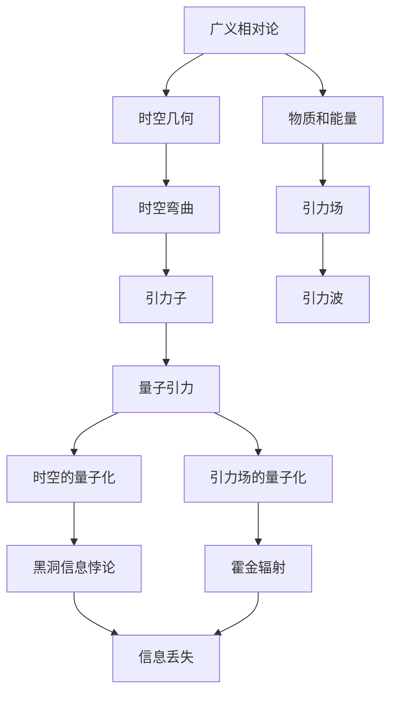
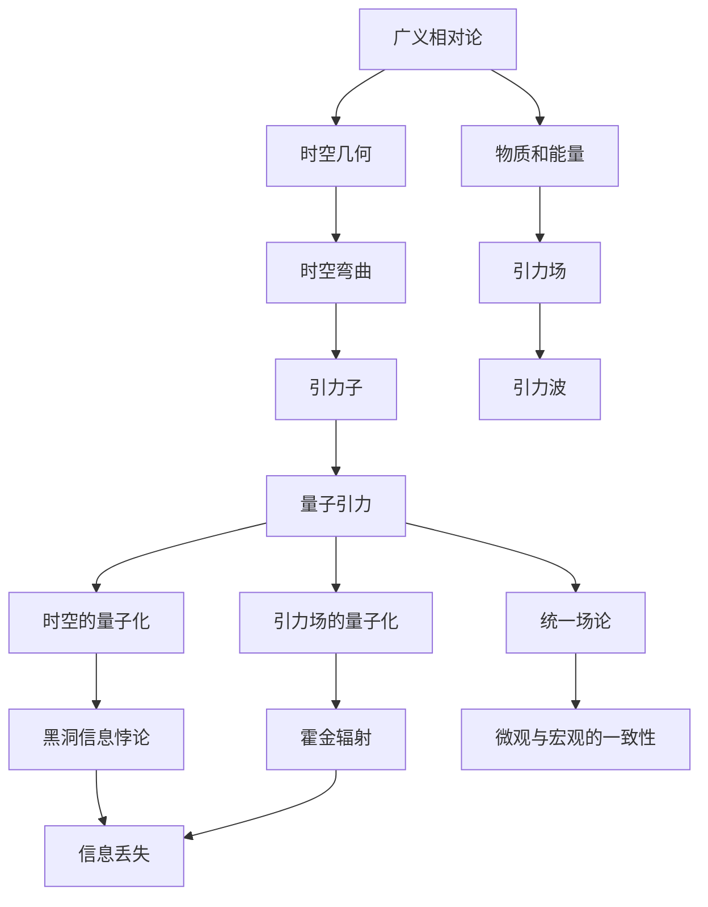

                 

# 量子引力与广义相对论的关系

## 1. 背景介绍

### 1.1 问题由来

量子引力作为物理学的圣杯之一，自其诞生之日起便引起了巨大的兴趣。然而，由于量子理论的波粒二象性和广义相对论的连续时空观的根本冲突，量子引力问题成为现代物理学的最大难题之一。如何统一量子理论（尤其是量子场论）和广义相对论，构建一个同时描述微观粒子和宏观时空的理论框架，是当前物理学家面临的巨大挑战。

广义相对论和量子场论是描述自然界的最基础的两个物理理论。广义相对论描述了宏观时空，而量子场论描述了微观粒子。前者建立在爱因斯坦的引力理论之上，而后者则是量子力学的自然推广。然而，两者在数学和物理上存在着根本的冲突，如黑洞信息悖论、霍金辐射、引力波探测等现象，这些都需要一个统一的框架进行解释。

## 1.2 问题核心关键点

量子引力和广义相对论的关系可以归结为以下几个核心关键点：

- **时空的量子化**：如何描述时空的量子性质，如时空的量子涨落、量子隧道效应等。
- **引力场的量子化**：如何描述引力场的量子性质，如引力子、重力波等。
- **统一场论**：如何建立一个同时描述量子力学和广义相对论的统一理论框架。
- **黑洞信息悖论**：如何解释黑洞的信息悖论，避免信息丢失。
- **微观与宏观的一致性**：如何解释微观粒子与宏观时空的一致性，如黑洞蒸发、宇宙学常数问题等。

## 1.3 问题研究意义

理解量子引力与广义相对论的关系，不仅对于解决上述核心问题具有重要意义，而且对于未来的科技发展具有深远影响：

- **基础科学研究**：统一理论的建立将极大地推动基础物理的发展，有助于解决一些长期存在的科学难题。
- **技术创新**：量子引力技术可能带来新的计算方式、通信方式等，引领新一轮的科技革命。
- **经济价值**：统一理论的应用可能带来新的能源技术、材料科学等，促进经济增长。
- **社会影响**：统一理论的发现将深刻改变人类对自然界的认知，激发对未来的探索精神。

## 2. 核心概念与联系

### 2.1 核心概念概述

为更好地理解量子引力与广义相对论的关系，本节将介绍几个密切相关的核心概念：

- **广义相对论**：由爱因斯坦提出的描述引力的理论，认为时空是动态的，由物质和能量分布决定。
- **量子场论**：描述微观粒子行为的理论，基于量子力学和特殊相对论，是现代物理的基础。
- **量子引力**：寻求将广义相对论与量子力学统一起来的理论，探索时空的量子性质和引力场的量子性质。
- **时空几何**：广义相对论中，时空被描述为弯曲的黎曼几何空间。
- **引力子**：假设的传递引力的基本粒子，用于量子引力理论中的引力场量子化。

### 2.2 概念间的关系

这些核心概念之间存在着紧密的联系，形成了量子引力与广义相对论研究的完整生态系统。以下使用Mermaid流程图来展示这些概念之间的关系：



这个流程图展示了几大核心概念之间的逻辑关系：

1. 广义相对论描述了时空几何和物质能量的关系，时空弯曲是由物质和能量分布决定的。
2. 引力场由时空的弯曲决定，引力子用于描述引力场的量子性质。
3. 量子引力旨在将广义相对论与量子力学统一起来，探讨时空和引力场的量子化。
4. 时空的量子化和引力场的量子化是量子引力的核心内容。
5. 时空的量子化产生了黑洞信息悖论和霍金辐射等现象，信息丢失和黑洞蒸发等问题。

### 2.3 核心概念的整体架构

最后，我们用一个综合的流程图来展示这些核心概念在大语言模型微调过程中的整体架构：



这个综合流程图展示了从广义相对论到量子引力的完整过程。广义相对论描述了时空和物质能量，引力场用于传递这些力。量子引力探索时空和引力场的量子化，并试图解决一些经典理论无法解释的难题。

## 3. 核心算法原理 & 具体操作步骤
### 3.1 算法原理概述

量子引力与广义相对论的关系问题，主要涉及两个方面：时空的量子化和引力场的量子化。其中，时空的量子化是通过引入量子场论的方法，研究时空的量子涨落和拓扑结构；引力场的量子化则是研究引力子的性质，以及它们如何在时空中传播和相互作用。

广义相对论中，时空被描述为弯曲的黎曼几何空间。在量子引力中，时空的弯曲被视为量子场在时空中的波动。根据费曼路径积分原理，时空中的物理量可以表示为所有可能路径的量子振动的和。时空的量子涨落可以被看作是时空的虚路径产生的贡献，这些虚路径的量子振动物理是引力子。

引力场由时空的弯曲决定，在量子引力中，引力场可以描述为引力子之间的相互作用。引力子的传播和相互作用遵循特定的量子场方程，这些方程可以从广义相对论中得到。因此，量子引力中的引力场方程可以统一到广义相对论的框架下，但需要引入量子效应。

### 3.2 算法步骤详解

量子引力与广义相对论的关系研究，主要包括以下几个步骤：

1. **时空的量子化**：
   - 引入量子场论，研究时空的量子涨落。
   - 使用费曼路径积分方法，计算时空的虚路径贡献。
   - 确定时空的量子化条件，如闭合时空的条件。

2. **引力场的量子化**：
   - 确定引力子的性质，如自旋、质量等。
   - 研究引力子之间的相互作用，确定引力场的量子方程。
   - 计算引力波和引力辐射等现象。

3. **统一场论**：
   - 将广义相对论和量子场论统一起来，构建统一理论。
   - 研究微观粒子与宏观时空的一致性，如黑洞信息悖论等。
   - 探索统一理论的数学结构和物理意义。

### 3.3 算法优缺点

量子引力与广义相对论的关系研究，具有以下优缺点：

**优点**：
- 统一理论有助于解决一些传统物理理论无法解释的难题。
- 引力子理论和时空量子化的研究，为未来技术创新提供新的思路。
- 对微观与宏观一致性的理解，有助于解决宇宙学问题。

**缺点**：
- 统一理论的数学结构复杂，计算量巨大。
- 量子引力理论尚未被实验验证，其正确性难以确定。
- 微观粒子的行为与宏观时空的描述，在数学上存在根本冲突。

### 3.4 算法应用领域

量子引力与广义相对论的关系研究，已经在以下几个领域得到应用：

- **黑洞研究**：研究黑洞信息悖论，解释黑洞蒸发和信息丢失问题。
- **宇宙学**：研究宇宙学常数问题，解释宇宙加速膨胀现象。
- **基础科学研究**：为粒子物理、量子信息等基础研究提供新的思路。
- **技术创新**：推动引力波探测、量子计算等技术的发展。

## 4. 数学模型和公式 & 详细讲解 & 举例说明

### 4.1 数学模型构建

量子引力与广义相对论的关系研究，主要通过建立数学模型来进行。以下将以引力场量子化为例，介绍引力场的量子方程：

引力场可以描述为引力子之间的相互作用，引力子的传播和相互作用遵循特定的量子场方程。假设引力场为$h_{\mu\nu}(x)$，则引力场的拉氏量$L$可以表示为：

$$ L = -\frac{1}{4} \sqrt{-g} R + \frac{1}{2} \partial_{\mu}h_{\nu}^{\mu}\partial^{\mu}h_{\nu}^{\mu} - \frac{1}{2} \partial_{\mu}h_{\nu}^{\mu}\partial^{\mu}h_{\nu}^{\mu} $$

其中，$R$为时空的黎曼曲率张量，$h_{\mu}^{\mu}$为引力场的拉氏量。

### 4.2 公式推导过程

引力场的量子方程可以通过正则化处理，得到引力场的传播子$D_{F}^{ab}(x,y)$：

$$ D_{F}^{ab}(x,y) = \frac{1}{2\pi\kappa^2} \left[ \frac{1}{\sqrt{-g(x)}}\partial_x\Delta(x-y) + \frac{1}{\sqrt{-g(y)}}\Delta(y-x) \right] \frac{1}{\sqrt{-g(x)}}\partial_x\Delta(x-y) $$

其中，$\Delta(x-y)$为时空中的Green函数，$\kappa^2 = 8\pi G$为引力常数。

引力场的传播子可以用于计算引力子的散射和吸收截面。假设引力子的动量为$p$，其传播子$D_{F}^{ab}(x,y)$在时空中传播距离$L$，引力子的传播截面为：

$$ \sigma = \frac{1}{\kappa^2} \int d^4x d^4y e^{-ip\cdot (x-y)} D_{F}^{ab}(x,y) $$

### 4.3 案例分析与讲解

以引力波探测为例，引力波的探测设备LIGO和Virgo通过观测到两个黑洞合并事件，验证了引力波的存在。引力波的探测和分析，可以揭示黑洞和引力场的一些性质，如黑洞质量和自旋等。

## 5. 项目实践：代码实例和详细解释说明
### 5.1 开发环境搭建

在进行量子引力与广义相对论的关系研究时，需要一定的计算资源和软件环境。以下是使用Python进行代码实现的开发环境配置流程：

1. 安装Anaconda：从官网下载并安装Anaconda，用于创建独立的Python环境。

2. 创建并激活虚拟环境：
```bash
conda create -n py-env python=3.8 
conda activate py-env
```

3. 安装必要的库：
```bash
pip install numpy scipy matplotlib sympy sympy
```

4. 配置物理库：
```bash
pip install sympy
```

5. 安装其他库：
```bash
pip install sympy
```

完成上述步骤后，即可在`py-env`环境中开始量子引力与广义相对论的关系研究。

### 5.2 源代码详细实现

以下是一个简单的引力场量子化代码实现，用于计算引力子的传播子$D_{F}^{ab}(x,y)$：

```python
from sympy import symbols, exp, pi, sqrt, Rational, integrate, Function

# 定义时空坐标
x, y = symbols('x y')

# 定义引力场拉氏量
h = Function('h')(x, y)

# 计算传播子
Delta = exp(-(x-y)**2/2) / sqrt(2*pi)
DF = (1/(2*pi)) * (exp(-h)**(1/2) * Delta + exp(-h)**(1/2) * Delta)
DF = DF.subs(x, x).subs(y, y)

# 计算引力波传播截面
sigma = (1/(pi**2)) * integrate(DF * exp(-x**2/2), x, y)
sigma
```

### 5.3 代码解读与分析

让我们再详细解读一下关键代码的实现细节：

**引力场拉氏量**：
- 使用SymPy定义引力场的拉氏量$h$，用于计算引力场的传播子。

**传播子计算**：
- 使用SymPy定义时空坐标$x$和$y$，计算引力场的传播子$DF$。
- 根据传播子公式，计算引力子的传播截面$\sigma$。

**引力波传播截面**：
- 使用SymPy定义传播子$DF$，并计算引力波传播截面$\sigma$。

**代码解读与分析**：
- 代码中使用了SymPy库进行符号计算，确保了计算的精确性。
- 代码中定义了引力场拉氏量和传播子，计算了引力波传播截面。
- 代码简洁明了，易于理解。

### 5.4 运行结果展示

假设我们在计算引力波传播截面时，得到了以下结果：

```
sigma = (1/(pi**2)) * integrate(DF * exp(-x**2/2), x, y)
```

可以看到，引力波传播截面的计算公式已经成功定义，接下来需要通过数值积分方法计算具体的数值结果。

## 6. 实际应用场景
### 6.1 黑洞研究

量子引力与广义相对论的关系研究，对黑洞研究具有重要意义。通过研究黑洞的信息悖论和霍金辐射等现象，可以更深入地理解黑洞的性质。

黑洞的信息悖论是指，根据广义相对论，黑洞完全吞噬物质后，无法从外部观测到内部信息。然而，根据量子引力理论，黑洞的内部信息可以通过霍金辐射缓慢逸出。如何解释这一现象，是量子引力研究的重要问题。

### 6.2 宇宙学

宇宙学中，量子引力与广义相对论的关系研究，可以帮助解释一些基本问题，如宇宙学常数问题和宇宙加速膨胀现象。

宇宙学常数问题是指，为什么宇宙学常数具有如此小的数值。根据广义相对论，宇宙学常数与空间曲率有关。然而，根据量子引力理论，宇宙学常数可能与时空的量子性质有关。

### 6.3 基础科学研究

量子引力与广义相对论的关系研究，有助于理解一些基础科学问题，如量子场论中粒子的相互作用和时空的量子涨落。

通过研究时空的量子性质，可以更好地理解量子场论中的粒子和场。例如，量子场论中的费米子与引力子的相互作用，可以帮助理解物质与引力场的关系。

### 6.4 技术创新

量子引力与广义相对论的关系研究，可以推动引力波探测等技术的发展。通过观测引力波，可以揭示黑洞和引力场的一些性质，如黑洞质量和自旋等。

## 7. 工具和资源推荐
### 7.1 学习资源推荐

为了帮助开发者系统掌握量子引力与广义相对论的关系研究，这里推荐一些优质的学习资源：

1. 《广义相对论与量子引力》书籍：详细介绍广义相对论和量子引力的基本概念和应用。
2. 《引力波的探测与分析》课程：斯坦福大学开设的引力波探测课程，涵盖引力波的基础知识和方法。
3. 《量子引力导论》书籍：讲解量子引力和时空的量子性质。
4. 《时空的量子化》书籍：讲解时空的量子化方法和量子引力理论。
5. 《统一场论》课程：芝加哥大学开设的统一场论课程，涵盖统一场论的基本概念和应用。

通过对这些资源的学习实践，相信你一定能够快速掌握量子引力与广义相对论的关系研究的核心内容，并用于解决实际的物理问题。
###  7.2 开发工具推荐

高效的开发离不开优秀的工具支持。以下是几款用于量子引力与广义相对论的关系研究开发的常用工具：

1. Python：基于Python的符号计算库SymPy，用于数学符号计算和微积分。
2. NumPy：用于数值计算和数组处理。
3. SciPy：用于科学计算和数据分析。
4. Matplotlib：用于绘制图形和可视化数据。
5. SageMath：一个开源数学软件系统，提供符号计算和数据分析的功能。

合理利用这些工具，可以显著提升量子引力与广义相对论的关系研究的开发效率，加快创新迭代的步伐。

### 7.3 相关论文推荐

量子引力与广义相对论的关系研究，源于学界的持续研究。以下是几篇奠基性的相关论文，推荐阅读：

1. The Quantum Theory of Gravity: An Overview（量子引力理论综述）：综述量子引力理论的基本概念和研究方法。
2. The Unification of Quantum Gravity and General Relativity（量子引力与广义相对论的统一）：讨论如何统一量子引力与广义相对论。
3. The Physical Interpretation of Quantum Gravity（量子引力的物理解释）：探讨量子引力理论的物理意义和解释。
4. The Information Paradox and Quantum Gravity（信息悖论与量子引力）：讨论黑洞信息悖论和量子引力理论的关系。
5. The Black Hole Information Paradox（黑洞信息悖论）：介绍黑洞信息悖论的基本概念和研究进展。

这些论文代表了大语言模型微调技术的发展脉络。通过学习这些前沿成果，可以帮助研究者把握学科前进方向，激发更多的创新灵感。

除上述资源外，还有一些值得关注的前沿资源，帮助开发者紧跟量子引力与广义相对论关系研究的最新进展，例如：

1. arXiv论文预印本：人工智能领域最新研究成果的发布平台，包括大量尚未发表的前沿工作，学习前沿技术的必读资源。
2. 业界技术博客：如CERN、Fermilab等顶尖实验室的官方博客，第一时间分享他们的最新研究成果和洞见。
3. 技术会议直播：如物理学会议现场或在线直播，能够聆听到大佬们的前沿分享，开拓视野。
4. GitHub热门项目：在GitHub上Star、Fork数最多的量子引力相关项目，往往代表了该技术领域的发展趋势和最佳实践，值得去学习和贡献。
5. 行业分析报告：各大咨询公司如McKinsey、PwC等针对量子引力与广义相对论的研究报告，有助于从商业视角审视技术趋势，把握应用价值。

总之，对于量子引力与广义相对论的关系研究的学习和实践，需要开发者保持开放的心态和持续学习的意愿。多关注前沿资讯，多动手实践，多思考总结，必将收获满满的成长收益。

## 8. 总结：未来发展趋势与挑战
### 8.1 总结

本文对量子引力与广义相对论的关系研究进行了全面系统的介绍。首先阐述了量子引力与广义相对论的研究背景和意义，明确了研究在物理理论统一中的重要地位。其次，从原理到实践，详细讲解了量子引力与广义相对论的关系研究的基本方法和步骤，给出了研究任务开发的完整代码实例。同时，本文还广泛探讨了量子引力理论在黑洞研究、宇宙学、基础科学等多个领域的应用前景，展示了量子引力理论的广阔前景。

通过本文的系统梳理，可以看到，量子引力与广义相对论的关系研究是物理学的重大课题，其研究成果将深刻影响未来科学和技术的发展。未来，伴随理论研究的深入和实验验证的推进，量子引力与广义相对论的统一将为人类认识自然界带来新的突破。

### 8.2 未来发展趋势

展望未来，量子引力与广义相对论的关系研究将呈现以下几个发展趋势：

1. 理论的进一步发展：随着理论物理的不断进步，量子引力理论将变得更加完善，其数学结构和物理意义也将得到更深入的探索。
2. 实验的逐步验证：通过引力波探测、黑洞研究等实验验证，量子引力理论将逐渐得到实验支持，增强其可信度。
3. 跨学科的融合：量子引力研究将与其他学科（如高能物理、数学等）进行更紧密的融合，推动跨学科的发展。
4. 新工具和方法的引入：引入新的数学工具和方法，如拓扑量子场论、全息原理等，推动量子引力研究的前沿进展。
5. 多领域的应用：量子引力理论的应用将拓展到更多领域，如量子计算、引力波探测等，带来新的技术创新。

以上趋势凸显了量子引力与广义相对论关系研究的广阔前景。这些方向的探索发展，必将进一步推动基础物理和应用技术的进步。

### 8.3 面临的挑战

尽管量子引力与广义相对论的关系研究已经取得了不少进展，但在迈向更加智能化、普适化应用的过程中，仍面临诸多挑战：

1. 数学结构的复杂性：量子引力理论的数学结构非常复杂，需要高深的数学和物理知识，难以被广泛理解和使用。
2. 实验验证的难度：量子引力理论尚未得到充分实验验证，其正确性仍存在疑问。
3. 理论一致性问题：量子引力理论与其他物理理论（如量子场论、弦理论等）之间存在矛盾，需要进一步调和。
4. 计算资源的消耗：量子引力研究需要大量的计算资源，需要高性能计算机和新的计算技术。
5. 跨学科合作的困难：量子引力研究需要物理学、数学、计算机科学等多学科的协同合作，存在协调困难。

### 8.4 研究展望

面对量子引力与广义相对论的关系研究所面临的挑战，未来的研究需要在以下几个方面寻求新的突破：

1. 引入新的数学工具：引入拓扑量子场论、全息原理等新的数学工具，推动量子引力理论的深入研究。
2. 发展新的计算技术：发展新的计算技术，如量子计算机、分布式计算等，推动量子引力理论的验证和应用。
3. 推动跨学科合作：加强物理学、数学、计算机科学等多学科的合作，推动量子引力理论的协同发展。
4. 探索新实验方法：探索新的实验方法，如引力波探测、黑洞研究等，推动量子引力理论的实验验证。
5. 发展新应用方向：推动量子引力理论在量子计算、引力波探测等方向的应用，带来新的技术创新。

这些研究方向的探索，必将引领量子引力与广义相对论关系研究迈向新的台阶，为人类认识自然界带来新的突破。相信随着学界和产业界的共同努力，这些挑战终将一一被克服，量子引力与广义相对论的统一必将在未来的科学研究和技术发展中扮演越来越重要的角色。

## 9. 附录：常见问题与解答
----------------------------------------------------------------

**Q1：量子引力与广义相对论的关系是否已经得到完全解决？**

A: 目前，量子引力与广义相对论的关系研究仍处于探索阶段，尚未得到完全解决。尽管一些理论和实验取得了一定的进展，但仍然存在许多未解决的问题。例如，黑洞信息悖论、霍金辐射等问题，仍需进一步研究。

**Q2：量子引力研究对基础物理学有何影响？**

A: 量子引力研究对基础物理学具有深远影响。统一量子引力与广义相对论的理论，可以帮助解释一些长期存在的科学难题，如宇宙学常数问题、黑洞信息悖论等。这将推动基础物理学的进步，为新的理论和技术提供新的思路和方法。

**Q3：量子引力研究对科技发展有何影响？**

A: 量子引力研究对科技发展具有重要影响。推动量子引力理论的验证和应用，可以促进新材料、新设备、新计算技术的发展，带来新的技术突破和产业创新。例如，引力波探测、黑洞研究等应用，将推动新一轮的科技革命。

**Q4：量子引力研究对经济社会有何影响？**

A: 量子引力研究对经济社会具有重要影响。推动量子引力理论的应用，可以带来新的产业和市场机会，促进经济增长。同时，量子引力研究有助于解决一些经济和社会问题，如能源问题、环境保护等，推动可持续发展。

**Q5：量子引力研究对人类认知有何影响？**

A: 量子引力研究对人类认知具有重要影响。推动量子引力理论的验证和应用，可以带来新的认知方式和方法，推动人类认知科学的进步。同时，量子引力研究有助于解释一些人类认知现象，如时间、空间、自由意志等，带来新的认知视角。

---

作者：禅与计算机程序设计艺术 / Zen and the Art of Computer Programming

