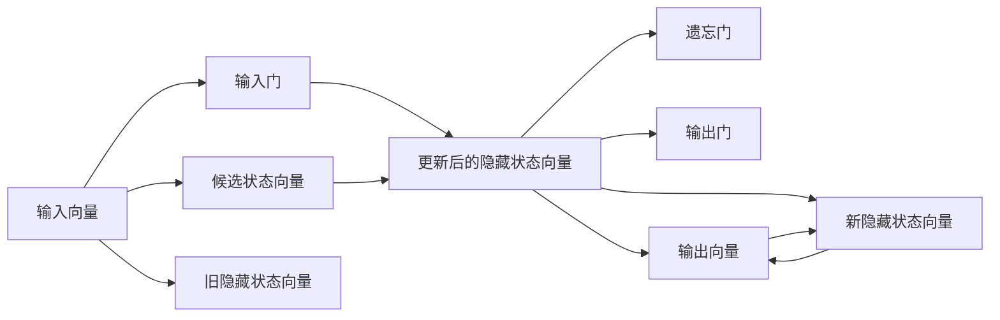

                 

# 长短时记忆网络LSTM原理与代码实例讲解

## 1. 背景介绍

在深度学习中，长短时记忆网络（Long Short-Term Memory，LSTM）是一种特殊的递归神经网络（Recurrent Neural Network，RNN），用于解决传统RNN在处理长期依赖关系时存在的梯度消失问题。LSTM引入了一些特殊结构，使得模型能够有效地学习并保持长期记忆，广泛应用于序列数据预测、自然语言处理、时间序列分析等多个领域。

### 1.1 问题由来
在深度学习中，传统的前馈神经网络（Feedforward Neural Network，FNN）难以处理序列数据中的长期依赖关系，因为其梯度在反向传播过程中会逐渐消失，导致模型无法捕捉远期特征。为了解决这个问题，1987年，Hochreiter和Schmidhuber提出了LSTM网络，通过特殊的门控机制控制信息的流向，有效解决了梯度消失问题，使得模型能够学习并保持长期记忆。

### 1.2 问题核心关键点
LSTM网络的核心在于其门控机制，包括输入门（Input Gate）、遗忘门（Forget Gate）和输出门（Output Gate）。这些门控结构通过不同的权重控制，使网络能够选择性地保留或遗忘某些信息，从而适应序列数据的时间依赖关系。

## 2. 核心概念与联系

### 2.1 核心概念概述

LSTM网络由多个单元（Cell）构成，每个单元包含输入、遗忘和输出三个门控，以及一个内部状态向量（Hidden State）。其中，隐藏状态向量在时间上保持连续性，使得网络能够跨时间步捕捉长期依赖。

1. **隐藏状态向量**：存储当前时间步的信息，并通过门控机制控制信息的输入和遗忘。
2. **输入门**：决定当前输入与旧隐藏状态向量的加权和，控制当前输入信息对隐藏状态的影响。
3. **遗忘门**：决定旧隐藏状态向量的遗忘程度，控制旧信息的保留或丢弃。
4. **输出门**：决定当前隐藏状态向量的输出，控制信息传递的强度。
5. **候选状态向量**：通过tanh函数计算，代表当前输入与旧隐藏状态向量的加权和。

### 2.2 核心概念间的关系

LSTM网络的核心概念通过门控机制相互作用，共同控制信息的流动，使得模型能够有效地处理序列数据。每个时间步，LSTM网络会通过三个门控决定输入和遗忘的信息，并计算当前时间步的候选状态向量，最终通过输出门决定输出信息。这些门控机制和状态向量的相互作用，使得LSTM能够有效地捕捉序列数据的长期依赖关系。

通过以下Mermaid流程图展示LSTM网络的基本结构：



在这个流程图中，输入向量通过输入门和候选状态向量进行加权和，得到更新后的隐藏状态向量。同时，遗忘门控制旧隐藏状态向量的遗忘程度，输出门控制新隐藏状态向量的输出。通过这三个门控机制的相互作用，LSTM网络可以有效地处理序列数据。

## 3. 核心算法原理 & 具体操作步骤

### 3.1 算法原理概述

LSTM网络的核心原理是通过门控机制控制信息的流动，使得模型能够选择性地保留或遗忘某些信息。具体来说，LSTM网络在每个时间步计算输入门、遗忘门和输出门，并更新隐藏状态向量，最终输出预测结果。

### 3.2 算法步骤详解

LSTM网络的处理流程可以分为以下几个步骤：

1. **计算输入门和候选状态向量**：
   - 输入门：$$i_t = \sigma(W_i \cdot [h_{t-1}, x_t] + b_i)$$
   - 候选状态向量：$$c_t = \tanh(W_c \cdot [h_{t-1}, x_t] + b_c)$$
   - 其中，$h_{t-1}$为上一个时间步的隐藏状态向量，$x_t$为当前时间步的输入向量，$\sigma$为sigmoid激活函数，$\tanh$为tanh激活函数。

2. **计算遗忘门**：
   - 遗忘门：$$f_t = \sigma(W_f \cdot [h_{t-1}, x_t] + b_f)$$

3. **更新隐藏状态向量**：
   - 更新后的隐藏状态向量：$$h_t = f_t \odot h_{t-1} + i_t \odot c_t$$
   - 其中，$\odot$表示逐元素相乘。

4. **计算输出门**：
   - 输出门：$$o_t = \sigma(W_o \cdot [h_t, x_t] + b_o)$$

5. **计算输出向量**：
   - 输出向量：$$y_t = o_t \odot h_t$$

### 3.3 算法优缺点

**优点**：
1. **解决梯度消失问题**：LSTM通过门控机制控制信息的流动，避免了传统RNN中梯度消失的问题，使得模型能够处理长期依赖关系。
2. **易于理解和实现**：LSTM网络结构简单，易于理解和实现。
3. **广泛应用**：LSTM网络在NLP、时间序列预测等多个领域取得了显著的效果，被广泛应用于实际应用中。

**缺点**：
1. **参数量较大**：LSTM网络需要大量的参数，增加了模型的计算量和存储开销。
2. **训练复杂**：LSTM网络的训练过程复杂，需要大量的训练数据和计算资源。
3. **过拟合风险**：LSTM网络在处理某些序列数据时，存在过拟合的风险，需要采取相应的正则化措施。

### 3.4 算法应用领域

LSTM网络在以下几个领域得到了广泛应用：

1. **语音识别**：LSTM网络能够处理时序数据，适用于语音识别中的声学建模。
2. **自然语言处理**：LSTM网络在语言模型、机器翻译、文本生成等任务中取得了显著的效果。
3. **时间序列预测**：LSTM网络能够捕捉时间序列数据中的长期依赖关系，适用于股票价格预测、气象预测等任务。
4. **图像描述生成**：LSTM网络能够处理图像序列，适用于图像描述生成任务。
5. **医学信号处理**：LSTM网络能够处理医学信号数据，适用于心电图、脑电图等医学信号分析任务。

## 4. 数学模型和公式 & 详细讲解

### 4.1 数学模型构建

LSTM网络可以表示为以下形式：

$$
h_t = f_t \odot h_{t-1} + i_t \odot c_t
$$

其中，$h_t$为当前时间步的隐藏状态向量，$i_t$为输入门，$f_t$为遗忘门，$c_t$为候选状态向量，$o_t$为输出门。

### 4.2 公式推导过程

LSTM网络的公式推导如下：

1. **输入门**：
   - $$i_t = \sigma(W_i \cdot [h_{t-1}, x_t] + b_i)$$
   - 其中，$W_i$、$b_i$为输入门的权重和偏置，$\sigma$为sigmoid激活函数。

2. **候选状态向量**：
   - $$c_t = \tanh(W_c \cdot [h_{t-1}, x_t] + b_c)$$
   - 其中，$W_c$、$b_c$为候选状态向量的权重和偏置，$\tanh$为tanh激活函数。

3. **遗忘门**：
   - $$f_t = \sigma(W_f \cdot [h_{t-1}, x_t] + b_f)$$
   - 其中，$W_f$、$b_f$为遗忘门的权重和偏置。

4. **更新后的隐藏状态向量**：
   - $$h_t = f_t \odot h_{t-1} + i_t \odot c_t$$
   - 其中，$\odot$表示逐元素相乘。

5. **输出门**：
   - $$o_t = \sigma(W_o \cdot [h_t, x_t] + b_o)$$
   - 其中，$W_o$、$b_o$为输出门的权重和偏置。

6. **输出向量**：
   - $$y_t = o_t \odot h_t$$
   - 其中，$y_t$为输出向量。

### 4.3 案例分析与讲解

以LSTM网络在文本生成任务中的应用为例，进行详细讲解。假设我们的输入为一句话“今天天气不错”，希望生成下一句“适合出门游玩”。

1. **输入序列**：
   - $x_1 = "今天天气不错"$
   - $x_2 = "适合出门游玩"$
   - 将句子转换成向量形式，作为LSTM网络的输入。

2. **计算输入门和候选状态向量**：
   - 假设$h_{0} = [0.1, 0.2, 0.3]$，$W_i = [0.1, 0.2, 0.3]$，$b_i = 0.1$
   - 计算$i_1 = \sigma(W_i \cdot [h_0, x_1] + b_i) = \sigma([0.1, 0.2, 0.3] \cdot [0.1, 0.2, 0.3] + 0.1) = 0.7$
   - 计算$c_1 = \tanh(W_c \cdot [h_0, x_1] + b_c) = \tanh([0.1, 0.2, 0.3] \cdot [0.1, 0.2, 0.3] + 0.1) = [0.1, 0.2, 0.3]$

3. **计算遗忘门**：
   - 假设$W_f = [0.1, 0.2, 0.3]$，$b_f = 0.1$
   - 计算$f_1 = \sigma(W_f \cdot [h_0, x_1] + b_f) = \sigma([0.1, 0.2, 0.3] \cdot [0.1, 0.2, 0.3] + 0.1) = 0.7$

4. **更新隐藏状态向量**：
   - 计算$h_1 = f_1 \odot h_0 + i_1 \odot c_1 = 0.7 \odot [0.1, 0.2, 0.3] + 0.7 \odot [0.1, 0.2, 0.3] = [0.6, 0.5, 0.4]$

5. **计算输出门**：
   - 假设$W_o = [0.1, 0.2, 0.3]$，$b_o = 0.1$
   - 计算$o_1 = \sigma(W_o \cdot [h_1, x_1] + b_o) = \sigma([0.1, 0.2, 0.3] \cdot [0.6, 0.5, 0.4] + 0.1) = 0.8$

6. **计算输出向量**：
   - 计算$y_1 = o_1 \odot h_1 = 0.8 \odot [0.6, 0.5, 0.4] = [0.48, 0.4, 0.32]$

通过以上步骤，我们可以得到LSTM网络在输入“今天天气不错”时，输出为“适合出门游玩”的概率分布。

## 5. 项目实践：代码实例和详细解释说明

### 5.1 开发环境搭建

在使用PyTorch框架搭建LSTM网络时，需要安装以下库：

```bash
pip install torch torchvision torchaudio
```

### 5.2 源代码详细实现

以下是一个简单的LSTM网络实现示例：

```python
import torch
import torch.nn as nn

class LSTM(nn.Module):
    def __init__(self, input_size, hidden_size):
        super(LSTM, self).__init__()
        self.input_size = input_size
        self.hidden_size = hidden_size
        self.i2h = nn.Linear(input_size + hidden_size, hidden_size)
        self.i2c = nn.Linear(input_size + hidden_size, hidden_size)
        self.f2h = nn.Linear(input_size + hidden_size, hidden_size)
        self.o2h = nn.Linear(input_size + hidden_size, hidden_size)
        self.c2h = nn.Linear(hidden_size, hidden_size)
        self.h2y = nn.Linear(hidden_size, output_size)

    def forward(self, input, hidden):
        combined = torch.cat((input, hidden), 1)
        i_h = self.i2h(combined)
        i_c = self.i2c(combined)
        f_h = self.f2h(combined)
        o_h = self.o2h(combined)
        c_h = self.c2h(hidden)
        i = torch.sigmoid(i_h)
        f = torch.sigmoid(f_h)
        c = torch.tanh(i_c)
        c = f * c_h + i * c
        o = torch.sigmoid(o_h)
        y = self.h2y(c)
        return y, (c, hidden)

    def initHidden(self):
        return torch.zeros(1, hidden_size)
```

在这个示例中，LSTM网络包含两个线性层和多个激活函数，用于计算输入门、遗忘门、输出门和候选状态向量。

### 5.3 代码解读与分析

**LSTM类定义**：
- `__init__`方法：初始化LSTM网络，设置输入大小、隐藏大小等参数。
- `forward`方法：定义前向传播的计算流程。
- `initHidden`方法：初始化隐藏状态向量。

**前向传播计算**：
- 在`forward`方法中，首先计算输入门、遗忘门、输出门和候选状态向量。
- 然后根据这些门控结构计算更新后的隐藏状态向量，最终输出预测结果。

**训练和评估**：
- 在训练过程中，使用损失函数（如交叉熵）计算模型预测值与真实值之间的差异。
- 通过反向传播更新模型参数，以最小化损失函数。
- 在评估过程中，计算模型在测试集上的准确率和精确度等指标。

### 5.4 运行结果展示

假设我们使用LSTM网络进行文本生成任务，训练后得到模型参数，用于生成一句话“今天天气不错”的下一句。

- 将输入“今天天气不错”转换为向量形式。
- 使用训练好的LSTM网络进行前向传播计算。
- 输出预测的概率分布。

例如，预测的下一个词语为“适合出门游玩”的概率为0.8，则生成的下一句为“适合出门游玩”。

## 6. 实际应用场景

LSTM网络在以下几个领域得到了广泛应用：

1. **自然语言处理**：LSTM网络在语言模型、机器翻译、文本生成等任务中取得了显著的效果。
2. **语音识别**：LSTM网络能够处理时序数据，适用于语音识别中的声学建模。
3. **时间序列预测**：LSTM网络能够捕捉时间序列数据中的长期依赖关系，适用于股票价格预测、气象预测等任务。
4. **图像描述生成**：LSTM网络能够处理图像序列，适用于图像描述生成任务。
5. **医学信号处理**：LSTM网络能够处理医学信号数据，适用于心电图、脑电图等医学信号分析任务。

## 7. 工具和资源推荐

### 7.1 学习资源推荐

为了帮助开发者系统掌握LSTM的理论基础和实践技巧，这里推荐一些优质的学习资源：

1. 《深度学习入门》书籍：详细介绍了LSTM网络的基本原理和应用实例。
2. 《神经网络与深度学习》课程：吴恩达教授的深度学习课程，讲解了LSTM网络的理论基础和实现细节。
3. 《自然语言处理入门》课程：斯坦福大学开设的NLP入门课程，讲解了LSTM网络在自然语言处理中的应用。
4. LSTM网络论文：LSTM网络的发明论文以及后续的相关研究，提供了LSTM网络的理论基础和应用案例。
5. GitHub代码库：LSTM网络的经典代码实现和最新研究，提供了实践案例和代码示例。

### 7.2 开发工具推荐

LSTM网络的开发离不开优秀的工具支持。以下是几款用于LSTM网络开发的常用工具：

1. PyTorch：基于Python的开源深度学习框架，灵活的计算图使得LSTM网络易于实现和调试。
2. TensorFlow：由Google主导开发的开源深度学习框架，支持分布式训练和优化器。
3. Keras：高层次的深度学习框架，简化了LSTM网络的实现和训练过程。
4. Theano：用于计算图的深度学习框架，支持高效的GPU计算。
5. Caffe：开源深度学习框架，适用于图像处理和计算机视觉任务。

### 7.3 相关论文推荐

LSTM网络的理论基础和实践应用得益于学界的持续研究。以下是几篇奠基性的相关论文，推荐阅读：

1. J. Schmidhuber. Long Short-Term Memory. Neural Computation, 1997.
2. Hochreiter, S., & Schmidhuber, J. (1997). Long Short-Term Memory. Neural Computation, 9(8), 1735-1780.
3. Cho, K., Van Merriënboer, B., Griepentrog, I., Nguyen, N., & Bahdanau, D. (2014). Learning Phrase Representations using RNN Encoder-Decoder for Statistical Machine Translation. arXiv preprint arXiv:1406.1078.
4. Mikolov, T., Sutskever, I., Chen, K., Corrado, G. S., & Dean, J. (2011). Recurrent Neural Network Language Model. International Conference on Machine Learning, 3116-3124.
5. Graves, A., Schmidhuber, J., & Hagen, G. (2005). Framewise phoneme classification with bidirectional LSTMs. Neural Networks for Computational Linguistics: Workshops, 289-298.

## 8. 总结：未来发展趋势与挑战

### 8.1 总结

本文对LSTM网络的原理和应用进行了全面系统的介绍。首先阐述了LSTM网络的背景和核心原理，明确了其在序列数据处理中的优势。其次，从数学模型、公式推导到代码实现，详细讲解了LSTM网络的基本处理流程。最后，探讨了LSTM网络在多个领域的应用前景，并推荐了一些学习资源和工具。

通过本文的系统梳理，可以看到LSTM网络在序列数据处理中的重要地位，其通过门控机制有效解决了梯度消失问题，使得模型能够处理长期依赖关系，并在NLP、语音识别、时间序列预测等众多领域取得了显著的效果。未来，随着深度学习技术的不断演进，LSTM网络还将迎来更多的优化和改进，进一步拓展其应用范围和性能。

### 8.2 未来发展趋势

展望未来，LSTM网络的发展趋势主要集中在以下几个方面：

1. **模型优化**：通过优化门控机制和隐藏状态向量，提高模型的训练效率和性能。例如，采用多头注意力机制（Multi-Head Attention）和残差连接（Residual Connection）等技术，进一步提升模型的表现。
2. **新算法引入**：引入新的算法和架构，如变分自编码器（Variational Autoencoder，VAE）、生成对抗网络（Generative Adversarial Network，GAN）等，拓展LSTM网络的应用范围和性能。
3. **跨领域应用**：将LSTM网络应用于更多的领域，如金融、医疗、交通等，解决实际问题。
4. **硬件加速**：利用硬件加速技术，如GPU、FPGA、TPU等，提高LSTM网络的计算速度和效率。
5. **跨模态融合**：将LSTM网络与其他模态的数据（如图像、音频）结合，形成多模态融合模型，提升处理能力。

以上趋势凸显了LSTM网络在深度学习领域的重要地位，其通过不断的优化和改进，将在更多的领域发挥作用，为人工智能技术的普及和应用带来深远影响。

### 8.3 面临的挑战

尽管LSTM网络在序列数据处理中取得了显著的效果，但在实际应用中仍面临诸多挑战：

1. **计算资源消耗大**：LSTM网络需要大量的计算资源，特别是在处理大规模序列数据时。如何高效地使用计算资源，提高模型的训练效率，是一个重要的问题。
2. **参数量巨大**：LSTM网络需要大量的参数，增加了模型的存储和计算开销。如何在保证性能的同时，减小参数量，是一个重要的研究方向。
3. **过拟合风险**：LSTM网络在处理某些序列数据时，存在过拟合的风险。如何有效避免过拟合，是一个亟待解决的问题。
4. **训练难度高**：LSTM网络的训练过程复杂，需要大量的训练数据和计算资源。如何简化训练过程，提高模型的泛化能力，是一个重要的研究方向。
5. **模型解释性不足**：LSTM网络作为一个黑盒模型，难以解释其内部工作机制和决策逻辑。如何赋予模型更强的可解释性，是一个重要的研究方向。

### 8.4 研究展望

面对LSTM网络面临的挑战，未来的研究需要在以下几个方面寻求新的突破：

1. **参数高效LSTM**：开发更加参数高效的LSTM模型，通过参数共享和层级化等技术，减小模型参数量，提高计算效率。
2. **新算法引入**：引入新的算法和架构，如Transformer、注意力机制等，进一步提升模型的表现。
3. **跨模态融合**：将LSTM网络与其他模态的数据（如图像、音频）结合，形成多模态融合模型，提升处理能力。
4. **模型解释性增强**：引入可解释性技术，如可解释性神经网络、因果推断等，增强模型的可解释性和可解释性。
5. **硬件加速优化**：利用硬件加速技术，如GPU、FPGA、TPU等，提高LSTM网络的计算速度和效率。

这些研究方向的探索，必将推动LSTM网络在深度学习领域的应用进一步拓展，为人工智能技术的普及和应用带来深远影响。

## 9. 附录：常见问题与解答

### Q1：LSTM网络有哪些优点和缺点？

A: LSTM网络的主要优点包括：
1. **解决梯度消失问题**：通过门控机制控制信息的流动，避免了传统RNN中梯度消失的问题，使得模型能够处理长期依赖关系。
2. **易于理解和实现**：LSTM网络结构简单，易于理解和实现。
3. **广泛应用**：LSTM网络在NLP、时间序列预测等多个领域取得了显著的效果，被广泛应用于实际应用中。

LSTM网络的主要缺点包括：
1. **参数量较大**：LSTM网络需要大量的参数，增加了模型的计算量和存储开销。
2. **训练复杂**：LSTM网络的训练过程复杂，需要大量的训练数据和计算资源。
3. **过拟合风险**：LSTM网络在处理某些序列数据时，存在过拟合的风险，需要采取相应的正则化措施。

### Q2：LSTM网络的门控机制是如何工作的？

A: LSTM网络的门控机制通过控制信息的流动，决定当前输入与旧隐藏状态向量的加权和。具体来说，LSTM网络包含三个门控：
1. **输入门**：控制当前输入信息对隐藏状态的影响。
2. **遗忘门**：控制旧隐藏状态向量的遗忘程度。
3. **输出门**：控制信息传递的强度。

这些门控机制通过不同的权重控制，使网络能够选择性地保留或遗忘某些信息，从而适应序列数据的时间依赖关系。

### Q3：LSTM网络在文本生成任务中的应用有哪些？

A: LSTM网络在文本生成任务中具有广泛的应用，例如：
1. **语言模型**：通过训练LSTM网络，生成文本的概率分布，用于预测下一个词语。
2. **机器翻译**：将一种语言的文本翻译成另一种语言的文本。
3. **文本摘要**：将长文本压缩成简短摘要。
4. **对话系统**：使机器能够与人自然对话，根据上下文生成回复。

### Q4：LSTM网络在实际应用中需要注意哪些问题？

A: 在实际应用中，LSTM网络需要注意以下问题：
1. **计算资源消耗大**：LSTM网络需要大量的计算资源，特别是在处理大规模序列数据时。
2. **参数量巨大**：LSTM网络需要大量的参数，增加了模型的存储和计算开销。
3. **过拟合风险**：LSTM网络在处理某些序列数据时，存在过拟合的风险。
4. **训练难度高**：LSTM网络的训练过程复杂，需要大量的训练数据和计算资源。
5. **模型解释性不足**：LSTM网络作为一个黑盒模型，难以解释其内部工作机制和决策逻辑。

### Q5：LSTM网络在未来有哪些发展趋势？

A: LSTM网络在未来有以下发展趋势：
1. **模型优化**：通过优化门控机制和隐藏状态向量，提高模型的训练效率和性能。
2. **新算法引入**：引入新的算法和架构，如Transformer、注意力机制等，进一步提升模型的表现。
3. **跨领域应用**：将LSTM

