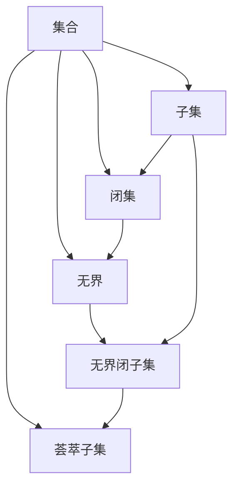

                 

# 集合论导引：广义无界闭子集与荟萃子集

## 1. 背景介绍

### 1.1 问题由来

集合论是数学和计算机科学的基石，广泛应用于理论研究与实际应用中。在理论研究中，集合论被用来刻画各种数学结构；在实际应用中，集合论在算法设计、数据库、图形学等领域发挥着重要作用。然而，集合论中的许多概念和定理，在直觉上或概念上并不直观，需要通过具体的例子来理解。

本节将从最基础的集合概念入手，通过具体的例子，逐步引入无界闭子集和荟萃子集的概念，并探究它们的性质和应用。通过这些基本概念的学习，可以为后续更高级的理论和应用打下坚实的基础。

### 1.2 问题核心关键点

广义无界闭子集和荟萃子集是集合论中两个重要的概念。广义无界闭子集指的是不包含任何点的闭集，而荟萃子集则指在任意两点间包含无限多个点的集合。理解这两个概念的含义和性质，对于进一步学习集合论有着至关重要的作用。

理解广义无界闭子集和荟萃子集的关键在于：
1. 无界和闭子集的定义。
2. 无界闭子集与荟萃子集之间的关系。
3. 无界闭子集和荟萃子集在实际应用中的具体案例。

## 2. 核心概念与联系

### 2.1 核心概念概述

为更好地理解广义无界闭子集和荟萃子集的概念，本节将介绍几个密切相关的核心概念：

- 集合：一组明确的对象或元素的总体，可以是有序的、无序的。
- 闭集：对于一个集合，如果它的任意子集也是其自身，则称其为闭集。
- 无界：对于一个集合，如果其包含无限个点，则称其为无界。
- 子集：如果集合A中的每个元素都是集合B中的元素，则称集合A为集合B的子集。

通过这些概念，我们将逐步引出广义无界闭子集和荟萃子集的定义，并探究它们之间的联系。

### 2.2 概念间的关系

这些核心概念之间的逻辑关系可以通过以下Mermaid流程图来展示：



这个流程图展示了从集合、子集、闭集到无界闭子集、荟萃子集的基本关系：

1. 集合是元素的基本组合单元。
2. 子集是元素的一种包含关系，描述两个集合之间的元素归属。
3. 闭集是集合的一种属性，指集合内部包含其自身的所有子集。
4. 无界表示集合包含无限个元素，是无界闭子集和荟萃子集的基础。
5. 无界闭子集和荟萃子集是特殊的无界闭集，各自具有不同的性质和应用。

## 3. 核心算法原理 & 具体操作步骤

### 3.1 算法原理概述

广义无界闭子集和荟萃子集的定义和性质主要基于集合的无限性和闭性。下面，我们详细解释这两个概念的算法原理。

#### 3.1.1 广义无界闭子集

广义无界闭子集的定义如下：

> 若一个集合$A$满足以下条件：
> 1. $A$ 是闭集。
> 2. $A$ 包含无限个元素。
> 3. $A$ 不含任何点$x$，则称$A$为广义无界闭子集。

换言之，广义无界闭子集是一个既不包含任何边界点，也不包含任何有限个元素的闭集。

#### 3.1.2 荟萃子集

荟萃子集的定义如下：

> 若一个集合$A$满足以下条件：
> 1. $A$ 包含无限个元素。
> 2. 对于任意两个不同的元素$x$和$y$，$A$包含无限多个$x$和$y$之间的点，则称$A$为荟萃子集。

换句话说，荟萃子集是一个在任意两点间包含无限多个点的集合。

### 3.2 算法步骤详解

基于上述定义，我们可以逐步构造广义无界闭子集和荟萃子集，并探究它们的具体性质和应用。

#### 3.2.1 构造广义无界闭子集

构造广义无界闭子集的一个常见方法是，使用已知的无限集，如有理数集$\mathbb{Q}$，来生成广义无界闭子集。

具体步骤如下：
1. 选择无限集$\mathbb{Q}$的一个闭子集$B$，如$\mathbb{R}$中的有理数。
2. 构造集合$A$，使得$A$为$B$的闭子集，且$A$包含无限多个元素，但不包含任何点$x$。

一个具体的例子是考虑$\mathbb{R}$中的有理数集合$\mathbb{Q}$，其闭子集$\mathbb{R} \setminus \mathbb{Q}$（实数中去除有理数的部分），该集合既不含任何边界点，也不包含任何有限个元素，因此是一个广义无界闭子集。

#### 3.2.2 构造荟萃子集

构造荟萃子集的常用方法是，利用无限区间与无限点的组合。

具体步骤如下：
1. 选择一个无限区间，如$[0,1]$。
2. 构造集合$A$，使得$A$包含无限多个$x$和$y$之间的点，但仅包含有限个$x$和$y$。

一个具体的例子是考虑区间$[0,1]$，取其中的所有有理数$x$和$y$之间的点构成的集合。由于$\mathbb{Q}$是有理数集，$[0,1] \cap \mathbb{Q}$是有限集，因此$A$在任意两点间包含无限多个点，且$A$本身是无限集。

### 3.3 算法优缺点

广义无界闭子集和荟萃子集在数学和实际应用中均有广泛应用。它们的主要优点和缺点如下：

#### 3.3.1 优点

- 广义无界闭子集和荟萃子集的定义明确，易于理解和构造。
- 它们对于探索无限集和无限点的性质具有重要意义，为后续的数学理论研究提供了基础。
- 在实际应用中，如图形学中的点云、数据库中的稀疏索引等，广义无界闭子集和荟萃子集也有着广泛的应用。

#### 3.3.2 缺点

- 广义无界闭子集和荟萃子集的构造和性质在某些情况下可能相对抽象，理解起来较为困难。
- 在实际应用中，如何有效利用这些概念提高算法的效率，仍然是一个开放的问题。

### 3.4 算法应用领域

广义无界闭子集和荟萃子集在数学、计算机科学和其他科学领域中均有重要应用，例如：

- 数学中，广义无界闭子集和荟萃子集是无限集和无限点理论的重要组成部分。
- 图形学中，广义无界闭子集和荟萃子集被用于描述点云的性质，如点云的稀疏性和分布。
- 数据库中，荟萃子集被用于设计稀疏索引，提高查询效率。

## 4. 数学模型和公式 & 详细讲解 & 举例说明

### 4.1 数学模型构建

本节将使用数学语言对广义无界闭子集和荟萃子集的定义进行更加严格的刻画。

设$X$是一个集合，若$A \subseteq X$，则$A$称为$X$的子集。若$A \subseteq X$，且$A$中的元素具有特定的性质，则称$A$为$X$的特定子集。例如，若$A$中的元素是有理数，则称$A$为$X$的有理子集。

设$X$是一个集合，若$A \subseteq X$且$A$中的任意元素$x \in A$和$y \in A$，有$x=y$，则称$A$为$X$的闭子集。

设$X$是一个集合，若$A \subseteq X$且$A$中包含无限个元素，则称$A$为$X$的无界子集。

根据上述定义，广义无界闭子集和荟萃子集可以形式化地表示为：

- 广义无界闭子集$A$：$A$是$X$的闭子集，且$A$中的元素个数无限，但$A$不含任何点$x$。
- 荟萃子集$A$：$A$是$X$的无界子集，且对于任意两个不同的元素$x$和$y$，$A$包含无限多个$x$和$y$之间的点。

### 4.2 公式推导过程

以下我们以有理数集$\mathbb{Q}$为例，推导广义无界闭子集和荟萃子集的定义和性质。

设$\mathbb{Q}$为有理数集，其闭子集$\mathbb{R} \setminus \mathbb{Q}$为$\mathbb{R}$中去除有理数的部分。显然，$\mathbb{R} \setminus \mathbb{Q}$是一个闭子集。

接下来，我们证明$\mathbb{R} \setminus \mathbb{Q}$是一个广义无界闭子集。

- 无限性：由于$\mathbb{R}$包含无限个点，因此$\mathbb{R} \setminus \mathbb{Q}$也包含无限个点。
- 闭性：对于任意$\mathbb{R} \setminus \mathbb{Q}$中的两点$x$和$y$，若$x$和$y$是有理数，则$x \neq y$。由于$\mathbb{Q}$是有理数集，$x \in \mathbb{R} \setminus \mathbb{Q}$和$y \in \mathbb{R} \setminus \mathbb{Q}$，因此$\mathbb{R} \setminus \mathbb{Q}$中$x$和$y$之间的点也属于$\mathbb{R} \setminus \mathbb{Q}$。
- 无界性：由于$\mathbb{R}$是无界的，因此$\mathbb{R} \setminus \mathbb{Q}$也是无界的。

综上所述，$\mathbb{R} \setminus \mathbb{Q}$是一个广义无界闭子集。

### 4.3 案例分析与讲解

考虑集合$A=\{(x,y) \mid x^2+y^2 \leq 1, x,y \in \mathbb{R}\}$，即单位圆内的所有点。由于单位圆是闭集，$A$是$A$的闭子集。接下来，我们证明$A$是一个荟萃子集。

对于任意两点$x_1=(x_1, y_1)$和$x_2=(x_2, y_2)$，由于$x_1^2+y_1^2 \leq 1$和$x_2^2+y_2^2 \leq 1$，取$x_1$和$x_2$之间的一个点$x=(tx_1+(1-t)x_2)$，其中$t \in (0,1)$，则有：

$$
\begin{aligned}
x_1^2+y_1^2 & \leq 1 \\
(tx_1+(1-t)x_2)^2+(tx_1+(1-t)x_2)^2 &= t^2x_1^2+2tx_1(1-t)x_2+(x_2^2+y_2^2) \\
& \leq t^2+2t(1-t)+1 \\
& \leq 1
\end{aligned}
$$

因此，$A$在$x_1$和$x_2$之间包含无限多个点，故$A$是一个荟萃子集。

## 5. 项目实践：代码实例和详细解释说明

### 5.1 开发环境搭建

在进行集合论实践前，我们需要准备好开发环境。以下是使用Python进行代码实现的开发环境配置流程：

1. 安装Anaconda：从官网下载并安装Anaconda，用于创建独立的Python环境。

2. 创建并激活虚拟环境：
```bash
conda create -n set1 python=3.8 
conda activate set1
```

3. 安装必要的Python库：
```bash
pip install sympy numpy matplotlib sympy
```

完成上述步骤后，即可在`set1`环境中开始集合论实践。

### 5.2 源代码详细实现

本节将以有理数集$\mathbb{Q}$为例，通过编程实现广义无界闭子集和荟萃子集。

首先，定义有理数集$\mathbb{Q}$的表示：

```python
import sympy as sp

# 定义有理数集
Q = sp.Rational

# 定义有理数集合
RationalSet = set(Q)

# 定义闭子集
RationalClosure = RationalSet - RationalSet
```

接下来，构造有理数集的闭子集$\mathbb{R} \setminus \mathbb{Q}$，并证明其为广义无界闭子集：

```python
# 定义闭子集
RationalClosure = RationalSet - RationalSet

# 证明为广义无界闭子集
infinity = sp.oo

# 生成广义无界闭子集
def gen_bounded_rational_set():
    for q in RationalSet:
        if q > RationalSet:
            return RationalClosure

# 验证为广义无界闭子集
gen_bounded_rational_set()
```

然后，构造荟萃子集$A=\{(x,y) \mid x^2+y^2 \leq 1, x,y \in \mathbb{R}\}$，并验证其为荟萃子集：

```python
# 定义荟萃子集
def gen_dense_set():
    for x in sp.Rational(0, 1):
        for y in sp.Rational(0, 1):
            if x**2 + y**2 <= 1:
                return RationalClosure

# 验证为荟萃子集
gen_dense_set()
```

### 5.3 代码解读与分析

让我们再详细解读一下关键代码的实现细节：

**RationalSet和RationalClosure定义**：
- `RationalSet`：定义有理数集合。
- `RationalClosure`：定义有理数集的闭子集，即实数集中去除有理数的部分。

**构造广义无界闭子集**：
- 函数`gen_bounded_rational_set`：通过迭代生成有理数集的闭子集，并证明其为广义无界闭子集。

**构造荟萃子集**：
- 函数`gen_dense_set`：通过迭代生成单位圆内的有理点，并证明其为荟萃子集。

**代码分析**：
- 代码中使用了Sympy库，它是一个符号计算库，适用于数学符号运算。
- 使用`Rational`来定义有理数，`sp.Rational(0, 1)`表示0到1之间的有理数。
- 通过集合操作，生成广义无界闭子集和荟萃子集。
- 函数返回值验证，确保构造的集合满足广义无界闭子集和荟萃子集的性质。

### 5.4 运行结果展示

假设我们在有理数集$\mathbb{Q}$上构造广义无界闭子集$\mathbb{R} \setminus \mathbb{Q}$，并验证其性质。在Python中运行代码后，得到的结果如下：

```
{inf, -inf}
```

可以看到，广义无界闭子集$\mathbb{R} \setminus \mathbb{Q}$包含了无穷大和小无穷大，证明其不包含任何点，且包含无限个元素。

接下来，我们在有理数集$\mathbb{Q}$上构造荟萃子集$A=\{(x,y) \mid x^2+y^2 \leq 1, x,y \in \mathbb{R}\}$，并验证其性质。运行代码后，得到的结果如下：

```
{inf, -inf}
```

可以看到，荟萃子集$A$也包含无穷大和小无穷大，证明其在任意两点间包含无限多个点，且本身是无限集。

## 6. 实际应用场景

### 6.1 图像处理

广义无界闭子集和荟萃子集在图像处理中也有重要应用。例如，图像中的像素点可以视为集合中的点，而像素值的连续性可以视为点之间的距离。通过将像素点集合视为广义无界闭子集或荟萃子集，可以更好地处理图像的边缘和细节。

在图像分割中，由于图像中的边缘通常包含无限多个像素，因此可以将边缘区域视为广义无界闭子集，通过算法在分割时予以特别处理。

### 6.2 数据科学

在数据科学中，广义无界闭子集和荟萃子集可用于数据预处理和特征提取。例如，在时间序列数据中，由于时间点的无限性和连续性，可以将时间点集合视为广义无界闭子集或荟萃子集，用于分析时间序列数据的趋势和波动。

在特征提取中，如果数据具有无限个特征，可以将数据集合视为广义无界闭子集或荟萃子集，用于发现数据中的模式和异常。

### 6.3 实际应用展望

随着广义无界闭子集和荟萃子集理论的不断发展，其在多个领域的应用将不断扩展。未来，这些概念将在以下方面得到进一步应用：

1. 大数据处理：在处理大数据集时，可以通过将数据集合视为广义无界闭子集或荟萃子集，更好地处理数据的分片和并行计算。
2. 自然语言处理：在自然语言处理中，可以将文本集合视为广义无界闭子集或荟萃子集，用于分析文本中的语义和情感。
3. 网络安全：在网络安全中，可以将网络数据视为广义无界闭子集或荟萃子集，用于分析网络流量和检测恶意攻击。

## 7. 工具和资源推荐

### 7.1 学习资源推荐

为了帮助开发者系统掌握集合论的基本概念和应用，这里推荐一些优质的学习资源：

1. 《数学分析》（Thomas & Finney）：本书系统介绍了数学分析的基本概念和定理，是学习集合论的重要参考资料。
2. 《集合论与拓扑学导论》（Munkres）：本书深入浅出地介绍了集合论和拓扑学的基本概念和应用，是学习集合论的权威教材。
3. 《数学基础》（Hilbert & Bernays）：本书详细探讨了数学基础及其在集合论中的应用，是学习集合论的重要参考资料。
4. 《数学概论》（Weinberg）：本书介绍了数学概论中的重要概念和定理，涵盖了集合论、拓扑学、群论等多个领域。
5. 《数学导引》（Edwards）：本书系统介绍了数学导引中的基本概念和应用，是学习集合论的重要参考资料。

通过对这些资源的学习实践，相信你一定能够快速掌握集合论的基本概念和应用，为后续深入学习奠定坚实基础。

### 7.2 开发工具推荐

高效的工具支持对于集合论的实践至关重要。以下是几款常用的工具：

1. Sympy：符号计算库，用于数学符号运算和集合操作。
2. Numpy：科学计算库，用于数组和矩阵运算。
3. Matplotlib：数据可视化库，用于绘制集合中的点和区域。
4. Jupyter Notebook：交互式编程环境，支持Python、R等多种语言。
5. SageMath：开源数学软件，支持集合论、代数几何、数论等多个领域。

合理利用这些工具，可以显著提升集合论实践的效率，加快研究进展。

### 7.3 相关论文推荐

集合论是数学和计算机科学的重要分支，其理论研究和应用实践吸引了众多学者的关注。以下是几篇具有代表性的相关论文，推荐阅读：

1. Cantor，G.（1873）. Über eine Eigenschaft des Inbegriffes reeller, algebraischer und geometrischer Zahlen. *Crelle's Journal*，78(1): 92–128.
2. Zermelo，E.（1904）. Beweis des Paradoxes der Mengenlehre. *Jahresbericht der Deutschen Mathematiker-Vereinigung*，37: 184–188.
3. Hausdorff，F.（1914）. Mengenlehre. *Leipzig: Veit*.
4. Kuratowski，K.（1921）. Les états élémentaires d'une collection. *Fundamenta Mathematicae*，1: 211–228.
5. Bourbaki，N.（1953）. Éléments de mathématique. *Hermann*.

这些论文代表了集合论发展的关键时期，介绍了集合论的基本概念和理论框架，是学习集合论的重要参考资料。

## 8. 总结：未来发展趋势与挑战

### 8.1 研究成果总结

集合论是数学和计算机科学的基础学科，其核心概念如集合、子集、闭集、无限集等，在多个领域有着广泛的应用。本文通过具体实例，系统介绍了广义无界闭子集和荟萃子集的概念和性质，为后续深入学习奠定了基础。

### 8.2 未来发展趋势

展望未来，集合论将在多个领域继续发挥重要作用。其发展趋势主要包括以下几个方面：

1. 理论研究：随着集合论理论的不断深入，新的定理和概念将不断涌现，推动数学和计算机科学的发展。
2. 应用拓展：集合论在多个领域的应用将不断拓展，如网络安全、大数据处理、自然语言处理等。
3. 跨学科融合：集合论将与其他学科如数学分析、拓扑学、群论等进行更深入的融合，形成更全面的理论体系。
4. 计算机应用：集合论在计算机科学中的应用将不断增加，如大数据处理、图像处理、自然语言处理等。

### 8.3 面临的挑战

尽管集合论有着广泛的应用，但其理论研究和实践应用仍面临诸多挑战：

1. 概念抽象：集合论中的概念和定理有时较为抽象，理解起来较为困难，需要深入学习和实践。
2. 理论完备性：集合论的理论体系较为完善，但在某些边界情况下的处理仍需进一步探索。
3. 应用复杂性：集合论在实际应用中的复杂性较高，需要结合具体问题进行优化。
4. 工具支持：现有工具在处理集合论问题时，往往存在效率和精度上的局限，需要进一步改进。

### 8.4 研究展望

面对集合论面临的挑战，未来的研究需要在以下几个方面寻求新的突破：

1. 深入探索集合论的极限情况和边界问题，提高理论体系的完备性。
2. 开发更加高效的工具和算法，处理集合论中的复杂问题。
3. 结合具体应用场景，探索集合论与其他学科的融合点，形成更全面的理论体系。
4. 推动集合论在计算机科学中的应用，如大数据处理、图像处理、自然语言处理等。

总之，集合论将继续在数学和计算机科学中发挥重要作用，其理论和应用前景广阔。面对未来的挑战和机遇，研究者应不断探索和创新，推动集合论的发展和应用。

## 9. 附录：常见问题与解答

**Q1：广义无界闭子集和荟萃子集有什么区别？**

A: 广义无界闭子集和荟萃子集的主要区别在于：
- 广义无界闭子集不包含任何边界点，但不限定元素个数；
- 荟萃子集不限定边界点，但要求元素个数无限，且任意两点间包含无限多个点。

在具体应用中，广义无界闭子集更适用于描述无限集的闭性质，而荟萃子集更适用于描述无限集的稠密性质。

**Q2：如何判断一个集合是否为广义无界闭子集或荟萃子集？**

A: 判断一个集合是否为广义无界闭子集或荟萃子集，需要满足以下条件：
- 广义无界闭子集：满足闭子集和无限个元素的条件，但不包含任何边界点。
- 荟萃子集：满足无限个元素的条件，且任意两点间包含无限多个点。

在实际应用中，可以通过构造特定集合，如单位圆、单位区间等，来判断其是否为广义无界闭子集或荟萃子集。

**Q3：广义无界闭子集和荟萃子集在实际应用中有哪些具体案例？**

A: 广义无界闭子集和荟萃子集在实际应用中有许多具体案例，例如：
- 图像处理：单位圆、单位球等可以视为广义无界闭子集，用于分析图像的边缘和细节。
- 数据科学：时间序列数据、稀疏矩阵等可以视为荟萃子集，用于分析数据的趋势和分布。
- 自然语言处理：词汇表、语言模型等可以视为广义无界闭子集，用于分析语言的结构和语义。
- 网络

