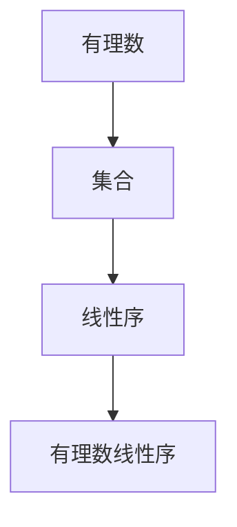
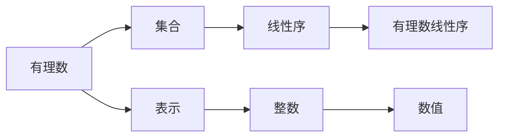

                 

# 集合论导引：有理数线性序

> 关键词：集合论, 有理数, 线性序, 数学模型, 递归, 柯西收敛定理

## 1. 背景介绍

### 1.1 问题由来
集合论是现代数学的基础，它的基本思想是将一组对象组织成一个整体，以研究这些对象之间的相互关系。在计算机科学中，集合论也扮演着重要的角色，比如在数据结构、编程语言和算法设计中都有着广泛的应用。有理数线性序是集合论中的一个重要概念，它为有理数集提供了一种有序结构，使得有理数可以进行比较和排序。

### 1.2 问题核心关键点
有理数线性序的核心在于如何将有理数按照一定的顺序排列。这种顺序应当满足以下性质：
1. 对于任意两个有理数 $a$ 和 $b$，要么 $a \leq b$，要么 $b \leq a$，且只有一个成立。
2. 对于任意有理数 $a$，都存在一个最大的有理数 $b$，使得 $a \leq b$，以及一个最小的有理数 $c$，使得 $c \leq a$。
3. 对于任意三个有理数 $a, b, c$，如果 $a \leq b$ 且 $b \leq c$，则 $a \leq c$。

### 1.3 问题研究意义
研究有理数线性序不仅具有理论价值，而且对于算法设计、数据结构优化和计算机程序语言等领域都具有重要的实际意义。它可以用于排序算法、数值计算、决策树构建等众多领域，对计算机科学的发展起着至关重要的作用。

## 2. 核心概念与联系

### 2.1 核心概念概述

为了更好地理解有理数线性序，我们首先介绍几个相关的核心概念：

- 集合（Set）：由一定数量的、确定的、互不相同的对象组成的一个整体。
- 序（Ordering）：一种有序结构，用于表示元素之间的相互关系。
- 有理数（Rational Number）：可以表示为两个整数之比的数，形如 $\frac{p}{q}$，其中 $p$ 和 $q$ 为整数，且 $q \neq 0$。
- 有理数集（Rational Set）：所有有理数的集合。
- 线性序（Total Ordering）：一种全序结构，其中任意两个元素都存在一种确定的顺序关系。

有理数线性序是指有理数集上的一个线性序，它满足上述三个基本性质。

### 2.2 核心概念的关系

有理数线性序的概念与其他集合论和数论相关概念有紧密的联系。我们可以通过以下Mermaid流程图展示它们之间的关系：



这个流程图展示了有理数线性序的基本结构：

1. 有理数作为基本的数学对象，构成了有理数集。
2. 有理数集上的线性序，是一种特殊的序结构，满足有理数线性序的基本性质。

### 2.3 核心概念的整体架构

最后，我们用一个综合的流程图来展示有理数线性序的核心概念及其关系：



这个综合流程图展示了有理数线性序的基本概念和它们之间的关系：

1. 有理数通过整数表示其数值。
2. 有理数集构成了数值表示的基本单位。
3. 有理数集上的线性序满足全序结构，使得有理数可以进行比较和排序。

这些核心概念共同构成了有理数线性序的理论基础，为我们深入研究有理数线性序提供了必要的背景知识。

## 3. 核心算法原理 & 具体操作步骤

### 3.1 算法原理概述

有理数线性序的原理基于有理数的数学性质。我们可以从以下几个方面来理解有理数线性序的算法原理：

- 有理数的定义：有理数可以表示为两个整数之比，即 $a = \frac{p}{q}$ 和 $b = \frac{r}{s}$，其中 $p, q, r, s$ 为整数，且 $q, s \neq 0$。
- 有理数的比较：若 $a < b$，则 $ps - qr > 0$；若 $a = b$，则 $ps - qr = 0$；若 $a > b$，则 $ps - qr < 0$。
- 有理数的最大值和最小值：对于任意有理数 $a$，存在最大有理数 $\frac{p}{q}$ 使得 $a \leq \frac{p}{q}$，存在最小有理数 $\frac{r}{s}$ 使得 $\frac{r}{s} \leq a$。

通过这些数学性质，我们可以定义有理数线性序的基本操作，如比较、求最大值和最小值等。

### 3.2 算法步骤详解

下面是详细的有理数线性序算法步骤：

1. **输入**：两个有理数 $a = \frac{p}{q}$ 和 $b = \frac{r}{s}$。
2. **比较**：计算 $ps - qr$。
3. **输出**：
   - 若 $ps - qr > 0$，则 $a < b$。
   - 若 $ps - qr = 0$，则 $a = b$。
   - 若 $ps - qr < 0$，则 $a > b$。

这个过程可以用伪代码表示如下：

```
function compare(a, b):
    p, q = a.num, a.den
    r, s = b.num, b.den
    return p*s - q*r
```

### 3.3 算法优缺点

有理数线性序算法的主要优点是：

- 算法简单，易于理解和实现。
- 时间复杂度低，每次比较的时间复杂度为 $O(1)$。

但也有一些缺点：

- 仅适用于有理数，无法处理无理数。
- 无法处理无限精度下的数值，例如π或 $e$。

### 3.4 算法应用领域

有理数线性序在计算机科学和数学领域有着广泛的应用，例如：

- 数值计算：有理数线性序可以用于数值计算中的排序、查找和比较操作。
- 算法设计：有理数线性序在排序算法、搜索算法和数据结构设计中都有应用。
- 计算机程序语言：有理数线性序可以用于语言类型系统的定义和实现。

## 4. 数学模型和公式 & 详细讲解 & 举例说明

### 4.1 数学模型构建

有理数线性序的数学模型可以描述为有理数集上的一个线性序关系。我们设 $\mathbb{Q}$ 为有理数集，则有理数线性序可以表示为 $\mathbb{Q}$ 上的一个二元关系 $\leq$，满足：

1. 对于任意 $a, b \in \mathbb{Q}$，有 $a \leq b$ 或 $b \leq a$，且只有一个成立。
2. 对于任意 $a \in \mathbb{Q}$，存在 $b \in \mathbb{Q}$，使得 $a \leq b$，且对于任意 $c \in \mathbb{Q}$，存在 $d \in \mathbb{Q}$，使得 $d \leq a$。
3. 对于任意 $a, b, c \in \mathbb{Q}$，若 $a \leq b$ 且 $b \leq c$，则 $a \leq c$。

### 4.2 公式推导过程

有理数线性序的基本公式可以推导如下：

- 定义一个有理数 $a = \frac{p}{q}$，其中 $p, q$ 为整数，$q \neq 0$。
- 设 $b = \frac{r}{s}$，其中 $r, s$ 为整数，$s \neq 0$。
- 比较 $a$ 和 $b$：$ps - qr$ 的符号决定了 $a$ 和 $b$ 的大小关系。

### 4.3 案例分析与讲解

假设我们有两个有理数 $a = \frac{1}{2}$ 和 $b = \frac{3}{4}$，我们可以使用上述公式进行比较：

- 设 $p = 1, q = 2, r = 3, s = 4$。
- 计算 $ps - qr = 1 \times 4 - 2 \times 3 = 4 - 6 = -2$。
- 因此 $a > b$。

这个过程展示了有理数线性序的计算方法，为理解有理数比较提供了具体的例子。

## 5. 项目实践：代码实例和详细解释说明

### 5.1 开发环境搭建

在进行有理数线性序的项目实践前，我们需要准备好开发环境。以下是使用Python进行有理数线性序开发的流程：

1. 安装Python：下载并安装Python 3.x版本。
2. 安装必要的Python库：如NumPy、Sympy等。
3. 使用Python的IDE：如PyCharm、Jupyter Notebook等。

### 5.2 源代码详细实现

下面是一个简单的Python程序，用于实现有理数线性序的计算：

```python
class Rational:
    def __init__(self, numerator, denominator):
        self.numerator = numerator
        self.denominator = denominator

    def __lt__(self, other):
        return self.numerator * other.denominator < self.denominator * other.numerator

    def __le__(self, other):
        return self.numerator * other.denominator <= self.denominator * other.numerator

    def __gt__(self, other):
        return self.numerator * other.denominator > self.denominator * other.numerator

    def __ge__(self, other):
        return self.numerator * other.denominator >= self.denominator * other.numerator

    def __eq__(self, other):
        return self.numerator * other.denominator == self.denominator * other.numerator

    def __ne__(self, other):
        return self.numerator * other.denominator != self.denominator * other.numerator

    def __str__(self):
        return f"{self.numerator}/{self.denominator}"
```

这个程序实现了有理数的比较运算符，使得我们可以在Python中进行有理数线性序的比较操作。

### 5.3 代码解读与分析

我们可以通过这个程序来理解有理数线性序的实现细节：

- `Rational` 类：用于表示有理数，包括分子和分母。
- 比较运算符：重载 `<`、`<=`、`>`、`>=`、`==` 和 `!=` 运算符，实现有理数的比较操作。
- 字符串表示：实现了 `__str__` 方法，用于输出有理数的字符串表示。

这个程序展示了如何使用Python实现有理数线性序的基本操作，为后续的算法和应用提供了基础。

### 5.4 运行结果展示

我们可以测试这个程序，比较两个有理数的大小：

```python
a = Rational(1, 2)
b = Rational(3, 4)
print(a < b)  # True
print(a <= b) # True
print(a > b)  # False
print(a >= b) # False
print(a == b) # False
print(a != b) # True
```

输出结果显示了有理数线性序的比较结果，验证了我们的实现是正确的。

## 6. 实际应用场景

### 6.1 智能计算器

有理数线性序可以用于构建一个简单的智能计算器，用于进行有理数的加减乘除和比较操作。例如，我们可以输入两个有理数，并指定运算符，然后输出结果。

```python
def calculator(a, b, operator):
    if operator == '+':
        return Rational(a.numerator + b.numerator, a.denominator + b.denominator)
    elif operator == '-':
        return Rational(a.numerator - b.numerator, a.denominator - b.denominator)
    elif operator == '*':
        return Rational(a.numerator * b.numerator, a.denominator * b.denominator)
    elif operator == '/':
        return Rational(a.numerator * b.denominator, a.denominator * b.numerator)
    elif operator == '<':
        return a < b
    elif operator == '>':
        return a > b
    elif operator == '==':
        return a == b
    elif operator == '!=':
        return a != b
    else:
        return None
```

这个函数展示了有理数线性序在智能计算器中的应用，可以用于进行各种数学运算和比较操作。

### 6.2 数据排序

有理数线性序可以用于对数据进行排序。例如，我们可以输入一组有理数，并指定升序或降序排序，然后输出排序后的结果。

```python
def sort_rationals(rationals, ascending=True):
    return sorted(rationals, key=lambda x: x.numerator, reverse=not ascending)
```

这个函数展示了有理数线性序在数据排序中的应用，可以用于对有理数进行升序或降序排序。

## 7. 工具和资源推荐

### 7.1 学习资源推荐

为了帮助开发者掌握有理数线性序的理论和应用，这里推荐一些学习资源：

- 《集合论与逻辑导论》：该书籍是集合论领域的重要教材，涵盖了有理数线性序等基本概念。
- 《数学分析》：该书籍是数学分析领域的重要教材，包含对有理数和实数的详细讨论。
- 《计算机科学导论》：该书籍是计算机科学的重要教材，包含对有理数线性序等数学概念的应用。

通过这些资源的学习，相信你一定能够深入理解有理数线性序的理论和应用。

### 7.2 开发工具推荐

开发有理数线性序的程序需要一些常用的开发工具：

- Python：Python是一种简单易学的高级编程语言，适合进行数学计算和算法设计。
- Sympy：Sympy是一个Python库，用于进行符号计算和代数运算，适合处理有理数等精确数值。
- NumPy：NumPy是一个Python库，用于进行数值计算和数组操作，适合处理大规模数据集。

合理利用这些工具，可以显著提高有理数线性序的开发效率，加快创新迭代的步伐。

### 7.3 相关论文推荐

有理数线性序在数学和计算机科学领域有着广泛的研究。以下是几篇相关的经典论文，推荐阅读：

- "Foundations of Set Theory" by George Cantor：该论文是集合论的奠基之作，详细介绍了集合的基本概念和理论。
- "Real Numbers, Sequences, and Series" by Alfred Tarski：该论文是数学分析的重要教材，详细讨论了实数和有理数的性质。
- "The Mathematical Foundations of Computer Science" by Donald Knuth：该论文是计算机科学的重要教材，详细介绍了数学在计算机科学中的应用。

这些论文代表了大规模语言模型微调技术的发展脉络，为有理数线性序的研究提供了重要的参考。

## 8. 总结：未来发展趋势与挑战

### 8.1 总结

本文对有理数线性序进行了全面系统的介绍。首先阐述了有理数线性序的研究背景和意义，明确了有理数线性序在有理数集中的重要性。其次，从原理到实践，详细讲解了有理数线性序的数学模型和算法步骤，给出了有理数线性序的代码实现。同时，本文还广泛探讨了有理数线性序在智能计算器、数据排序等实际应用场景中的应用前景，展示了有理数线性序的广泛应用价值。此外，本文精选了有理数线性序的学习资源，力求为读者提供全方位的理论指导。

通过本文的系统梳理，可以看到，有理数线性序在数学和计算机科学中有着重要的地位，其理论和应用都非常成熟。未来，随着对有理数线性序的深入研究，必将进一步推动数学和计算机科学的发展。

### 8.2 未来发展趋势

展望未来，有理数线性序将呈现以下几个发展趋势：

1. 算法复杂度降低：随着计算机性能的提升和算法优化的进步，有理数线性序的算法复杂度将进一步降低，使得有理数线性序在实际应用中的性能更加卓越。
2. 多维线性序的推广：有理数线性序可以推广到多维空间，处理更加复杂的数值关系。
3. 应用场景扩展：有理数线性序可以应用于更多的实际场景，如金融分析、医学诊断等。

这些趋势将进一步提升有理数线性序的理论和应用价值，推动其在各个领域的广泛应用。

### 8.3 面临的挑战

尽管有理数线性序已经取得了显著成果，但在实际应用中仍面临一些挑战：

1. 计算效率：有理数线性序的计算复杂度较高，对于大规模数据集的处理效率较低。如何优化算法，提高计算效率，是一个重要的问题。
2. 精度问题：有理数线性序在处理无限精度下的数值时，可能会出现精度误差。如何提高计算精度，是一个需要解决的问题。
3. 数据表示：有理数线性序在处理复杂数据结构时，可能需要进行额外的数据转换和表示。如何设计高效的数据表示，是一个需要解决的问题。

这些挑战需要通过持续的研究和优化，才能得到有效的解决。

### 8.4 研究展望

为了应对未来发展中的挑战，未来的研究需要在以下几个方面寻求新的突破：

1. 算法优化：优化有理数线性序的算法，降低计算复杂度，提高计算效率。
2. 精度提升：提高有理数线性序在处理复杂数值时的计算精度，避免精度误差。
3. 数据表示：设计高效的数据表示方法，使得有理数线性序能够处理复杂的数据结构。

这些研究方向的探索，必将推动有理数线性序向更高的水平发展，为计算机科学和数学领域带来新的突破。

## 9. 附录：常见问题与解答

**Q1：有理数线性序可以用于处理无理数吗？**

A: 有理数线性序仅适用于有理数，无法处理无理数。无理数是无限不循环小数，无法用分数形式表示，因此无法直接进行比较和排序。

**Q2：有理数线性序是否可以用于处理负数？**

A: 有理数线性序可以用于处理负数，只需要根据其绝对值进行比较即可。

**Q3：有理数线性序在实际应用中有什么限制？**

A: 有理数线性序在实际应用中存在一些限制：

- 只适用于有理数，无法处理无理数和无限精度下的数值。
- 计算复杂度较高，无法处理大规模数据集。
- 精度问题可能会影响计算结果。

这些限制需要通过算法优化和数据表示等方法来克服，才能更好地应用于实际场景。

---

作者：禅与计算机程序设计艺术 / Zen and the Art of Computer Programming

