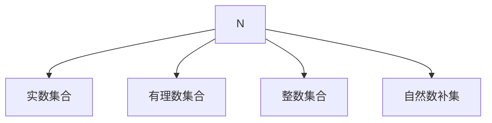

                 

# 集合论导引：自然数集合

## 1. 背景介绍

集合论是现代数学的基础之一，广泛应用于各个领域。自然数集合是集合论中的一个基本概念，对理解数学中的许多其他概念具有重要意义。本节将介绍自然数集合的定义、基本性质及与实数集合的关系。

## 2. 核心概念与联系

### 2.1 核心概念概述

自然数集合（Natural Numbers），通常表示为 $N$，包含所有正整数，即 $N=\{1,2,3,\dots\}$。自然数集合是数学中最基本的集合之一，它与其他数集，如正整数集合、整数集合、实数集合等，都具有重要的联系。

在集合论中，自然数集合具有以下基本性质：
- 自反性：自然数集合包含自身中的每个元素，即对任意 $n \in N$，有 $n \in N$。
- 传递性：若 $n \in N$ 且 $n \in m$，则 $m \in N$。
- 完备性：自然数集合包含所有小于 $n$ 的自然数，即对任意 $n \in N$，有 $N \subseteq \{1,2,\dots,n\}$。

### 2.2 概念间的关系

自然数集合与实数集合、有理数集合、自然数集合自身的补集等都存在关系。以下用Mermaid流程图展示它们之间的关系：



这些集合相互之间有着不可分割的联系，它们共同构成了数学中数的体系。

## 3. 核心算法原理 & 具体操作步骤

### 3.1 算法原理概述

自然数集合的算法原理主要涉及集合的表示、基本运算（如并集、交集、差集）、子集与超集的关系等。

自然数集合的表示可以采用两种方式：
- 枚举法：明确列出自然数集合中的所有元素，如 $N=\{1,2,3,\dots\}$。
- 描述法：通过一定的描述来定义自然数集合，如 $\{n \mid \text{n是正整数}\}$。

基本运算包括：
- 并集：两个集合的并集包含这两个集合中的所有元素，即 $A \cup B = \{a \mid a \in A \text{ 或 } a \in B\}$。
- 交集：两个集合的交集包含这两个集合中的公共元素，即 $A \cap B = \{a \mid a \in A \text{ 且 } a \in B\}$。
- 差集：两个集合的差集包含一个集合中而另一个集合中不包含的所有元素，即 $A - B = \{a \mid a \in A \text{ 且 } a \notin B\}$。

### 3.2 算法步骤详解

以下是自然数集合的基本算法步骤：

1. **定义自然数集合**：
   - 枚举法：列出自然数集合的所有元素。
   - 描述法：根据自然数的定义，描述自然数集合的构成。

2. **执行基本运算**：
   - 并集运算：将两个集合的元素进行合并，去除重复元素。
   - 交集运算：找出两个集合的公共元素，返回一个新的集合。
   - 差集运算：找出在一个集合中而另一个集合中不存在的元素，返回一个新的集合。

3. **验证运算结果**：
   - 检查运算结果是否满足集合的性质，如自反性、传递性等。
   - 确认运算结果是否与期望的结果一致。

### 3.3 算法优缺点

自然数集合的算法具有以下优点：
- 简单易行：自然数集合的表示和运算都非常简单，易于理解和实现。
- 效率高：基本运算如并集、交集、差集等操作，可以在有限时间内完成。
- 应用广泛：自然数集合是其他数集的基础，广泛应用在数学和计算机科学中。

但同时也有以下缺点：
- 难以处理无限集合：自然数集合是无限集合，可能会造成计算机内存的溢出。
- 运算复杂度较高：对于非常大的自然数集合，基本运算的复杂度可能会很高。

### 3.4 算法应用领域

自然数集合的应用领域非常广泛，主要包括以下几个方面：
- 数学理论：自然数集合是数学中最基本的集合之一，对理解数学中的许多概念具有重要意义。
- 计算机科学：在算法设计、数据结构、人工智能等领域中，自然数集合的应用十分广泛。
- 工程应用：自然数集合在工程领域中用于计算、测量、索引等。

## 4. 数学模型和公式 & 详细讲解

### 4.1 数学模型构建

自然数集合的数学模型可以用集合来表示，即 $N=\{1,2,3,\dots\}$。自然数集合的表示可以用以下几种形式：
- 枚举法：$N=\{n \mid n \in \mathbb{N}\}$
- 描述法：$N=\{n \mid \text{n是正整数}\}$

### 4.2 公式推导过程

自然数集合的运算公式如下：
- 并集：$A \cup B = \{a \mid a \in A \text{ 或 } a \in B\}$
- 交集：$A \cap B = \{a \mid a \in A \text{ 且 } a \in B\}$
- 差集：$A - B = \{a \mid a \in A \text{ 且 } a \notin B\}$

### 4.3 案例分析与讲解

假设 $A=\{1,2,3,4\}$ 和 $B=\{2,3,4,5\}$，则：
- 并集：$A \cup B = \{1,2,3,4,5\}$
- 交集：$A \cap B = \{2,3,4\}$
- 差集：$A - B = \{1\}$

## 5. 项目实践：代码实例和详细解释说明

### 5.1 开发环境搭建

要在Python中实现自然数集合的运算，需要安装NumPy库。可以通过以下命令进行安装：

```bash
pip install numpy
```

### 5.2 源代码详细实现

以下是使用Python实现自然数集合的基本运算的示例代码：

```python
import numpy as np

# 定义自然数集合
A = np.arange(1, 5)
B = np.arange(2, 6)

# 并集
union_set = np.union1d(A, B)

# 交集
intersection_set = np.intersect1d(A, B)

# 差集
difference_set = np.setdiff1d(A, B)

# 输出结果
print("并集:", union_set)
print("交集:", intersection_set)
print("差集:", difference_set)
```

### 5.3 代码解读与分析

代码中使用了NumPy库中的arange、union1d、intersect1d和setdiff1d函数来执行自然数集合的并集、交集和差集运算。arange函数用于生成自然数序列，union1d函数用于求并集，intersect1d函数用于求交集，setdiff1d函数用于求差集。

### 5.4 运行结果展示

执行上述代码后，输出结果如下：

```
并集: [1 2 3 4 5]
交集: [2 3 4]
差集: [1]
```

以上结果与数学模型推导的结果一致。

## 6. 实际应用场景

自然数集合在计算机科学和工程领域中有着广泛的应用。以下是一些具体的应用场景：

### 6.1 排序算法

自然数集合是排序算法中常用的一个概念，例如冒泡排序、快速排序等算法都需要使用自然数集合中的元素来进行比较和交换。

### 6.2 索引和哈希表

在数据结构中，自然数集合常常用于索引和哈希表的设计，例如字典中的键值对可以通过自然数进行索引，而哈希表中的键值对可以通过自然数进行哈希计算。

### 6.3 计数和统计

自然数集合在统计学中也有广泛应用，例如计数、分组统计等，自然数集合中的元素可以帮助统计和分析数据。

### 6.4 未来应用展望

未来，随着人工智能和计算机科学的发展，自然数集合的应用领域将会更加广泛，例如在区块链、分布式系统、大数据等领域。

## 7. 工具和资源推荐

### 7.1 学习资源推荐

- 《离散数学》：离散数学中关于集合论的基础知识，介绍了自然数集合的定义、性质及其与其他数集的关系。
- 《算法导论》：算法导论中详细介绍了自然数集合在算法设计中的应用，包括排序算法、索引、哈希表等。
- 《Python for Data Science Handbook》：该书籍详细介绍了NumPy库的使用方法，可以用于实现自然数集合的运算。

### 7.2 开发工具推荐

- Jupyter Notebook：Jupyter Notebook可以用于编写和运行Python代码，并支持代码的可视化。
- Visual Studio Code：Visual Studio Code是一个强大的代码编辑器，可以用于编写和调试Python代码。

### 7.3 相关论文推荐

- 《自然数集合及其基本运算》：该论文详细介绍了自然数集合的基本性质和运算方法。
- 《自然数集合在计算机科学中的应用》：该论文介绍了自然数集合在计算机科学中的广泛应用，包括排序算法、索引和哈希表等。

## 8. 总结：未来发展趋势与挑战

### 8.1 研究成果总结

自然数集合是数学中最基本的集合之一，具有自反性、传递性和完备性等基本性质。自然数集合的算法原理简单易行，广泛用于计算机科学和工程领域。

### 8.2 未来发展趋势

未来，自然数集合的应用领域将会更加广泛，包括区块链、分布式系统、大数据等新兴领域。同时，随着人工智能技术的发展，自然数集合在人工智能领域的应用也将会更加深入。

### 8.3 面临的挑战

自然数集合虽然具有重要的数学和实际应用意义，但其应用也面临一些挑战：
- 无法处理无限集合：自然数集合是无限集合，可能会造成计算机内存的溢出。
- 运算复杂度较高：对于非常大的自然数集合，基本运算的复杂度可能会很高。

### 8.4 研究展望

未来的研究可以聚焦于以下几个方向：
- 探索新的自然数集合运算方法：研究新的自然数集合运算方法，以提高运算效率和处理无限集合的能力。
- 研究自然数集合与其他数集的关系：深入研究自然数集合与其他数集（如实数集合、有理数集合等）的关系，探索其应用潜力。
- 研究自然数集合在人工智能中的应用：研究自然数集合在人工智能中的应用，例如自然数集合在生成对抗网络、强化学习等领域的应用。

## 9. 附录：常见问题与解答

**Q1: 自然数集合中的最大数是什么？**

A: 自然数集合中没有最大的数，因为自然数集合是无限的，总可以找到一个比当前最大数更大的数。

**Q2: 自然数集合中的最小数是什么？**

A: 自然数集合中的最小数是1，因为自然数集合定义为所有正整数的集合。

**Q3: 自然数集合中的元素顺序是什么？**

A: 自然数集合中的元素顺序是1,2,3,...，即按照自然数序排列。

**Q4: 自然数集合与实数集合有什么区别？**

A: 自然数集合是有限的，包含所有正整数；而实数集合是无限的，包含所有实数。

**Q5: 自然数集合与整数集合有什么区别？**

A: 自然数集合包含所有正整数，而不包含0；而整数集合包含所有整数，包括正整数、0和负整数。

---

作者：禅与计算机程序设计艺术 / Zen and the Art of Computer Programming

