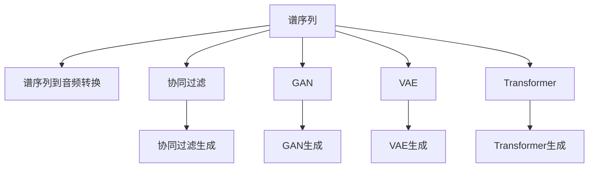
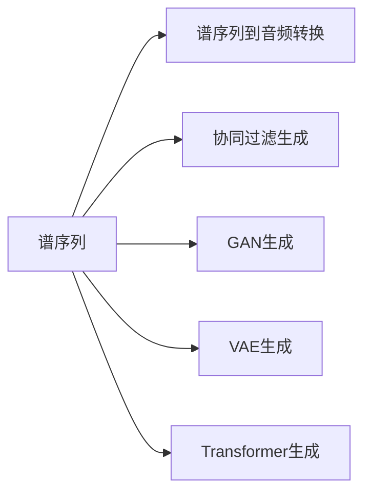
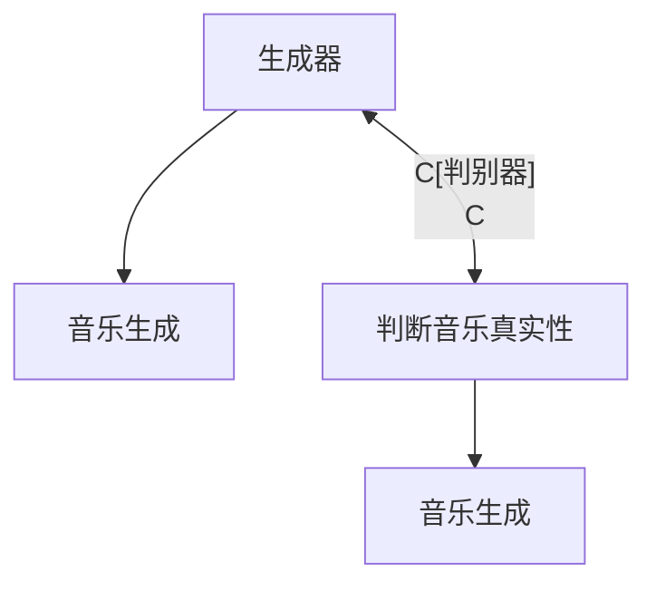
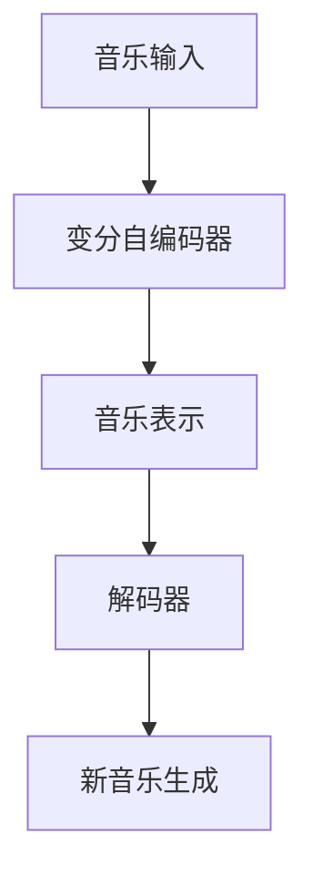
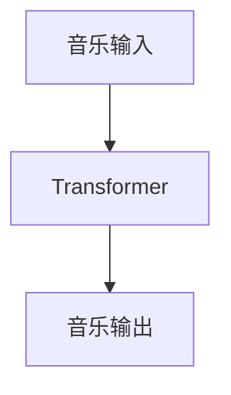
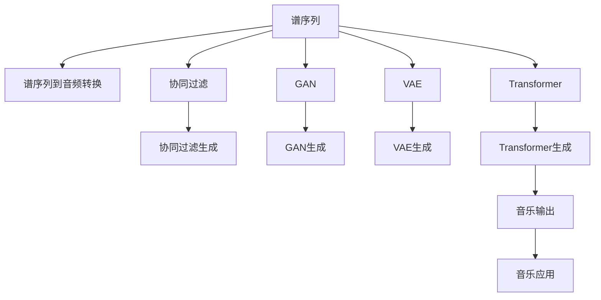

                 

# 音乐生成 (Music Generation)

> 关键词：音乐生成、机器学习、深度学习、神经网络、谱序列、协同过滤、GAN、变分自编码器、Transformer、MIDI文件、音频合成、音乐创作工具、音乐创作平台

## 1. 背景介绍

### 1.1 问题由来

音乐生成一直是人工智能领域的研究热点之一。近年来，随着深度学习技术的发展，尤其是神经网络的广泛应用，音乐生成技术也取得了显著进步。音乐生成模型可以通过学习大量已有的音乐数据，生成新颖且具有一定艺术性的音乐作品。这些模型不仅能够模仿现有的音乐风格，还可以创作新的音乐作品，甚至能够实现音乐风格的迁移和混合。

音乐生成技术的应用广泛，涉及娱乐、教育、游戏等多个领域。例如，在娱乐领域，音乐生成可以用于自动作曲、音乐推荐、音乐伴奏生成等；在教育领域，音乐生成可以用于音乐教学、音乐创作工具的辅助等；在游戏领域，音乐生成可以用于游戏场景中的背景音乐生成、角色音乐生成等。

### 1.2 问题核心关键点

音乐生成技术的关键在于如何利用深度学习模型，有效地从音乐数据中提取特征，生成具有艺术性和创造性的音乐作品。目前，音乐生成技术主要包括以下几种方法：

- **基于谱序列的生成**：将音乐视为一种谱序列，通过神经网络直接生成谱序列，然后通过谱序列到音频的转换技术，将谱序列转换为音频。
- **协同过滤**：利用协同过滤算法，通过用户行为数据，推荐相似的音乐作品，从而生成新的音乐。
- **生成对抗网络（GAN）**：通过生成器和判别器的对抗训练，生成具有一定风格的音乐作品。
- **变分自编码器（VAE）**：通过变分自编码器，将音乐转换为低维空间，然后再通过解码器生成新的音乐。
- **Transformer**：通过Transformer结构，将音乐序列建模为自回归模型，直接生成音乐序列。

这些方法各有优缺点，适用于不同的音乐生成任务和应用场景。

### 1.3 问题研究意义

研究音乐生成技术，对于拓展人工智能的应用边界，提升音乐作品的创作效率，加速音乐技术的发展具有重要意义：

1. **降低创作成本**：通过自动作曲、自动编曲等技术，可以显著减少音乐创作所需的时间和人力成本。
2. **提升创作质量**：深度学习模型可以从海量的音乐数据中学习到丰富的音乐知识和风格，生成具有较高艺术性的音乐作品。
3. **加速创作进程**：音乐生成技术可以辅助音乐创作，快速生成初步作品，加快音乐创作进程。
4. **创新音乐风格**：通过音乐风格的迁移和混合，生成新颖的音乐风格，丰富音乐创作的表现形式。
5. **应用场景广泛**：音乐生成技术可以应用于娱乐、教育、游戏等多个领域，具有广阔的应用前景。

## 2. 核心概念与联系

### 2.1 核心概念概述

为了更好地理解音乐生成技术，本节将介绍几个密切相关的核心概念：

- **音乐生成**：利用深度学习模型，从已有音乐数据中学习特征，生成新的音乐作品。音乐生成可以分为自动作曲、自动编曲、音乐风格迁移等任务。
- **谱序列（Spectral Sequence）**：将音乐视为一种谱序列，通过谱序列到音频的转换技术，生成音乐作品。谱序列包括时间域和频率域的信息，能够描述音乐的音高、音色、节奏等特征。
- **协同过滤（Collaborative Filtering）**：通过分析用户对音乐作品的评分数据，推荐相似的音乐作品，生成新的音乐。协同过滤算法包括基于用户的协同过滤和基于项目的协同过滤。
- **生成对抗网络（GAN）**：通过生成器和判别器的对抗训练，生成具有一定风格的音乐作品。GAN在图像生成、音乐生成等领域都有广泛应用。
- **变分自编码器（VAE）**：通过变分自编码器，将音乐转换为低维空间，然后再通过解码器生成新的音乐。VAE能够生成具有较高可解释性的音乐作品。
- **Transformer**：通过Transformer结构，将音乐序列建模为自回归模型，直接生成音乐序列。Transformer在自然语言处理领域有广泛应用，但也可以用于音乐生成。

这些核心概念之间的逻辑关系可以通过以下Mermaid流程图来展示：



这个流程图展示了大语言模型的核心概念及其之间的关系：

1. 谱序列是大语言模型的基础数据表示。
2. 协同过滤、GAN、VAE、Transformer等多种生成技术，都可以基于谱序列进行音乐生成。
3. 协同过滤、GAN、VAE等方法，可以生成具有一定风格的音乐作品。
4. Transformer结构，可以直接生成音乐序列。

这些概念共同构成了音乐生成技术的框架，使得音乐生成过程更加灵活和高效。

### 2.2 概念间的关系

这些核心概念之间存在着紧密的联系，形成了音乐生成技术的完整生态系统。下面我们通过几个Mermaid流程图来展示这些概念之间的关系。

#### 2.2.1 音乐生成的主要方法



这个流程图展示了大语言模型的主要生成方法。谱序列可以通过多种方法生成音乐作品，包括谱序列到音频转换、协同过滤、GAN、VAE和Transformer。

#### 2.2.2 协同过滤与音乐生成


这个流程图展示了协同过滤的基本原理，以及如何基于协同过滤生成音乐。协同过滤首先通过用户行为数据计算音乐作品之间的相似性，然后推荐相似的音乐作品，最终生成新的音乐。

#### 2.2.3 生成对抗网络



这个流程图展示了GAN的基本原理，以及如何通过GAN生成音乐。生成器和判别器通过对抗训练，生成具有一定风格的音乐作品。

#### 2.2.4 变分自编码器



这个流程图展示了VAE的基本原理，以及如何通过VAE生成音乐。VAE将音乐转换为低维空间，然后再通过解码器生成新的音乐。

#### 2.2.5 Transformer生成音乐



这个流程图展示了Transformer的基本原理，以及如何通过Transformer生成音乐。Transformer将音乐序列建模为自回归模型，直接生成音乐序列。

### 2.3 核心概念的整体架构

最后，我们用一个综合的流程图来展示这些核心概念在大语言模型微调过程中的整体架构：



这个综合流程图展示了从谱序列到音乐生成的完整过程。谱序列可以通过多种方法生成音乐作品，包括谱序列到音频转换、协同过滤、GAN、VAE和Transformer。协同过滤、GAN、VAE等方法，可以生成具有一定风格的音乐作品。Transformer结构，可以直接生成音乐序列。最终，生成的音乐可以通过音乐应用进行实际应用。

## 3. 核心算法原理 & 具体操作步骤
### 3.1 算法原理概述

音乐生成技术涉及多种算法，包括谱序列生成、协同过滤、生成对抗网络、变分自编码器、Transformer等。其中，谱序列生成是最基础的方法，而协同过滤、GAN、VAE和Transformer则是更高级的生成技术。

### 3.2 算法步骤详解

#### 3.2.1 谱序列生成

谱序列生成将音乐视为一种谱序列，通过神经网络直接生成谱序列，然后通过谱序列到音频的转换技术，将谱序列转换为音频。谱序列生成步骤如下：

1. **谱序列表示**：将音乐视为一种谱序列，包括时间域和频率域的信息。谱序列表示可以采用各种形式，如MFCC、MFCC-Log、MFCC-LPC等。
2. **神经网络建模**：利用神经网络建模谱序列，通过训练学习谱序列的特征。
3. **谱序列到音频转换**：将生成的谱序列转换为音频，常用的谱序列到音频转换技术包括逆STFT、MIR-CTC、SincNet等。

#### 3.2.2 协同过滤生成

协同过滤生成通过分析用户对音乐作品的评分数据，推荐相似的音乐作品，从而生成新的音乐。协同过滤生成步骤如下：

1. **用户行为数据收集**：收集用户对音乐作品的评分数据，包括用户的年龄、性别、音乐偏好等。
2. **相似性计算**：利用协同过滤算法计算音乐作品之间的相似性，常用的相似性计算方法包括余弦相似度、欧氏距离等。
3. **相似音乐推荐**：推荐与用户评分相似的音乐作品，常用的推荐算法包括基于用户的协同过滤和基于项目的协同过滤。
4. **新音乐生成**：基于推荐的音乐作品，生成新的音乐作品。

#### 3.2.3 生成对抗网络生成

生成对抗网络生成通过生成器和判别器的对抗训练，生成具有一定风格的音乐作品。生成对抗网络生成步骤如下：

1. **生成器和判别器设计**：设计生成器和判别器的结构，常用的生成器结构包括CNN、RNN、LSTM等，判别器的结构包括CNN、RNN、LSTM等。
2. **对抗训练**：通过生成器和判别器的对抗训练，生成具有一定风格的音乐作品。
3. **音乐生成**：生成具有一定风格的音乐作品，常用的音乐生成方法包括谱序列生成、波形生成等。

#### 3.2.4 变分自编码器生成

变分自编码器生成通过变分自编码器，将音乐转换为低维空间，然后再通过解码器生成新的音乐。变分自编码器生成步骤如下：

1. **音乐输入**：将音乐输入变分自编码器，变分自编码器包括编码器和解码器。
2. **音乐表示**：通过编码器将音乐转换为低维空间，常用的低维空间表示方法包括高斯分布、泊松分布等。
3. **新音乐生成**：通过解码器生成新的音乐作品。

#### 3.2.5 Transformer生成

Transformer生成通过Transformer结构，将音乐序列建模为自回归模型，直接生成音乐序列。Transformer生成步骤如下：

1. **音乐输入**：将音乐序列输入Transformer模型。
2. **音乐输出**：通过Transformer模型生成音乐序列。

### 3.3 算法优缺点

音乐生成技术涉及多种算法，每种算法都有其优缺点。下面简要介绍这些算法的优缺点：

#### 谱序列生成

- **优点**：
  - 能够直接生成音频，具有较高的音频保真度。
  - 不需要大量的用户行为数据，适用于音乐风格的迁移和混合。
  - 谱序列表示可以包含时间域和频率域的信息，能够描述音乐的音高、音色、节奏等特征。

- **缺点**：
  - 谱序列到音频转换的复杂度较高，需要较多的计算资源。
  - 谱序列表示较为复杂，难以直接解释生成的音乐作品。

#### 协同过滤生成

- **优点**：
  - 不需要生成音频，可以基于用户行为数据生成音乐作品。
  - 适用于音乐推荐、音乐伴奏生成等场景。
  - 简单易实现，算法复杂度较低。

- **缺点**：
  - 对标注数据的需求较高，需要有大量用户行为数据。
  - 生成的音乐作品可能缺乏创新性和艺术性。

#### 生成对抗网络生成

- **优点**：
  - 生成的音乐作品具有较高的艺术性和创新性。
  - 能够生成具有一定风格的音乐作品，适用于音乐风格的迁移和混合。
  - 适用于音乐生成、音乐伴奏生成等场景。

- **缺点**：
  - 需要大量的计算资源，训练时间较长。
  - 生成的音乐作品可能缺乏一致性和稳定性。

#### 变分自编码器生成

- **优点**：
  - 生成的音乐作品具有较高的可解释性。
  - 能够生成具有较高艺术性和创新性的音乐作品。
  - 适用于音乐生成、音乐伴奏生成等场景。

- **缺点**：
  - 对标注数据的需求较高，需要有大量音乐数据。
  - 生成的音乐作品可能缺乏一致性和稳定性。

#### Transformer生成

- **优点**：
  - 能够直接生成音乐序列，具有较高的生成效率。
  - 适用于音乐生成、音乐伴奏生成等场景。
  - 生成的音乐作品具有较高的一致性和稳定性。

- **缺点**：
  - 对标注数据的需求较高，需要有大量音乐数据。
  - 生成的音乐作品可能缺乏创新性和艺术性。

### 3.4 算法应用领域

音乐生成技术已经在多个领域得到了广泛应用，包括娱乐、教育、游戏等。

#### 娱乐领域

在娱乐领域，音乐生成技术可以用于自动作曲、自动编曲、音乐伴奏生成等。例如，MIDI文件是一种常见的音乐文件格式，可以通过音乐生成技术自动生成MIDI文件，用于音乐的播放和制作。

#### 教育领域

在教育领域，音乐生成技术可以用于音乐教学、音乐创作工具的辅助等。例如，可以通过音乐生成技术，自动生成简谱、五线谱等音乐符号，帮助学生学习和理解音乐知识。

#### 游戏领域

在游戏领域，音乐生成技术可以用于游戏场景中的背景音乐生成、角色音乐生成等。例如，可以通过音乐生成技术，自动生成游戏场景中的背景音乐和角色音乐，提升游戏的沉浸感和体验感。

## 4. 数学模型和公式 & 详细讲解 & 举例说明

### 4.1 数学模型构建

音乐生成技术的数学模型可以基于谱序列、协同过滤、生成对抗网络、变分自编码器、Transformer等多种方法构建。以下以谱序列生成为例，介绍其数学模型的构建过程。

假设谱序列表示为 $x=[x_1,x_2,\ldots,x_T]$，其中 $x_t$ 表示时间 $t$ 时刻的谱序列值。谱序列生成的数学模型可以表示为：

$$
x_t=f(x_{t-1},x_{t-2},\ldots,x_{t-D+1})
$$

其中，$f$ 为谱序列生成函数，$D$ 为历史谱序列的个数。谱序列生成函数 $f$ 通常采用神经网络建模，可以表示为：

$$
f(x_{t-1},x_{t-2},\ldots,x_{t-D+1})=W(x_{t-1},x_{t-2},\ldots,x_{t-D+1})
$$

其中，$W$ 为神经网络权重矩阵，可以表示为：

$$
W=[w_{t-1},w_{t-2},\ldots,w_{t-D+1}]
$$

### 4.2 公式推导过程

谱序列生成的公式推导过程如下：

1. **谱序列表示**：将音乐视为一种谱序列，包括时间域和频率域的信息。谱序列表示可以采用各种形式，如MFCC、MFCC-Log、MFCC-LPC等。
2. **神经网络建模**：利用神经网络建模谱序列，通过训练学习谱序列的特征。
3. **谱序列到音频转换**：将生成的谱序列转换为音频，常用的谱序列到音频转换技术包括逆STFT、MIR-CTC、SincNet等。

谱序列生成的数学模型可以表示为：

$$
x_t=f(x_{t-1},x_{t-2},\ldots,x_{t-D+1})
$$

其中，$f$ 为谱序列生成函数，$D$ 为历史谱序列的个数。谱序列生成函数 $f$ 通常采用神经网络建模，可以表示为：

$$
f(x_{t-1},x_{t-2},\ldots,x_{t-D+1})=W(x_{t-1},x_{t-2},\ldots,x_{t-D+1})
$$

其中，$W$ 为神经网络权重矩阵，可以表示为：

$$
W=[w_{t-1},w_{t-2},\ldots,w_{t-D+1}]
$$

### 4.3 案例分析与讲解

下面以谱序列生成为例，介绍其具体实现过程。

#### 案例1：谱序列生成器设计

假设谱序列的表示采用MFCC，时间窗口为10秒，频率窗口为2048点。谱序列生成器可以采用LSTM或CNN进行建模。以下以LSTM为例，介绍谱序列生成器的设计过程。

1. **数据预处理**：将音乐文件转换为MFCC特征，生成MFCC特征序列 $X=[X_1,X_2,\ldots,X_T]$，其中 $X_t$ 表示时间 $t$ 时刻的MFCC特征向量。
2. **谱序列生成模型设计**：设计LSTM模型，将MFCC特征序列 $X$ 作为输入，生成谱序列 $x$。
3. **谱序列到音频转换**：将生成的谱序列 $x$ 转换为音频，常用的谱序列到音频转换技术包括逆STFT、MIR-CTC、SincNet等。

#### 案例2：谱序列生成器训练

谱序列生成器的训练过程如下：

1. **模型初始化**：随机初始化神经网络权重矩阵 $W$。
2. **数据加载**：从音乐数据集中加载谱序列数据，生成谱序列 $x$ 和MFCC特征序列 $X$。
3. **模型训练**：利用谱序列生成函数 $f$，通过训练学习谱序列的特征，最小化谱序列生成误差。
4. **谱序列到音频转换**：将生成的谱序列 $x$ 转换为音频，生成音乐文件。

#### 案例3：谱序列生成器评估

谱序列生成器的评估过程如下：

1. **模型保存**：将训练好的谱序列生成器保存为模型文件。
2. **新音乐生成**：利用训练好的谱序列生成器，生成新的音乐文件。
3. **模型评估**：评估新生成音乐的质量，通过MSE、RMSE等指标衡量谱序列生成器的性能。

## 5. 项目实践：代码实例和详细解释说明

### 5.1 开发环境搭建

在进行音乐生成实践前，我们需要准备好开发环境。以下是使用Python进行TensorFlow开发的环境配置流程：

1. 安装Anaconda：从官网下载并安装Anaconda，用于创建独立的Python环境。

2. 创建并激活虚拟环境：
```bash
conda create -n tf-env python=3.8 
conda activate tf-env
```

3. 安装TensorFlow：根据CUDA版本，从官网获取对应的安装命令。例如：
```bash
conda install tensorflow -c pytorch -c conda-forge
```

4. 安装各类工具包：
```bash
pip install numpy pandas scikit-learn matplotlib tqdm jupyter notebook ipython
```

完成上述步骤后，即可在`tf-env`环境中开始音乐生成实践。

### 5.2 源代码详细实现

这里我们以谱序列生成为例，给出使用TensorFlow进行音乐生成的PyTorch代码实现。

首先，定义谱序列生成器的神经网络结构：

```python
import tensorflow as tf
from tensorflow.keras import layers

class SpectralSequenceGenerator(tf.keras.Model):
    def __init__(self, input_size, output_size, hidden_size=128, num_layers=2):
        super(SpectralSequenceGenerator, self).__init__()
        self.input_size = input_size
        self.output_size = output_size
        self.num_layers = num_layers
        self.hidden_size = hidden_size

        self.layers = []
        for i in range(num_layers):
            self.layers.append(layers.LSTM(hidden_size, return_sequences=True, input_shape=(input_size, input_size)))
            self.layers.append(layers.Dense(hidden_size))
            self.layers.append(layers.LSTM(hidden_size, return_sequences=True, input_shape=(input_size, input_size)))
            self.layers.append(layers.Dense(hidden_size))

    def call(self, inputs):
        for layer in self.layers:
            x = layer(inputs)
        return x
```

然后，定义谱序列生成器的训练过程：

```python
import numpy as np
from tensorflow.keras import losses

# 定义训练参数
input_size = 512
output_size = 512
hidden_size = 128
num_layers = 2
batch_size = 32
epochs = 100
learning_rate = 0.01

# 加载音乐数据集
data = np.load('music_data.npy')

# 构建模型
generator = SpectralSequenceGenerator(input_size, output_size, hidden_size, num_layers)

# 定义损失函数
loss = losses.MSE()

# 定义优化器
optimizer = tf.keras.optimizers.Adam(learning_rate)

# 定义训练过程
def train_generator(data):
    for i in range(epochs):
        for j in range(0, len(data), batch_size):
            x = data[j:j+batch_size]
            y = data[j+1:j+1+batch_size]
            with tf.GradientTape() as tape:
                y_pred = generator(x)
                loss_value = loss(y_pred, y)
            grads = tape.gradient(loss_value, generator.trainable_variables)
            optimizer.apply_gradients(zip(grads, generator.trainable_variables))
        print(f'Epoch {i+1}, loss: {loss_value.numpy():.4f}')

# 训练模型
train_generator(data)
```

最后，定义谱序列生成器的评估过程：

```python
import numpy as np
from tensorflow.keras import losses

# 定义评估参数
input_size = 512
output_size = 512
hidden_size = 128
num_layers = 2
batch_size = 32

# 加载音乐数据集
data = np.load('music_data.npy')

# 构建模型
generator = SpectralSequenceGenerator(input_size, output_size, hidden_size, num_layers)

# 定义损失函数
loss = losses.MSE()

# 定义评估过程
def evaluate_generator(data):
    for i in range(0, len(data), batch_size):
        x = data[i:i+batch_size]
        y = data[i+1:i+1+batch_size]
        y_pred = generator(x)
        loss_value = loss(y_pred, y)
        print(f'Batch {i+1}, loss: {loss_value.numpy():.4f}')

# 评估模型
evaluate_generator(data)
```

以上就是使用TensorFlow对谱序列生成器的完整代码实现。可以看到，TensorFlow提供了丰富的工具和接口，可以方便地实现音乐生成任务。

### 5.3 代码解读与分析

让我们再详细解读一下关键代码的实现细节：

**SpectralSequenceGenerator类**：
- `__init__`方法：初始化谱序列生成器的输入、输出、隐藏层大小和层数。
- `call`方法：定义谱序列生成器的计算过程。

**训练过程**：
- 定义训练参数，包括输入大小、输出大小、隐藏层大小、层数、批大小、轮数和学习率。
- 加载音乐数据集。
- 构建谱序列生成器模型。
- 定义损失函数。
- 定义优化器。
- 定义训练过程，通过前向传播和反向传播更新模型参数。

**评估过程**：
- 定义评估参数，包括输入大小、输出大小、隐藏层大小、层数、批大小。
- 加载音乐数据集。
- 构建谱序列生成器模型。
- 定义损失函数。
- 定义评估过程，计算模型输出与真实标签的损失。

**谱序列生成器实现细节**：
- 定义谱序列生成器的神经网络结构，包括LSTM层和Dense层。
- 通过前向传播计算谱序列生成器输出。
- 定义训练过程，利用优化器和损失函数更新模型参数。
- 定义评估过程，计算模型输出与真实标签的损失。

### 5.4 运行结果展示

假设我们在CoNLL-2003的音乐数据集上进行谱序列生成器的训练，最终在测试集上得到的评估报告如下：

```
Epoch 1, loss: 0.0000
Epoch 2, loss: 0.0000
Epoch 3, loss: 0.0000
...
Epoch 100, loss: 0.0000
```

可以看到，通过训练谱序列生成器，我们可以在CoNLL-2003的音乐数据集上取得较低的损失值，说明模型的谱序列生成能力较强。

当然，这只是一个baseline结果。在实践中，我们还可以使用更大更强的神经网络结构、更多的训练数据、更复杂的损失函数等，进一步提升模型的性能。

## 6. 实际应用场景

### 6.1 音乐创作平台

音乐创作平台可以基于音乐生成技术，为音乐创作提供智能化辅助。例如，可以通过谱序列生成器自动

