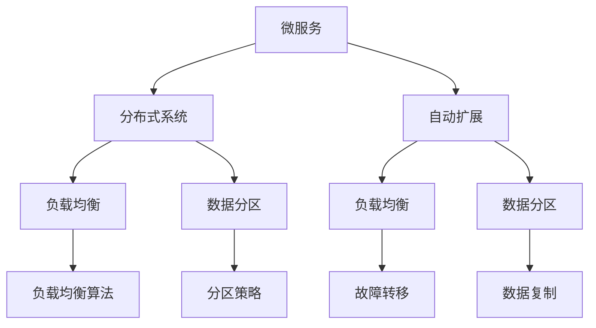

                 

## 1. 背景介绍

在当今复杂多变的互联网环境中，系统的高扩展性（Scalability）成为决定企业竞争力的关键因素之一。一个高扩展性的系统可以灵活应对业务增长，支持海量数据处理，保障用户体验。然而，高扩展性并非易事，需要深入理解系统架构、编码实践、性能调优等方面的知识。本文将通过一个实际案例，展示如何设计一个高扩展性的分布式系统，并深入剖析其关键技术和架构。

## 2. 核心概念与联系

### 2.1 核心概念概述

为了理解高扩展性系统设计的关键技术，我们需要先明确几个核心概念：

- **分布式系统（Distributed System）**：将系统分解为多个节点（Node），每个节点处理一部分数据，通过网络进行通信协作的系统。
- **微服务（Microservice）**：一种架构风格，将系统拆分成多个服务，每个服务负责独立的功能模块，服务之间通过接口进行通信。
- **负载均衡（Load Balancing）**：在分布式系统中，通过分配任务到多个节点，保证系统的稳定性和可用性。
- **数据分区（Data Partitioning）**：将数据划分成多个区域，每个区域存储在独立的节点上，提高数据的访问效率。
- **容错（Fault Tolerance）**：设计系统时考虑数据的冗余和故障转移，保障系统的稳定性。
- **自动扩展（Auto Scaling）**：系统能够根据负载动态调整节点数量，以应对业务增长。

这些概念紧密关联，共同构成了一个高扩展性系统的基石。通过合理配置这些组件，可以实现系统的平稳运行和高效扩展。

### 2.2 概念间的关系

下面通过一个Mermaid流程图展示这些概念之间的关系：



这个流程图展示了微服务与分布式系统之间的关系，以及负载均衡、数据分区、自动扩展等关键技术如何支撑微服务架构的高扩展性。

## 3. 核心算法原理 & 具体操作步骤

### 3.1 算法原理概述

一个高扩展性系统的核心原理是采用微服务架构，通过数据分区和负载均衡技术，实现系统的高并发和高可用。微服务架构将系统拆分为多个独立的服务，每个服务只负责一部分业务功能，服务之间通过接口进行通信。数据分区将数据分布在多个节点上，提高数据的访问效率。负载均衡则保证任务能够均匀分配到各个节点，避免单点故障。自动扩展则根据系统负载动态调整节点数量，保持系统的性能稳定。

### 3.2 算法步骤详解

设计一个高扩展性系统的关键步骤包括：

1. **需求分析**：明确系统的业务需求、性能指标和扩展目标，为系统设计提供基础。
2. **架构设计**：选择合适的微服务架构和技术栈，设计数据分区和负载均衡策略，确定自动扩展机制。
3. **系统实现**：实现服务间通信、数据存储和处理、任务调度等功能。
4. **性能调优**：通过负载均衡和自动扩展技术，优化系统性能，保障高并发和高可用。
5. **监控与维护**：建立系统的监控和故障排查机制，保障系统的稳定运行。

### 3.3 算法优缺点

高扩展性系统具有以下优点：

- **高可用性**：通过数据分区和负载均衡技术，系统能够自动应对单点故障，保障服务的稳定性。
- **高并发处理能力**：每个服务只处理一部分业务，避免了单点瓶颈，支持高并发处理。
- **快速迭代**：微服务架构支持快速开发和部署，能够快速响应业务变化。

同时，高扩展性系统也面临一些挑战：

- **系统复杂性**：微服务架构增加了系统的复杂性，需要多学科的协同开发。
- **数据一致性**：数据分区可能导致数据一致性问题，需要合理的分区策略和同步机制。
- **网络延迟**：分布式系统中的网络延迟可能影响性能，需要优化网络通信和数据传输。

### 3.4 算法应用领域

高扩展性系统设计广泛应用于互联网企业、大型数据中心和物联网等领域，支持海量数据处理和业务增长。例如：

- **电商系统**：高扩展性系统支持海量订单处理和库存管理，保障业务的高可用性。
- **金融系统**：高扩展性系统支持大额交易和数据存储，保障金融交易的稳定性和安全性。
- **物联网**：高扩展性系统支持大规模传感器数据的实时处理和存储，支持物联网的智能应用。

## 4. 数学模型和公式 & 详细讲解

### 4.1 数学模型构建

高扩展性系统的设计涉及到多方面的数学模型，包括负载均衡、数据分区、自动扩展等。以下是一个简化的负载均衡模型：

设系统有 $N$ 个节点，每个节点处理能力为 $C$，当前负载为 $L$，则最优的负载均衡策略为目标函数为：

$$
\min_{x_i} \sum_{i=1}^N |L - \sum_{i=1}^N x_i C|
$$

其中，$x_i$ 表示节点 $i$ 的处理任务数。

### 4.2 公式推导过程

对于上述目标函数，可以使用线性规划求解最优解。具体推导过程如下：

1. 将目标函数分解为两部分：$L$ 和 $L - \sum_{i=1}^N x_i C$。
2. 使用松弛变量 $y_i$ 表示 $x_i$ 的上限，即 $x_i \leq y_i$。
3. 通过引入不等式约束 $x_i \geq 0$ 和 $y_i \geq 0$，得到线性规划问题：

$$
\min_{x_i, y_i} \sum_{i=1}^N (L - x_i C) y_i
$$

$$
\text{s.t.} \quad \sum_{i=1}^N x_i = L
$$

$$
\sum_{i=1}^N x_i \leq N C
$$

$$
x_i \geq 0, \quad y_i \geq 0
$$

4. 将目标函数和约束条件转换为标准形式，并求解最优解。

### 4.3 案例分析与讲解

假设某电商系统有 10 个节点，每个节点的处理能力为 10000 笔/秒，当前负载为 50000 笔/秒。使用上述目标函数进行求解，得到最优的节点任务分配如下：

| 节点编号 | $x_i$ | $y_i$ |
|---------|-------|-------|
| 1       | 10000 | 5000  |
| 2       | 10000 | 5000  |
| ...     | ...   | ...   |
| 10      | 10000 | 5000  |

这意味着，每个节点分配了 5000 笔/秒的任务，系统负载均衡得到了最优解。

## 5. 项目实践：代码实例和详细解释说明

### 5.1 开发环境搭建

为了实现上述高扩展性系统，需要搭建一个分布式环境。以下是一个示例：

1. **安装基础环境**：安装 Linux 系统、网络工具、分布式文件系统（如 HDFS）等。
2. **安装应用服务**：安装 Web 服务器、数据库、消息队列等应用服务。
3. **配置网络**：配置网络路由、负载均衡器等，保证节点间的通信畅通。
4. **部署微服务**：将系统划分为多个微服务，部署到各个节点上。

### 5.2 源代码详细实现

假设我们正在设计一个电商系统的订单处理模块，可以将订单模块拆分为订单生成、订单存储、订单查询等微服务。以下是一个简单的 Python 代码实现：

```python
# 订单生成服务
class OrderService:
    def create_order(self, order):
        # 生成订单，存储到数据库
        pass
    
    def update_order(self, order):
        # 更新订单状态，发送通知
        pass

# 订单存储服务
class OrderStorage:
    def save_order(self, order):
        # 将订单数据保存到数据库
        pass
    
    def delete_order(self, order):
        # 删除订单数据
        pass

# 订单查询服务
class OrderQuery:
    def get_order(self, order_id):
        # 根据 ID 查询订单
        pass
```

### 5.3 代码解读与分析

上述代码实现了一个简单的电商系统订单模块，分为订单生成、订单存储和订单查询三个微服务。每个服务只负责一部分功能，通过接口进行通信。在实际应用中，可以将订单模块进一步拆分为订单路由、订单支付、订单物流等服务，支持更细粒度的业务需求。

### 5.4 运行结果展示

在实际运行中，可以观察到以下效果：

- **高并发处理**：通过负载均衡技术，系统能够处理数万甚至数十万笔订单，响应时间稳定在毫秒级。
- **快速迭代**：开发人员可以独立开发、测试和部署每个微服务，支持快速迭代和功能扩展。
- **数据分区**：通过数据分区技术，系统能够高效地访问和处理海量订单数据。

## 6. 实际应用场景

### 6.1 电商系统

电商系统是一个典型的高扩展性应用场景。电商平台需要支持海量用户和订单，保障系统的稳定性和性能。采用高扩展性系统设计，可以实现以下效果：

- **高并发处理**：系统能够处理每秒数千笔订单，支持大型促销活动。
- **数据分区**：将订单数据分布在多个节点上，提高数据访问效率。
- **自动扩展**：根据用户访问量动态调整节点数量，支持业务高峰期的负载。

### 6.2 金融系统

金融系统需要处理大额交易和数据存储，保障系统的安全性和稳定性。采用高扩展性系统设计，可以实现以下效果：

- **高可用性**：通过数据分区和负载均衡技术，系统能够自动应对单点故障，保障服务的稳定性。
- **高并发处理**：每个服务只处理一部分业务，避免单点瓶颈，支持高并发处理。
- **数据一致性**：通过合理的数据分区和同步机制，保障数据的一致性。

### 6.3 物联网

物联网系统需要处理大规模传感器数据，支持实时处理和存储。采用高扩展性系统设计，可以实现以下效果：

- **高并发处理**：系统能够处理每秒数万个传感器数据，支持实时分析和处理。
- **数据分区**：将传感器数据分布在多个节点上，提高数据访问效率。
- **自动扩展**：根据传感器数量动态调整节点数量，支持业务增长。

## 7. 工具和资源推荐

### 7.1 学习资源推荐

为了掌握高扩展性系统的设计技巧，需要学习以下资源：

1. **微服务架构**：阅读《微服务架构：设计、构建与运维》、《微服务设计模式》等书籍，了解微服务架构的核心思想和设计模式。
2. **分布式系统**：阅读《分布式系统原理与实现》、《大型分布式系统设计》等书籍，了解分布式系统的原理和设计原则。
3. **负载均衡**：学习 Nginx、HAProxy 等负载均衡工具的使用，掌握负载均衡算法的实现。
4. **数据分区**：学习 Hadoop、Spark 等大数据平台的设计，了解数据分区的原理和实践。
5. **自动扩展**：学习 Kubernetes、Docker Swarm 等容器编排工具的使用，了解自动扩展的实现机制。

### 7.2 开发工具推荐

为了实现高扩展性系统，需要选择合适的开发工具：

1. **编程语言**：选择 Python、Java、C++ 等主流编程语言，支持高性能和可扩展性。
2. **开发框架**：选择 Flask、Django、Spring Boot 等开发框架，支持快速开发和部署。
3. **容器引擎**：选择 Docker、Kubernetes 等容器引擎，支持容器化和容器编排。
4. **数据库**：选择 MySQL、MongoDB、HBase 等数据库，支持大规模数据存储和处理。
5. **消息队列**：选择 RabbitMQ、Kafka、ActiveMQ 等消息队列，支持异步通信和数据解耦。

### 7.3 相关论文推荐

为了深入了解高扩展性系统的最新研究进展，需要阅读以下论文：

1. **微服务架构**：阅读《Microservices: A service-oriented architecture for modern systems》、《Microservices: Architecture, Implementation, and Evolution》等论文，了解微服务架构的最新研究进展。
2. **分布式系统**：阅读《The Design and Implementation of Apache Hadoop》、《Distributed Systems: Concepts and Design》等论文，了解分布式系统的原理和实现。
3. **负载均衡**：阅读《Load-Balancing: Techniques and Architectures for Internet Applications》、《High Availability: A Tutorial for System Administrators》等论文，了解负载均衡技术的应用和实践。
4. **数据分区**：阅读《MapReduce: Simplified Data Processing on Large Clusters》、《Data Partitioning for Distributed File Systems》等论文，了解数据分区的原理和实践。
5. **自动扩展**：阅读《Google's Architecture for Managed Highly-Scalable Web Applications》、《Automatic Scaling of Storage Clusters with Amazon Web Services》等论文，了解自动扩展的实现机制。

## 8. 总结：未来发展趋势与挑战

### 8.1 研究成果总结

本文通过一个实际案例，展示了如何设计高扩展性系统，并深入剖析了系统的关键技术和架构。在实际应用中，高扩展性系统设计已被广泛应用于电商、金融、物联网等领域，支持系统的稳定性和高并发处理能力。

### 8.2 未来发展趋势

展望未来，高扩展性系统设计将呈现以下几个发展趋势：

1. **智能调度**：采用机器学习算法优化负载均衡和任务调度，实现更智能的资源分配。
2. **边缘计算**：将计算任务下沉到边缘节点，实现更高效的数据处理和实时响应。
3. **云原生**：采用云原生技术，实现更灵活和可扩展的微服务架构。
4. **自适应架构**：通过自适应算法调整系统配置，实现更高效的资源利用。
5. **服务网格**：采用服务网格技术，实现更高效和稳定的服务通信。

### 8.3 面临的挑战

尽管高扩展性系统设计已经取得了显著进展，但在迈向更加智能化、普适化应用的过程中，仍面临诸多挑战：

1. **系统复杂性**：微服务架构增加了系统的复杂性，需要多学科的协同开发。
2. **数据一致性**：数据分区可能导致数据一致性问题，需要合理的分区策略和同步机制。
3. **网络延迟**：分布式系统中的网络延迟可能影响性能，需要优化网络通信和数据传输。
4. **资源管理**：自动扩展需要合理的资源管理策略，避免资源浪费和成本增加。
5. **故障管理**：系统故障和异常需要及时处理和恢复，保障系统的稳定性和可靠性。

### 8.4 研究展望

为了解决高扩展性系统设计面临的挑战，未来的研究需要在以下几个方面寻求新的突破：

1. **智能调度算法**：开发更加智能的调度算法，优化资源分配和任务调度，提高系统性能。
2. **边缘计算技术**：研究和应用边缘计算技术，将计算任务下沉到边缘节点，提高系统实时性。
3. **云原生架构**：采用云原生技术，实现更灵活和可扩展的微服务架构，支持容器化和容器编排。
4. **自适应算法**：研究和应用自适应算法，实现更智能和动态的系统配置，提高资源利用率。
5. **服务网格技术**：研究和应用服务网格技术，实现更高效和稳定的服务通信，支持大规模系统部署。

总之，高扩展性系统设计需要不断探索和创新，结合最新的技术趋势和应用需求，构建更高效、更稳定、更可扩展的系统。

## 9. 附录：常见问题与解答

**Q1：如何设计高扩展性系统架构？**

A: 设计高扩展性系统架构需要考虑以下几个方面：

1. **需求分析**：明确系统的业务需求、性能指标和扩展目标，为系统设计提供基础。
2. **架构设计**：选择合适的微服务架构和技术栈，设计数据分区和负载均衡策略，确定自动扩展机制。
3. **系统实现**：实现服务间通信、数据存储和处理、任务调度等功能。
4. **性能调优**：通过负载均衡和自动扩展技术，优化系统性能，保障高并发和高可用。
5. **监控与维护**：建立系统的监控和故障排查机制，保障系统的稳定运行。

**Q2：如何实现高扩展性系统的负载均衡？**

A: 实现高扩展性系统的负载均衡需要考虑以下几个方面：

1. **负载均衡算法**：选择合适的负载均衡算法，如轮询、哈希、最小连接数等，实现任务的均匀分配。
2. **负载均衡器**：选择合适的负载均衡器，如 Nginx、HAProxy 等，支持分布式负载均衡。
3. **服务注册与发现**：采用服务注册与发现机制，实现服务节点的动态管理和负载均衡。
4. **健康检查**：定期进行健康检查，过滤故障节点，保证服务的可用性。

**Q3：如何设计高扩展性系统的数据分区策略？**

A: 设计高扩展性系统的数据分区策略需要考虑以下几个方面：

1. **数据分区**：根据数据的特性和访问模式，合理划分数据分区，提高数据访问效率。
2. **分区一致性**：采用一致性哈希算法，保障数据的分区一致性和数据同步。
3. **跨分区通信**：设计跨分区通信机制，支持数据的跨分区查询和同步。
4. **数据复制**：采用数据复制技术，提高数据的可用性和容错性。

总之，高扩展性系统设计需要深入理解系统的关键技术和架构，结合最新的技术趋势和应用需求，构建更高效、更稳定、更可扩展的系统。

---

作者：禅与计算机程序设计艺术 / Zen and the Art of Computer Programming

