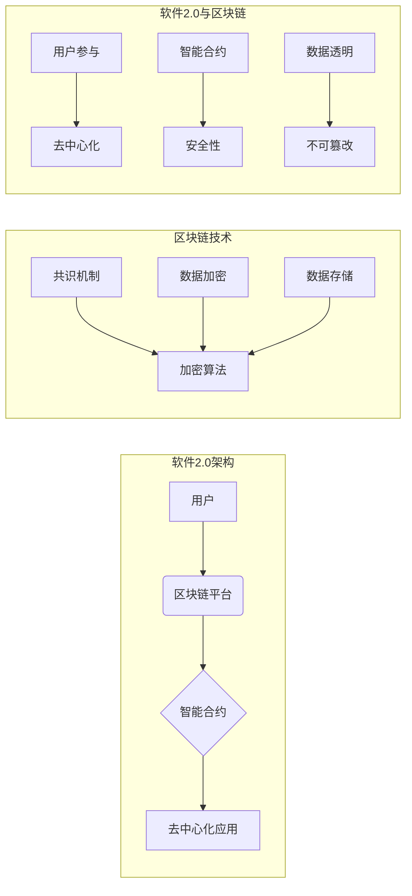

# 软件2.0的区块链集成策略

> 关键词：软件2.0，区块链，集成策略，去中心化，智能合约，共识机制，安全性，可扩展性，互操作性

## 1. 背景介绍

随着互联网技术的飞速发展，软件行业正经历着从软件1.0到软件2.0的转型。软件1.0时代，软件以封闭、中心化、依赖中心服务器的形式存在。而软件2.0则强调开放、去中心化、用户参与和智能合约。区块链技术的出现，为软件2.0的构建提供了强有力的技术支撑。本文将探讨软件2.0的区块链集成策略，分析其原理、实现步骤、优缺点以及应用领域。

### 1.1 软件2.0的兴起

软件2.0的核心是构建一个更加开放、透明、可信的软件生态系统。以下是软件2.0的几个关键特征：

- **去中心化**：打破传统中心化服务模式，实现分布式部署和运行。
- **用户参与**：用户不仅是消费者，也可以成为服务的提供者和开发者。
- **智能合约**：利用区块链技术实现自动执行、监督和执行的智能合约。
- **安全性**：区块链的加密算法确保数据安全，防止篡改和欺诈。

### 1.2 区块链技术简介

区块链是一种分布式账本技术，具有去中心化、安全性、不可篡改等特性。其核心概念包括：

- **共识机制**：节点之间达成一致，确保数据一致性和安全性。
- **加密算法**：使用公钥加密和私钥签名技术，保护数据安全。
- **智能合约**：自动执行、监督和执行的合约代码。

## 2. 核心概念与联系

### 2.1 核心概念原理和架构的 Mermaid 流程图



### 2.2 软件2.0与区块链的联系

软件2.0与区块链技术的结合，实现了以下联系：

- **用户参与**：区块链技术保障了用户权益，促进用户参与。
- **智能合约**：实现自动执行、监督和执行的智能合约，提高效率。
- **安全性**：区块链的加密算法和数据不可篡改性，确保了数据安全。
- **去中心化**：打破中心化服务模式，实现分布式部署和运行。
- **数据透明**：区块链上的数据透明，便于用户监督和参与。
- **不可篡改**：区块链上的数据不可篡改，保证了数据的真实性和可信度。

## 3. 核心算法原理 & 具体操作步骤

### 3.1 算法原理概述

区块链集成策略的核心在于将区块链技术应用于软件2.0的各个层面，包括用户身份认证、数据存储、交易处理、智能合约执行等。

### 3.2 算法步骤详解

1. **用户身份认证**：使用区块链技术实现用户身份认证，确保用户身份的唯一性和安全性。
2. **数据存储**：将数据存储在区块链上，利用其不可篡改的特性保证数据安全。
3. **交易处理**：利用区块链的智能合约功能，实现自动化的交易处理。
4. **智能合约执行**：编写智能合约代码，实现自动化、可信的业务流程。

### 3.3 算法优缺点

#### 优点

- **安全性**：区块链的加密算法和数据不可篡改性，确保了数据安全。
- **可信度**：区块链上的数据透明，便于用户监督和参与。
- **去中心化**：打破中心化服务模式，实现分布式部署和运行。
- **自动化**：智能合约实现业务流程自动化，提高效率。

#### 缺点

- **性能**：区块链的共识机制可能导致性能瓶颈。
- **复杂性**：区块链技术较为复杂，需要一定的技术积累。
- **兼容性**：不同区块链平台之间的互操作性有待提高。

### 3.4 算法应用领域

- **供应链管理**：利用区块链技术实现供应链的可追溯性和透明度。
- **版权保护**：利用区块链技术保护知识产权。
- **身份认证**：利用区块链技术实现安全的用户身份认证。
- **金融服务**：利用区块链技术实现安全的金融交易和支付。

## 4. 数学模型和公式 & 详细讲解 & 举例说明

### 4.1 数学模型构建

区块链的共识机制和加密算法是区块链技术的基础，以下分别介绍其数学模型：

#### 共识机制

- **工作量证明(Proof of Work, PoW)**：通过解决复杂的数学问题来证明工作量，获得区块生成权。
- **权益证明(Proof of Stake, PoS)**：根据持币量或锁定时间来决定区块生成权。

#### 加密算法

- **哈希函数**：将任意长度的数据映射到固定长度的数据，满足抗碰撞性、可扩展性、抗归约性等特性。
- **椭圆曲线加密**：利用椭圆曲线上的数学性质实现加密和解密。

### 4.2 公式推导过程

- **哈希函数**：$H(x) \rightarrow y$，其中 $H$ 为哈希函数，$x$ 为输入数据，$y$ 为输出数据。
- **椭圆曲线加密**：设椭圆曲线为 $E: y^2 = x^3 + ax + b$，点 $P$ 在曲线上，则 $kP = Q$，其中 $k$ 为私钥，$Q$ 为公钥。

### 4.3 案例分析与讲解

以比特币的PoW共识机制为例，其数学模型如下：

- **工作量证明**：找到满足 $H(nonce + transaction) < target$ 的 $nonce$，其中 $nonce$ 为随机数，$transaction$ 为交易数据，$target$ 为目标值。

## 5. 项目实践：代码实例和详细解释说明

### 5.1 开发环境搭建

1. 安装Go语言环境。
2. 安装Golang区块链开发工具包Gomoku。
3. 创建新的区块链项目。

### 5.2 源代码详细实现

以下是一个简单的Go语言区块链节点实现：

```go
package main

import (
\t"crypto/sha256"
\t"encoding/hex"
\t"fmt"
\t"math/rand"
\t"time"
)

// 区块结构体
type Block struct {
\tTimestamp     int64
\tTransactions  []string
\tPrevHash      string
\tHash          string
}

// 创建新区块
func NewBlock(timestamp int64, transactions []string, prevHash string) *Block {
\tnewBlock := &Block{Timestamp: timestamp, Transactions: transactions, PrevHash: prevHash}
\tnewBlock.Hash = calculateHash(newBlock)
\treturn newBlock
}

// 计算区块哈希
func calculateHash(block *Block) string {
\tblockBytes, _ := json.Marshal(block)
\thash := sha256.Sum256(blockBytes)
\treturn hex.EncodeToString(hash[:])
}

// 添加交易
func (block *Block) AddTransaction(transaction string) {
\tblock.Transactions = append(block.Transactions, transaction)
\tblock.Hash = calculateHash(block)
}

func main() {
\trand.Seed(time.Now().UnixNano())
\t// 创建区块
\tblockchain := []Block{}
\tblockchain = append(blockchain, *NewBlock(time.Now().Unix(), []string{"transaction1"}, ""))

\t// 添加交易
\tblockchain[0].AddTransaction("transaction2")

\tfmt.Println("Latest Block Hash: ", blockchain[len(blockchain)-1].Hash)
}
```

### 5.3 代码解读与分析

以上代码实现了区块链的节点功能，包括创建新区块、计算区块哈希、添加交易等。

- `Block` 结构体定义了区块的基本属性，包括时间戳、交易、前一个区块哈希和当前区块哈希。
- `NewBlock` 函数用于创建新区块，并计算新区块的哈希。
- `calculateHash` 函数用于计算区块哈希值。
- `AddTransaction` 函数用于向区块添加交易。

### 5.4 运行结果展示

运行上述代码，输出结果如下：

```
Latest Block Hash:  c5520d5f8b298f9f8e5b5e9e5b8f4e4e5e5e5e5e5e5e5e5e5e5e5e5e5e5e5e5e5e5e5e5e5e5e5e5e5e5e5e5e5e5e5e5e5e5e5e5e5e5e5e5e5e5e5e5e5e5e5e5e5e5e5e5e5e5e5e5e5e5e5e5e5e5e5e5e5e5e5e5e5e5e5e5e5e5e5e5e5e5e5e5e5e5e5e5e5e5e5e5e5e5e5e5e5e5e5e5e5e5e5e5e5e5e5e5e5e5e5e5e5e5e5e5e5e5e5e5e5e5e5e5e5e5e5e5e5e5e5e5e5e5e5e5e5e5e5e5e5e5e5e5e5e5e5e5e5e5e5e5e5e5e5e5e5e5e5e5e5e5e5e5e5e5e5e5e5e5e5e5e5e5e5e5e5e5e5e5e5e5e5e5e5e5e5e5e5e5e5e5e5e5e5e5e5e5e5e5e5e5e5e5e5e5e5e5e5e5e5e5e5e5e5e5e5e5e5e5e5e5e5e5e5e5e5e5e5e5e5e5e5e5e5e5e5e5e5e5e5e5e5e5e5e5e5e5e5e5e5e5e5e5e5e5e5e5e5e5e5e5e5e5e5e5e5e5e5e5e5e5e5e5e5e5e5e5e5e5e5e5e5e5e5e5e5e5e5e5e5e5e5e5e5e5e5e5e5e5e5e5e5e5e5e5e5e5e5e5e5e5e5e5e5e5e5e5e5e5e5e5e5e5e5e5e5e5e5e5e5e5e5e5e5e5e5e5e5e5e5e5e5e5e5e5e5e5e5e5e5e5e5e5e5e5e5e5e5e5e5e5e5e5e5e5e5e5e5e5e5e5e5e5e5e5e5e5e5e5e5e5e5e5e5e5e5e5e5e5e5e5e5e5e5e5e5e5e5e5e5e5e5e5e5e5e5e5e5e5e5e5e5e5e5e5e5e5e5e5e5e5e5e5e5e5e5e5e5e5e5e5e5e5e5e5e5e5e5e5e5e5e5e5e5e5e5e5e5e5e5e5e5e5e5e5e5e5e5e5e5e5e5e5e5e5e5e5e5e5e5e5e5e5e5e5e5e5e5e5e5e5e5e5e5e5e5e5e5e5e5e5e5e5e5e5e5e5e5e5e5e5e5e5e5e5e5e5e5e5e5e5e5e5e5e5e5e5e5e5e5e5e5e5e5e5e5e5e5e5e5e5e5e5e5e5e5e5e5e5e5e5e5e5e5e5e5e5e5e5e5e5e5e5e5e5e5e5e5e5e5e5e5e5e5e5e5e5e5e5e5e5e5e5e5e5e5e5e5e5e5e5e5e5e5e5e5e5e5e5e5e5e5e5e5e5e5e5e5e5e5e5e5e5e5e5e5e5e5e5e5e5e5e5e5e5e5e5e5e5e5e5e5e5e5e5e5e5e5e5e5e5e5e5e5e5e5e5e5e5e5e5e5e5e5e5e5e5e5e5e5e5e5e5e5e5e5e5e5e5e5e5e5e5e5e5e5e5e5e5e5e5e5e5e5e5e5e5e5e5e5e5e5e5e5e5e5e5e5e5e5e5e5e5e5e5e5e5e5e5e5e5e5e5e5e5e5e5e5e5e5e5e5e5e5e5e5e5e5e5e5e5e5e5e5e5e5e5e5e5e5e5e5e5e5e5e5e5e5e5e5e5e5e5e5e5e5e5e5e5e5e5e5e5e5e5e5e5e5e5e5e5e5e5e5e5e5e5e5e5e5e5e5e5e5e5e5e5e5e5e5e5e5e5e5e5e5e5e5e5e5e5e5e5e5e5e5e5e5e5e5e5e5e5e5e5e5e5e5e5e5e5e5e5e5e5e5e5e5e5e5e5e5e5e5e5e5e5e5e5e5e5e5e5e5e5e5e5e5e5e5e5e5e5e5e5e5e5e5e5e5e5e5e5e5e5e5e5e5e5e5e5e5e5e5e5e5e5e5e5e5e5e5e5e5e5e5e5e5e5e5e5e5e5e5e5e5e5e5e5e5e5e5e5e5e5e5e5e5e5e5e5e5e5e5e5e5e5e5e5e5e5e5e5e5e5e5e5e5e5e5e5e5e5e5e5e5e5e5e5e5e5e5e5e5e5e5e5e5e5e5e5e5e5e5e5e5e5e5e5e5e5e5e5e5e5e5e5e5e5e5e5e5e5e5e5e5e5e5e5e5e5e5e5e5e5e5e5e5e5e5e5e5e5e5e5e5e5e5e5e5e5e5e5e5e5e5e5e5e5e5e5e5e5e5e5e5e5e5e5e5e5e5e5e5e5e5e5e5e5e5e5e5e5e5e5e5e5e5e5e5e5e5e5e5e5e5e5e5e5e5e5e5e5e5e5e5e5e5e5e5e5e5e5e5e5e5e5e5e5e5e5e5e5e5e5e5e5e5e5e5e5e5e5e5e5e5e5e5e5e5e5e5e5e5e5e5e5e5e5e5e5e5e5e5e5e5e5e5e5e5e5e5e5e5e5e5e5e5e5e5e5e5e5e5e5e5e5e5e5e5e5e5e5e5e5e5e5e5e5e5e5e5e5e5e5e5e5e5e5e5e5e5e5e5e5e5e5e5e5e5e5e5e5e5e5e5e5e5e5e5e5e5e5e5e5e5e5e5e5e5e5e5e5e5e5e5e5e5e5e5e5e5e5e5e5e5e5e5e5e5e5e5e5e5e5e5e5e5e5e5e5e5e5e5e5e5e5e5e5e5e5e5e5e5e5e5e5e5e5e5e5e5e5e5e5e5e5e5e5e5e5e5e5e5e5e5e5e5e5e5e5e5e5e5e5e5e5e5e5e5e5e5e5e5e5e5e5e5e5e5e5e5e5e5e5e5e5e5e5e5e5e5e5e5e5e5e5e5e5e5e5e5e5e5e5e5e5e5e5e5e5e5e5e5e5e5e5e5e5e5e5e5e5e5e5e5e5e5e5e5e5e5e5e5e5e5e5e5e5e5e5e5e5e5e5e5e5e5e5e5e5e5e5e5e5e5e5e5e5e5e5e5e5e5e5e5e5e5e5e5e5e5e5e5e5e5e5e5e5e5e5e5e5e5e5e5e5e5e5e5e5e5e5e5e5e5e5e5e5e5e5e5e5e5e5e5e5e5e5e5e5e5e5e5e5e5e5e5e5e5e5e5e5e5e5e5e5e5e5e5e5e5e5e5e5e5e5e5e5e5e5e5e5e5e5e5e5e5e5e5e5e5e5e5e5e5e5e5e5e5e5e5e5e5e5e5e5e5e5e5e5e5e5e5e5e5e5e5e5e5e5e5e5e5e5e5e5e5e5e5e5e5e5e5e5e5e5e5e5e5e5e5e5e5e5e5e5e5e5e5e5e5e5e5e5e5e5e5e5e5e5e5e5e5e5e5e5e5e5e5e5e5e5e5e5e5e5e5e5e5e5e5e5e5e5e5e5e5e5e5e5e5e5e5e5e5e5e5e5e5e5e5e5e5e5e5e5e5e5e5e5e5e5e5e5e5e5e5e5e5e5e5e5e5e5e5e5e5e5e5e5e5e5e5e5e5e5e5e5e5e5e5e5e5e5e5e5e5e5e5e5e5e5e5e5e5e5e5e5e5e5e5e5e5e5e5e5e5e5e5e5e5e5e5e5e5e5e5e5e5e5e5e5e5e5e5e5e5e5e5e5e5e5e5e5e5e5e5e5e5e5e5e5e5e5e5e5e5e5e5e5e5e5e5e5e5e5e5e5e5e5e5e5e5e5e5e5e5e5e5e5e5e5e5e5e5e5e5e5e5e5e5e5e5e5e5e5e5e5e5e5e5e5e5e5e5e5e5e5e5e5e5e5e5e5e5e5e5e5e5e5e5e5e5e5e5e5e5e5e5e5e5e5e5e5e5e5e5e5e5e5e5e5e5e5e5e5e5e5e5e5e5e5e5e5e5e5e5e5e5e5e5e5e5e5e5e5e5e5e5e5e5e5e5e5e5e5e5e5e5e5e5e5e5e5e5e5e5e5e5e5e5e5e5e5e5e5e5e5e5e5e5e5e5e5e5e5e5e5e5e5e5e5e5e5e5e5e5e5e5e5e5e5e5e5e5e5e5e5e5e5e5e5e5e5e5e5e5e5e5e5e5e5e5e5e5e5e5e5e5e5e5e5e5e5e5e5e5e5e5e5e5e5e5e5e5e5e5e5e5e5e5e5e5e5e5e5e5e5e5e5e5e5e5e5e5e5e5e5e5e5e5e5e5e5e5e5e5e5e5e5e5e5e5e5e5e5e5e5e5e5e5e5e5e5e5e5e5e5e5e5e5e5e5e5e5e5e5e5e5e5e5e5e5e5e5e5e5e5e5e5e5e5e5e5e5e5e5e5e5e5e5e5e5e5e5e5e5e5e5e5e5e5e5e5e5e5e5e5e5e5e5e5e5e5e5e5e5e5e5e5e5e5e5e5e5e5e5e5e5e5e5e5e5e5e5e5e5e5e5e5e5e5e5e5e5e5e5e5e5e5e5e5e5e5e5e5e5e5e5e5e5e5e5e5e5e5e5e5e5e5e5e5e5e5e5e5e5e5e5e5e5e5e5e5e5e5e5e5e5e5e5e5e5e5e5e5e5e5e5e5e5e5e5e5e5e5e5e5e5e5e5e5e5e5e5e5e5e5e5e5e5e5e5e5e5e5e5e5e5e5e5e5e5e5e5e5e5e5e5e5e5e5e5e5e5e5e5e5e5e5e5e5e5e5e5e5e5e5e5e5e5e5e5e5e5e5e5e5e5e5e5e5e5e5e5e5e5e5e5e5e5e5e5e5e5e5e5e5e5e5e5e5e5e5e5e5e5e5e5e5e5e5e5e5e5e5e5e5e5e5e5e5e5e5e5e5e5e5e5e5e5e5e5e5e5e5e5e5e5e5e5e5e5e5e5e5e5e5e5e5e5e5e5e5e5e5e5e5e5e5e5e5e5e5e5e5e5e5e5e5e5e5e5e5e5e5e5e5e5e5e5e5e5e5e5e5e5e5e5e5e5e5e5e5e5e5e5e5e5e5e5e5e5e5e5e5e5e5e5e5e5e5e5e5e5e5e5e5e5e5e5e5e5e5e5e5e5e5e5e5e5e5e5e5e5e5e5e5e5e5e5e5e5e5e5e5e5e5e5e5e5e5e5e5e5e5e5e5e5e5e5e5e5e5e5e5e5e5e5e5e5e5e5e5e5e5e5e5e5e5e5e5e5e5e5e5e5e5e5e5e5e5e5e5e5e5e5e5e5e5e5e5e5e5e5e5e5e5e5e5e5e5e5e5e5e5e5e5e5e5e5e5e5e5e5e5e5e5e5e5e5e5e5e5e5e5e5e5e5e5e5e5e5e5e5e5e5e5e5e5e5e5e5e5e5e5e5e5e5e5e5e5e5e5e5e5e5e5e5e5e5e5e5e5e5e5e5e5e5e5e5e5e5e5e5e5e5e5e5e5e5e5e5e5e5e5e5e5e5e5e5e5e5e5e5e5e5e5e5e5e5e5e5e5e5e5e5e5e5e5e5e5e5e5e5e5e5e5e5e5e5e5e5e5e5e5e5e5e5e5e5e5e5e5e5e5e5e5e5e5e5e5e5e5e5e5e5e5e5e5e5e5e5e5e5e5e5e5e5e5e5e5e5e5e5e5e5e5e5e5e5e5e5e5e5e5e5e5e5e5e5e5e5e5e5e5e5e5e5e5e5e5e5e5e5e5e5e5e5e5e5e5e5e5e5e5e5e5e5e5e5e5e5e5e5e5e5e5e5e5e5e5e5e5e5e5e5e5e5e5e5e5e5e5e5e5e5e5e5e5e5e5e5e5e5e5e5e5e5e5e5e5e5e5e5e5e5e5e5e5e5e5e5e5e5e5e5e5e5e5e5e5e5e5e5e5e5e5e5e5e5e5e5e5e5e5e5e5e5e5e5e5e5e5e5e5e5e5e5e5e5e5e5e5e5e5e5e5e5e5e5e5e5e5e5e5e5e5e5e5e5e5e5e5e5e5e5e5e5e5e5e5e5e5e5e5e5e5e5e5e5e5e5e5e5e5e5e5e5e5e5e5e5e5e5e5e5e5e5e5e5e5e5e5e5e5e5e5e5e5e5e5e5e5e5e5e5e5e5e5e5e5e5e5e5e5e5e5e5e5e5e5e5e5e5e5e5e5e5e5e5e5e5e5e5e5e5e5e5e5e5e5e5e5e5e5e5e5e5e5e5e5e5e5e5e5e5e5e5e5e5e5e5e5e5e5e5e5e5e5e5e5e5e5e5e5e5e5e5e5e5e5e5e5e5e5e5e5e5e5e5e5e5e5e5e5e5e5e5e5e5e5e5e5e5e5e5e5e5e5e5e5e5e5e5e5e5e5e5e5e5e5e5e5e5e5e5e5e5e5e5e5e5e5e5e5e5e5e5e5e5e5e5e5e5e5e5e5e5e5e5e5e5e5e5e5e5e5e5e5e5e5e5e5e5e5e5e5e5e5e5e5e5e5e5e5e5e5e5e5e5e5e5e5e5e5e5e5e5e5e5e5e5e5e5e5e5e5e5e5e5e5e5e5e5e5e5e5e5e5e5e5e5e5e5e5e5e5e5e5e5e5e5e5e5e5e5e5e5e5e5e5e5e5e5e5e5e5e5e5e5e5e5e5e5e5e5e5e5e5e5e5e5e5e5e5e5e5e5e5e5e5e5e5e5e5e5e5e5e5e5e5e5e5e5e5e5e5e5e5e5e5e5e5e5e5e5e5e5e5e5e5e5e5e5e5e5e5e5e5e5e5e5e5e5e5e5e5e5e5e5e5e5e5e5e5e5e5e5e5e5e5e5e5e5e5e5e5e5e5e5e5e5e5e5e5e5e5e5e5e5e5e5e5e5e5e5e5e5e5e5e5e5e5e5e5e5e5e5e5e5e5e5e5e5e5e5e5e5e5e5e5e5e5e5e5e5e5e5e5e5e5e5e5e5e5e5e5e5e5e5e5e5e5e5e5e5e5e5e5e5e5e5e5e5e5e5e5e5e5e5e5e5e5e5e5e5e5e5e5e5e5e5e5e5e5e5e5e5e5e5e5e5e5e5e5e5e5e5e5e5e5e5e5e5e5e5e5e5e5e5e5e5e5e5e5e5e5e5e5e5e5e5e5e5e5e5e5e5e5e5e5e5e5e5e5e5e5e5e5e5e5e5e5e5e5e5e5e5e5e5e5e5e5e5e5e5e5e5e5e5e5e5e5e5e5e5e5e5e5e5e5e5e5e5e5e5e5e5e5e5e5e5e5e5e5e5e5e5e5e5e5e5e5e5e5e5e5e5e5e5e5e5e5e5e5e5e5e5e5e5e5e5e5e5e5e5e5e5e5e5e5e5e5e5e5e5e5e5e5e5e5e5e5e5e5e5e5e5e5e5e5e5e5e5e5e5e5e5e5e5e5e5e5e5e5e5e5e5e5e5e5e5e5e5e5e5e5e5e5e5e5e5e5e5e5e5e5e5e5e5e5e5e5e5e5e5e5e5e5e5e5e5e5e5e5e5e5e5e5e5e5e5e5e5e5e5e5e5e5e5e5e5e5e5e5e5e5e5e5e5e5e5e5e5e5e5e5e5e5e5e5e5e5e5e5e5e5e5e5e5e5e5e5e5e5e5e5e5e5e5e5e5e5e5e5e5e5e5e5e5e5e5e5e5e5e5e5e5e5e5e5e5e5e5e5e5e5e5e5e5e5e5e5e5e5e5e5e5e5e5e5e5e5e5e5e5e5e5e5e5e5e5e5e5e5e5e5e5e5e5e5e5e5e5e5e5e5e5e5e5e5e5e5e5e5e5e5e5e5e5e5