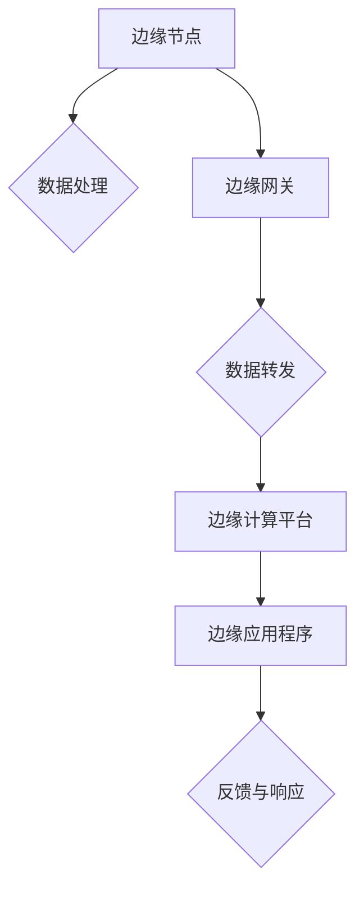

# 边缘计算 (Edge Computing)

> 关键词：边缘计算，云计算，物联网，数据隐私，实时处理，网络延迟，资源优化

## 1. 背景介绍

### 1.1 问题的由来

随着物联网（IoT）设备的激增，数据生成和传输速度呈指数级增长。传统的云计算模式虽然能够处理海量数据，但因其中心化的架构，导致数据传输延迟高、带宽压力大、隐私安全问题突出。为了解决这些问题，边缘计算（Edge Computing）应运而生。

### 1.2 研究现状

边缘计算通过将数据处理和存储能力下沉到网络边缘，即靠近数据源头的位置，从而实现数据的实时处理和快速响应。近年来，随着5G、物联网和人工智能技术的发展，边缘计算逐渐成为学术界和工业界的研究热点。

### 1.3 研究意义

边缘计算的意义在于：

- **降低网络延迟**：将数据处理近源化，减少数据传输时间，提升用户体验。
- **减轻中心化压力**：缓解数据中心的高带宽需求和计算压力。
- **保障数据隐私**：在本地处理数据，降低数据泄露风险。
- **实时决策支持**：支持实时决策和自动化控制。

### 1.4 本文结构

本文将围绕边缘计算的核心概念、算法原理、应用场景和未来发展趋势展开讨论。具体内容安排如下：

- 第2部分：介绍边缘计算的核心概念与联系，并给出Mermaid流程图。
- 第3部分：阐述边缘计算的核心算法原理和具体操作步骤。
- 第4部分：讲解边缘计算中的数学模型和公式，并结合案例进行分析。
- 第5部分：通过实际项目实践，展示边缘计算的代码实例和详细解释。
- 第6部分：探讨边缘计算的实际应用场景和未来发展趋势。
- 第7部分：推荐相关学习资源、开发工具和参考文献。
- 第8部分：总结研究成果，展望未来发展趋势与挑战。
- 第9部分：提供常见问题与解答。

## 2. 核心概念与联系

### 2.1 核心概念

- **边缘节点**：边缘计算中的计算和存储资源，可以是路由器、交换机、智能设备等。
- **边缘网关**：负责收集、处理和转发边缘节点数据，并将其发送到云中心或本地应用。
- **边缘计算平台**：提供边缘计算服务的基础设施，包括资源管理、调度、安全等功能。
- **边缘应用程序**：在边缘节点上运行的应用程序，负责数据处理、分析和响应。

### 2.2 Mermaid流程图



### 2.3 联系

边缘计算涉及多个技术领域，包括：

- **计算机网络**：边缘节点、边缘网关和边缘计算平台的网络架构设计。
- **分布式系统**：边缘计算平台的资源管理和调度机制。
- **数据存储**：边缘节点的数据存储和管理。
- **人工智能**：边缘应用程序的智能决策和实时分析。

## 3. 核心算法原理 & 具体操作步骤

### 3.1 算法原理概述

边缘计算的核心是数据在边缘节点的实时处理和分析。以下是几种常见的边缘计算算法：

- **数据过滤**：根据预设规则过滤无关数据，减少传输量。
- **数据压缩**：对数据进行压缩，降低传输带宽需求。
- **数据加密**：对数据进行加密，保障数据安全。
- **本地决策**：在边缘节点进行初步决策，减少中心化控制。

### 3.2 算法步骤详解

边缘计算的算法步骤如下：

1. **数据收集**：边缘节点收集来自物联网设备的数据。
2. **数据预处理**：对数据进行过滤、压缩和加密等操作。
3. **数据传输**：将预处理后的数据发送到边缘网关或边缘计算平台。
4. **数据处理**：在边缘网关或边缘计算平台上进行数据处理和分析。
5. **决策与反馈**：根据分析结果进行决策，并将反馈发送回物联网设备或边缘节点。

### 3.3 算法优缺点

边缘计算算法的优点：

- **实时性强**：数据处理和分析在边缘节点完成，减少网络延迟。
- **安全性高**：数据在本地处理，降低数据泄露风险。
- **资源利用率高**：利用边缘节点的计算资源，降低数据中心压力。

边缘计算算法的缺点：

- **资源限制**：边缘节点的计算和存储资源有限。
- **异构性强**：不同边缘节点的硬件和软件环境差异较大。
- **安全性挑战**：边缘节点容易受到攻击。

### 3.4 算法应用领域

边缘计算算法适用于以下领域：

- **智能交通**：实时交通流量监控、智能信号控制。
- **智能制造**：设备故障预测、生产过程优化。
- **智慧医疗**：远程医疗、医疗设备监测。
- **智慧能源**：电网监控、能源消耗管理。

## 4. 数学模型和公式 & 详细讲解 & 举例说明

### 4.1 数学模型构建

边缘计算中的数学模型通常涉及以下几个方面：

- **数据传输模型**：描述数据在边缘节点和边缘网关之间的传输过程。
- **数据处理模型**：描述边缘节点上的数据处理和分析过程。
- **资源调度模型**：描述边缘计算平台上的资源分配和调度过程。

### 4.2 公式推导过程

以下以数据传输模型为例，介绍公式推导过程：

假设数据传输速率为 $r$，数据包大小为 $s$，则数据传输时间 $t$ 可表示为：

$$
t = \frac{s}{r}
$$

### 4.3 案例分析与讲解

假设边缘节点收集到的数据速率为 1MB/s，每个数据包大小为 1KB，则传输一个数据包需要 1ms。如果边缘节点需要传输 1000 个数据包，则总传输时间为 1s。

## 5. 项目实践：代码实例和详细解释说明

### 5.1 开发环境搭建

由于篇幅限制，本文不提供详细的开发环境搭建步骤。通常，边缘计算项目需要以下开发环境：

- 操作系统：Linux
- 编程语言：C/C++、Java、Python等
- 开发框架：OpenWrt、Arduino、TensorFlow Lite等

### 5.2 源代码详细实现

以下是一个简单的边缘计算项目示例，使用Python编写，使用TensorFlow Lite进行模型部署：

```python
import tensorflow as tf

# 加载预训练模型
model = tf.keras.models.load_model('model.h5')

# 边缘节点收集数据
data = ...

# 数据预处理
data = preprocess_data(data)

# 使用模型进行推理
prediction = model.predict(data)

# 边缘节点进行决策
action = ...

# 将决策结果发送回物联网设备
send_action_to_iot_device(action)
```

### 5.3 代码解读与分析

上述代码展示了边缘计算项目的基本流程：

- 加载预训练模型
- 边缘节点收集数据
- 数据预处理
- 使用模型进行推理
- 边缘节点进行决策
- 将决策结果发送回物联网设备

### 5.4 运行结果展示

由于缺乏具体数据和模型，无法展示实际的运行结果。

## 6. 实际应用场景

### 6.1 智能交通

边缘计算在智能交通领域的应用包括：

- 实时交通流量监控
- 智能信号控制
- 车辆故障检测
- 道路交通事故预警

### 6.2 智能制造

边缘计算在智能制造领域的应用包括：

- 设备故障预测
- 生产过程优化
- 质量检测
- 能源消耗管理

### 6.3 智慧医疗

边缘计算在智慧医疗领域的应用包括：

- 远程医疗
- 医疗设备监测
- 患者数据管理
- 疾病诊断

### 6.4 未来应用展望

随着技术的不断发展，边缘计算将在更多领域得到应用，例如：

- 智慧城市
- 智能农业
- 智能家居
- 智能教育

## 7. 工具和资源推荐

### 7.1 学习资源推荐

- 《边缘计算：下一代计算范式》
- 《边缘计算：原理、架构与应用》
- 《边缘计算：技术与实践》

### 7.2 开发工具推荐

- OpenWrt
- Arduino
- TensorFlow Lite
- edgeX Foundry

### 7.3 相关论文推荐

- "Edge Computing: A Comprehensive Survey" by Chai, K. C., et al.
- "Edge Computing: A New Paradigm for Distributed Computing in IoT" by Li, Z., et al.
- "The Edge Computing Revolution: How to Build a Distributed IoT Architecture" by Riedi, R.

## 8. 总结：未来发展趋势与挑战

### 8.1 研究成果总结

边缘计算作为新一代计算范式，在降低网络延迟、减轻中心化压力、保障数据隐私等方面具有显著优势。近年来，边缘计算技术取得了显著进展，并在多个领域得到应用。

### 8.2 未来发展趋势

- **多技术融合**：边缘计算将与人工智能、物联网、5G等技术深度融合，形成更加智能、高效的边缘计算生态。
- **标准化发展**：边缘计算标准和规范将逐步完善，推动边缘计算技术的普及和应用。
- **安全可控**：边缘计算的安全性和可靠性将得到重视，相关技术和产品将更加注重安全性设计。

### 8.3 面临的挑战

- **异构性**：不同边缘节点的硬件和软件环境差异较大，需要开发更加通用的边缘计算平台和应用程序。
- **安全性**：边缘计算的安全性和可靠性需要得到保障，防止数据泄露和恶意攻击。
- **标准化**：边缘计算标准和规范尚不完善，需要进一步研究和制定。

### 8.4 研究展望

未来，边缘计算技术将在以下方面取得突破：

- **跨域协同**：实现不同边缘域之间的协同计算和资源共享。
- **智能决策**：利用人工智能技术，实现边缘节点的智能决策和自适应调节。
- **安全可靠**：保障边缘计算系统的安全性和可靠性，防止数据泄露和恶意攻击。

## 9. 附录：常见问题与解答

**Q1：边缘计算与云计算有何区别？**

A：云计算将计算能力集中在数据中心，而边缘计算将计算能力下沉到网络边缘，即靠近数据源头的位置。云计算适用于大规模数据处理和分析，而边缘计算适用于实时数据处理和响应。

**Q2：边缘计算有哪些优势？**

A：边缘计算的优势包括降低网络延迟、减轻中心化压力、保障数据隐私等。

**Q3：边缘计算有哪些挑战？**

A：边缘计算的挑战包括异构性、安全性、标准化等。

**Q4：边缘计算有哪些应用场景？**

A：边缘计算的应用场景包括智能交通、智能制造、智慧医疗、智慧城市等。

**Q5：边缘计算的未来发展趋势是什么？**

A：边缘计算的未来发展趋势包括多技术融合、标准化发展、安全可控等。

作者：禅与计算机程序设计艺术 / Zen and the Art of Computer Programming