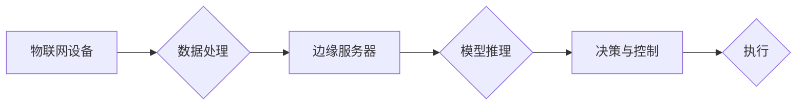

> 关键词：边缘计算，端侧推理，深度学习，模型压缩，实时性，资源受限设备

# 边缘计算与端侧推理原理与代码实战案例讲解

边缘计算和端侧推理是近年来云计算和人工智能领域两个备受关注的热点。随着物联网设备的普及和移动互联网的快速发展，数据产生的速度和规模呈指数级增长。如何将这些海量数据高效、实时地处理，成为了技术发展的关键。本文将深入探讨边缘计算与端侧推理的原理，并通过实际代码案例，展示如何将深度学习模型部署到边缘设备和端侧设备上，实现实时智能。

## 1. 背景介绍

### 1.1 问题的由来

随着移动互联网的普及，越来越多的设备开始产生和使用数据。然而，传统的云计算模式将所有数据处理都集中在大数据中心，不仅数据传输延迟高，而且中心化架构难以应对海量设备的连接和数据量激增的问题。边缘计算和端侧推理应运而生，它们将数据处理和计算推向网络边缘，近端设备或终端用户，从而实现了更低的延迟、更高的效率和更好的用户体验。

### 1.2 研究现状

边缘计算和端侧推理技术已经取得了显著的进展，主要表现在以下几个方面：

- 深度学习模型的轻量化和压缩技术不断成熟，使得模型能够在资源受限的设备上高效运行。
- 硬件加速技术的发展，如神经网络处理器(Neural Network Processors, NNPs)和专用集成电路(Application-Specific Integrated Circuits, ASICs)，为端侧推理提供了强大的硬件支持。
- 边缘计算平台和框架不断完善，为开发者提供了便捷的部署和运维工具。

### 1.3 研究意义

边缘计算和端侧推理技术对于推动人工智能应用的普及具有重要意义：

- 提高数据处理速度和效率，降低延迟，提升用户体验。
- 缓解数据中心压力，降低网络带宽和能源消耗。
- 增强数据隐私保护，避免敏感数据在网络上传输。
- 促进人工智能在更多领域的应用，如智能城市、智能家居、自动驾驶等。

### 1.4 本文结构

本文将分为以下几个部分：

- 第2章介绍边缘计算和端侧推理的核心概念。
- 第3章阐述端侧推理的核心算法原理和具体操作步骤。
- 第4章讲解模型压缩和量化技术，以及它们在端侧推理中的应用。
- 第5章通过实际代码案例，展示如何在边缘设备和端侧设备上部署深度学习模型。
- 第6章探讨边缘计算和端侧推理的实际应用场景。
- 第7章推荐相关的学习资源、开发工具和论文。
- 第8章总结未来发展趋势和面临的挑战。

## 2. 核心概念与联系

### 2.1 核心概念

**边缘计算（Edge Computing）**：将数据处理和计算能力从云端迁移到网络边缘，如物联网设备、移动设备等，以实现更快的响应速度和更低的延迟。

**端侧推理（Edge Inference）**：在端侧设备上运行深度学习模型，对采集到的数据进行分析和处理，实现实时智能。

### 2.2 架构图

以下是一个简单的边缘计算与端侧推理的架构图：



在这个架构中，物联网设备负责采集数据，并将数据传输到边缘服务器。边缘服务器负责数据的预处理和模型推理，然后将推理结果发送给端侧设备进行决策和控制。

## 3. 核心算法原理 & 具体操作步骤

### 3.1 算法原理概述

端侧推理的核心是将深度学习模型部署到端侧设备上，并对采集到的数据进行实时处理。以下是一些常用的算法原理：

- **卷积神经网络（CNNs）**：适用于图像识别、物体检测等视觉任务。
- **循环神经网络（RNNs）**：适用于序列数据处理，如语音识别、机器翻译等。
- **Transformer**：适用于自然语言处理任务，如文本分类、机器翻译等。

### 3.2 算法步骤详解

端侧推理的一般步骤如下：

1. 数据采集：从端侧设备采集数据。
2. 数据预处理：对采集到的数据进行必要的处理，如去噪、缩放等。
3. 模型加载：将预训练的深度学习模型加载到端侧设备。
4. 模型推理：将预处理后的数据输入模型进行推理。
5. 结果处理：对推理结果进行后处理，如解码、可视化等。

### 3.3 算法优缺点

**优点**：

- 响应速度快，降低延迟，提升用户体验。
- 避免敏感数据在网络上传输，增强数据隐私保护。
- 减少数据中心压力，降低网络带宽和能源消耗。

**缺点**：

- 端侧设备资源有限，可能难以运行大型模型。
- 模型训练和优化需要专门的技术和工具。
- 安全性和稳定性需要特别关注。

### 3.4 算法应用领域

端侧推理可以应用于以下领域：

- **智能摄像头**：实时识别和监控视频中的物体。
- **智能音箱**：实时理解用户的语音指令。
- **智能手表**：实时监测用户的健康状况。
- **自动驾驶**：实时处理道路信息和车辆控制。

## 4. 数学模型和公式 & 详细讲解 & 举例说明

### 4.1 数学模型构建

以卷积神经网络（CNN）为例，其基本结构包括卷积层、池化层、全连接层等。

- **卷积层**：通过卷积操作提取特征。
- **池化层**：降低特征图的分辨率，减少模型参数。
- **全连接层**：对提取的特征进行分类或回归。

### 4.2 公式推导过程

以卷积层为例，其计算公式如下：

$$
\mathbf{f}(\mathbf{x}) = \mathbf{W} * \mathbf{f}(\mathbf{I}) + \mathbf{b}
$$

其中，$\mathbf{f}(\mathbf{x})$ 为输出特征图，$\mathbf{W}$ 为卷积核，$\mathbf{I}$ 为输入特征图，$\mathbf{b}$ 为偏置项。

### 4.3 案例分析与讲解

以下是一个简单的图像分类模型，使用PyTorch框架实现：

```python
import torch
import torch.nn as nn

class SimpleCNN(nn.Module):
    def __init__(self):
        super(SimpleCNN, self).__init__()
        self.conv1 = nn.Conv2d(3, 16, kernel_size=3, stride=1, padding=1)
        self.relu = nn.ReLU()
        self.pool = nn.MaxPool2d(kernel_size=2, stride=2)
        self.fc1 = nn.Linear(16 * 64 * 64, 128)
        self.fc2 = nn.Linear(128, 10)

    def forward(self, x):
        x = self.pool(self.relu(self.conv1(x)))
        x = x.view(-1, 16 * 64 * 64)
        x = self.relu(self.fc1(x))
        x = self.fc2(x)
        return x
```

## 5. 项目实践：代码实例和详细解释说明

### 5.1 开发环境搭建

在进行端侧推理实践前，我们需要准备以下开发环境：

1. 安装Python 3.7或更高版本。
2. 安装PyTorch：`pip install torch torchvision torchaudio`
3. 安装TensorFlow Lite：`pip install tensorflow-lite`
4. 安装其他必要的库：`pip install opencv-python numpy`

### 5.2 源代码详细实现

以下是一个简单的端侧推理示例，使用PyTorch模型和TensorFlow Lite进行部署：

```python
import torch
import torch.nn as nn
from torch.autograd import Variable
import tensorflow as tf

# 定义网络结构
class SimpleCNN(nn.Module):
    # ... (与上文相同)

# 加载预训练模型
model = SimpleCNN().to('cuda')
model.load_state_dict(torch.load('model.pth'))

# 将模型转换为TensorFlow Lite模型
converter = tf.lite.TFLiteConverter.from_pytorch(model)
tflite_model = converter.convert()

# 使用TensorFlow Lite模型进行推理
interpreter = tf.lite.Interpreter(model_content=tflite_model)
interpreter.allocate_tensors()

input_details = interpreter.get_input_details()
output_details = interpreter.get_output_details()

# 加载测试图像
image = cv2.imread('test_image.jpg')
image = cv2.resize(image, (64, 64))
image = image / 255.0
image = image.transpose((2, 0, 1))
image = torch.from_numpy(image).float().unsqueeze(0).to('cuda')

# 进行推理
interpreter.set_tensor(input_details[0]['index'], image.numpy())
interpreter.invoke()
output_data = interpreter.get_tensor(output_details[0]['index'])

# 显示结果
print('预测类别：', torch.argmax(output_data))
```

### 5.3 代码解读与分析

以上代码首先定义了一个简单的CNN网络结构，并加载了预训练的模型。然后，使用TensorFlow Lite将模型转换为TFLite格式，并加载到TensorFlow Lite解释器中。接着，加载测试图像并进行预处理，将预处理后的图像输入到模型中进行推理，并输出预测结果。

### 5.4 运行结果展示

假设测试图像为一张猫的图片，运行上述代码后，模型会输出预测类别为“猫”的结果。

## 6. 实际应用场景

### 6.1 智能摄像头

智能摄像头可以实时监测视频中的物体，并发出警报。例如，当检测到异常行为或异常物体时，系统会自动报警并记录视频。

### 6.2 智能音箱

智能音箱可以实时理解用户的语音指令，并执行相应的操作。例如，用户可以通过语音控制智能音箱播放音乐、查询天气、设定闹钟等。

### 6.3 智能手表

智能手表可以实时监测用户的健康状况，如心率、血压等，并给出健康建议。

### 6.4 未来应用展望

随着边缘计算和端侧推理技术的不断发展，未来将在更多领域得到应用，如：

- 智能城市：实时监控城市交通、环境、安全等。
- 智能家居：实现家庭设备的智能化控制。
- 自动驾驶：实现自动驾驶汽车的安全驾驶。
- 医疗保健：实现远程医疗和健康监测。

## 7. 工具和资源推荐

### 7.1 学习资源推荐

- 《深度学习》系列书籍：全面介绍深度学习的基本概念、原理和算法。
- PyTorch官方文档：PyTorch框架的官方文档，提供了丰富的教程和API说明。
- TensorFlow官方文档：TensorFlow框架的官方文档，提供了丰富的教程和API说明。
- TensorFlow Lite官方文档：TensorFlow Lite框架的官方文档，提供了丰富的教程和API说明。

### 7.2 开发工具推荐

- PyTorch：开源的深度学习框架，提供了丰富的模型和工具。
- TensorFlow：开源的深度学习框架，提供了丰富的模型和工具。
- TensorFlow Lite：用于在移动和嵌入式设备上部署TensorFlow模型的工具。
- OpenCV：开源的计算机视觉库，提供了丰富的图像和视频处理功能。

### 7.3 相关论文推荐

- DAI. "An overview of deep learning-based image classification: architectures, challenges, and solutions." 2018.
- Y. LeCun, Y. Bengio, G. Hinton. "Deep learning." Nature, 2015.
- S. Bengio, A. Courville, Y. Bengio. "Deep learning." MIT press, 2015.

## 8. 总结：未来发展趋势与挑战

### 8.1 研究成果总结

本文深入探讨了边缘计算和端侧推理的原理，并通过实际代码案例，展示了如何将深度学习模型部署到边缘设备和端侧设备上，实现实时智能。

### 8.2 未来发展趋势

- 模型压缩和量化技术将进一步提高模型的效率和压缩率。
- 硬件加速技术的发展将降低端侧设备的功耗和成本。
- 边缘计算和端侧推理将与其他人工智能技术（如知识图谱、强化学习等）相结合，实现更加智能的应用。

### 8.3 面临的挑战

- 模型压缩和量化技术需要进一步提高，以满足不同设备的计算需求。
- 硬件加速技术的发展需要关注能耗和散热问题。
- 边缘计算和端侧推理的安全性和隐私保护需要进一步加强。

### 8.4 研究展望

随着技术的不断发展和完善，边缘计算和端侧推理将在更多领域得到应用，为人类社会带来更加智能化的生活和工作体验。

## 9. 附录：常见问题与解答

**Q1：边缘计算和端侧推理的主要区别是什么？**

A1：边缘计算是一种计算范式，将数据处理和计算推向网络边缘；端侧推理是边缘计算的一种应用，在端侧设备上进行模型推理。

**Q2：为什么需要边缘计算和端侧推理？**

A2：边缘计算和端侧推理可以降低延迟、提高效率、增强数据隐私保护，并促进人工智能在更多领域的应用。

**Q3：如何将深度学习模型部署到端侧设备？**

A3：可以使用TensorFlow Lite、ONNX Runtime等工具将模型转换为端侧设备可识别的格式，然后在端侧设备上运行模型进行推理。

**Q4：如何提高端侧推理的效率？**

A4：可以通过模型压缩、量化、剪枝等技术降低模型复杂度和参数量，同时可以使用硬件加速器提高推理速度。

**Q5：边缘计算和端侧推理的安全性和隐私保护如何保障？**

A5：需要采用加密、访问控制、数据脱敏等技术保障数据和模型的安全性和隐私保护。

作者：禅与计算机程序设计艺术 / Zen and the Art of Computer Programming