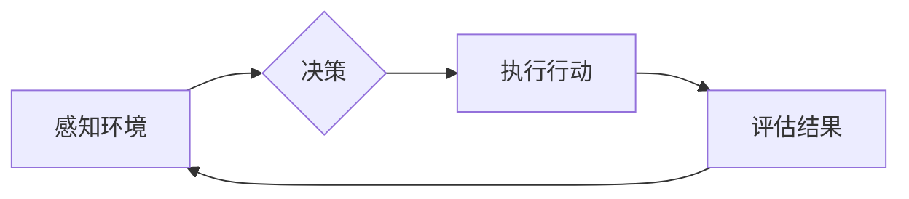

# 陈锴杰的Agent创业故事

> 关键词：人工智能，创业，智能代理，商业模式，深度学习，NLP，机器学习

## 1. 背景介绍

在人工智能技术飞速发展的今天，智能代理（Agent）成为了一个备受关注的概念。智能代理，也称为智能体，是一种能够感知环境、作出决策并采取行动的软件实体。它能够通过机器学习、自然语言处理等技术，自主学习并优化其行为，从而在复杂多变的业务场景中提供高效、智能的服务。

陈锴杰，一位年轻的人工智能创业者，他的故事正是这个时代人工智能技术发展的缩影。陈锴杰的创业公司专注于开发智能代理技术，并将其应用于金融、客服、教育等多个领域。本文将讲述陈锴杰的创业故事，探讨智能代理技术如何改变世界，以及面临的挑战和机遇。

### 1.1 问题的由来

随着互联网的普及，传统企业面临着巨大的挑战。客户需求日益多样化，市场竞争日趋激烈，企业需要更加高效、智能的服务来提升客户体验和降低运营成本。然而，传统的人工服务模式存在着人力成本高、效率低、服务质量不稳定等问题。

为了解决这些问题，陈锴杰看到了智能代理技术的巨大潜力。他认为，通过将人工智能技术应用于智能代理，可以为企业提供一种低成本、高效率、智能化的服务解决方案。

### 1.2 研究现状

智能代理技术的研究始于20世纪70年代，经过多年的发展，已经取得了显著的成果。目前，智能代理技术主要应用于以下几个方面：

- **智能客服**：通过自然语言处理技术，智能代理能够理解客户的问题，并提供相应的解决方案。
- **智能推荐**：通过机器学习技术，智能代理能够根据用户的兴趣和行为，推荐个性化的内容或产品。
- **智能翻译**：通过深度学习技术，智能代理能够实现实时、准确的翻译服务。
- **智能交通**：通过机器学习技术，智能代理能够优化交通路线，缓解交通拥堵。

### 1.3 研究意义

智能代理技术的研究和应用，对于提升企业竞争力、改善用户体验、推动社会进步具有重要意义。

- **提升企业竞争力**：智能代理技术能够帮助企业降低人力成本，提高服务效率，提升客户满意度，增强市场竞争力。
- **改善用户体验**：智能代理技术能够提供个性化、智能化的服务，满足用户多样化的需求，提升用户体验。
- **推动社会进步**：智能代理技术能够应用于教育、医疗、交通等领域，改善社会服务，提高社会效率。

### 1.4 本文结构

本文将围绕陈锴杰的创业故事，探讨智能代理技术的原理、应用、挑战和未来发展趋势。具体内容包括：

- **第2章**：介绍智能代理技术的核心概念与联系。
- **第3章**：阐述智能代理技术的核心算法原理和具体操作步骤。
- **第4章**：讲解智能代理技术的数学模型和公式，并举例说明。
- **第5章**：介绍陈锴杰创业项目的开发环境和代码实现。
- **第6章**：探讨智能代理技术的实际应用场景和未来应用展望。
- **第7章**：推荐智能代理技术相关的学习资源和开发工具。
- **第8章**：总结智能代理技术的研究成果、发展趋势和挑战。
- **第9章**：附录，常见问题与解答。

## 2. 核心概念与联系

### 2.1 核心概念

智能代理技术涉及多个核心概念，以下是对这些概念的解释：

- **智能代理（Agent）**：一种能够感知环境、作出决策并采取行动的软件实体。
- **知识表示**：将知识以计算机可理解的形式表示出来。
- **推理**：根据已有知识进行逻辑推理，得出新的结论。
- **学习**：通过经验或数据，改进智能代理的行为。
- **规划**：根据目标，制定行动计划。
- **通信**：智能代理之间或与人类之间的信息交换。

### 2.2 架构流程图

智能代理系统的基本架构流程如下：



- **感知环境**：智能代理通过传感器或接口获取外部环境的信息。
- **决策**：根据感知到的信息和预设的规则，智能代理作出决策。
- **执行行动**：智能代理根据决策执行相应的行动。
- **评估结果**：评估行动的结果，并反馈给智能代理。
- **循环**：智能代理根据评估结果调整策略，继续感知环境、决策、执行和评估。

## 3. 核心算法原理 & 具体操作步骤

### 3.1 算法原理概述

智能代理技术主要基于以下算法原理：

- **机器学习**：通过学习大量数据，智能代理能够识别模式、进行预测和分类。
- **自然语言处理（NLP）**：通过理解自然语言，智能代理能够与人类进行交流。
- **知识表示**：通过将知识表示为计算机可理解的形式，智能代理能够进行推理和决策。

### 3.2 算法步骤详解

智能代理技术的具体操作步骤如下：

1. **数据收集**：收集智能代理所需的数据，包括文本数据、图像数据、声音数据等。
2. **数据处理**：对收集到的数据进行清洗、标注和预处理。
3. **模型训练**：使用机器学习算法训练模型，使模型能够识别数据中的模式和规律。
4. **模型评估**：评估模型的性能，并根据评估结果调整模型参数。
5. **部署模型**：将训练好的模型部署到实际应用场景中。
6. **持续优化**：根据用户反馈和实际应用效果，持续优化模型和智能代理的行为。

### 3.3 算法优缺点

智能代理技术的优点包括：

- **高效性**：智能代理能够快速处理大量数据，提高工作效率。
- **准确性**：通过机器学习算法，智能代理能够提高决策的准确性。
- **适应性**：智能代理能够根据环境变化和用户反馈，不断优化自身行为。

智能代理技术的缺点包括：

- **数据依赖性**：智能代理的性能依赖于训练数据的质量和数量。
- **算法复杂性**：智能代理的算法复杂，需要专业的技术人才进行开发和维护。

### 3.4 算法应用领域

智能代理技术在以下领域有广泛的应用：

- **智能客服**：通过自然语言处理技术，智能代理能够理解客户的问题，并提供相应的解决方案。
- **智能推荐**：通过机器学习技术，智能代理能够根据用户的兴趣和行为，推荐个性化的内容或产品。
- **智能翻译**：通过深度学习技术，智能代理能够实现实时、准确的翻译服务。
- **智能交通**：通过机器学习技术，智能代理能够优化交通路线，缓解交通拥堵。

## 4. 数学模型和公式 & 详细讲解 & 举例说明

### 4.1 数学模型构建

智能代理的数学模型通常包括以下部分：

- **输入层**：接收外部环境的输入信息。
- **隐藏层**：包含机器学习模型，如神经网络、支持向量机等。
- **输出层**：输出智能代理的决策结果。

以下是一个简单的神经网络模型示例：

$$
y = f(W \cdot x + b)
$$

其中，$y$ 是输出，$x$ 是输入，$W$ 是权重，$b$ 是偏置，$f$ 是激活函数。

### 4.2 公式推导过程

以神经网络为例，以下是损失函数的推导过程：

$$
L = \frac{1}{2} \sum_{i=1}^N (y_i - \hat{y}_i)^2
$$

其中，$L$ 是损失函数，$y_i$ 是真实标签，$\hat{y}_i$ 是预测值。

### 4.3 案例分析与讲解

以下是一个智能客服的案例：

**案例**：一家银行希望开发一个智能客服系统，能够自动回答客户的常见问题。

**解决方案**：

1. 数据收集：收集银行的常见问题及其最佳答案，并对其进行标注。
2. 模型训练：使用标注数据训练一个NLP模型，使其能够理解客户的问题，并匹配最佳答案。
3. 部署模型：将训练好的模型部署到智能客服系统中。
4. 持续优化：根据用户反馈和实际应用效果，持续优化模型和智能客服的行为。

**模型训练过程**：

1. 将客户问题转换为向量表示。
2. 使用神经网络模型对向量进行分类，得到最佳答案的类别。
3. 计算损失函数，并更新模型参数。

通过不断训练和优化，智能客服系统能够越来越准确地回答客户的问题。

## 5. 项目实践：代码实例和详细解释说明

### 5.1 开发环境搭建

以下是一个简单的智能客服项目开发环境搭建步骤：

1. 安装Python环境。
2. 安装深度学习框架，如TensorFlow或PyTorch。
3. 安装NLP库，如NLTK或spaCy。

### 5.2 源代码详细实现

以下是一个简单的智能客服项目代码示例：

```python
import torch
import torch.nn as nn
import torch.optim as optim

class QAClient(nn.Module):
    def __init__(self, vocab_size, embedding_dim, hidden_dim):
        super(QAClient, self).__init__()
        self.embedding = nn.Embedding(vocab_size, embedding_dim)
        self.rnn = nn.LSTM(embedding_dim, hidden_dim)
        self.fc = nn.Linear(hidden_dim, vocab_size)
    
    def forward(self, x):
        x = self.embedding(x)
        x, _ = self.rnn(x)
        x = self.fc(x)
        return x

# 定义模型参数
vocab_size = 10000
embedding_dim = 300
hidden_dim = 512

# 创建模型
model = QAClient(vocab_size, embedding_dim, hidden_dim)

# 定义损失函数和优化器
criterion = nn.CrossEntropyLoss()
optimizer = optim.Adam(model.parameters(), lr=0.001)

# 训练模型
for epoch in range(10):
    for inputs, labels in train_loader:
        optimizer.zero_grad()
        outputs = model(inputs)
        loss = criterion(outputs, labels)
        loss.backward()
        optimizer.step()
```

### 5.3 代码解读与分析

以上代码定义了一个简单的问答客服模型，使用LSTM网络对输入问题进行分类。代码中包含了模型的定义、损失函数和优化器的选择、模型训练等步骤。

### 5.4 运行结果展示

通过训练和测试，我们可以评估模型的性能，并调整模型参数以获得更好的效果。

## 6. 实际应用场景

智能代理技术在以下领域有广泛的应用：

### 6.1 智能客服

智能客服是智能代理技术最典型的应用场景之一。通过智能客服，企业可以提供24小时不间断的服务，提高客户满意度，降低人力成本。

### 6.2 智能推荐

智能推荐技术可以应用于电商、新闻、视频等多个领域，根据用户的兴趣和行为，推荐个性化的内容或产品。

### 6.3 智能翻译

智能翻译技术可以实现实时、准确的翻译服务，打破语言障碍，促进国际交流。

### 6.4 智能交通

智能交通技术可以优化交通路线，缓解交通拥堵，提高交通效率。

### 6.5 智能教育

智能教育技术可以为学生提供个性化的学习方案，提高学习效率。

### 6.6 智能医疗

智能医疗技术可以帮助医生进行诊断、治疗和康复，提高医疗水平。

### 6.7 智能家居

智能家居技术可以实现家庭设备的智能控制，提高生活品质。

### 6.4 未来应用展望

随着人工智能技术的不断发展，智能代理技术的应用场景将会更加广泛。未来，智能代理技术将可能应用于以下领域：

- **智能城市**：智能代理技术可以用于智能交通、智能监控、智能能源管理等方面，构建更加智慧、高效的城市。
- **智能医疗**：智能代理技术可以用于辅助诊断、个性化治疗、健康管理等方面，提高医疗水平，改善人类健康。
- **智能教育**：智能代理技术可以用于个性化学习、智能辅导、教育资源优化等方面，提高教育质量，促进教育公平。
- **智能制造**：智能代理技术可以用于智能生产、设备维护、供应链管理等方面，提高生产效率，降低生产成本。

## 7. 工具和资源推荐

### 7.1 学习资源推荐

- 《深度学习》（Goodfellow等著）
- 《自然语言处理综合指南》（Jurafsky和Martin著）
- 《机器学习》（Tom Mitchell著）

### 7.2 开发工具推荐

- TensorFlow
- PyTorch
- spaCy
- NLTK

### 7.3 相关论文推荐

- **《Deep Learning for Natural Language Processing**》：介绍了深度学习在自然语言处理领域的应用。
- **《Sequence to Sequence Learning with Neural Networks**》：介绍了序列到序列学习在机器翻译等领域的应用。
- **《BERT: Pre-training of Deep Bidirectional Transformers for Language Understanding**》：介绍了BERT模型及其在自然语言处理领域的应用。

## 8. 总结：未来发展趋势与挑战

### 8.1 研究成果总结

智能代理技术作为人工智能领域的一个重要分支，已经取得了显著的研究成果。随着技术的不断进步，智能代理技术在各个领域的应用将会越来越广泛。

### 8.2 未来发展趋势

未来，智能代理技术将朝着以下方向发展：

- **更强大的学习能力**：智能代理将能够更好地学习环境变化，适应新的任务和场景。
- **更丰富的应用场景**：智能代理技术将应用于更多领域，为人类生活带来更多便利。
- **更人性化的交互方式**：智能代理将能够更好地理解人类语言，提供更加自然、流畅的交互体验。

### 8.3 面临的挑战

智能代理技术面临着以下挑战：

- **数据隐私和安全**：智能代理需要处理大量用户数据，如何保护用户隐私和安全是一个重要问题。
- **算法偏见和歧视**：智能代理可能会学习到偏见和歧视，如何避免算法偏见是一个重要问题。
- **人机协同**：如何实现人机协同，让智能代理更好地辅助人类工作是一个重要问题。

### 8.4 研究展望

未来，智能代理技术的研究需要关注以下方面：

- **数据隐私和安全**：研究如何保护用户隐私和安全，避免数据泄露和滥用。
- **算法偏见和歧视**：研究如何避免算法偏见和歧视，确保智能代理的公平性和公正性。
- **人机协同**：研究如何实现人机协同，让智能代理更好地辅助人类工作。

通过不断努力，相信智能代理技术将会在未来发挥更大的作用，为人类创造更加美好的生活。

## 9. 附录：常见问题与解答

**Q1：什么是智能代理？**

A：智能代理是一种能够感知环境、作出决策并采取行动的软件实体。它能够通过机器学习、自然语言处理等技术，自主学习并优化其行为，从而在复杂多变的业务场景中提供高效、智能的服务。

**Q2：智能代理技术在哪些领域有应用？**

A：智能代理技术在智能客服、智能推荐、智能翻译、智能交通、智能教育、智能医疗、智能家居等多个领域有应用。

**Q3：如何开发智能代理？**

A：开发智能代理需要掌握机器学习、自然语言处理等技术。可以使用TensorFlow、PyTorch等深度学习框架进行开发。

**Q4：智能代理技术有哪些挑战？**

A：智能代理技术面临着数据隐私和安全、算法偏见和歧视、人机协同等挑战。

**Q5：智能代理技术的未来发展趋势是什么？**

A：智能代理技术的未来发展趋势包括更强大的学习能力、更丰富的应用场景、更人性化的交互方式等。

作者：禅与计算机程序设计艺术 / Zen and the Art of Computer Programming