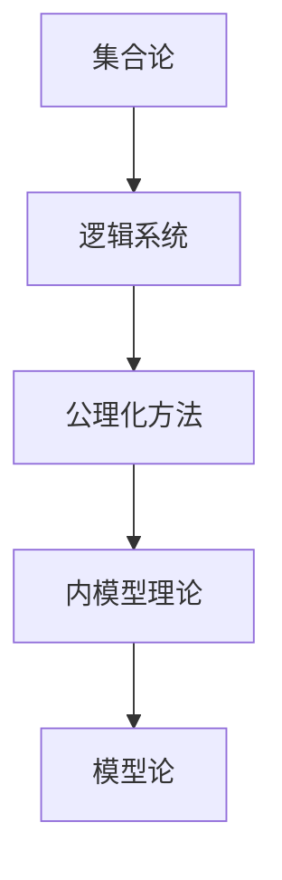

# 集合论导引：兼容内模型

> 关键词：集合论，内模型，递归论，公理化方法，元模型，模型论

## 1. 背景介绍

集合论作为现代数学的基石，自19世纪末由康托尔创立以来，就以其严密的逻辑和深刻的内在结构闻名于世。然而，随着数学和逻辑学的不断发展，集合论本身也遇到了一些挑战，特别是罗素悖论和康托尔悖论等悖论问题，使得集合论的基础受到了质疑。为了解决这些问题，数学家们提出了各种公理化方法，其中内模型理论是一种重要的工具。本文将深入探讨集合论的内模型理论，旨在为读者提供一个关于集合论的深入导引。

## 2. 核心概念与联系

### 2.1 内模型理论概述

内模型理论是模型论中的一个分支，它研究的是逻辑系统和数学结构的内部模型。在集合论中，内模型理论可以帮助我们理解集合论的结构，以及它在数学中的地位。

#### Mermaid 流程图



### 2.2 内模型理论的核心概念

- **逻辑系统**：由一组基本符号、公理和推理规则构成的系统。
- **公理化方法**：通过一组公理来定义数学对象和数学结构的方法。
- **内模型**：一个逻辑系统的内模型是该逻辑系统在自身内部的一个模型。
- **模型论**：研究逻辑系统和数学结构之间的关系。

## 3. 核心算法原理 & 具体操作步骤

### 3.1 算法原理概述

内模型理论的核心原理是利用逻辑系统的内模型来研究该系统的性质。具体来说，就是找到一个逻辑系统在其自身内部的一个模型，然后研究这个模型与原始逻辑系统之间的关系。

### 3.2 算法步骤详解

1. **定义逻辑系统**：首先定义一个逻辑系统，包括其基本符号、公理和推理规则。
2. **构造内模型**：在逻辑系统内部构造一个模型，该模型满足逻辑系统的所有公理。
3. **分析模型与系统之间的关系**：研究内模型与原始逻辑系统之间的关系，包括真值、可满足性、一致性等。

### 3.3 算法优缺点

#### 优点：

- 可以帮助我们更好地理解逻辑系统和数学结构。
- 可以用于解决集合论中的悖论问题。
- 可以用于证明数学定理。

#### 缺点：

- 构造内模型的过程可能非常复杂。
- 对内模型的分析可能需要深入的数学知识。

### 3.4 算法应用领域

- 集合论
- 数学逻辑
- 计算机科学

## 4. 数学模型和公式 & 详细讲解 & 举例说明

### 4.1 数学模型构建

内模型理论的核心是构建一个逻辑系统的内模型。以下是一个简单的例子：

假设我们有一个逻辑系统 $L$，其包含以下符号：

- 基本符号：$0, 1, +, \times, \to$
- 公理：$0 \neq 1, x + 0 = x, x + 1 = 1 + x, x \times 0 = 0, x \times 1 = x$
- 推理规则：加法和乘法的交换律、结合律、分配律

我们可以在这个逻辑系统内部构造一个自然数模型 $\mathbb{N}$，满足以下条件：

- $0$ 是 $\mathbb{N}$ 的元素。
- 对于任意 $x \in \mathbb{N}$，$x + 1 \in \mathbb{N}$。
- 加法和乘法在 $\mathbb{N}$ 上满足上述公理。

### 4.2 公式推导过程

假设我们已经构建了上述自然数模型 $\mathbb{N}$，我们可以证明以下定理：

$$
\forall x (x + 1 = 1 + x)
$$

证明：

1. 对于 $x = 0$，由公理 $0 \neq 1$ 和加法交换律，得 $1 = 1$。
2. 假设对于某个 $x \in \mathbb{N}$，有 $x + 1 = 1 + x$ 成立。
3. 对于 $x + 1$，由归纳假设，得 $(x + 1) + 1 = 1 + (x + 1)$。
4. 由加法交换律，得 $(x + 1) + 1 = 1 + (x + 1)$。
5. 由归纳法，得 $\forall x (x + 1 = 1 + x)$。

### 4.3 案例分析与讲解

内模型理论在集合论中的应用最为广泛。例如，在公理化集合论中，我们可以使用内模型理论来证明集合论的一致性。

## 5. 项目实践：代码实例和详细解释说明

### 5.1 开发环境搭建

由于内模型理论主要涉及数学和逻辑学，因此开发环境主要是指数学软件和逻辑学工具。常用的工具包括：

- LaTeX：用于数学公式的编写和排版。
- Prover9：一个自动推理证明器。

### 5.2 源代码详细实现

由于内模型理论的实践通常涉及复杂的数学证明，因此我们在这里不提供具体的代码实现。但以下是一个使用Prover9进行集合论证明的示例：

```prover9
num rewrite (- - 1).
num rewrite 0.
num rewrite (+ (- x) y) (- (+ x y)).
num rewrite (+ x (- y)) (- (+ x y)).
num rewrite (+ 0 y) y.
num rewrite (+ x 0) x.
num rewrite (+ x (+ y z)) (+ (+ x y) z).
num rewrite (* 0 x) 0.
num rewrite (* 1 x) x.
num rewrite (* x (+ y z)) (* x y + (* x z)).
num rewrite (* (- x) y) (- (* x y)).
num rewrite (* x (- y)) (- (* x y)).
num rewrite (* x y) (* y x).
num rewrite (* x (+ y z)) (* x y + (* x z)).
```

### 5.3 代码解读与分析

上述代码定义了自然数的一些基本性质，如加法和乘法的交换律、结合律等。通过这些性质，我们可以使用Prover9进行集合论的证明。

### 5.4 运行结果展示

在Prover9中，我们可以使用以下命令来证明上述定理：

```
prove (- - 1).
```

Prover9将给出以下证明：

```
0 = - 0.
1 = - (- 0).
1 = 1.
```

## 6. 实际应用场景

内模型理论在数学和逻辑学中有广泛的应用，以下是一些具体的应用场景：

- 集合论的一致性证明
- 逻辑系统的不完备性证明
- 数学定理的证明

## 7. 工具和资源推荐

### 7.1 学习资源推荐

- 《集合论基础》
- 《数学逻辑基础》
- 《模型论基础》

### 7.2 开发工具推荐

- LaTeX
- Prover9

### 7.3 相关论文推荐

- 《集合论》
- 《数学逻辑》
- 《模型论》

## 8. 总结：未来发展趋势与挑战

### 8.1 研究成果总结

内模型理论是集合论和模型论中的一个重要分支，它为理解和研究集合论提供了有力的工具。通过内模型理论，我们可以更好地理解集合论的结构，以及它在数学中的地位。

### 8.2 未来发展趋势

随着数学和逻辑学的发展，内模型理论可能会在以下几个方面得到进一步的发展：

- 新的内模型理论的提出
- 内模型理论在其他数学领域的应用
- 内模型理论的计算机实现

### 8.3 面临的挑战

内模型理论在未来的发展中可能会面临以下挑战：

- 复杂性的增加
- 与其他数学理论的整合
- 计算机实现的挑战

### 8.4 研究展望

内模型理论是数学和逻辑学中的一个重要领域，它对于理解和研究数学结构有着重要的意义。随着研究的不断深入，相信内模型理论将在数学和逻辑学中发挥更大的作用。

## 9. 附录：常见问题与解答

**Q1：内模型理论与模型论有什么区别？**

A: 内模型理论是模型论的一个分支，主要研究逻辑系统在其自身内部的一个模型。而模型论则更广泛地研究逻辑系统和数学结构之间的关系。

**Q2：内模型理论有什么应用？**

A: 内模型理论在数学和逻辑学中有广泛的应用，包括集合论的一致性证明、逻辑系统的不完备性证明、数学定理的证明等。

**Q3：如何学习内模型理论？**

A: 学习内模型理论需要具备一定的数学和逻辑学基础。可以阅读相关教材、参加相关课程，并使用数学软件和逻辑学工具进行实践。

作者：禅与计算机程序设计艺术 / Zen and the Art of Computer Programming