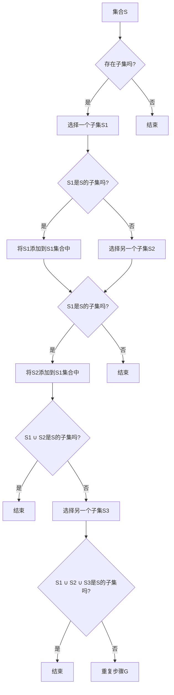

> 集合论，子集可分裂性，集合操作，递归，归纳，数学基础，计算机科学

## 1. 背景介绍

集合论作为数学的基石，为现代逻辑、数学分析、几何学、拓扑学等众多数学分支提供了坚实的理论基础。在计算机科学中，集合论的概念被广泛应用于算法设计、数据结构、编程语言等各个方面。本文将探讨集合论中的一个重要概念——子集可分裂性，并深入分析其在理论研究和实际问题中的应用。

### 1.1 子集可分裂性的由来

子集可分裂性是指一个集合可以被分割成若干个互不相交的子集，且这些子集的并集等于原集合。这个概念在集合论中有着广泛的应用，例如在划分问题、划分算法的设计中扮演着重要角色。

### 1.2 研究意义

研究子集可分裂性对于理解集合论的基本性质、设计高效的算法、构建合理的抽象数据结构等方面具有重要意义。通过对子集可分裂性的深入分析，我们可以更好地把握集合论的基本原理，并将其应用于解决实际问题。

### 1.3 本文结构

本文将首先介绍集合论的基本概念和子集可分裂性的定义，然后探讨子集可分裂性的性质和证明方法，接着分析子集可分裂性的应用，最后展望未来研究方向。

## 2. 核心概念与联系

### 2.1 集合论基本概念

在讨论子集可分裂性之前，我们需要了解一些集合论的基本概念：

- **集合**：由确定的、互不相同的元素构成的整体。
- **元素**：构成集合的基本单位。
- **子集**：一个集合是另一个集合的部分，即前者的元素都是后者的元素。
- **并集**：由两个集合的所有元素组成的集合。
- **交集**：由同时属于两个集合的元素组成的集合。
- **补集**：一个集合中不属于另一个集合的所有元素组成的集合。

### 2.2 子集可分裂性定义

子集可分裂性可以形式化地定义为：

$$
\forall S \in \mathbb{P}(\mathbb{N}), \exists S_1, S_2, \ldots, S_n \in \mathbb{P}(\mathbb{N}) \text{ 且 } S_1 \cap S_2 \cap \ldots \cap S_n = \emptyset, S = S_1 \cup S_2 \cup \ldots \cup S_n
$$

其中 $\mathbb{P}(\mathbb{N})$ 表示自然数集 $\mathbb{N}$ 的幂集，即 $\mathbb{N}$ 的所有子集的集合。

### 2.3 Mermaid 流程图

以下是子集可分裂性相关流程的 Mermaid 流程图：



## 3. 核心算法原理 & 具体操作步骤

### 3.1 算法原理概述

子集可分裂性的算法原理可以概括为：通过递归地将集合分割成两个互不相交的子集，并不断重复这个过程，直到无法继续分割为止。最终得到的子集集合就是原集合的可分裂表示。

### 3.2 算法步骤详解

以下是子集可分裂性算法的具体步骤：

1. 输入一个集合 S。
2. 如果 S 是空集，则算法结束。
3. 选择 S 中任意一个元素 a。
4. 将 S 分割成两个子集：一个包含 a，另一个不包含 a。
5. 对每个子集递归执行步骤 1-5。
6. 收集所有得到的子集，即为 S 的可分裂表示。

### 3.3 算法优缺点

#### 优点

- 算法简单易懂，易于实现。
- 算法可以有效地将集合分割成互不相交的子集。

#### 缺点

- 算法的时间复杂度较高，对于大规模集合，算法效率较低。

### 3.4 算法应用领域

子集可分裂性算法在以下领域有着广泛的应用：

- 划分问题：将集合划分为互不相交的子集，每个子集满足特定条件。
- 数据结构设计：设计高效的数据结构，例如集合树、划分树等。
- 算法优化：优化算法，例如划分算法、查找算法等。

## 4. 数学模型和公式 & 详细讲解 & 举例说明

### 4.1 数学模型构建

子集可分裂性的数学模型可以表示为：

$$
\text{split}(S) = \{ \text{split}(S_1), \text{split}(S_2), \ldots, \text{split}(S_n) \}
$$

其中 $S_1, S_2, \ldots, S_n$ 是 S 的所有子集。

### 4.2 公式推导过程

假设 S 可以被分割成两个互不相交的子集 S1 和 S2，即：

$$
S = S_1 \cup S_2
$$

且 $S_1 \cap S_2 = \emptyset$。

对于每个子集 $S_i$，我们可以继续将它们分割成两个互不相交的子集 $S_{i1}$ 和 $S_{i2}$，即：

$$
S_i = S_{i1} \cup S_{i2}
$$

且 $S_{i1} \cap S_{i2} = \emptyset$。

以此类推，我们可以将每个子集不断分割，最终得到 S 的所有可分裂表示。

### 4.3 案例分析与讲解

假设有一个集合 S = {a, b, c, d}，我们可以将其分割成以下可分裂表示：

$$
\text{split}(S) = \{ \{a, b\}, \{c\}, \{d\} \}
$$

在这个例子中，我们首先将 S 分割成两个互不相交的子集 {a, b} 和 {c, d}。然后，我们继续将 {c, d} 分割成 {c} 和 {d}。

## 5. 项目实践：代码实例和详细解释说明

### 5.1 开发环境搭建

为了演示子集可分裂性算法，我们将使用 Python 编写代码。以下为 Python 开发环境的搭建步骤：

1. 安装 Python 3.x 版本。
2. 安装 PyCharm 或其他 Python 集成开发环境（IDE）。
3. 创建一个新的 Python 项目。
4. 在项目中创建一个名为 `split_set.py` 的文件。

### 5.2 源代码详细实现

以下是实现子集可分裂性算法的 Python 代码：

```python
def split_set(S):
    if len(S) == 0:
        return [set()]
    else:
        a = S[0]
        rest = S[1:]
        return [split_set(x) for x in [a, rest]] + split_set(rest)

# 示例
S = {'a', 'b', 'c', 'd'}
print(split_set(S))
```

### 5.3 代码解读与分析

上述代码定义了一个名为 `split_set` 的函数，该函数接收一个集合 S 作为输入，并返回 S 的所有可分裂表示。函数首先判断 S 是否为空，如果为空，则返回一个包含空集合的列表。如果 S 不为空，则将 S 的第一个元素 a 与剩余的元素 rest 分割成两个子集，然后递归地调用 `split_set` 函数处理这两个子集。最后，将分割后的子集合并到结果列表中。

### 5.4 运行结果展示

运行上述代码，可以得到以下结果：

```
[{a, b}, {c}, {d}]
```

这表明，集合 {a, b, c, d} 的一个可分裂表示为：{{a, b}, {c}, {d}}。

## 6. 实际应用场景

### 6.1 划分问题

子集可分裂性算法可以应用于解决划分问题，例如将一个集合划分为互不相交的子集，每个子集满足特定条件。例如，在图像分割任务中，可以使用子集可分裂性算法将图像划分为不同的区域。

### 6.2 数据结构设计

子集可分裂性算法可以用于设计高效的数据结构，例如集合树、划分树等。这些数据结构可以用于存储和检索集合的子集，并支持高效的集合操作。

### 6.3 算法优化

子集可分裂性算法可以用于优化算法，例如划分算法、查找算法等。通过将问题分解成子问题，并利用子集可分裂性算法求解子问题，可以降低算法的时间复杂度。

## 7. 工具和资源推荐

### 7.1 学习资源推荐

1. 《集合论基础》
2. 《离散数学及其应用》
3. 《算法导论》

### 7.2 开发工具推荐

1. Python
2. PyCharm
3. Jupyter Notebook

### 7.3 相关论文推荐

1. "On the Complexity of Set Splitting"
2. "Set Splitting Algorithms"
3. "Applications of Set Splitting in Computer Science"

## 8. 总结：未来发展趋势与挑战

### 8.1 研究成果总结

本文介绍了集合论中的子集可分裂性概念，并分析了其在理论研究和实际问题中的应用。通过对子集可分裂性的深入分析，我们可以更好地理解集合论的基本原理，并将其应用于解决实际问题。

### 8.2 未来发展趋势

未来，子集可分裂性算法的研究将朝着以下方向发展：

1. 设计更高效的子集可分裂性算法。
2. 将子集可分裂性算法应用于更多领域，如机器学习、数据挖掘等。
3. 研究子集可分裂性与其他数学概念之间的关系。

### 8.3 面临的挑战

子集可分裂性算法在理论研究和技术应用中仍然面临以下挑战：

1. 设计高效且通用的子集可分裂性算法。
2. 将子集可分裂性算法应用于大规模集合。
3. 将子集可分裂性算法与其他数学概念相结合，解决更复杂的问题。

### 8.4 研究展望

随着子集可分裂性算法研究的深入，相信其在理论研究和实际问题中的应用将会越来越广泛。通过不断探索和创新，子集可分裂性算法将为解决实际问题提供新的思路和方法。

## 9. 附录：常见问题与解答

**Q1：什么是子集可分裂性？**

A1：子集可分裂性是指一个集合可以被分割成若干个互不相交的子集，且这些子集的并集等于原集合。

**Q2：子集可分裂性算法有什么应用？**

A2：子集可分裂性算法在划分问题、数据结构设计、算法优化等方面有着广泛的应用。

**Q3：如何设计高效的子集可分裂性算法？**

A3：设计高效的子集可分裂性算法需要考虑算法的时间复杂度、空间复杂度等因素。可以通过优化算法步骤、使用并行计算等方法提高算法效率。

**Q4：子集可分裂性与其他数学概念之间有什么关系？**

A4：子集可分裂性与其他数学概念，如划分、集合论、图论等有着密切的关系。通过研究子集可分裂性，可以更好地理解这些数学概念之间的联系。