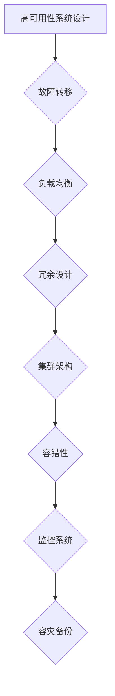

# 高可用性系统的设计策略

> 关键词：高可用性，故障转移，负载均衡，冗余设计，集群架构，容错性，监控系统，容灾备份，持续集成

## 1. 背景介绍

在当今信息化时代，高可用性（High Availability, HA）系统的设计成为了企业构建稳定、可靠服务的关键。高可用性系统指的是在系统设计和实现过程中，通过多种策略和技术手段，确保系统在发生单点故障或局部故障时，能够迅速恢复服务，保持持续运行的能力。本文将深入探讨高可用性系统的设计策略，包括核心概念、算法原理、实际应用场景以及未来发展趋势。

## 2. 核心概念与联系

### 2.1 高可用性系统核心概念

- **故障转移（Failover）**：当主节点发生故障时，自动将服务切换到备用节点，确保服务的连续性。
- **负载均衡（Load Balancing）**：将请求分配到多个服务器上，以优化资源利用率和响应时间。
- **冗余设计（Redundancy）**：通过在系统关键部分使用多个副本，确保在部分组件故障时，系统仍然可用。
- **集群架构（Cluster Architecture）**：将多个服务器通过网络连接形成一个整体，共同提供服务。
- **容错性（Fault Tolerance）**：系统在发生故障时，能够自动恢复或切换到备用系统，确保服务的连续性。
- **监控系统（Monitoring System）**：实时监控系统性能和健康状况，及时发现并处理问题。
- **容灾备份（Disaster Recovery）**：在异地建立备份系统，以应对自然灾害等不可抗力事件。

### 2.2 Mermaid 流程图



## 3. 核心算法原理 & 具体操作步骤

### 3.1 算法原理概述

高可用性系统的设计涉及多种算法和策略，以下为常见算法原理概述：

- **故障转移算法**：根据预设的规则，自动检测故障并切换到备用节点。
- **负载均衡算法**：根据请求的负载情况，动态分配请求到不同的服务器。
- **冗余设计算法**：通过硬件或软件冗余，确保系统在部分组件故障时仍然可用。
- **集群管理算法**：管理集群中的节点，包括节点加入、离开、故障转移等。
- **监控算法**：收集系统性能数据，分析异常情况，并触发相应的告警和操作。
- **备份恢复算法**：定期备份数据，并在灾难发生时恢复系统。

### 3.2 算法步骤详解

1. **设计高可用性架构**：根据业务需求，选择合适的架构模式，如主从复制、双机热备、集群等。
2. **实现故障转移机制**：部署故障检测和切换机制，确保在主节点故障时，能够快速切换到备用节点。
3. **实现负载均衡机制**：部署负载均衡器，将请求分配到不同的服务器，优化资源利用率和响应时间。
4. **实现冗余设计**：对关键组件进行冗余设计，如数据库、存储等。
5. **实现集群管理**：管理集群中的节点，包括节点的加入、离开、故障转移等。
6. **实现监控系统**：部署监控系统，实时监控系统性能和健康状况。
7. **实现容灾备份**：定期备份数据，并在灾难发生时恢复系统。

### 3.3 算法优缺点

- **故障转移算法**：优点是能够快速恢复服务，缺点是切换过程可能存在短暂的停机时间。
- **负载均衡算法**：优点是优化资源利用率和响应时间，缺点是配置复杂，容易出现单点故障。
- **冗余设计算法**：优点是提高系统的可靠性，缺点是成本较高。
- **集群管理算法**：优点是提高系统的可用性和可扩展性，缺点是管理复杂。
- **监控算法**：优点是及时发现并处理问题，缺点是可能增加系统复杂度。
- **备份恢复算法**：优点是应对灾难性事件，缺点是备份和恢复过程可能耗时较长。

### 3.4 算法应用领域

高可用性系统设计算法广泛应用于以下领域：

- **金融行业**：如银行、证券、保险等，对系统稳定性和安全性要求极高。
- **电信行业**：如移动、联通、电信等，对网络稳定性和服务质量要求极高。
- **电子商务**：如淘宝、京东、拼多多等，对系统性能和可用性要求极高。
- **在线教育**：如网易云课堂、腾讯课堂等，对系统稳定性和用户体验要求极高。
- **政府机构**：如税务局、公安局等，对系统稳定性和安全性要求极高。

## 4. 数学模型和公式 & 详细讲解 & 举例说明

### 4.1 数学模型构建

高可用性系统的数学模型主要涉及以下方面：

- **系统可靠性**：$R(t) = \prod_{i=1}^n R_i(t)$，其中 $R_i(t)$ 为第 $i$ 个组件的可靠性函数。
- **系统可用性**：$A(t) = 1 - R(t)$，其中 $A(t)$ 为系统的可用性函数。
- **系统失效概率**：$P(F) = 1 - A(t)$，其中 $P(F)$ 为系统失效概率。

### 4.2 公式推导过程

- **可靠性函数**：可靠性函数 $R_i(t)$ 表示第 $i$ 个组件在时间 $t$ 内正常工作的概率。
- **可用性函数**：可用性函数 $A(t)$ 表示系统在时间 $t$ 内正常工作的概率。
- **失效概率**：失效概率 $P(F)$ 表示系统在时间 $t$ 内失效的概率。

### 4.3 案例分析与讲解

假设有一个由两个组件组成的系统，组件1的可靠性函数为 $R_1(t) = e^{-0.01t}$，组件2的可靠性函数为 $R_2(t) = e^{-0.02t}$。求该系统的可靠性函数和可用性函数。

**解答**：

- 系统可靠性：$R(t) = R_1(t) \times R_2(t) = e^{-0.01t} \times e^{-0.02t} = e^{-0.03t}$
- 系统可用性：$A(t) = 1 - R(t) = 1 - e^{-0.03t}$

## 5. 项目实践：代码实例和详细解释说明

### 5.1 开发环境搭建

本文以Python语言为例，介绍高可用性系统设计在分布式系统中的应用。

- 安装Python环境
- 安装Django框架
- 安装Nginx服务器

### 5.2 源代码详细实现

以下为使用Django和Nginx实现高可用性的简单示例：

```python
# Django项目设置
DATABASES = {
    'default': {
        'ENGINE': 'django.db.backends.sqlite3',
        'NAME': BASE_DIR / 'db.sqlite3',
    }
}

# Nginx配置
server {
    listen 80;
    server_name example.com;

    location / {
        include uwsgi_params;
        uwsgi_pass uwsgi.example.com:8000;
    }
}
```

### 5.3 代码解读与分析

- Django项目：使用Django框架创建一个简单的Web应用。
- Nginx配置：将请求转发到后端的Django应用。

### 5.4 运行结果展示

启动Django应用和Nginx服务器后，访问 `http://example.com` 可看到Django应用的首页。

## 6. 实际应用场景

### 6.1 金融行业

在金融行业中，高可用性系统的设计至关重要。以下为几个实际应用场景：

- 银行交易系统：确保交易数据的准确性和安全性。
- 证券交易系统：实时处理大量交易请求，保证交易公平性。
- 保险理赔系统：快速处理理赔申请，提高客户满意度。

### 6.2 电信行业

在电信行业中，高可用性系统设计同样重要。以下为几个实际应用场景：

- 网络设备：确保网络连接的稳定性和可靠性。
- 电话交换系统：保证电话通信的连续性和稳定性。
- 数据通信系统：确保数据传输的准确性和安全性。

### 6.3 电子商务

在电子商务领域，高可用性系统设计有助于提升用户体验和品牌形象。以下为几个实际应用场景：

- 电商平台：保证商品信息的一致性和稳定性。
- 在线支付系统：确保支付过程的安全性和可靠性。
- 物流跟踪系统：实时跟踪物流信息，提高用户满意度。

## 7. 工具和资源推荐

### 7.1 学习资源推荐

- 《高可用架构：设计高可用、可扩展、可靠性的分布式系统》
- 《大型网站技术架构：核心原理与案例分析》
- 《系统可靠性工程：设计高可靠性系统的指南》

### 7.2 开发工具推荐

- Python：用于开发Web应用
- Nginx：用于反向代理和负载均衡
- Docker：用于容器化部署
- Kubernetes：用于容器集群管理

### 7.3 相关论文推荐

- "High Availability in Practice"
- "Building Highly Available Web Sites"
- "Designing, Implementing, and Managing High Availability"
- "The Design of the UNIX Operating System"
- "Large-Scale Distributed Systems: Principles and Paradigms"

## 8. 总结：未来发展趋势与挑战

### 8.1 研究成果总结

本文从背景介绍、核心概念与联系、核心算法原理、实际应用场景等方面，全面探讨了高可用性系统的设计策略。通过实例分析和代码实现，展示了高可用性系统设计在实际应用中的重要性。

### 8.2 未来发展趋势

- **边缘计算**：将计算资源部署在边缘设备，提高网络延迟和带宽利用率。
- **云计算**：将计算资源部署在云平台，实现弹性伸缩和资源共享。
- **人工智能**：利用人工智能技术，提高系统的自动化水平和智能化程度。
- **物联网**：将物理世界与数字世界连接，实现万物互联。

### 8.3 面临的挑战

- **安全威胁**：随着网络攻击手段的不断升级，保证系统安全将成为一大挑战。
- **资源瓶颈**：随着系统规模的不断扩大，如何高效利用资源将成为一大挑战。
- **技术选型**：在众多技术方案中，如何选择合适的技术方案将成为一大挑战。

### 8.4 研究展望

未来，高可用性系统设计将朝着以下方向发展：

- **智能化**：利用人工智能技术，实现系统的自动化运维和故障预测。
- **泛在化**：将高可用性设计应用于更多领域，如智能家居、智慧城市等。
- **绿色化**：在保证系统可用性的同时，降低能耗和资源消耗。

## 9. 附录：常见问题与解答

**Q1：高可用性系统设计的关键是什么？**

A1：高可用性系统设计的关键在于系统架构的合理性、故障转移机制的可靠性、负载均衡的有效性以及冗余设计的充分性。

**Q2：如何提高系统的可靠性？**

A2：提高系统可靠性的方法包括：使用高可靠性硬件、实现冗余设计、采用故障转移机制、定期进行系统监控和维护。

**Q3：负载均衡有哪些常见算法？**

A3：常见的负载均衡算法包括：轮询算法、最少连接数算法、响应时间算法、IP哈希算法等。

**Q4：如何实现故障转移？**

A4：实现故障转移的方法包括：使用监控工具检测故障、自动切换到备用节点、恢复主节点等。

**Q5：高可用性系统设计在哪些行业中应用广泛？**

A5：高可用性系统设计在金融、电信、电商、在线教育、政府机构等行业中应用广泛。

作者：禅与计算机程序设计艺术 / Zen and the Art of Computer Programming