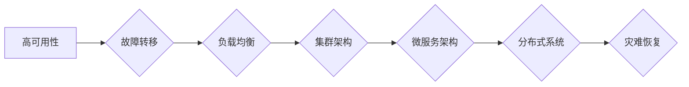

> 关键词：高可用性系统，容错机制，故障转移，负载均衡，集群架构，微服务，分布式系统，灾难恢复，自动运维

# 高可用性系统设计的关键要素

在当今的数字化时代，系统的高可用性（High Availability, HA）成为了企业 IT 架构的核心关注点。高可用性系统意味着系统能够在出现故障时迅速恢复，保证服务的持续可用性。本文将深入探讨高可用性系统设计的关键要素，并提供实际应用场景和未来发展趋势。

## 1. 背景介绍

随着互联网技术的飞速发展，企业对于系统可用性的要求越来越高。高可用性系统不仅能够提升用户体验，还能降低企业的运营成本，增强市场竞争能力。然而，高可用性系统的设计并非易事，需要考虑众多技术挑战和设计原则。

### 1.1 问题的由来

随着业务的快速扩张，系统面临着以下挑战：

- **单点故障**：系统中的某个组件故障可能导致整个系统不可用。
- **性能瓶颈**：随着用户量的增加，系统性能可能出现瓶颈，影响用户体验。
- **数据一致性问题**：在分布式系统中，保持数据一致性是一个难题。
- **灾难恢复**：自然灾害或人为事故可能导致系统长时间中断。

### 1.2 研究现状

目前，高可用性系统设计已成为计算机科学和IT领域的一个重要研究方向。研究者们提出了多种技术和策略，如故障转移、负载均衡、集群架构、微服务架构、分布式系统等，以提高系统的可用性。

### 1.3 研究意义

高可用性系统设计对于企业具有重要意义：

- **提升用户体验**：保证服务的持续可用性，提升用户满意度。
- **降低运营成本**：减少系统故障带来的损失，降低维护成本。
- **增强市场竞争力**：在竞争激烈的市场中，提供可靠的服务是关键优势。

### 1.4 本文结构

本文将分为以下几个部分：

- 核心概念与联系
- 核心算法原理 & 具体操作步骤
- 数学模型和公式 & 详细讲解 & 举例说明
- 项目实践：代码实例和详细解释说明
- 实际应用场景
- 工具和资源推荐
- 总结：未来发展趋势与挑战
- 附录：常见问题与解答

## 2. 核心概念与联系

为了更好地理解高可用性系统设计，我们需要首先了解以下几个核心概念及其相互关系。

### 2.1 核心概念原理

- **高可用性（High Availability）**：指系统在出现故障时能够迅速恢复，保证服务的持续可用性。
- **容错性（Fault Tolerance）**：指系统在出现故障时能够自动或手动切换到备用系统，保证服务的可用性。
- **负载均衡（Load Balancing）**：指将用户请求均匀分配到多个服务器上，提高系统性能和可用性。
- **集群架构（Cluster Architecture）**：指将多个服务器组成一个集群，共同提供服务，提高系统的可用性和扩展性。
- **微服务架构（Microservices Architecture）**：指将一个大型应用拆分为多个小型服务，提高系统的可维护性和扩展性。
- **分布式系统（Distributed System）**：指由多个节点组成的系统，节点之间通过网络进行通信，共同提供服务。
- **灾难恢复（Disaster Recovery）**：指在系统遭受灾难性事件时，能够迅速恢复到正常运行状态。

### 2.2 Mermaid 流程图

以下是一个简单的 Mermaid 流程图，展示了高可用性系统设计中的核心概念及其关系：



## 3. 核心算法原理 & 具体操作步骤

### 3.1 算法原理概述

高可用性系统设计的关键算法包括：

- **故障检测与监控**：通过实时监控系统状态，检测故障并触发相应的恢复机制。
- **故障转移**：在检测到故障时，自动将服务切换到备用节点。
- **负载均衡**：将用户请求均匀分配到多个服务器上，提高系统性能和可用性。
- **数据同步**：在分布式系统中，保证数据的一致性。

### 3.2 算法步骤详解

#### 3.2.1 故障检测与监控

1. **设置监控指标**：根据系统特点，设置合适的监控指标，如CPU利用率、内存使用率、网络带宽等。
2. **实时监控**：使用监控工具实时收集监控指标数据。
3. **异常检测**：根据监控指标数据，检测异常情况，如阈值超限、服务不可达等。
4. **报警通知**：在检测到异常时，向相关人员发送报警通知。

#### 3.2.2 故障转移

1. **配置高可用集群**：将系统部署在多个节点上，形成一个高可用集群。
2. **健康检查**：定期对节点进行健康检查，确保节点可用。
3. **故障检测**：在检测到节点故障时，触发故障转移机制。
4. **服务切换**：将故障节点的服务切换到备用节点，保证服务可用。

#### 3.2.3 负载均衡

1. **选择负载均衡策略**：根据系统特点和需求，选择合适的负载均衡策略，如轮询、最少连接数、IP哈希等。
2. **配置负载均衡器**：在负载均衡器上配置节点信息和服务信息。
3. **请求分发**：将用户请求根据负载均衡策略分发到不同的节点。

#### 3.2.4 数据同步

1. **选择数据同步协议**：根据数据特点和需求，选择合适的数据同步协议，如Raft、Paxos等。
2. **配置数据同步**：在分布式系统中配置数据同步策略，确保数据一致性。
3. **数据复制**：在节点间复制数据，保证数据的一致性。

### 3.3 算法优缺点

- **故障检测与监控**：优点是能够及时发现故障，缺点是可能会误报或漏报。
- **故障转移**：优点是能够快速恢复服务，缺点是可能会引入额外的复杂性。
- **负载均衡**：优点是能够提高系统性能和可用性，缺点是可能会引入额外的延迟。
- **数据同步**：优点是能够保证数据一致性，缺点是可能会影响性能。

### 3.4 算法应用领域

这些算法广泛应用于以下领域：

- **云计算平台**：如阿里云、腾讯云等。
- **数据中心**：如谷歌数据中心、亚马逊数据中心等。
- **金融系统**：如银行、证券、保险等。
- **电子商务**：如淘宝、京东等。

## 4. 数学模型和公式 & 详细讲解 & 举例说明

### 4.1 数学模型构建

高可用性系统的数学模型可以表示为：

$$
HA = f(T, R, F)
$$

其中，$HA$ 表示系统的可用性，$T$ 表示系统正常运行的时间，$R$ 表示系统恢复的时间，$F$ 表示系统故障的概率。

### 4.2 公式推导过程

假设系统在正常情况下运行的概率为 $P(T)$，在出现故障时恢复的概率为 $P(R)$，则系统可用性可以表示为：

$$
HA = P(T) \times P(R) \times (1 - P(F))
$$

### 4.3 案例分析与讲解

以下是一个简单的案例：

假设一个系统正常运行的概率为 0.99，出现故障的概率为 0.01。在出现故障时，系统可以在 10 分钟内恢复。则该系统的可用性为：

$$
HA = 0.99 \times 0.9 \times (1 - 0.01) = 0.891
$$

这意味着该系统每小时可能出现 1 次故障。

## 5. 项目实践：代码实例和详细解释说明

### 5.1 开发环境搭建

由于高可用性系统设计涉及到多个方面，以下将以一个简单的负载均衡器为例进行说明。

#### 5.1.1 环境要求

- 操作系统：Linux
- 编程语言：Python
- 依赖库：Flask

#### 5.1.2 安装依赖

```bash
pip install Flask
```

### 5.2 源代码详细实现

以下是一个简单的负载均衡器实现：

```python
from flask import Flask, request
import requests
from random import choice

app = Flask(__name__)

# 服务器列表
Servers = ["http://server1:5000", "http://server2:5000", "http://server3:5000"]

@app.route('/<path:path>')
def route_to_server(path):
    server = choice(Servers)
    return requests.get(f"{server}/{path}").text

if __name__ == '__main__':
    app.run(host='0.0.0.0', port=80)
```

### 5.3 代码解读与分析

- `Servers` 变量存储了可用的服务器列表。
- `route_to_server` 函数根据请求路径选择一个服务器，并将请求转发到该服务器。
- 使用 Flask 框架实现简单的 Web 服务器。

### 5.4 运行结果展示

将上述代码保存为 `load_balancer.py`，并使用以下命令启动服务：

```bash
python load_balancer.py
```

然后，访问 `http://localhost:80/some/path`，即可看到由负载均衡器分配的服务器响应。

## 6. 实际应用场景

高可用性系统设计在以下场景中具有重要作用：

- **电商平台**：保证订单处理、支付等关键服务的可用性。
- **在线游戏**：保证游戏体验的流畅性和稳定性。
- **金融系统**：保证交易、资金管理等关键服务的可用性。
- **社交媒体**：保证用户发布、评论等关键服务的可用性。

### 6.4 未来应用展望

随着云计算、大数据等技术的发展，高可用性系统设计将面临以下挑战和机遇：

- **云原生应用**：云原生应用对高可用性要求更高，需要设计更加灵活的架构。
- **边缘计算**：边缘计算对延迟和可用性要求更高，需要设计更加高效的网络和计算架构。
- **人工智能**：人工智能应用对实时性和可靠性要求更高，需要设计更加智能化的系统。

## 7. 工具和资源推荐

### 7.1 学习资源推荐

- 《高可用架构：构建弹性、可靠、可伸缩的分布式系统》
- 《大规模分布式存储系统：原理与实现》
- 《分布式系统原理与范型》

### 7.2 开发工具推荐

- **监控工具**：Prometheus、Grafana
- **故障转移工具**：Keepalived、Nginx
- **负载均衡工具**：HAProxy、Nginx
- **分布式存储**：Cassandra、MongoDB

### 7.3 相关论文推荐

- **《High Availability in the Internet Age》**：介绍了高可用性系统的设计和实现。
- **《Designing Data-Intensive Applications》**：介绍了分布式系统设计和实现。
- **《The Art of Multiprocessor Programming》**：介绍了多处理器编程和并发控制。

## 8. 总结：未来发展趋势与挑战

### 8.1 研究成果总结

本文全面介绍了高可用性系统设计的关键要素，包括核心概念、算法原理、实际应用场景等。通过实例分析和代码实现，帮助读者更好地理解和应用高可用性系统设计。

### 8.2 未来发展趋势

- **云原生应用**：云原生应用将推动高可用性系统设计向更加灵活、可扩展的方向发展。
- **边缘计算**：边缘计算将推动高可用性系统设计向更加高效、低延迟的方向发展。
- **人工智能**：人工智能将推动高可用性系统设计向更加智能化、自动化的方向发展。

### 8.3 面临的挑战

- **安全性和可靠性**：随着系统复杂性的增加，安全性和可靠性将成为更大的挑战。
- **成本控制**：高可用性系统设计需要投入大量的资源和成本，如何控制成本是一个重要问题。
- **技术人才**：高可用性系统设计需要大量的技术人才，如何吸引和培养人才是一个挑战。

### 8.4 研究展望

未来，高可用性系统设计的研究将主要集中在以下几个方面：

- **安全性和可靠性**：研究更加安全可靠的高可用性系统设计方法。
- **成本控制**：研究更加经济高效的高可用性系统设计方案。
- **技术创新**：研究更加先进的高可用性系统设计技术，如人工智能、区块链等。

## 9. 附录：常见问题与解答

**Q1：什么是高可用性系统？**

A：高可用性系统是指系统能够在出现故障时迅速恢复，保证服务的持续可用性。

**Q2：高可用性系统设计的关键要素有哪些？**

A：高可用性系统设计的关键要素包括容错机制、故障转移、负载均衡、集群架构、微服务架构、分布式系统、灾难恢复和自动运维。

**Q3：如何提高系统的高可用性？**

A：提高系统高可用性的方法包括：

- 设计冗余的硬件和软件架构。
- 使用负载均衡技术。
- 实现故障转移机制。
- 使用监控工具实时监控系统状态。
- 定期进行灾难恢复演练。

**Q4：高可用性系统设计有哪些挑战？**

A：高可用性系统设计的挑战包括：

- 系统复杂度增加，设计难度加大。
- 需要投入大量资源，成本较高。
- 技术人才短缺，难以招聘和培养。
- 安全性和可靠性问题。

**Q5：高可用性系统设计在哪些场景中应用？**

A：高可用性系统设计在以下场景中应用：

- 电商平台
- 在线游戏
- 金融系统
- 社交媒体

作者：禅与计算机程序设计艺术 / Zen and the Art of Computer Programming