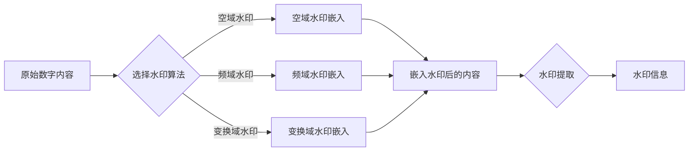

# Watermark 原理与代码实例讲解

> 关键词：数字水印，版权保护，数据隐藏，图像处理，加密技术，Python实现

## 1. 背景介绍

随着数字时代的到来，数字内容的版权保护变得日益重要。数字水印技术作为一种有效的版权保护手段，能够在不影响原始内容质量和使用的前提下，将版权信息嵌入到数字作品中。本文将深入探讨数字水印的原理，并提供Python代码实例，帮助读者理解和实现数字水印技术。

### 1.1 问题的由来

数字内容的易复制性使得原创者的权益难以得到保障。传统的物理载体如书籍、画作等，可以通过法律手段进行版权保护，但数字内容的复制和传播却难以控制。为了解决这个问题，数字水印技术被提出，通过在数字内容中嵌入不可见的标识，实现对内容的追踪和保护。

### 1.2 研究现状

数字水印技术已经发展多年，根据嵌入方法的不同，主要分为以下几种类型：

- **空域水印**：直接在图像的像素值上嵌入水印信息。
- **频域水印**：利用图像的频率域特性嵌入水印。
- **变换域水印**：利用图像的变换域特性嵌入水印，如DCT域、DFT域等。

### 1.3 研究意义

数字水印技术对于版权保护、数据安全和隐私保护具有重要意义。它不仅可以防止数字内容的非法复制和传播，还可以追踪侵权行为，保护创作者的合法权益。

### 1.4 本文结构

本文将首先介绍数字水印的核心概念和原理，然后通过Mermaid流程图展示其架构，接着深入讲解核心算法原理和操作步骤，并通过Python代码实例进行详细解释说明。最后，本文将探讨数字水印的实际应用场景和未来发展趋势。

## 2. 核心概念与联系

### 2.1 核心概念

- **数字水印**：将版权信息或标识嵌入到数字内容中的技术。
- **水印嵌入**：将水印信息嵌入到数字内容中的过程。
- **水印提取**：从数字内容中提取水印信息的过程。
- **鲁棒性**：水印在经过多种变换（如压缩、剪切等）后仍能被有效提取的能力。

### 2.2 Mermaid流程图



## 3. 核心算法原理 & 具体操作步骤

### 3.1 算法原理概述

数字水印的嵌入和提取过程通常包括以下几个步骤：

1. **水印生成**：生成或选择要嵌入的水印信息。
2. **水印嵌入**：将水印信息嵌入到数字内容中。
3. **水印提取**：从数字内容中提取水印信息。
4. **水印验证**：验证提取的水印信息是否与原始水印一致。

### 3.2 算法步骤详解

#### 空域水印嵌入

1. 选择水印信息，如版权信息或标识。
2. 将水印信息转换为二值图像。
3. 在数字内容的像素值上嵌入水印信息，可以通过改变像素值、增加噪声等方式实现。
4. 对嵌入水印的图像进行反混淆处理，恢复图像质量。

#### 频域水印嵌入

1. 将数字内容转换为频域表示，如DCT域或DFT域。
2. 在频域上嵌入水印信息，可以通过修改频域系数实现。
3. 将修改后的频域系数反变换回时域，得到嵌入水印的数字内容。

#### 变换域水印嵌入

1. 将数字内容转换为变换域表示，如DWT域。
2. 在变换域上嵌入水印信息。
3. 将修改后的变换域系数反变换回时域，得到嵌入水印的数字内容。

### 3.3 算法优缺点

- **空域水印**：简单易实现，但鲁棒性较差，容易受到图像压缩、剪切等操作的影响。
- **频域水印**：鲁棒性较好，但计算复杂度较高。
- **变换域水印**：兼具空域和频域水印的优点，但计算复杂度较高。

### 3.4 算法应用领域

数字水印技术广泛应用于图像、视频、音频等多媒体内容中，以及文档、数据文件等领域。

## 4. 数学模型和公式 & 详细讲解 & 举例说明

### 4.1 数学模型构建

以下是一个简单的空域水印嵌入的数学模型：

$$
I_{watermarked} = I + W
$$

其中，$I$ 为原始图像，$W$ 为水印图像，$I_{watermarked}$ 为嵌入水印后的图像。

### 4.2 公式推导过程

以灰度图像为例，水印嵌入可以通过修改图像的像素值实现：

$$
I_{watermarked}(x, y) = \begin{cases} 
I(x, y) + W(x, y) & \text{if } I(x, y) + W(x, y) \leq 255 \\
255 & \text{if } I(x, y) + W(x, y) > 255 \\
I(x, y) - (W(x, y) - 255) & \text{if } I(x, y) + W(x, y) < 0 
\end{cases}
$$

### 4.3 案例分析与讲解

以下是一个使用Python实现的空域水印嵌入的代码实例：

```python
import cv2
import numpy as np

def watermark_image(input_image_path, watermark_image_path, output_image_path, alpha=0.5):
    # 读取原始图像和水印图像
    input_image = cv2.imread(input_image_path, cv2.IMREAD_GRAYSCALE)
    watermark = cv2.imread(watermark_image_path, cv2.IMREAD_GRAYSCALE)

    # 计算水印嵌入系数
    alpha = max(0, min(1, alpha))

    # 嵌入水印
    output_image = input_image + alpha * watermark

    # 保存嵌入水印后的图像
    cv2.imwrite(output_image_path, output_image)

# 使用示例
watermark_image('input.jpg', 'watermark.png', 'output.jpg', alpha=0.2)
```

## 5. 项目实践：代码实例和详细解释说明

### 5.1 开发环境搭建

要实现数字水印，需要以下Python库：

- OpenCV：用于图像处理。
- NumPy：用于数值计算。

可以使用pip命令安装这些库：

```bash
pip install opencv-python numpy
```

### 5.2 源代码详细实现

以下是一个简单的变换域水印嵌入的代码实例：

```python
import cv2
import numpy as np

def dct2(x):
    return cv2.dct(np.float32(x))

def idct2(x):
    return cv2.idct(np.float32(x))

def watermark_dct(input_image_path, watermark_image_path, output_image_path, alpha=0.05):
    # 读取原始图像和水印图像
    input_image = cv2.imread(input_image_path, cv2.IMREAD_GRAYSCALE)
    watermark = cv2.imread(watermark_image_path, cv2.IMREAD_GRAYSCALE)

    # 对图像进行DCT变换
    dct_image = dct2(input_image)

    # 对水印进行DCT变换
    dct_watermark = dct2(watermark)

    # 嵌入水印
    dct_image += alpha * dct_watermark

    # 反DCT变换，得到嵌入水印的图像
    output_image = idct2(dct_image)

    # 保存嵌入水印后的图像
    cv2.imwrite(output_image_path, np.uint8(output_image))

# 使用示例
watermark_dct('input.jpg', 'watermark.png', 'output.jpg', alpha=0.05)
```

### 5.3 代码解读与分析

上述代码首先读取原始图像和水印图像，然后对它们进行DCT变换。接着，在DCT域上对原始图像的系数进行修改，实现水印的嵌入。最后，通过反DCT变换得到嵌入水印后的图像，并将其保存到指定路径。

### 5.4 运行结果展示

运行上述代码后，将在指定路径生成嵌入水印后的图像，通过视觉观察可以明显看出水印的存在。

## 6. 实际应用场景

数字水印技术在实际应用中非常广泛，以下是一些常见的应用场景：

- **版权保护**：在数字图像、音频、视频等多媒体内容中嵌入版权信息，防止非法复制和传播。
- **源追踪**：通过提取水印信息，追踪数字内容的来源和传播路径。
- **数据加密**：将加密信息嵌入到数字内容中，实现数据加密传输和存储。
- **数字货币**：在数字货币中嵌入水印，实现货币追踪和防伪。

## 7. 工具和资源推荐

### 7.1 学习资源推荐

- **《数字水印技术》**：详细介绍数字水印的理论、技术和应用。
- **《数字水印算法设计与实现》**：深入讲解数字水印算法的设计和实现。
- **OpenCV官方文档**：提供丰富的图像处理函数和示例代码。

### 7.2 开发工具推荐

- **Python**：强大的编程语言，支持丰富的图像处理和数值计算库。
- **OpenCV**：开源的计算机视觉库，提供丰富的图像处理和计算机视觉算法。
- **NumPy**：开源的数值计算库，提供高效的数组操作和矩阵运算功能。

### 7.3 相关论文推荐

- **"Digital Watermarking Techniques for Image Authentication and Copyright Protection"**：综述了数字水印技术的各种方法。
- **"A Survey of Watermarking Techniques in Digital Images"**：介绍了数字图像水印的各种方法。

## 8. 总结：未来发展趋势与挑战

### 8.1 研究成果总结

本文深入探讨了数字水印的原理、算法和实现，并通过Python代码实例展示了水印嵌入和提取的过程。数字水印技术在版权保护、数据安全和隐私保护等方面具有重要意义。

### 8.2 未来发展趋势

随着技术的不断发展，数字水印技术将呈现以下发展趋势：

- **更高级的嵌入算法**：提高水印的鲁棒性和不可见性。
- **多模态水印**：将水印嵌入到图像、音频、视频等多模态数据中。
- **基于人工智能的水印**：利用深度学习技术提高水印的嵌入和提取效果。

### 8.3 面临的挑战

数字水印技术在实际应用中仍面临以下挑战：

- **鲁棒性**：提高水印的鲁棒性，使其能够抵御各种攻击和篡改。
- **不可见性**：提高水印的不可见性，使其不影响数字内容的使用。
- **安全性**：保证水印的安全性，防止被恶意攻击和破解。

### 8.4 研究展望

未来，数字水印技术将朝着更加智能化、高效化和安全化的方向发展。随着技术的不断进步，数字水印技术将在版权保护、数据安全和隐私保护等方面发挥越来越重要的作用。

## 9. 附录：常见问题与解答

**Q1：数字水印技术有哪些类型？**

A：数字水印技术主要分为空域水印、频域水印和变换域水印三种类型。

**Q2：如何选择合适的水印算法？**

A：选择水印算法需要考虑多种因素，如嵌入效果、鲁棒性、计算复杂度等。通常需要根据具体的应用场景和需求进行选择。

**Q3：数字水印技术有哪些应用场景？**

A：数字水印技术广泛应用于版权保护、源追踪、数据加密、数字货币等领域。

**Q4：如何提高数字水印的鲁棒性？**

A：提高数字水印的鲁棒性可以通过以下方法实现：

- 采用更加复杂的水印嵌入算法。
- 使用多种水印嵌入技术，如空域、频域和变换域。
- 结合加密技术，保护水印信息的安全性。

**Q5：数字水印技术有哪些挑战？**

A：数字水印技术面临的挑战主要包括鲁棒性、不可见性和安全性等方面。

作者：禅与计算机程序设计艺术 / Zen and the Art of Computer Programming