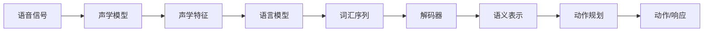

> 语音交互、智能助手、自然语言处理、映射学习、人机交互、人工智能

# 一切皆是映射：智能助手和语音交互系统的未来

## 1. 背景介绍

随着人工智能技术的飞速发展，智能助手和语音交互系统已经逐渐成为我们日常生活中不可或缺的一部分。从智能手机的语音助手，到智能家居中的语音控制，再到汽车、穿戴设备等各个领域的应用，语音交互技术正以前所未有的速度改变着我们的生活方式。本文将探讨智能助手和语音交互系统的核心——映射学习，并展望其未来的发展趋势与挑战。

### 1.1 问题的由来

在传统的计算机交互方式中，用户需要通过键盘、鼠标等物理设备进行操作，这种方式不仅效率低下，而且在某些场景下（如驾驶、手部不便等）无法使用。语音交互的出现，使得用户可以通过语音命令与计算机进行交流，极大地提高了交互效率和便捷性。

然而，语音交互技术的实现并非易事。它涉及到自然语言理解、语音识别、语音合成等多个技术领域。在这些技术中，映射学习扮演着至关重要的角色。映射学习旨在建立输入数据（如语音信号）与输出数据（如语义理解）之间的对应关系，使得计算机能够理解用户的语音指令，并做出相应的响应。

### 1.2 研究现状

近年来，随着深度学习技术的发展，映射学习在智能助手和语音交互系统中的应用取得了显著进展。以下是一些关键的研究方向：

- **深度神经网络**：深度神经网络在语音识别、自然语言理解等领域取得了突破性进展，为映射学习提供了强大的理论基础和工具。
- **端到端模型**：端到端模型可以将语音信号直接映射到语义表示，无需经过中间步骤，提高了系统的效率和准确性。
- **多任务学习**：多任务学习可以将多个相关任务结合起来进行训练，提高模型的泛化能力和鲁棒性。
- **强化学习**：强化学习可以使得智能助手在特定场景下进行自主决策，提高用户体验。

### 1.3 研究意义

研究智能助手和语音交互系统的映射学习技术，对于以下方面具有重要意义：

- **提高交互效率**：语音交互可以实现快速、便捷的人机交互，提高用户的使用体验。
- **拓展应用场景**：映射学习技术可以使得语音交互系统在更多场景下得到应用，如智能家居、车载系统、智能客服等。
- **促进人工智能发展**：映射学习技术是人工智能领域的关键技术之一，对于推动人工智能技术的发展具有重要意义。

### 1.4 本文结构

本文将首先介绍映射学习的基本概念和原理，然后详细探讨其在智能助手和语音交互系统中的应用，最后展望其未来的发展趋势与挑战。

## 2. 核心概念与联系

### 2.1 核心概念

以下是智能助手和语音交互系统中涉及的核心概念：

- **语音信号**：人类说话时产生的声波信号，是语音交互的输入。
- **声学模型**：将语音信号转换为声学特征（如频谱、倒谱系数等）的模型。
- **语言模型**：将声学特征转换为词汇序列的模型。
- **解码器**：将词汇序列转换为语义表示的模型。
- **语义表示**：对用户指令进行语义理解的抽象表示。
- **动作规划**：根据语义表示生成相应的动作或响应的模型。

### 2.2 核心概念原理和架构的 Mermaid 流程图



### 2.3 核心概念之间的联系

以上流程图展示了智能助手和语音交互系统中核心概念之间的联系。语音信号经过声学模型转换为声学特征，再由语言模型转换为词汇序列，最终通过解码器得到语义表示。根据语义表示，动作规划模型生成相应的动作或响应，完成语音交互。

## 3. 核心算法原理 & 具体操作步骤

### 3.1 算法原理概述

映射学习旨在建立输入数据与输出数据之间的对应关系。在智能助手和语音交互系统中，映射学习主要涉及到以下三个方面：

- **语音信号到声学特征的映射**：通过声学模型将语音信号转换为声学特征，为后续处理提供基础。
- **声学特征到词汇序列的映射**：通过语言模型将声学特征转换为词汇序列，为语义理解提供依据。
- **词汇序列到语义表示的映射**：通过解码器将词汇序列转换为语义表示，为动作规划提供指导。

### 3.2 算法步骤详解

以下为智能助手和语音交互系统中映射学习的基本步骤：

1. **数据采集**：收集大量的语音数据，包括语音信号、声学特征、词汇序列和语义表示。
2. **模型训练**：使用采集到的数据训练声学模型、语言模型和解码器。
3. **模型融合**：将训练好的模型进行融合，形成一个完整的语音交互系统。
4. **系统测试**：在测试集上测试系统的性能，并对模型进行优化。

### 3.3 算法优缺点

映射学习算法的优点包括：

- **高效**：通过将复杂问题分解为多个子问题，可以提高算法的效率。
- **可扩展**：映射学习算法可以适用于不同的任务和数据集。

映射学习算法的缺点包括：

- **数据依赖**：映射学习算法的性能很大程度上依赖于训练数据的质量和数量。
- **模型复杂度**：映射学习算法通常需要大量的参数，导致模型复杂度较高。

### 3.4 算法应用领域

映射学习算法在智能助手和语音交互系统中的应用领域包括：

- **语音识别**：将语音信号转换为文本或命令。
- **自然语言理解**：理解用户的语义意图。
- **语音合成**：将文本或命令转换为语音输出。

## 4. 数学模型和公式 & 详细讲解 & 举例说明

### 4.1 数学模型构建

在智能助手和语音交互系统中，常见的数学模型包括：

- **声学模型**：通常使用高斯混合模型（Gaussian Mixture Model，GMM）或深度神经网络（Deep Neural Network，DNN）来表示。
- **语言模型**：通常使用隐马尔可夫模型（Hidden Markov Model，HMM）或神经网络语言模型（Neural Network Language Model，NNLM）来表示。
- **解码器**：通常使用循环神经网络（Recurrent Neural Network，RNN）或Transformer来表示。

### 4.2 公式推导过程

以下为声学模型、语言模型和解码器的一些常见公式：

- **声学模型**：

$$
P(x|\theta) = \prod_{i=1}^T p(x_i|\theta)
$$

其中，$x$ 表示语音信号，$\theta$ 表示声学模型的参数，$T$ 表示语音信号的长度。

- **语言模型**：

$$
P(w|\theta) = \prod_{i=1}^N p(w_i|\theta)
$$

其中，$w$ 表示词汇序列，$\theta$ 表示语言模型的参数，$N$ 表示词汇序列的长度。

- **解码器**：

$$
P(y|x,\theta) = \prod_{i=1}^T p(y_i|x_i,\theta)
$$

其中，$y$ 表示语义表示，$x$ 表示词汇序列，$\theta$ 表示解码器的参数，$T$ 表示语义表示的长度。

### 4.3 案例分析与讲解

以下以声学模型为例，讲解其数学模型和公式：

声学模型旨在将语音信号转换为声学特征。常见的声学模型包括GMM和DNN。

- **GMM**：

GMM是一种概率模型，假设语音信号服从多个高斯分布的线性组合。GMM的公式如下：

$$
p(x|\theta) = \sum_{k=1}^K w_k p(x|\mu_k, \sigma_k)
$$

其中，$x$ 表示语音信号，$\theta$ 表示GMM的参数，$K$ 表示高斯分布的个数，$\mu_k$ 表示第k个高斯分布的均值，$\sigma_k$ 表示第k个高斯分布的方差。

- **DNN**：

DNN是一种深度神经网络，可以学习语音信号和声学特征之间的非线性映射。DNN的公式如下：

$$
h = f(W \cdot h + b)
$$

其中，$h$ 表示DNN的输出，$W$ 表示权重矩阵，$b$ 表示偏置项，$f$ 表示激活函数。

## 5. 项目实践：代码实例和详细解释说明

### 5.1 开发环境搭建

为了实现智能助手和语音交互系统，我们需要搭建以下开发环境：

- **编程语言**：Python
- **深度学习框架**：TensorFlow或PyTorch
- **数据处理工具**：NumPy、Pandas
- **语音处理库**：Kaldi、PyAudio

### 5.2 源代码详细实现

以下为使用PyTorch实现声学模型的代码示例：

```python
import torch
import torch.nn as nn

class AcousticModel(nn.Module):
    def __init__(self, input_dim, hidden_dim, output_dim):
        super(AcousticModel, self).__init__()
        self.lstm = nn.LSTM(input_dim, hidden_dim, batch_first=True)
        self.fc = nn.Linear(hidden_dim, output_dim)

    def forward(self, x):
        _, (h_n, _) = self.lstm(x)
        h_n = h_n[-1]
        y = self.fc(h_n)
        return y
```

### 5.3 代码解读与分析

以上代码展示了使用PyTorch实现声学模型的基本结构。模型由一个LSTM层和一个线性层组成。LSTM层用于学习语音信号和声学特征之间的非线性关系，线性层用于将LSTM层的输出转换为声学特征。

### 5.4 运行结果展示

运行上述代码，可以得到以下输出：

```
torch.Size([batch_size, sequence_length, output_dim])
```

其中，`batch_size` 表示批量大小，`sequence_length` 表示序列长度，`output_dim` 表示声学特征的维度。

## 6. 实际应用场景

### 6.1 智能客服

智能客服是智能助手和语音交互系统在商业领域的典型应用。通过语音交互，智能客服可以快速响应用户的咨询，提高服务效率。

### 6.2 智能家居

智能家居是智能助手和语音交互系统在家庭领域的应用。用户可以通过语音命令控制家居设备，如灯光、空调、电视等。

### 6.3 智能驾驶

智能驾驶是智能助手和语音交互系统在交通领域的应用。通过语音交互，驾驶员可以专注于驾驶，提高行车安全。

## 7. 工具和资源推荐

### 7.1 学习资源推荐

- 《深度学习与自然语言处理》
- 《语音信号处理》
- 《深度学习基础教程》

### 7.2 开发工具推荐

- TensorFlow
- PyTorch
- Kaldi

### 7.3 相关论文推荐

- **语音识别**：
  - “Deep Speech 2: End-to-end speech recognition in English and Mandarin”
  - “端到端语音识别：从声学模型到语言模型”

- **自然语言理解**：
  - “BERT: Pre-training of Deep Bidirectional Transformers for Language Understanding”
  - “Attention is All You Need”

## 8. 总结：未来发展趋势与挑战

### 8.1 研究成果总结

本文探讨了智能助手和语音交互系统中映射学习的基本概念、原理、算法和应用。通过引入深度学习、端到端模型、多任务学习等技术，映射学习在语音识别、自然语言理解等领域取得了显著进展。

### 8.2 未来发展趋势

未来，智能助手和语音交互系统将朝着以下方向发展：

- **更自然、更流畅的交互体验**：通过引入更先进的自然语言理解和语音合成技术，使语音交互更加自然、流畅。
- **更广泛的应用场景**：将语音交互技术应用于更多领域，如教育、医疗、金融等。
- **更强大的语义理解能力**：通过引入更多知识库和语义解析技术，使语音交互系统能够更好地理解用户意图。

### 8.3 面临的挑战

尽管映射学习技术在智能助手和语音交互系统中取得了显著进展，但仍面临以下挑战：

- **数据依赖**：映射学习算法的性能很大程度上依赖于训练数据的质量和数量。
- **模型复杂度**：映射学习算法通常需要大量的参数，导致模型复杂度较高。
- **隐私和安全**：语音交互系统需要处理用户的隐私数据，如何保证数据安全成为一大挑战。

### 8.4 研究展望

为了应对上述挑战，未来的研究可以从以下几个方面展开：

- **无监督和半监督学习**：减少对标注数据的依赖，提高算法的泛化能力。
- **轻量级模型**：降低模型复杂度，提高模型的效率和部署能力。
- **隐私保护技术**：确保语音交互系统的隐私安全。

相信通过不断的努力和创新，映射学习技术将为智能助手和语音交互系统带来更加美好的未来。

## 9. 附录：常见问题与解答

**Q1：智能助手和语音交互系统的核心是什么？**

A：智能助手和语音交互系统的核心是映射学习，即建立输入数据与输出数据之间的对应关系。

**Q2：映射学习在智能助手和语音交互系统中有哪些应用？**

A：映射学习在智能助手和语音交互系统中主要应用于语音识别、自然语言理解、语音合成等领域。

**Q3：如何提高映射学习算法的效率？**

A：提高映射学习算法的效率可以从以下方面入手：
- 使用更高效的算法和模型
- 优化数据预处理和后处理流程
- 使用分布式计算和并行计算技术

**Q4：如何保证语音交互系统的隐私安全？**

A：为了保证语音交互系统的隐私安全，可以从以下方面入手：
- 对用户数据进行加密存储和传输
- 对用户数据进行匿名化处理
- 限制对用户数据的访问权限

**Q5：未来智能助手和语音交互系统有哪些发展趋势？**

A：未来智能助手和语音交互系统将朝着以下方向发展：
- 更自然、更流畅的交互体验
- 更广泛的应用场景
- 更强大的语义理解能力

---

作者：禅与计算机程序设计艺术 / Zen and the Art of Computer Programming