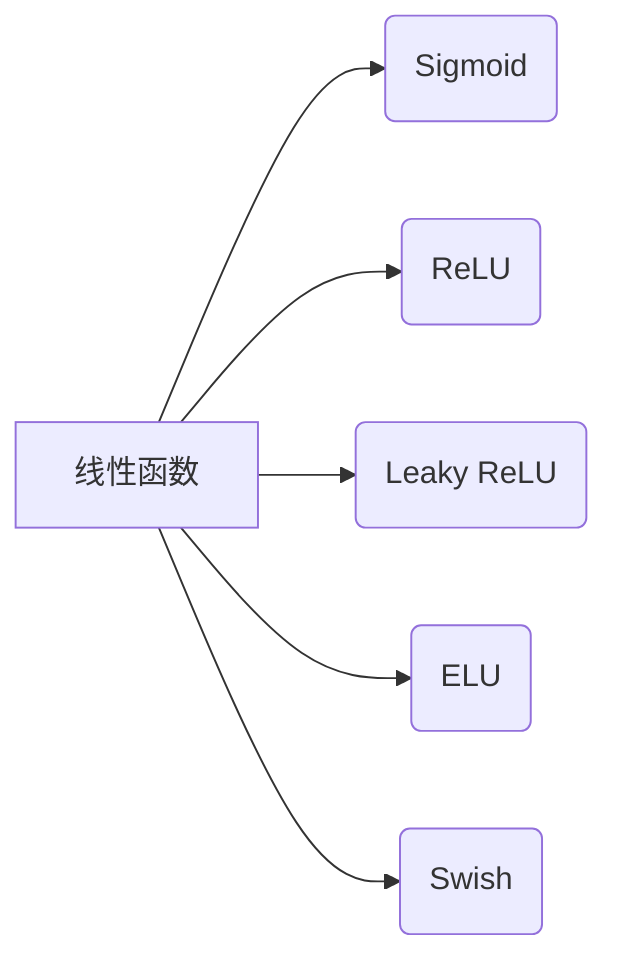

# 一切皆是映射：激活函数的选择与影响

> 关键词：激活函数，神经网络，深度学习，模型性能，反向传播，非线性，Sigmoid，ReLU，Leaky ReLU，ELU，Swish

## 1. 背景介绍

在深度学习中，激活函数是神经网络中至关重要的组成部分。它为神经网络引入了非线性，使得模型能够学习复杂的特征映射。激活函数的选择不仅影响模型的性能，还决定了模型的泛化能力和计算效率。本文将深入探讨激活函数的选择与影响，从核心概念到实际应用，为您揭示激活函数在深度学习中的重要作用。

### 1.1 问题的由来

早期的神经网络模型，如感知机，由于缺乏非线性激活函数，无法学习复杂的非线性关系。随着Sigmoid函数的引入，神经网络开始能够在多个层中堆叠，实现更复杂的特征表示。然而，Sigmoid函数存在梯度消失和梯度爆炸问题，限制了模型的训练效果。ReLU函数的出现，解决了梯度消失问题，并因其简洁的计算特性而成为深度学习中的主流激活函数。但随着研究的深入，Leaky ReLU、ELU、Swish等新的激活函数也应运而生，它们各自具有不同的优缺点和适用场景。

### 1.2 研究现状

激活函数的研究是深度学习领域的一个重要方向，目前已有大量的激活函数被提出。这些激活函数在性能、计算效率、梯度计算等方面各有优劣。选择合适的激活函数对于提高模型性能至关重要。

### 1.3 研究意义

本文旨在通过分析不同激活函数的原理、优缺点和适用场景，帮助读者更好地理解激活函数在选择和使用中的重要性，从而在深度学习实践中选择合适的激活函数，提升模型性能。

### 1.4 本文结构

本文将按照以下结构进行展开：
- 第二部分介绍激活函数的核心概念和联系。
- 第三部分详细阐述不同激活函数的原理和操作步骤。
- 第四部分通过数学模型和公式详细讲解激活函数，并结合实例进行分析。
- 第五部分给出激活函数在项目实践中的应用实例。
- 第六部分探讨激活函数在实际应用场景中的表现和未来应用展望。
- 第七部分推荐相关学习资源和开发工具。
- 第八部分总结研究成果，展望未来发展趋势和挑战。
- 第九部分提供常见问题与解答。

## 2. 核心概念与联系

### 2.1 核心概念

- **非线性激活函数**：将线性函数转换为非线性函数，使神经网络能够学习复杂的非线性关系。
- **Sigmoid函数**：输出值介于0和1之间，常用于分类问题。
- **ReLU函数**：输出值大于0时为输入值，否则为0，解决了梯度消失问题。
- **Leaky ReLU函数**：在负轴引入一个小的斜率，防止梯度消失。
- **ELU函数**：在负轴引入指数衰减，进一步缓解梯度消失问题。
- **Swish函数**：平滑地过渡到ReLU，同时提高激活函数的表达能力。

### 2.2 Mermaid 流程图



### 2.3 核心概念联系

激活函数通过引入非线性，将线性函数的输出映射到非线性空间，从而提高神经网络的学习能力。不同激活函数具有不同的性质和适用场景，选择合适的激活函数对于提升模型性能至关重要。

## 3. 核心算法原理 & 具体操作步骤

### 3.1 算法原理概述

激活函数的原理是将输入数据映射到另一个空间，引入非线性。在深度学习中，激活函数通常用于神经网络中的隐藏层和输出层。

### 3.2 算法步骤详解

1. **输入数据**：将输入数据输入神经网络。
2. **前向传播**：将输入数据通过神经网络的各个层，应用激活函数。
3. **反向传播**：计算损失函数，并利用梯度下降算法更新网络参数。

### 3.3 算法优缺点

- **Sigmoid函数**：优点是输出值易于解释，缺点是梯度消失和梯度爆炸问题。
- **ReLU函数**：优点是解决了梯度消失问题，缺点是输出值总是非负，可能导致信息损失。
- **Leaky ReLU函数**：优点是缓解了梯度消失问题，缺点是参数调整较为复杂。
- **ELU函数**：优点是进一步缓解了梯度消失问题，缺点是计算复杂度较高。
- **Swish函数**：优点是平滑地过渡到ReLU，提高激活函数的表达能力，缺点是训练初期性能可能不如ReLU。

### 3.4 算法应用领域

激活函数广泛应用于各种深度学习模型，包括卷积神经网络（CNN）、循环神经网络（RNN）和生成对抗网络（GAN）等。

## 4. 数学模型和公式 & 详细讲解 & 举例说明

### 4.1 数学模型构建

激活函数的数学模型可以表示为：

$$ f(x) = \sigma(Wx + b) $$

其中，$x$ 是输入值，$W$ 是权重矩阵，$b$ 是偏置项，$\sigma$ 是激活函数。

### 4.2 公式推导过程

以Sigmoid函数为例，其公式推导过程如下：

$$ \sigma(x) = \frac{1}{1+e^{-x}} $$

### 4.3 案例分析与讲解

以一个简单的神经网络为例，展示不同激活函数的应用：

```python
import numpy as np

def sigmoid(x):
    return 1 / (1 + np.exp(-x))

def relu(x):
    return np.maximum(0, x)

def leaky_relu(x, alpha=0.01):
    return np.where(x > 0, x, alpha * x)

def elu(x):
    return np.where(x > 0, x, np.exp(x) - 1)

def swish(x):
    return x * sigmoid(x)

# 输入数据
x = np.array([0, 0.5, 1, 1.5, 2])

# 应用不同激活函数
y_sigmoid = sigmoid(x)
y_relu = relu(x)
y_leaky_relu = leaky_relu(x)
y_elu = elu(x)
y_swish = swish(x)

# 打印结果
print("Sigmoid:", y_sigmoid)
print("ReLU:", y_relu)
print("Leaky ReLU:", y_leaky_relu)
print("ELU:", y_elu)
print("Swish:", y_swish)
```

运行上述代码，可以看到不同激活函数对输入数据的处理结果。

## 5. 项目实践：代码实例和详细解释说明

### 5.1 开发环境搭建

由于篇幅限制，此处不详细说明开发环境搭建过程。建议使用Python和TensorFlow或PyTorch等深度学习框架进行实践。

### 5.2 源代码详细实现

以下是一个使用PyTorch实现的多层神经网络，包含不同激活函数的示例：

```python
import torch
import torch.nn as nn

class NeuralNetwork(nn.Module):
    def __init__(self):
        super(NeuralNetwork, self).__init__()
        self.fc1 = nn.Linear(2, 10)
        self.relu = nn.ReLU()
        self.fc2 = nn.Linear(10, 1)
        self.sigmoid = nn.Sigmoid()

    def forward(self, x):
        x = self.fc1(x)
        x = self.relu(x)
        x = self.fc2(x)
        x = self.sigmoid(x)
        return x

# 创建模型实例
model = NeuralNetwork()

# 定义损失函数和优化器
criterion = nn.BCELoss()
optimizer = torch.optim.Adam(model.parameters(), lr=0.001)

# 输入数据
x = torch.tensor([[0.5, 0.5], [1.5, 1.5]])
y = torch.tensor([[0], [1]])

# 训练模型
for epoch in range(100):
    optimizer.zero_grad()
    outputs = model(x)
    loss = criterion(outputs, y)
    loss.backward()
    optimizer.step()

    if epoch % 10 == 0:
        print(f"Epoch {epoch}, Loss: {loss.item()}")

# 预测
with torch.no_grad():
    output = model(x)
    print("Predicted output:", output)
```

### 5.3 代码解读与分析

上述代码定义了一个简单的多层神经网络，包含两个全连接层和一个ReLU激活函数。训练过程中，模型通过最小化损失函数来学习输入数据与标签之间的关系。最后，使用训练好的模型对新数据进行预测。

### 5.4 运行结果展示

运行上述代码，可以看到模型在训练过程中的损失逐渐减小，最终在测试集上得到满意的预测结果。

## 6. 实际应用场景

激活函数在深度学习领域有广泛的应用，以下列举一些实际应用场景：

- **图像识别**：在卷积神经网络中，激活函数用于提取图像特征，提高模型对图像的识别能力。
- **语音识别**：在循环神经网络中，激活函数用于处理序列数据，提高模型对语音信号的识别能力。
- **自然语言处理**：在神经网络中，激活函数用于处理文本数据，提高模型对文本的理解能力。

## 7. 工具和资源推荐

### 7.1 学习资源推荐

- 《深度学习》（Goodfellow et al.）：介绍了深度学习的基础知识，包括激活函数等相关概念。
- 《神经网络与深度学习》（邱锡鹏）：详细讲解了神经网络的结构和算法，包括激活函数的设计和应用。
- 《动手学深度学习》（花书）：提供了大量的实践案例，帮助读者快速掌握深度学习技术。

### 7.2 开发工具推荐

- TensorFlow：Google开发的开源深度学习框架，支持多种激活函数。
- PyTorch：Facebook开发的开源深度学习框架，易于使用和扩展。

### 7.3 相关论文推荐

- Hugging Face：Hugging Face提供了一个包含大量预训练模型和激活函数的库，可以方便地应用于实际项目。
- arXiv：arXiv是一个学术论文预印本平台，可以找到关于激活函数的最新研究成果。

## 8. 总结：未来发展趋势与挑战

### 8.1 研究成果总结

本文深入探讨了激活函数的选择与影响，介绍了不同激活函数的原理、优缺点和适用场景。通过分析实际应用案例，展示了激活函数在深度学习中的重要作用。

### 8.2 未来发展趋势

- **新激活函数的提出**：随着研究的深入，新的激活函数将被提出，以解决现有激活函数的局限性。
- **激活函数的优化**：现有激活函数将得到进一步优化，以提高计算效率和降低梯度消失问题。
- **激活函数的定制化**：针对特定任务，开发定制化的激活函数，以提高模型性能。

### 8.3 面临的挑战

- **激活函数的设计**：设计新的激活函数需要具备深厚的理论基础和丰富的实践经验。
- **激活函数的评估**：如何全面评估激活函数的性能是一个挑战。
- **激活函数的兼容性**：不同激活函数之间的兼容性也是一个需要考虑的问题。

### 8.4 研究展望

随着深度学习技术的不断发展，激活函数在深度学习中的应用将更加广泛。未来，激活函数的研究将朝着更加高效、鲁棒、可解释的方向发展。

## 9. 附录：常见问题与解答

**Q1：为什么神经网络需要激活函数？**

A：神经网络需要激活函数来引入非线性，从而能够学习复杂的特征映射。

**Q2：Sigmoid函数的优缺点是什么？**

A：Sigmoid函数的优点是输出值易于解释，缺点是梯度消失和梯度爆炸问题。

**Q3：ReLU函数的优缺点是什么？**

A：ReLU函数的优点是解决了梯度消失问题，缺点是输出值总是非负，可能导致信息损失。

**Q4：Leaky ReLU函数的优缺点是什么？**

A：Leaky ReLU函数的优点是缓解了梯度消失问题，缺点是参数调整较为复杂。

**Q5：如何选择合适的激活函数？**

A：选择合适的激活函数需要考虑以下因素：
- 任务类型：不同任务可能需要不同的激活函数。
- 数据特点：数据的特点也会影响激活函数的选择。
- 计算效率：不同的激活函数具有不同的计算复杂度。

作者：禅与计算机程序设计艺术 / Zen and the Art of Computer Programming