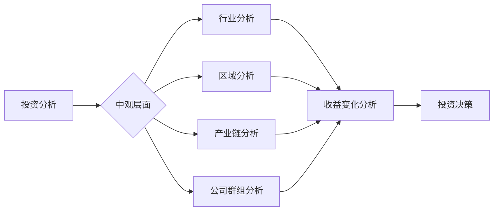

> 关键词：中观投资，收益变化分析，投资策略，市场结构，风险控制，量化模型

# 中观层面的投资收益变化分析

中观层面的投资分析在资本市场中扮演着越来越重要的角色。相较于宏观经济层面的宏观分析和微观层面的个股分析，中观分析更加聚焦于行业、区域和公司群组，能够捕捉到市场深层次的动态和机会。本文将从中观层面的投资收益变化分析出发，探讨其核心概念、算法原理、数学模型以及实际应用，并展望未来的发展趋势与挑战。

## 1. 背景介绍

### 1.1 投资分析的重要性

投资分析是投资者进行投资决策的重要依据。通过分析市场、行业、公司和宏观经济等因素，投资者可以更好地理解市场动态，识别投资机会，规避潜在风险。

### 1.2 中观层面的定义

中观层面是指介于宏观经济和微观公司之间的分析层面，通常包括行业、区域、产业链和公司群组等。中观分析可以帮助投资者从更宏观的角度把握市场趋势，从更微观的角度理解行业和公司的竞争格局。

### 1.3 中观分析的优势

中观分析具有以下优势：

- **捕捉市场趋势**：中观分析能够帮助投资者捕捉到行业周期、区域经济和政策变化等宏观趋势。
- **理解竞争格局**：中观分析可以揭示行业内部不同公司之间的竞争关系，帮助投资者选择具有竞争优势的公司。
- **规避风险**：中观分析可以帮助投资者识别行业风险、区域风险和公司风险，从而规避潜在损失。

## 2. 核心概念与联系

### 2.1 中观层面的核心概念

- **行业分析**：分析行业的基本面，包括行业生命周期、市场容量、增长潜力、竞争格局等。
- **区域分析**：分析不同区域的经济状况、政策环境、产业布局等。
- **产业链分析**：分析产业链上下游企业的关联关系和竞争格局。
- **公司群组分析**：分析特定行业或区域内的公司群组特征和表现。

### 2.2 Mermaid 流程图



### 2.3 核心概念之间的联系

行业分析、区域分析、产业链分析和公司群组分析相互关联，共同构成了中观分析的核心内容。这些分析结果共同影响收益变化分析，为投资决策提供依据。

## 3. 核心算法原理 & 具体操作步骤

### 3.1 算法原理概述

中观层面的投资收益变化分析通常采用以下算法原理：

- **数据收集与处理**：收集行业、区域、产业链和公司群组的相关数据，包括财务数据、市场数据、政策数据等。
- **特征提取与选择**：从收集到的数据中提取关键特征，并选择与收益变化相关的特征。
- **模型构建与训练**：利用机器学习或统计模型对提取的特征进行建模，预测收益变化。
- **风险控制**：对模型进行风险评估，确保投资决策的安全性。

### 3.2 算法步骤详解

1. **数据收集与处理**：从公开数据源、行业报告、公司年报等渠道收集相关数据。
2. **特征提取与选择**：利用数据挖掘和统计方法提取关键特征，如公司盈利能力、行业增长率、区域经济发展水平等。
3. **模型构建与训练**：选择合适的机器学习或统计模型，如线性回归、决策树、支持向量机、神经网络等，对提取的特征进行建模。
4. **模型评估与优化**：使用交叉验证等方法评估模型性能，并根据评估结果优化模型参数。
5. **风险控制**：对模型进行风险评估，如回测、压力测试等，确保模型在真实市场环境中的稳健性。

### 3.3 算法优缺点

**优点**：

- **提高效率**：通过自动化分析，提高投资决策的效率。
- **降低风险**：通过风险评估和控制，降低投资风险。
- **提高收益**：通过准确预测收益变化，提高投资收益。

**缺点**：

- **数据依赖**：模型的性能高度依赖于数据质量。
- **模型复杂性**：一些复杂的模型难以理解和解释。
- **过拟合风险**：模型可能过度拟合训练数据，导致在未知数据上的表现不佳。

### 3.4 算法应用领域

中观层面的投资收益变化分析可以应用于以下领域：

- **行业投资**：识别具有增长潜力的行业。
- **区域投资**：选择具有发展潜力的区域进行投资。
- **股票投资**：选择具有竞争优势的公司进行投资。
- **基金投资**：构建投资组合，实现资产配置。

## 4. 数学模型和公式 & 详细讲解 & 举例说明

### 4.1 数学模型构建

假设我们使用线性回归模型对收益变化进行预测，其数学模型如下：

$$
y = \beta_0 + \beta_1 x_1 + \beta_2 x_2 + ... + \beta_n x_n + \epsilon
$$

其中，$y$ 为收益变化，$x_1, x_2, ..., x_n$ 为特征变量，$\beta_0, \beta_1, ..., \beta_n$ 为模型参数，$\epsilon$ 为误差项。

### 4.2 公式推导过程

线性回归模型的推导过程如下：

1. **最小二乘法**：选择使误差平方和最小的参数 $\beta_0, \beta_1, ..., \beta_n$。
2. **误差平方和**：$S = \sum_{i=1}^N (y_i - (\beta_0 + \beta_1 x_{1i} + \beta_2 x_{2i} + ... + \beta_n x_{ni})^2$
3. **求导**：对 $S$ 分别对 $\beta_0, \beta_1, ..., \beta_n$ 求导，并令导数为0。
4. **求解**：解得 $\beta_0, \beta_1, ..., \beta_n$。

### 4.3 案例分析与讲解

假设我们要预测某支股票的未来收益变化，我们收集了以下数据：

- 公司市盈率（$x_1$）
- 行业增长率（$x_2$）
- 宏观经济增长率（$x_3$）

我们使用线性回归模型对收益变化进行预测：

$$
y = \beta_0 + \beta_1 x_1 + \beta_2 x_2 + \beta_3 x_3 + \epsilon
$$

经过模型训练，我们得到以下参数：

- $\beta_0 = 0.1$
- $\beta_1 = 0.2$
- $\beta_2 = 0.15$
- $\beta_3 = 0.1$

现在，假设我们预测公司市盈率为10，行业增长率为5%，宏观经济增长率为3%，则股票的预期收益变化为：

$$
y = 0.1 + 0.2 \times 10 + 0.15 \times 5% + 0.1 \times 3% = 0.37
$$

这意味着，根据我们的模型预测，该股票的收益变化预期为0.37。

## 5. 项目实践：代码实例和详细解释说明

### 5.1 开发环境搭建

为了进行中观层面的投资收益变化分析，我们需要搭建以下开发环境：

- **编程语言**：Python
- **数据分析库**：Pandas、NumPy
- **机器学习库**：Scikit-learn、TensorFlow或PyTorch

### 5.2 源代码详细实现

以下是一个简单的线性回归模型实现示例：

```python
import pandas as pd
from sklearn.linear_model import LinearRegression

# 加载数据
data = pd.read_csv('data.csv')

# 特征和目标
X = data[['市盈率', '行业增长率', '宏观经济增长率']]
y = data['收益变化']

# 创建线性回归模型
model = LinearRegression()

# 训练模型
model.fit(X, y)

# 预测
prediction = model.predict([[10, 5, 3]])
print(f"预测收益变化: {prediction[0]}")
```

### 5.3 代码解读与分析

- 我们首先导入了必要的库，包括Pandas、NumPy和Scikit-learn。
- 然后，我们加载了数据，并分离出特征和目标。
- 接着，我们创建了一个线性回归模型，并将其拟合到数据上。
- 最后，我们使用模型进行预测，并打印出预测结果。

### 5.4 运行结果展示

假设我们的数据集包含1000个样本，运行上述代码将得到预测收益变化的值。

## 6. 实际应用场景

### 6.1 行业投资

通过中观层面的投资收益变化分析，投资者可以识别出具有增长潜力的行业，从而进行行业投资。

### 6.2 区域投资

中观层面的投资收益变化分析可以帮助投资者选择具有发展潜力的区域进行投资。

### 6.3 股票投资

投资者可以使用中观分析选择具有竞争优势的公司进行投资。

### 6.4 基金投资

中观分析可以用于构建投资组合，实现资产配置。

## 7. 工具和资源推荐

### 7.1 学习资源推荐

- 《投资学》
- 《金融市场技术分析》
- 《Python数据分析》
- 《机器学习》

### 7.2 开发工具推荐

- Jupyter Notebook
- Python编程环境
- pandas、NumPy、Scikit-learn、TensorFlow或PyTorch等数据分析库

### 7.3 相关论文推荐

- 《基于中观层面的投资组合优化》
- 《中观层面的行业风险管理》
- 《机器学习在投资领域的应用》

## 8. 总结：未来发展趋势与挑战

### 8.1 研究成果总结

中观层面的投资收益变化分析为投资者提供了更全面、更深入的投资决策依据。通过数据分析、机器学习和统计模型等方法，投资者可以更准确地预测市场趋势，识别投资机会，规避潜在风险。

### 8.2 未来发展趋势

- **数据驱动**：随着大数据技术的发展，数据将成为中观分析的重要驱动力。
- **人工智能**：人工智能技术将进一步提高中观分析的准确性和效率。
- **跨界融合**：中观分析将与其他领域（如金融科技、生物科技等）进行跨界融合，产生新的应用场景。

### 8.3 面临的挑战

- **数据质量**：数据质量问题将影响中观分析的结果。
- **模型复杂性**：复杂的模型可能导致理解困难，难以解释。
- **技术更新**：技术的快速发展可能导致现有模型失效。

### 8.4 研究展望

中观层面的投资收益变化分析将在未来资本市场中发挥越来越重要的作用。通过不断优化数据质量、模型技术和分析方法，中观分析将为投资者提供更可靠的决策支持。

## 9. 附录：常见问题与解答

**Q1：中观层面的投资收益变化分析与其他层面的分析有什么区别？**

A：中观层面的投资收益变化分析介于宏观经济层面的宏观分析和微观层面的个股分析之间。它更加聚焦于行业、区域和公司群组，能够捕捉到市场深层次的动态和机会。

**Q2：中观层面的投资收益变化分析需要哪些数据？**

A：中观层面的投资收益变化分析需要收集行业、区域、产业链和公司群组的相关数据，包括财务数据、市场数据、政策数据等。

**Q3：如何确保中观分析的数据质量？**

A：确保数据质量需要从数据源、数据采集、数据清洗等方面进行控制。同时，需要对数据进行定期的审核和验证。

**Q4：中观分析的技术难点是什么？**

A：中观分析的技术难点包括数据质量、模型复杂性和技术更新等方面。

**Q5：中观分析的未来发展趋势是什么？**

A：中观分析的未来发展趋势包括数据驱动、人工智能和跨界融合等。

---

作者：禅与计算机程序设计艺术 / Zen and the Art of Computer Programming