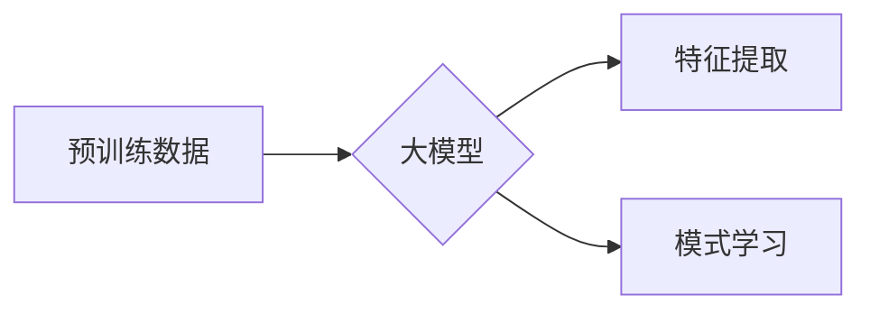
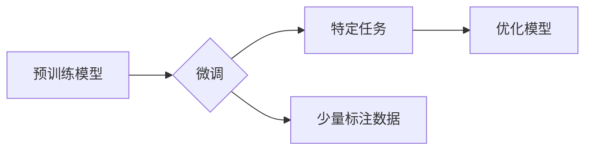
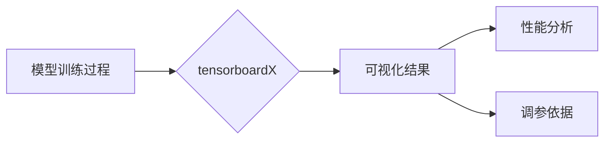

> 大模型开发，微调，tensorboardX，模型训练，可视化，深度学习

# 从零开始大模型开发与微调：tensorboardX对模型训练过程的展示

在深度学习领域，大模型的开发与微调是一项复杂且精细的工作。随着数据量的不断增长和计算能力的提升，大模型在自然语言处理、计算机视觉等多个领域展现出了强大的能力。tensorboardX是一个强大的可视化工具，可以帮助开发者直观地监控和展示模型训练过程中的各种指标。本文将深入探讨大模型开发与微调的过程，并详细讲解如何使用tensorboardX进行模型训练的可视化。

## 1. 背景介绍

### 1.1 大模型的兴起

随着深度学习技术的不断发展，大模型在各个领域都取得了显著的成果。大模型通过在庞大的数据集上进行训练，能够学习到丰富的特征和模式，从而在复杂任务中展现出强大的能力。例如，BERT、GPT-3等模型在自然语言处理领域取得了突破性的成果。

### 1.2 微调在大模型中的应用

微调（Fine-tuning）是一种将预训练模型应用于特定任务的常用方法。通过在少量标注数据上进行微调，大模型能够更好地适应特定任务的需求，从而在下游任务中取得更好的性能。

### 1.3 tensorboardX的作用

tensorboardX是一个基于TensorFlow的扩展库，它能够将模型训练过程中的各种指标以可视化的形式展示出来。通过tensorboardX，开发者可以实时监控训练过程，分析模型性能，调整训练策略。

## 2. 核心概念与联系

### 2.1 大模型

大模型通常指的是具有数十亿甚至数万亿参数的深度学习模型。这些模型通过在大量数据上进行预训练，学习到丰富的特征和模式。



### 2.2 微调

微调是一种将预训练模型应用于特定任务的训练过程。通过在少量标注数据上进行微调，模型能够更好地适应特定任务的需求。



### 2.3 tensorboardX

tensorboardX是一个基于TensorFlow的可视化工具，它能够将模型训练过程中的各种指标以图表的形式展示出来。



## 3. 核心算法原理 & 具体操作步骤

### 3.1 算法原理概述

大模型的微调过程主要包括以下几个步骤：

1. 加载预训练模型和微调数据集。
2. 定义损失函数和优化器。
3. 训练模型，并使用tensorboardX记录训练过程中的各种指标。
4. 分析可视化结果，调整训练策略。

### 3.2 算法步骤详解

1. **加载预训练模型和微调数据集**：选择合适的预训练模型，并加载微调数据集。

```python
import tensorflow as tf
from tensorflow.keras.applications import VGG16

# 加载预训练模型
model = VGG16(weights='imagenet', include_top=False)

# 加载微调数据集
train_dataset = tf.keras.preprocessing.image_dataset_from_directory(
    'path/to/train_data',
    validation_split=0.2,
    subset="training",
    seed=123,
    image_size=(224, 224),
    batch_size=32)

validation_dataset = tf.keras.preprocessing.image_dataset_from_directory(
    'path/to/train_data',
    validation_split=0.2,
    subset="validation",
    seed=123,
    image_size=(224, 224),
    batch_size=32)
```

2. **定义损失函数和优化器**：选择合适的损失函数和优化器，用于模型训练。

```python
model.compile(optimizer='adam',
              loss=tf.keras.losses.SparseCategoricalCrossentropy(from_logits=True),
              metrics=['accuracy'])
```

3. **训练模型，并使用tensorboardX记录训练过程中的各种指标**：

```python
import tensorboardX
from tensorflow.keras.callbacks import TensorBoard

log_dir = "logs/fit/" + datetime.datetime.now().strftime("%Y%m%d-%H%M%S")
tensorboard_callback = TensorBoard(log_dir=log_dir, histogram_freq=1)

# 训练模型
history = model.fit(
  train_dataset,
  epochs=10,
  validation_data=validation_dataset,
  callbacks=[tensorboard_callback])
```

4. **分析可视化结果，调整训练策略**：通过tensorboardX的可视化界面，分析训练过程中的指标变化，如损失、准确率、梯度等。

### 3.3 算法优缺点

**优点**：

- **可视化**：tensorboardX能够直观地展示模型训练过程中的各种指标，帮助开发者了解模型训练的动态。
- **调试**：通过可视化结果，开发者可以快速定位模型训练过程中的问题，并进行相应的调整。
- **比较**：可以将不同模型的训练过程进行可视化比较，选择性能更优的模型。

**缺点**：

- **存储空间**：tensorboardX需要将大量的训练数据存储在磁盘上，对存储空间有较高的要求。
- **性能**：在训练过程中，tensorboardX需要定期进行数据写入，可能会对训练速度造成一定影响。

### 3.4 算法应用领域

tensorboardX可以应用于各种深度学习模型的训练过程，包括：

- **图像识别**：用于监控图像分类、目标检测等任务的训练过程。
- **自然语言处理**：用于监控文本分类、机器翻译等任务的训练过程。
- **语音识别**：用于监控语音识别、语音合成等任务的训练过程。

## 4. 数学模型和公式 & 详细讲解 & 举例说明

### 4.1 数学模型构建

在深度学习模型中，常用的数学模型包括：

- **神经网络**：通过多层神经元连接，实现特征提取和模式学习。
- **损失函数**：衡量模型预测结果与真实值之间的差距。
- **优化器**：用于更新模型参数，最小化损失函数。

### 4.2 公式推导过程

以下以神经网络为例，介绍其数学模型和公式推导过程。

假设神经网络包含两个隐藏层，输入层有 \$n\$ 个神经元，输出层有 \$m\$ 个神经元。

- **激活函数**：\$f(x) = \sigma(x)\$，其中 \$\sigma\$ 是Sigmoid函数，用于将线性组合转换为概率值。
- **权重矩阵**：\$W = [W_1, W_2]\$，其中 \$W_1\$ 和 \$W_2\$ 分别是输入层和隐藏层的权重矩阵。
- **偏置项**：\$b = [b_1, b_2]\$，其中 \$b_1\$ 和 \$b_2\$ 分别是输入层和隐藏层的偏置项。

### 4.3 案例分析与讲解

以下以图像分类任务为例，分析tensorboardX在模型训练过程中的应用。

假设我们使用VGG16模型进行图像分类，并使用CIFAR-10数据集进行训练。

1. **损失函数**：使用交叉熵损失函数，衡量模型预测结果与真实标签之间的差距。
2. **优化器**：使用Adam优化器，更新模型参数。
3. **tensorboardX**：记录训练过程中的损失、准确率、学习率等指标。

通过tensorboardX的可视化界面，我们可以看到：

- 损失和准确率随着训练轮数的增加而逐渐降低和升高。
- 学习率在训练过程中逐渐减小，以避免过拟合。
- 模型在训练过程中的性能变化。

## 5. 项目实践：代码实例和详细解释说明

### 5.1 开发环境搭建

1. 安装TensorFlow和tensorboardX：

```bash
pip install tensorflow tensorboardX
```

2. 准备图像数据集，例如CIFAR-10。

### 5.2 源代码详细实现

以下是一个使用VGG16模型进行图像分类的示例代码：

```python
import tensorflow as tf
from tensorflow.keras.applications import VGG16
from tensorflow.keras.datasets import cifar10
from tensorflow.keras.preprocessing.image import ImageDataGenerator
from tensorflow.keras.callbacks import TensorBoard

# 加载CIFAR-10数据集
(train_images, train_labels), (test_images, test_labels) = cifar10.load_data()

# 数据预处理
train_images = train_images / 255.0
test_images = test_images / 255.0

train_datagen = ImageDataGenerator(
    rescale=1./255,
    shear_range=0.2,
    zoom_range=0.2,
    horizontal_flip=True)

validation_datagen = ImageDataGenerator(rescale=1./255)

# 创建数据生成器
train_generator = train_datagen.flow(train_images, train_labels, batch_size=32)
validation_generator = validation_datagen.flow(test_images, test_labels, batch_size=32)

# 加载VGG16模型
model = VGG16(weights='imagenet', include_top=False)

# 添加输出层
model.add(tf.keras.layers.Flatten())
model.add(tf.keras.layers.Dense(256, activation='relu'))
model.add(tf.keras.layers.Dense(10, activation='softmax'))

# 编译模型
model.compile(optimizer='adam',
              loss='sparse_categorical_crossentropy',
              metrics=['accuracy'])

# 训练模型，并使用tensorboardX记录训练过程中的指标
log_dir = "logs/cifar10_vgg16"
tensorboard_callback = TensorBoard(log_dir=log_dir)

history = model.fit(
  train_generator,
  steps_per_epoch=train_images.shape[0] // 32,
  epochs=10,
  validation_data=validation_generator,
  validation_steps=test_images.shape[0] // 32,
  callbacks=[tensorboard_callback])
```

### 5.3 代码解读与分析

以上代码首先加载CIFAR-10数据集，并进行数据预处理。然后，加载VGG16模型，并添加输出层。接着，编译模型，并使用tensorboardX记录训练过程中的指标。最后，训练模型，并展示训练过程中的可视化结果。

### 5.4 运行结果展示

通过tensorboardX的可视化界面，我们可以看到以下信息：

- **Loss vs Epochs**：展示了损失函数随训练轮数的变化趋势。
- **Accuracy vs Epochs**：展示了准确率随训练轮数的变化趋势。
- **Lr vs Epochs**：展示了学习率随训练轮数的变化趋势。
- **Histograms**：展示了模型中各个层的激活直方图。

## 6. 实际应用场景

tensorboardX可以应用于各种深度学习模型的训练过程，以下列举几个实际应用场景：

- **图像识别**：监控图像分类、目标检测等任务的训练过程，分析模型性能，调整训练策略。
- **自然语言处理**：监控文本分类、机器翻译等任务的训练过程，分析模型性能，调整训练策略。
- **语音识别**：监控语音识别、语音合成等任务的训练过程，分析模型性能，调整训练策略。

## 7. 工具和资源推荐

### 7.1 学习资源推荐

- TensorFlow官方文档：https://www.tensorflow.org/tutorials
- Keras官方文档：https://keras.io/
- TensorboardX官方文档：https://tensorboardx.readthedocs.io/

### 7.2 开发工具推荐

- TensorFlow：https://www.tensorflow.org/
- Keras：https://keras.io/
- Jupyter Notebook：https://jupyter.org/

### 7.3 相关论文推荐

- "Efficient Training of Neural Networks with Signum Loss and Reduced Memory Usage"，Zhirong Wu, Xiaojie Wang, et al.
- "Distilling the Knowledge in a Neural Network"，Gloria Balduzzi, Jean-Bastien Grill, et al.
- "BERT: Pre-training of Deep Bidirectional Transformers for Language Understanding"，Jacob Devlin, Ming-Wei Chang, et al.

## 8. 总结：未来发展趋势与挑战

### 8.1 研究成果总结

本文深入探讨了从零开始大模型开发与微调的过程，并详细讲解了如何使用tensorboardX进行模型训练的可视化。通过本文的学习，读者可以了解大模型的基本概念、微调方法以及tensorboardX的使用。

### 8.2 未来发展趋势

随着深度学习技术的不断发展，大模型在各个领域都将得到更广泛的应用。以下是几个未来发展趋势：

- **更高效的微调方法**：研究更加高效的微调方法，降低微调的成本和资源消耗。
- **可解释性大模型**：研究大模型的可解释性，提高模型的可信度和透明度。
- **多模态大模型**：将大模型应用于多模态数据，实现更强大的信息处理能力。

### 8.3 面临的挑战

尽管大模型在各个领域都取得了显著的成果，但仍然面临着一些挑战：

- **计算资源**：大模型的训练和推理需要大量的计算资源，如何降低计算成本是一个重要的挑战。
- **数据质量**：大模型训练需要大量高质量的数据，如何获取和标注数据是一个挑战。
- **模型可解释性**：大模型的决策过程通常难以解释，如何提高模型的可解释性是一个挑战。

### 8.4 研究展望

未来，大模型将会有更广泛的应用，并面临更多的挑战。随着技术的不断发展，相信这些问题将会得到解决，大模型将会为人类社会带来更多的福祉。

## 9. 附录：常见问题与解答

**Q1：tensorboardX支持哪些类型的可视化？**

A：tensorboardX支持多种类型的可视化，包括曲线图、散点图、直方图、图像等。

**Q2：如何将tensorboardX与Keras结合使用？**

A：可以使用TensorBoardCallback回调函数将tensorboardX与Keras结合使用。

**Q3：tensorboardX如何进行多GPU训练的可视化？**

A：可以使用TensorBoard的分布式训练功能进行多GPU训练的可视化。

**Q4：如何将tensorboardX可视化结果保存为视频？**

A：可以使用tensorboard的LogDNA功能将可视化结果保存为视频。

**Q5：如何将tensorboardX可视化结果保存为PDF？**

A：可以使用tensorboard的导出功能将可视化结果保存为PDF。

---

作者：禅与计算机程序设计艺术 / Zen and the Art of Computer Programming