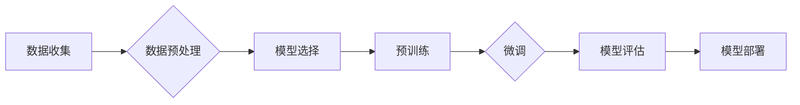

> 大模型, 微调, 深度学习, 人工智能, NLP, 预训练, 迁移学习, 转换器架构, 模型部署

# 从零开始大模型开发与微调：深度学习与人工智能

### 1. 背景介绍

随着深度学习的飞速发展，大模型（Large Language Models, LLMs）已经成为自然语言处理（Natural Language Processing, NLP）、计算机视觉（Computer Vision, CV）等领域的明星技术。大模型通过在大量无标签数据上进行预训练，学习到丰富的知识，并通过微调（Fine-Tuning）在特定任务上取得显著的效果。本文将为您从零开始介绍大模型开发与微调的整个过程，涵盖深度学习与人工智能的基本概念、核心算法、项目实践以及实际应用场景。

### 2. 核心概念与联系

#### 2.1 核心概念

在大模型开发与微调中，以下核心概念至关重要：

- **深度学习**：一种利用深层神经网络进行学习的人工智能技术，可以自动从数据中学习特征和模式。
- **预训练**：在大规模无标签数据上训练模型，使其学习到通用特征表示。
- **微调**：在预训练模型的基础上，使用少量标注数据进一步训练，使其适应特定任务。
- **迁移学习**：将预训练模型的知识迁移到其他任务上，减少数据需求。
- **转换器架构**：一种基于自注意力机制（Self-Attention）的神经网络架构，适用于处理序列数据。
- **模型部署**：将训练好的模型部署到生产环境中，使其能够进行实时预测。

#### 2.2 Mermaid 流程图

以下是大模型开发与微调的Mermaid流程图：



### 3. 核心算法原理 & 具体操作步骤

#### 3.1 算法原理概述

大模型开发与微调的核心算法主要包括以下几个方面：

- **预训练**：使用无标签数据进行自监督学习，学习通用特征表示。
- **微调**：在预训练模型的基础上，使用少量标注数据进行监督学习，优化模型在特定任务上的性能。
- **优化**：使用梯度下降等优化算法，更新模型参数，最小化损失函数。

#### 3.2 算法步骤详解

以下是开发与微调大模型的详细步骤：

1. **数据收集**：收集大量无标签和标注数据。
2. **数据预处理**：对数据进行清洗、去重、分词等处理。
3. **模型选择**：选择合适的预训练模型架构。
4. **预训练**：在无标签数据上训练模型，学习通用特征表示。
5. **微调**：在预训练模型的基础上，使用少量标注数据进行监督学习，优化模型在特定任务上的性能。
6. **模型评估**：在测试集上评估模型性能。
7. **模型部署**：将训练好的模型部署到生产环境中。

#### 3.3 算法优缺点

**优点**：

- 可以在少量标注数据上取得显著的效果。
- 可以利用预训练模型的通用知识，提高模型泛化能力。
- 可以应用于各种NLP和CV任务。

**缺点**：

- 预训练过程需要大量计算资源。
- 需要大量标注数据进行微调。
- 模型可能存在过拟合风险。

#### 3.4 算法应用领域

大模型开发与微调可以应用于以下领域：

- **自然语言处理**：文本分类、情感分析、机器翻译、问答系统等。
- **计算机视觉**：图像分类、目标检测、图像分割等。
- **语音识别**：语音到文本、语音合成等。

### 4. 数学模型和公式 & 详细讲解 & 举例说明

#### 4.1 数学模型构建

大模型通常采用转换器（Transformer）架构，其核心思想是自注意力机制（Self-Attention）。

$$
\text{Self-Attention}(Q, K, V) = \text{softmax}\left(\frac{QK^T}{\sqrt{d_k}}\right)V
$$

其中，$Q$、$K$、$V$ 分别是查询（Query）、键（Key）和值（Value）向量，$d_k$ 是键向量的维度。

#### 4.2 公式推导过程

自注意力机制的推导过程如下：

1. 计算查询向量 $Q$ 和键向量 $K$ 的点积，得到注意力权重矩阵 $A$。
2. 对注意力权重矩阵 $A$ 进行softmax操作，得到概率矩阵 $W$。
3. 将概率矩阵 $W$ 乘以值向量 $V$，得到加权值向量 $H$。

#### 4.3 案例分析与讲解

以文本分类任务为例，我们可以使用BERT模型进行微调。

1. **数据预处理**：将文本进行分词、编码等预处理。
2. **模型选择**：选择预训练的BERT模型。
3. **微调**：在预训练模型的基础上，添加分类层，并使用标注数据进行训练。
4. **模型评估**：在测试集上评估模型性能。

### 5. 项目实践：代码实例和详细解释说明

#### 5.1 开发环境搭建

以下是在Python环境下进行大模型开发与微调的步骤：

1. 安装PyTorch和Transformers库：
```bash
pip install torch transformers
```

2. 下载预训练的BERT模型：
```python
from transformers import BertModel

model = BertModel.from_pretrained('bert-base-uncased')
```

#### 5.2 源代码详细实现

以下是一个简单的文本分类任务微调的示例代码：

```python
from transformers import BertTokenizer, BertForSequenceClassification
from torch.utils.data import DataLoader, TensorDataset

# 加载预训练的BERT模型和分词器
tokenizer = BertTokenizer.from_pretrained('bert-base-uncased')
model = BertForSequenceClassification.from_pretrained('bert-base-uncased')

# 数据预处理
train_texts = [...]  # 训练集文本
train_labels = [...]  # 训练集标签
train_encodings = tokenizer(train_texts, truncation=True, padding=True)
train_dataset = TensorDataset(train_encodings['input_ids'], train_encodings['attention_mask'], train_labels)

# 训练模型
model.train()
optimizer = AdamW(model.parameters(), lr=2e-5)
for epoch in range(epochs):
    model.train()
    dataloader = DataLoader(train_dataset, batch_size=16, shuffle=True)
    for batch in dataloader:
        input_ids, attention_mask, labels = batch
        optimizer.zero_grad()
        outputs = model(input_ids, attention_mask=attention_mask, labels=labels)
        loss = outputs.loss
        loss.backward()
        optimizer.step()

# 评估模型
model.eval()
test_texts = [...]  # 测试集文本
test_labels = [...]  # 测试集标签
test_encodings = tokenizer(test_texts, truncation=True, padding=True)
test_dataset = TensorDataset(test_encodings['input_ids'], test_encodings['attention_mask'], test_labels)
dataloader = DataLoader(test_dataset, batch_size=16)
with torch.no_grad():
    correct = 0
    total = 0
    for batch in dataloader:
        input_ids, attention_mask, labels = batch
        outputs = model(input_ids, attention_mask=attention_mask)
        _, predicted = torch.max(outputs.logits, 1)
        total += labels.size(0)
        correct += (predicted == labels).sum().item()

print(f'Accuracy of the model on the test datasets: {100 * correct // total}%')
```

#### 5.3 代码解读与分析

以上代码展示了使用PyTorch和Transformers库进行BERT微调的完整流程。

1. **加载预训练模型和分词器**：从Hugging Face的Transformer库中加载预训练的BERT模型和分词器。
2. **数据预处理**：将训练和测试集的文本进行分词、编码等预处理。
3. **模型训练**：使用AdamW优化器进行模型训练，包括损失函数计算、反向传播、参数更新等过程。
4. **模型评估**：在测试集上评估模型性能，计算准确率。

### 6. 实际应用场景

大模型开发与微调可以应用于以下实际应用场景：

- **智能客服**：利用大模型进行对话生成，实现7x24小时在线客服。
- **新闻摘要**：利用大模型自动生成新闻摘要，提高新闻阅读效率。
- **机器翻译**：利用大模型实现高质量、高速度的机器翻译。
- **图像识别**：利用大模型实现高精度的图像识别。
- **语音识别**：利用大模型实现高精度的语音识别。

### 7. 工具和资源推荐

#### 7.1 学习资源推荐

- 《深度学习》 - Ian Goodfellow、Yoshua Bengio、Aaron Courville
- 《动手学深度学习》 - 阮一峰
- 《深度学习与人工智能》 - 禅与计算机程序设计艺术 / Zen and the Art of Computer Programming

#### 7.2 开发工具推荐

- PyTorch
- TensorFlow
- Keras
- Hugging Face Transformers

#### 7.3 相关论文推荐

- Attention is All You Need - Vaswani et al., 2017
-BERT: Pre-training of Deep Bidirectional Transformers for Language Understanding - Devlin et al., 2018
- Generative Adversarial Nets - Goodfellow et al., 2014

### 8. 总结：未来发展趋势与挑战

#### 8.1 研究成果总结

大模型开发与微调是深度学习和人工智能领域的核心技术，已经在多个领域取得了显著的成果。然而，随着模型规模的不断扩大，对计算资源、存储资源以及标注数据的需求也越来越高。

#### 8.2 未来发展趋势

未来，大模型开发与微调将朝着以下方向发展：

- **模型规模不断扩大**：随着计算资源的提升，模型规模将继续扩大，以便学习更丰富的知识。
- **多模态融合**：大模型将融合多种模态信息，如文本、图像、视频等，实现更全面的智能。
- **可解释性增强**：大模型的可解释性将成为研究热点，以便更好地理解和控制模型行为。

#### 8.3 面临的挑战

大模型开发与微调面临着以下挑战：

- **计算资源需求**：大模型需要大量的计算资源进行训练和推理。
- **存储资源需求**：大模型的存储需求也非常大。
- **标注数据需求**：大模型的训练需要大量的标注数据。
- **模型可解释性**：大模型的决策过程缺乏可解释性，难以理解和控制。

#### 8.4 研究展望

未来，大模型开发与微调的研究将朝着以下方向发展：

- **轻量化模型**：开发轻量化模型，以降低计算和存储资源需求。
- **无监督和半监督学习**：减少对标注数据的依赖，提高模型的泛化能力。
- **可解释性研究**：提高模型的可解释性，以便更好地理解和控制模型行为。

大模型开发与微调是深度学习和人工智能领域的核心技术，具有广阔的应用前景。随着技术的不断发展，大模型将在更多领域发挥重要作用，为人类社会带来更多福祉。

### 9. 附录：常见问题与解答

**Q1：大模型微调需要多少数据？**

A：大模型微调需要的数据量取决于任务类型和预训练模型的规模。对于小样本任务，可能只需要几百个样本即可取得不错的效果。对于大规模任务，可能需要数千个样本。

**Q2：如何提高大模型的性能？**

A：提高大模型的性能可以从以下几个方面入手：

- 使用更大规模的预训练模型。
- 使用更高质量的数据进行微调。
- 优化模型架构，提高模型的表达能力。
- 使用更先进的优化算法，提高模型的收敛速度。

**Q3：大模型微调的步骤有哪些？**

A：大模型微调的步骤包括：

1. 数据收集与预处理
2. 模型选择
3. 预训练
4. 微调
5. 模型评估
6. 模型部署

**Q4：如何评估大模型微调的效果？**

A：评估大模型微调的效果可以通过以下指标：

- 准确率
- 召回率
- F1值
- 实际应用效果

**Q5：大模型微调需要哪些计算资源？**

A：大模型微调需要以下计算资源：

- GPU或TPU
- 显存
- 硬盘空间

**Q6：大模型微调的难点有哪些？**

A：大模型微调的难点包括：

- 计算资源需求
- 存储资源需求
- 标注数据需求
- 模型可解释性

**Q7：大模型微调的优化方向有哪些？**

A：大模型微调的优化方向包括：

- 轻量化模型
- 无监督和半监督学习
- 可解释性研究

作者：禅与计算机程序设计艺术 / Zen and the Art of Computer Programming