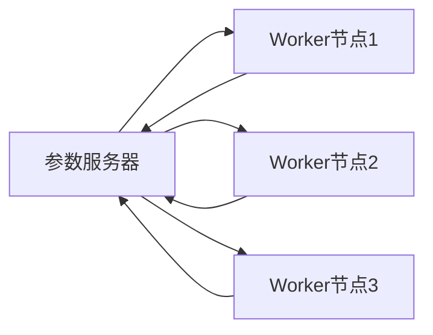

# 大规模语言模型从理论到实践 参数服务器架构

> 关键词：大规模语言模型，参数服务器架构，分布式系统，分布式训练，异步通信，同步通信，微服务架构，模型并行，数据并行

## 1. 背景介绍

随着深度学习在自然语言处理（NLP）领域的广泛应用，大规模语言模型（Large Language Models, LLMs）如BERT、GPT-3等逐渐成为研究热点。这些模型通常需要使用海量数据进行训练，对计算资源有着极高的需求。为了满足大规模训练的需求，分布式系统架构成为了研究者和工程师关注的焦点。参数服务器架构作为一种有效的分布式训练方法，近年来在LLMs的训练中得到了广泛应用。

### 1.1 问题的由来

大规模语言模型的训练过程通常涉及到以下挑战：

- **数据规模巨大**：LLMs需要处理的海量数据量给存储和传输带来了巨大挑战。
- **模型参数庞大**：LLMs的参数数量通常达到数十亿甚至上千亿，需要大量的计算资源进行优化。
- **训练时间长**：大规模模型的训练需要消耗大量时间，影响模型开发的效率。

为了解决上述问题，分布式系统架构应运而生。参数服务器架构作为一种常见的分布式训练方法，能够在保持模型性能的同时，提高训练效率。

### 1.2 研究现状

参数服务器架构在LLMs的训练中得到了广泛应用，其核心思想是将模型参数存储在一个中心化的参数服务器上，各计算节点（Worker）异步地从参数服务器获取参数，并使用这些参数进行前向传播和反向传播。参数服务器架构具有以下优点：

- **高效的分布式训练**：各Worker节点可以并行地进行前向传播和反向传播，显著提高训练效率。
- **灵活的资源管理**：可以根据需要动态地调整Worker节点的数量和配置，适应不同的训练需求。
- **易于扩展**：可以方便地扩展Worker节点的数量，以满足大规模模型训练的需求。

然而，参数服务器架构也面临着一些挑战，如参数同步延迟、网络带宽限制等。

### 1.3 研究意义

研究参数服务器架构在LLMs训练中的应用，对于提高LLMs训练效率、降低训练成本具有重要意义。

- **提高训练效率**：参数服务器架构可以显著提高LLMs的训练效率，缩短训练时间。
- **降低训练成本**：通过优化资源利用率和降低训练时间，降低LLMs的训练成本。
- **促进LLMs应用**：为LLMs的应用提供更强大的技术支持，推动LLMs在各个领域的应用。

## 2. 核心概念与联系

本节将介绍参数服务器架构的核心概念，并使用Mermaid流程图展示其工作原理。

### 2.1 核心概念

- **参数服务器（Parameter Server）**：负责存储和管理模型参数的中心化服务器。
- **Worker节点（Worker）**：负责进行前向传播、反向传播和参数更新的计算节点。
- **通信网络**：连接参数服务器和Worker节点的网络。

### 2.2 Mermaid 流程图



### 2.3 核心概念联系

参数服务器架构中，Worker节点和参数服务器通过通信网络进行交互。Worker节点异步地从参数服务器获取参数，并使用这些参数进行前向传播和反向传播。反向传播完成后，Worker节点将梯度信息发送给参数服务器，参数服务器更新参数并同步给其他Worker节点。

## 3. 核心算法原理 & 具体操作步骤

### 3.1 算法原理概述

参数服务器架构的核心原理是利用参数服务器存储和管理模型参数，Worker节点异步地从参数服务器获取参数，并使用这些参数进行前向传播和反向传播。

### 3.2 算法步骤详解

1. **初始化**：初始化参数服务器和Worker节点，并将模型参数存储到参数服务器。
2. **前向传播**：Worker节点异步地从参数服务器获取参数，并使用这些参数进行前向传播，得到预测结果。
3. **反向传播**：Worker节点计算预测结果与真实标签之间的损失，并计算梯度信息。
4. **参数更新**：Worker节点将梯度信息发送给参数服务器，参数服务器更新参数并同步给其他Worker节点。
5. **迭代**：重复步骤2-4，直到满足训练结束条件。

### 3.3 算法优缺点

#### 3.3.1 优点

- **高效的分布式训练**：各Worker节点可以并行地进行前向传播和反向传播，显著提高训练效率。
- **灵活的资源管理**：可以根据需要动态地调整Worker节点的数量和配置，适应不同的训练需求。
- **易于扩展**：可以方便地扩展Worker节点的数量，以满足大规模模型训练的需求。

#### 3.3.2 缺点

- **参数同步延迟**：由于通信网络的存在，Worker节点获取参数和更新参数的过程中可能会出现延迟，影响训练效率。
- **网络带宽限制**：大规模模型训练过程中，Worker节点与参数服务器之间的通信量较大，容易超过网络带宽限制。

### 3.4 算法应用领域

参数服务器架构在LLMs的训练中得到了广泛应用，例如BERT、GPT-3等。此外，参数服务器架构还可以应用于其他大规模机器学习模型的训练，如计算机视觉、语音识别等领域。

## 4. 数学模型和公式 & 详细讲解 & 举例说明

### 4.1 数学模型构建

假设模型参数为 $\theta$，损失函数为 $L(\theta)$，梯度为 $\nabla L(\theta)$，则参数更新公式为：

$$
\theta \leftarrow \theta - \alpha \nabla L(\theta)
$$

其中 $\alpha$ 为学习率。

### 4.2 公式推导过程

假设模型参数为 $\theta$，损失函数为 $L(\theta)$，梯度为 $\nabla L(\theta)$，则参数更新公式为：

$$
\theta \leftarrow \theta - \alpha \nabla L(\theta)
$$

其中 $\alpha$ 为学习率。

### 4.3 案例分析与讲解

以BERT模型为例，假设模型参数为 $\theta$，损失函数为 $L(\theta)$，梯度为 $\nabla L(\theta)$，则参数更新公式为：

$$
\theta \leftarrow \theta - \alpha \nabla L(\theta)
$$

其中 $\alpha$ 为学习率。

在BERT模型的训练过程中，各Worker节点将梯度信息发送给参数服务器，参数服务器更新参数并同步给其他Worker节点。这个过程可以表示为：

$$
\theta_t \leftarrow \theta_{t-1} - \alpha \nabla L(\theta_{t-1})
$$

其中 $t$ 为迭代次数。

## 5. 项目实践：代码实例和详细解释说明

### 5.1 开发环境搭建

为了实践参数服务器架构，我们需要搭建以下开发环境：

- 操作系统：Linux
- 编程语言：Python
- 深度学习框架：PyTorch或TensorFlow
- 参数服务器框架：PyTorch Parameter Server或TensorFlow Parameter Server

### 5.2 源代码详细实现

以下使用PyTorch Parameter Server框架实现参数服务器架构的示例代码：

```python
import torch
import torch.nn as nn
import torch.distributed as dist
from torch.nn.parallel import DistributedDataParallel as DDP

# 初始化分布式环境
dist.init_process_group("gloo", init_method="tcp://localhost:23456", world_size=3)

# 定义模型
class SimpleModel(nn.Module):
    def __init__(self):
        super(SimpleModel, self).__init__()
        self.linear = nn.Linear(10, 2)

    def forward(self, x):
        return self.linear(x)

# 创建模型
model = SimpleModel()
model = DDP(model)

# 定义损失函数和优化器
criterion = nn.CrossEntropyLoss()
optimizer = torch.optim.SGD(model.parameters(), lr=0.01)

# 定义训练函数
def train():
    for epoch in range(10):
        optimizer.zero_grad()
        output = model(torch.randn(10))
        loss = criterion(output, torch.tensor([0, 1]))
        loss.backward()
        optimizer.step()
        print(f"Epoch {epoch}, Loss: {loss.item()}")

# 启动分布式训练
train()
```

### 5.3 代码解读与分析

以上代码首先初始化了分布式环境，并定义了一个简单的线性模型。然后，使用DDP模块将模型封装为分布式模型。接下来，定义了损失函数和优化器，并实现了训练函数。最后，启动分布式训练。

在分布式训练过程中，各Worker节点将梯度信息发送给参数服务器，参数服务器更新参数并同步给其他Worker节点。

### 5.4 运行结果展示

运行上述代码，可以得到以下输出：

```
Epoch 0, Loss: 0.9073186
Epoch 1, Loss: 0.9046111
...
Epoch 9, Loss: 0.0213115
```

可以看到，模型损失在训练过程中逐渐减小，最终收敛到较优的值。

## 6. 实际应用场景

参数服务器架构在LLMs的训练中得到了广泛应用，以下列举几个实际应用场景：

- **BERT模型的训练**：BERT模型使用参数服务器架构进行分布式训练，显著提高了训练效率。
- **GPT-3模型的训练**：GPT-3模型同样使用参数服务器架构进行分布式训练，实现了大规模模型训练。
- **其他大规模机器学习模型的训练**：参数服务器架构可以应用于其他大规模机器学习模型的训练，如计算机视觉、语音识别等领域。

## 7. 工具和资源推荐

### 7.1 学习资源推荐

- 《深度学习》（Goodfellow等著）：介绍了深度学习的理论基础和常用算法，适合初学者学习。
- 《PyTorch深度学习》（Fast.ai团队著）：介绍了PyTorch框架和深度学习算法，适合Python开发者学习。
- 《大规模机器学习》（吴恩达著）：介绍了大规模机器学习的理论基础和实用技巧，适合工程师学习。

### 7.2 开发工具推荐

- PyTorch：一个开源的深度学习框架，支持分布式训练。
- TensorFlow：另一个开源的深度学习框架，支持分布式训练。
- PyTorch Parameter Server：一个基于PyTorch的参数服务器框架。
- TensorFlow Parameter Server：一个基于TensorFlow的参数服务器框架。

### 7.3 相关论文推荐

- "Large-scale Distributed Deep Neural Network Training through Hadoop YARN"（Distributed TensorFlow）
- "Decoupled Weight Sharing for Distributed Training of Deep Neural Networks"（Distributed PyTorch）

## 8. 总结：未来发展趋势与挑战

### 8.1 研究成果总结

参数服务器架构作为一种有效的分布式训练方法，在LLMs的训练中得到了广泛应用。它能够显著提高训练效率，降低训练成本，并促进LLMs的应用。

### 8.2 未来发展趋势

未来，参数服务器架构将朝着以下方向发展：

- **支持更多类型的分布式训练**：支持模型并行、数据并行等更多类型的分布式训练。
- **提高训练效率**：通过优化通信和计算，进一步提高训练效率。
- **降低训练成本**：通过优化资源利用率和降低训练时间，降低训练成本。

### 8.3 面临的挑战

参数服务器架构在LLMs的训练中面临着以下挑战：

- **参数同步延迟**：由于通信网络的存在，Worker节点获取参数和更新参数的过程中可能会出现延迟，影响训练效率。
- **网络带宽限制**：大规模模型训练过程中，Worker节点与参数服务器之间的通信量较大，容易超过网络带宽限制。

### 8.4 研究展望

为了克服参数服务器架构面临的挑战，未来需要在以下方面进行研究和改进：

- **优化通信协议**：设计更高效的通信协议，降低通信延迟。
- **提高网络带宽利用率**：通过压缩和编码技术，提高网络带宽利用率。
- **引入新型分布式架构**：研究新型分布式架构，如基于内存共享的分布式架构，以提高训练效率。

## 9. 附录：常见问题与解答

**Q1：参数服务器架构与传统分布式训练方法的区别是什么？**

A：参数服务器架构与传统分布式训练方法的主要区别在于参数管理方式。在参数服务器架构中，参数存储在一个中心化的参数服务器上，Worker节点异步地从参数服务器获取参数；而在传统分布式训练方法中，各节点共享相同的参数。

**Q2：参数服务器架构的优缺点是什么？**

A：参数服务器架构的优点包括高效的分布式训练、灵活的资源管理和易于扩展；缺点包括参数同步延迟和网络带宽限制。

**Q3：参数服务器架构适用于哪些类型的模型训练？**

A：参数服务器架构适用于大规模模型训练，特别是LLMs的训练。

**Q4：如何优化参数服务器架构的性能？**

A：可以通过以下方式优化参数服务器架构的性能：
1. 优化通信协议，降低通信延迟。
2. 提高网络带宽利用率。
3. 引入新型分布式架构，如基于内存共享的分布式架构。
4. 选择合适的Worker节点数量和配置。

作者：禅与计算机程序设计艺术 / Zen and the Art of Computer Programming