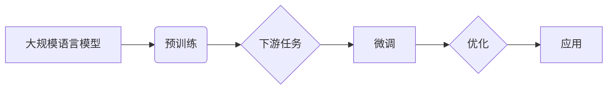

# 大规模语言模型从理论到实践 实践思考

> 关键词：大规模语言模型，预训练，迁移学习，微调，自然语言处理，应用实践，Transformer，BERT，GPT

## 1. 背景介绍

随着深度学习技术的飞速发展，自然语言处理（NLP）领域取得了前所未有的突破。大规模语言模型（Large Language Models，LLMs）应运而生，它们在理解、生成和翻译自然语言方面展现出了惊人的能力。本文将深入探讨大规模语言模型的原理、实践以及面临的挑战，旨在帮助读者从理论到实践全面了解这一领域的最新进展。

## 2. 核心概念与联系

### 2.1 核心概念

#### 大规模语言模型（LLMs）

大规模语言模型是指通过深度学习技术，在庞大的文本语料库上预训练得到的语言模型。它们能够理解和生成自然语言，并在各种NLP任务中表现出色。

#### 预训练（Pre-training）

预训练是指在大规模无标签文本数据上，通过特定任务让模型学习语言规律的过程。预训练模型可以提取丰富的语言知识，为下游任务提供强大的基础。

#### 迁移学习（Transfer Learning）

迁移学习是指将已在大规模数据集上预训练好的模型，应用于新任务时，仅在新任务的数据上进行微调的过程。迁移学习可以显著降低新任务的训练成本。

#### 微调（Fine-tuning）

微调是指在预训练模型的基础上，针对特定任务进行进一步训练的过程。通过微调，模型可以在特定任务上获得更好的性能。

### 2.2 架构的 Mermaid 流程图



## 3. 核心算法原理 & 具体操作步骤

### 3.1 算法原理概述

大规模语言模型的算法原理主要包括预训练和微调两个阶段。

- **预训练阶段**：模型在大量无标签文本数据上学习语言的通用表示和规律。
- **微调阶段**：在预训练模型的基础上，使用特定任务的标注数据进行训练，优化模型在特定任务上的性能。

### 3.2 算法步骤详解

#### 预训练步骤

1. **数据准备**：收集大量的无标签文本数据，如书籍、新闻、网页等。
2. **模型选择**：选择合适的预训练模型，如BERT、GPT-3等。
3. **预训练任务设计**：设计预训练任务，如掩码语言模型（Masked Language Model，MLM）、下一句预测（Next Sentence Prediction，NSP）等。
4. **训练**：在预训练数据上训练模型，优化模型参数。

#### 微调步骤

1. **数据准备**：收集特定任务的标注数据。
2. **模型选择**：选择合适的预训练模型作为微调基础。
3. **任务适配**：根据特定任务设计输入和输出层，如分类器、解码器等。
4. **训练**：在标注数据上微调模型，优化模型参数。

### 3.3 算法优缺点

#### 优点

- **强大的语言理解能力**：通过预训练，模型可以学习到丰富的语言知识，在NLP任务中表现出色。
- **高效的迁移学习**：预训练模型可以作为迁移学习的起点，快速适应新任务。
- **参数高效微调**：通过微调，模型可以在特定任务上获得更好的性能。

#### 缺点

- **计算资源消耗大**：预训练和微调都需要大量的计算资源。
- **对标注数据依赖性强**：微调需要标注数据，获取高质量标注数据成本较高。
- **模型可解释性差**：大规模语言模型通常被视为“黑盒”模型，其决策过程难以解释。

### 3.4 算法应用领域

大规模语言模型在以下NLP任务中取得了显著成果：

- **文本分类**：如情感分析、主题分类、垃圾邮件检测等。
- **文本摘要**：如提取摘要、生成摘要等。
- **机器翻译**：如英译中、中译英等。
- **问答系统**：如问题回答、对话系统等。
- **对话系统**：如聊天机器人、虚拟助手等。

## 4. 数学模型和公式 & 详细讲解 & 举例说明

### 4.1 数学模型构建

大规模语言模型的数学模型通常包括以下几个方面：

- **嵌入层**：将词转换为向量表示。
- **编码器**：通过编码器层，提取文本的语义信息。
- **解码器**：通过解码器层，生成文本的输出。

### 4.2 公式推导过程

以下以BERT模型为例，介绍其数学模型的推导过程。

#### BERT模型的嵌入层

BERT模型的嵌入层可以将词转换为高维向量表示。假设输入序列的长度为 $T$，则嵌入层输出的特征维度为 $E$。

$$
\mathbf{h}^0_t = \text{ Embedding}(\mathbf{w}^T_t)
$$

其中，$\mathbf{h}^0_t$ 为第 $t$ 个词的嵌入向量，$\mathbf{w}^T_t$ 为第 $t$ 个词的词向量。

#### BERT模型的编码器

BERT模型的编码器由多个 Transformer 编码层组成。每个编码层包含两个子层：自注意力层和前馈神经网络。

自注意力层：

$$
\mathbf{h}^{(i)}_{tj} = \mathbf{W}_Q^Q \mathbf{h}^{(i-1)}_{t} \mathbf{W}_K^K \mathbf{h}^{(i-1)}_{t} \mathbf{W}_V^V \mathbf{h}^{(i-1)}_{t} + \mathbf{b}_{iQ/K/V}
$$

其中，$\mathbf{h}^{(i)}_{tj}$ 为第 $i$ 层第 $t$ 个词的注意力权重，$\mathbf{W}_Q^Q$、$\mathbf{W}_K^K$ 和 $\mathbf{W}_V^V$ 分别为查询、键和值的权重矩阵，$\mathbf{b}_{iQ/K/V}$ 为偏置项。

前馈神经网络：

$$
\mathbf{h}^{(i+1)}_{t} = \text{FFN}(\mathbf{h}^{(i)}_{t}) = \max(0, \mathbf{W}_1 \mathbf{h}^{(i)}_{t} + \mathbf{b}_1) \cdot \mathbf{W}_2 + \mathbf{b}_2
$$

其中，$\mathbf{h}^{(i+1)}_{t}$ 为第 $i+1$ 层第 $t$ 个词的特征向量，$\mathbf{W}_1$ 和 $\mathbf{W}_2$ 分别为FFN层的权重矩阵，$\mathbf{b}_1$ 和 $\mathbf{b}_2$ 为偏置项。

### 4.3 案例分析与讲解

以下以BERT模型在文本分类任务中的应用为例，讲解其微调过程。

1. **数据准备**：收集文本分类任务的标注数据，如情感分析数据集。
2. **模型选择**：选择BERT模型作为微调基础。
3. **任务适配**：将BERT模型的输出层替换为线性分类器，并添加交叉熵损失函数。
4. **训练**：在标注数据上微调模型，优化模型参数。

## 5. 项目实践：代码实例和详细解释说明

### 5.1 开发环境搭建

为了进行大规模语言模型的实践，需要搭建以下开发环境：

- **操作系统**：Linux或MacOS
- **Python**：Python 3.6及以上版本
- **深度学习框架**：PyTorch或TensorFlow
- **预训练模型库**：transformers或bert-for-tensorflow

### 5.2 源代码详细实现

以下是一个简单的BERT模型在文本分类任务上的微调代码示例：

```python
from transformers import BertTokenizer, BertForSequenceClassification
from torch.utils.data import DataLoader, TensorDataset

# 加载预训练模型和分词器
model = BertForSequenceClassification.from_pretrained('bert-base-uncased')
tokenizer = BertTokenizer.from_pretrained('bert-base-uncased')

# 加载数据
train_texts = [text for text, label in train_data]
train_labels = [label for text, label in train_data]

# 编码数据
train_encodings = tokenizer(train_texts, padding=True, truncation=True, return_tensors='pt')

# 创建TensorDataset
train_dataset = TensorDataset(train_encodings['input_ids'], train_encodings['attention_mask'], train_labels)

# 创建DataLoader
train_dataloader = DataLoader(train_dataset, batch_size=16, shuffle=True)

# 训练模型
optimizer = AdamW(model.parameters(), lr=2e-5)

for epoch in range(3):
    model.train()
    for input_ids, attention_mask, labels in train_dataloader:
        optimizer.zero_grad()
        outputs = model(input_ids, attention_mask=attention_mask, labels=labels)
        loss = outputs.loss
        loss.backward()
        optimizer.step()
```

### 5.3 代码解读与分析

上述代码展示了使用PyTorch和transformers库进行BERT模型微调的基本流程。

- 首先，加载预训练模型和分词器。
- 然后，加载数据并对其进行编码。
- 创建TensorDataset和DataLoader，用于批量加载和处理数据。
- 最后，使用AdamW优化器进行模型训练。

### 5.4 运行结果展示

在训练完成后，可以在测试集上评估模型的性能。以下是一个简单的评估代码示例：

```python
from sklearn.metrics import accuracy_score

# 加载测试集
test_texts = [text for text, label in test_data]
test_labels = [label for text, label in test_data]

# 编码数据
test_encodings = tokenizer(test_texts, padding=True, truncation=True, return_tensors='pt')

# 创建TensorDataset
test_dataset = TensorDataset(test_encodings['input_ids'], test_encodings['attention_mask'], test_labels)

# 创建DataLoader
test_dataloader = DataLoader(test_dataset, batch_size=16)

# 评估模型
model.eval()
all_preds = []
with torch.no_grad():
    for input_ids, attention_mask, labels in test_dataloader:
        outputs = model(input_ids, attention_mask=attention_mask)
        preds = outputs.logits.argmax(dim=1)
        all_preds.extend(preds.tolist())

print(f"Accuracy: {accuracy_score(test_labels, all_preds)}")
```

## 6. 实际应用场景

### 6.1 情感分析

情感分析是大规模语言模型在NLP领域的重要应用之一。通过微调预训练模型，可以实现对文本情感倾向的识别，如正面、负面、中性等。

### 6.2 文本摘要

文本摘要技术可以将长文本压缩成简洁的摘要，帮助用户快速了解文本内容。通过微调预训练模型，可以实现对文本摘要的生成。

### 6.3 机器翻译

机器翻译技术可以将一种语言的文本翻译成另一种语言。通过微调预训练模型，可以实现对特定语言对的机器翻译。

### 6.4 对话系统

对话系统可以与用户进行自然对话，提供各种服务。通过微调预训练模型，可以实现对对话系统的构建。

## 7. 工具和资源推荐

### 7.1 学习资源推荐

- 《深度学习与自然语言处理》
- 《NLP技术入门与实践》
- 《BERT：原理、实现与应用》

### 7.2 开发工具推荐

- PyTorch
- TensorFlow
- Hugging Face Transformers

### 7.3 相关论文推荐

- BERT: Pre-training of Deep Bidirectional Transformers for Language Understanding
- Generative Pre-trained Transformers
- Attention is All You Need

## 8. 总结：未来发展趋势与挑战

### 8.1 研究成果总结

大规模语言模型在NLP领域取得了显著的成果，为各种NLP任务提供了强大的工具。预训练和微调技术的结合，使得模型能够快速适应新任务，并在各个领域得到广泛应用。

### 8.2 未来发展趋势

- **模型规模将进一步扩大**：随着计算资源的提升，未来将出现更大规模的预训练模型。
- **模型将更加高效**：通过模型压缩、量化等技术，提高模型的效率和可扩展性。
- **模型将更加通用**：模型将能够更好地适应各种任务和数据，实现跨任务的迁移学习。
- **模型将更加安全**：通过改进模型设计、数据清洗等方法，降低模型的偏见和错误。

### 8.3 面临的挑战

- **计算资源消耗大**：大规模语言模型的训练和推理需要大量的计算资源。
- **数据安全问题**：模型可能会学习到数据中的偏见和错误。
- **模型可解释性问题**：模型决策过程难以解释。
- **模型泛化能力不足**：模型可能无法很好地适应新的任务和数据。

### 8.4 研究展望

未来，大规模语言模型的研究将朝着以下方向发展：

- **探索更加高效和可扩展的模型**：通过模型压缩、量化等技术，降低模型计算复杂度和内存占用。
- **提高模型的可解释性和鲁棒性**：通过改进模型设计、数据清洗等方法，降低模型的偏见和错误，提高模型的鲁棒性。
- **探索跨模态学习**：将语言模型与其他模态的信息进行融合，构建更加通用的模型。
- **探索与人类智能的协同**：让模型更好地理解人类智能，实现人机协同。

## 9. 附录：常见问题与解答

**Q1：什么是预训练？**

A：预训练是指在大量无标签文本数据上，通过特定任务让模型学习语言规律的过程。预训练模型可以提取丰富的语言知识，为下游任务提供强大的基础。

**Q2：什么是微调？**

A：微调是指在预训练模型的基础上，针对特定任务进行进一步训练的过程。通过微调，模型可以在特定任务上获得更好的性能。

**Q3：大规模语言模型如何学习语言知识？**

A：大规模语言模型通过在大量无标签文本数据上，使用特定任务（如掩码语言模型、下一句预测等）学习语言的规律和知识。

**Q4：大规模语言模型如何应用于实际任务？**

A：大规模语言模型可以通过微调技术，将其应用于各种NLP任务，如文本分类、文本摘要、机器翻译、对话系统等。

**Q5：大规模语言模型面临的挑战有哪些？**

A：大规模语言模型面临的挑战包括计算资源消耗大、数据安全问题、模型可解释性问题、模型泛化能力不足等。

作者：禅与计算机程序设计艺术 / Zen and the Art of Computer Programming