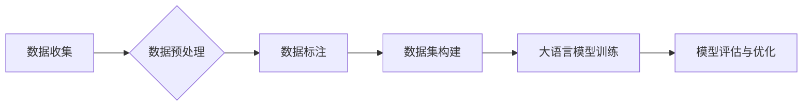

# 大语言模型原理与工程实践：数据的常见类别及其来源

> 关键词：大语言模型，数据类别，数据来源，数据预处理，数据标注，数据集构建，自然语言处理，机器学习

## 1. 背景介绍

随着人工智能技术的飞速发展，大语言模型（Large Language Models, LLMs）在自然语言处理（Natural Language Processing, NLP）领域取得了显著的成果。大语言模型能够理解和生成自然语言，广泛应用于文本分类、机器翻译、问答系统等领域。然而，大语言模型的成功离不开高质量数据的支持。本文将深入探讨大语言模型所需数据的常见类别及其来源，并分析数据预处理和标注的重要性。

## 2. 核心概念与联系

### 2.1 核心概念

- **自然语言处理（NLP）**：自然语言处理是人工智能领域的一个重要分支，旨在使计算机能够理解、解释和生成人类语言。

- **大语言模型（LLMs）**：大语言模型是一种基于深度学习的语言模型，能够理解和生成自然语言，广泛应用于各种NLP任务。

- **数据类别**：数据类别是指数据的不同类型，包括文本数据、语音数据、图像数据等。

- **数据来源**：数据来源是指数据产生的途径，如公开数据集、企业内部数据、用户生成内容等。

### 2.2 架构的 Mermaid 流程图



## 3. 核心算法原理 & 具体操作步骤

### 3.1 算法原理概述

大语言模型的数据处理流程主要包括以下步骤：

1. **数据收集**：收集各种类型的数据，包括文本、语音、图像等。

2. **数据预处理**：对收集到的数据进行清洗、格式化等操作，使其符合模型训练的要求。

3. **数据标注**：对预处理后的数据进行标注，为模型训练提供监督信号。

4. **数据集构建**：将标注后的数据组织成数据集，用于模型训练和评估。

5. **大语言模型训练**：使用构建好的数据集对大语言模型进行训练。

6. **模型评估与优化**：对训练好的模型进行评估，并根据评估结果进行优化。

### 3.2 算法步骤详解

#### 3.2.1 数据收集

数据收集是构建大语言模型的第一步，主要包括以下步骤：

- **确定数据需求**：根据具体任务需求，确定所需数据类型和规模。

- **数据源选择**：选择合适的公开数据集或企业内部数据。

- **数据采集**：通过爬虫、API等方式采集所需数据。

#### 3.2.2 数据预处理

数据预处理主要包括以下步骤：

- **数据清洗**：去除无效数据、重复数据、错误数据等。

- **数据格式化**：将数据转换为统一格式，如文本格式、语音格式、图像格式等。

- **数据增强**：通过数据变换、过采样、欠采样等方法扩充数据集。

#### 3.2.3 数据标注

数据标注主要包括以下步骤：

- **标注方案设计**：根据任务需求设计标注方案，包括标注内容、标注标准等。

- **标注工具选择**：选择合适的标注工具，如在线标注平台、离线标注工具等。

- **标注数据审核**：对标注数据进行审核，确保标注质量。

#### 3.2.4 数据集构建

数据集构建主要包括以下步骤：

- **数据分批次**：将数据集划分为训练集、验证集和测试集。

- **数据格式转换**：将标注后的数据转换为模型训练所需的格式。

- **数据集存储**：将构建好的数据集存储到文件系统或数据库中。

#### 3.2.5 大语言模型训练

大语言模型训练主要包括以下步骤：

- **模型选择**：选择合适的预训练语言模型，如BERT、GPT等。

- **训练参数设置**：设置训练参数，如批大小、学习率、迭代次数等。

- **模型训练**：使用训练集对模型进行训练。

#### 3.2.6 模型评估与优化

模型评估与优化主要包括以下步骤：

- **模型评估**：使用验证集评估模型性能，如准确率、召回率、F1值等。

- **模型优化**：根据评估结果调整模型参数，如学习率、迭代次数等。

- **模型迭代**：重复模型训练和评估过程，直至达到预期效果。

### 3.3 算法优缺点

#### 3.3.1 优点

- **数据驱动**：大语言模型以数据驱动，能够从大量数据中学习到丰富的语言知识。

- **泛化能力强**：大语言模型具有较强的泛化能力，能够适应不同领域的语言任务。

- **性能优异**：大语言模型在NLP任务上取得了优异的性能，如BERT在多项NLP任务上刷新了SOTA。

#### 3.3.2 缺点

- **数据依赖性高**：大语言模型对数据质量要求较高，数据不足或质量差会影响模型性能。

- **训练成本高**：大语言模型的训练需要大量的计算资源和存储空间。

- **模型可解释性差**：大语言模型的决策过程难以解释，难以确定模型为何做出特定决策。

## 4. 数学模型和公式 & 详细讲解 & 举例说明

### 4.1 数学模型构建

大语言模型通常基于深度神经网络（Deep Neural Network, DNN）构建，以下以BERT模型为例进行讲解。

#### 4.1.1 BERT模型架构

BERT模型采用Transformer架构，包括以下层：

- **输入层**：将文本转换为词向量表示。

- **Transformer编码器**：通过自注意力机制（Self-Attention）学习文本的上下文信息。

- **输出层**：输出文本的语义表示。

#### 4.1.2 数学公式

BERT模型的输入层和Transformer编码器层的数学公式如下：

```latex
\begin{align*}
E &= \text{EmbeddingLayer}(X) \\
H &= \text{Encoder}(E) = \text{Transformer}(\text{MultiHeadAttention}(\text{FeedForwardNetwork}(E)))
\end{align*}
```

其中，$E$ 为输入文本的词向量表示，$H$ 为输出文本的语义表示。

### 4.2 公式推导过程

BERT模型的公式推导过程较为复杂，涉及深度学习理论、线性代数、概率论等多个领域。这里简要介绍公式推导的基本思路：

- **词向量表示**：将文本中的词语转换为词向量表示，一般采用词嵌入（Word Embedding）技术。

- **自注意力机制**：自注意力机制通过计算词语之间的相似度，学习词语的上下文信息。

- **Transformer编码器**：Transformer编码器由多个自注意力层和前馈神经网络层堆叠而成。

### 4.3 案例分析与讲解

以下以BERT模型在文本分类任务中的应用为例进行讲解。

#### 4.3.1 文本分类任务

文本分类任务是判断文本所属类别的问题，如情感分析、主题分类等。

#### 4.3.2 模型结构

在文本分类任务中，BERT模型的结构如下：

- **输入层**：将文本转换为词向量表示。

- **Transformer编码器**：通过自注意力机制学习文本的上下文信息。

- **分类器**：将Transformer编码器的输出作为输入，使用线性层进行分类。

#### 4.3.3 模型训练与评估

1. **数据准备**：将文本数据转换为词向量表示，并进行标注。

2. **模型训练**：使用训练数据对BERT模型进行训练。

3. **模型评估**：使用验证数据评估模型性能，如准确率、召回率、F1值等。

## 5. 项目实践：代码实例和详细解释说明

### 5.1 开发环境搭建

1. 安装Python 3.7或更高版本。

2. 安装PyTorch、transformers库。

### 5.2 源代码详细实现

以下是一个使用PyTorch和transformers库进行文本分类任务的示例代码：

```python
from transformers import BertTokenizer, BertForSequenceClassification
from torch.utils.data import DataLoader, Dataset
import torch

# 定义数据集类
class TextDataset(Dataset):
    def __init__(self, texts, labels):
        self.texts = texts
        self.labels = labels
        self.tokenizer = BertTokenizer.from_pretrained('bert-base-uncased')

    def __len__(self):
        return len(self.texts)

    def __getitem__(self, idx):
        text = self.texts[idx]
        encoded_input = self.tokenizer.encode_plus(text, add_special_tokens=True, return_tensors='pt')
        labels = torch.tensor(self.labels[idx])
        return encoded_input, labels

# 加载数据集
texts = ['This is a good day.', 'This is a bad day.']
labels = [1, 0]
dataset = TextDataset(texts, labels)

# 加载模型
model = BertForSequenceClassification.from_pretrained('bert-base-uncased')

# 训练模型
model.train()
data_loader = DataLoader(dataset, batch_size=2, shuffle=True)
optimizer = torch.optim.AdamW(model.parameters(), lr=5e-5)

for epoch in range(3):
    for batch in data_loader:
        input_ids, labels = batch
        optimizer.zero_grad()
        outputs = model(input_ids, labels=labels)
        loss = outputs.loss
        loss.backward()
        optimizer.step()

# 评估模型
model.eval()
with torch.no_grad():
    predictions = model(input_ids)
    print(predictions.argmax(dim=1))
```

### 5.3 代码解读与分析

上述代码展示了使用PyTorch和transformers库进行文本分类任务的完整流程。首先，定义了一个数据集类`TextDataset`，用于加载和预处理文本数据。然后，加载预训练的BERT模型和分词器。接下来，创建数据加载器`DataLoader`，用于将数据集划分为批次进行训练。最后，使用AdamW优化器对模型进行训练，并使用测试数据评估模型性能。

## 6. 实际应用场景

大语言模型在多个实际应用场景中取得了显著的成果，以下列举几个常见应用场景：

- **情感分析**：判断文本的情感倾向，如正面、负面、中性。

- **主题分类**：将文本分类到预定义的主题类别，如科技、娱乐、体育等。

- **问答系统**：回答用户提出的问题，如问答机器人、智能客服等。

- **机器翻译**：将一种语言的文本翻译成另一种语言。

- **文本摘要**：将长文本压缩成简短的摘要。

## 7. 工具和资源推荐

### 7.1 学习资源推荐

1. 《深度学习自然语言处理》课程：斯坦福大学开设的NLP课程，提供丰富的教学资源和实践项目。

2. 《BERT: Pre-training of Deep Bidirectional Transformers for Language Understanding》论文：BERT模型的原论文，详细介绍了BERT模型的设计和实现。

3. 《Natural Language Processing with Transformers》书籍：介绍了如何使用Transformers库进行NLP任务开发。

### 7.2 开发工具推荐

1. PyTorch：开源的深度学习框架，适合快速迭代研究。

2. TensorFlow：开源的深度学习框架，适合大规模工程应用。

3. Hugging Face Transformers库：集成了大量预训练语言模型和工具，方便NLP任务开发。

### 7.3 相关论文推荐

1. 《BERT: Pre-training of Deep Bidirectional Transformers for Language Understanding》

2. 《Generative Pre-trained Transformers》

3. 《Transformers: State-of-the-Art NLP through Attention Mechanisms》

## 8. 总结：未来发展趋势与挑战

### 8.1 研究成果总结

本文对大语言模型所需数据的常见类别及其来源进行了探讨，并分析了数据预处理和标注的重要性。通过对核心概念、算法原理、数学模型、项目实践的介绍，帮助读者了解大语言模型的数据处理流程。

### 8.2 未来发展趋势

1. **数据质量提升**：随着数据采集和标注技术的进步，数据质量将得到进一步提升。

2. **模型轻量化**：为了降低模型对计算资源的依赖，模型轻量化将成为重要研究方向。

3. **多模态融合**：将文本、语音、图像等多模态信息进行融合，提升模型对现实世界的理解能力。

### 8.3 面临的挑战

1. **数据标注成本高**：高质量的数据标注需要大量人力和时间，制约了大语言模型的发展。

2. **模型可解释性差**：大语言模型的决策过程难以解释，难以确定模型为何做出特定决策。

3. **模型偏见**：大语言模型可能学习到有害或歧视性信息，需要采取措施消除模型偏见。

### 8.4 研究展望

未来，大语言模型在NLP领域将继续发挥重要作用，并为其他领域带来新的突破。同时，针对数据标注、模型可解释性、模型偏见等问题，需要进一步加强研究，推动大语言模型的健康发展。

## 9. 附录：常见问题与解答

**Q1：大语言模型需要哪些类型的数据？**

A：大语言模型主要需要文本数据，但也可能需要语音、图像等多模态数据，具体取决于具体任务的需求。

**Q2：如何提高数据标注质量？**

A：提高数据标注质量可以从以下几个方面入手：

1. 选择经验丰富的标注人员。

2. 设计清晰的标注规范和标准。

3. 定期对标注人员进行培训和考核。

**Q3：如何解决大语言模型的偏见问题？**

A：解决大语言模型的偏见问题需要从数据、算法、应用等多个方面入手：

1. 使用更加多元化的数据集。

2. 引入对抗训练等技术，提高模型对对抗样本的鲁棒性。

3. 设计无偏见或低偏见的训练目标。

**Q4：大语言模型的未来发展趋势是什么？**

A：大语言模型的未来发展趋势包括：

1. 数据质量提升。

2. 模型轻量化。

3. 多模态融合。

4. 模型可解释性增强。

5. 模型偏见消除。

---

作者：禅与计算机程序设计艺术 / Zen and the Art of Computer Programming