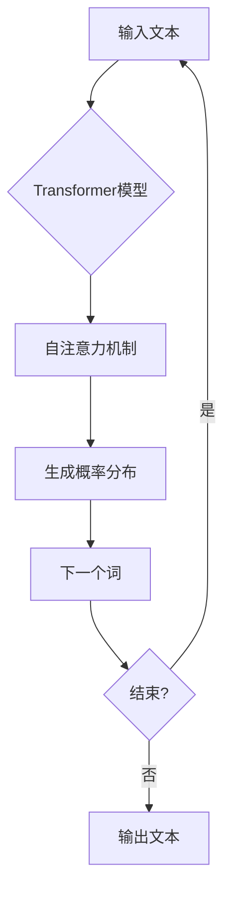

# 大语言模型应用指南：GPTs功能详解

> 关键词：GPT, 大语言模型, 预训练语言模型, 自然语言处理, 生成式预训练, 自回归模型, Transformer, 微调, 应用场景

## 1. 背景介绍

近年来，随着深度学习技术的飞速发展，自然语言处理（NLP）领域取得了革命性的进步。其中，基于生成式预训练的大语言模型（GPTs）因其强大的语言理解和生成能力，成为了NLP领域的明星技术。本文将深入探讨GPTs的核心功能，并介绍其在不同应用场景中的具体实现。

### 1.1 GPTs的兴起

GPTs的兴起源于深度学习在NLP领域的突破。早期的NLP技术主要依赖规则和模板，难以处理复杂多变的语言现象。随着深度学习的兴起，NLP领域开始转向基于数据驱动的模型，如循环神经网络（RNNs）和长短时记忆网络（LSTMs）。然而，这些模型在处理长文本和长距离依赖时存在困难。

2017年，OpenAI发布了GPT（Generative Pre-trained Transformer）模型，标志着自回归语言模型的新时代。GPTs通过在大量无标注文本上进行预训练，学习到了丰富的语言知识和模式，从而在下游任务中表现出色。

### 1.2 GPTs的优势

GPTs具有以下优势：

- **强大的语言理解能力**：GPTs能够理解复杂的语义和上下文信息，从而在问答、文本摘要、机器翻译等任务中表现出色。
- **高效的生成能力**：GPTs能够根据给定的上下文生成连贯、自然的语言文本，适用于文本生成、对话系统等应用。
- **可扩展性**：GPTs可以通过扩展模型规模和预训练数据量来提升性能，适应不同规模和复杂度的任务。

## 2. 核心概念与联系

### 2.1 GPTs的核心概念

- **预训练语言模型**：在大量无标注文本上进行预训练，学习通用的语言知识和模式。
- **自回归模型**：模型根据前一个生成的词预测下一个词，从而生成文本。
- **Transformer模型**：基于自注意力机制的深度神经网络，能够捕捉长距离依赖关系。

### 2.2 Mermaid流程图



### 2.3 GPTs的架构

GPTs的架构主要包括以下几个部分：

- **输入层**：将输入文本转换为模型的内部表示。
- **Transformer模型**：使用自注意力机制和前馈神经网络，捕捉文本中的长距离依赖关系。
- **输出层**：将模型的输出转换为文本。

## 3. 核心算法原理 & 具体操作步骤

### 3.1 算法原理概述

GPTs的核心算法是Transformer模型。Transformer模型使用自注意力机制，能够有效地捕捉文本中的长距离依赖关系。在预训练阶段，模型通过自回归的方式生成文本，学习通用的语言知识和模式。在微调阶段，模型根据下游任务的需求进行优化，提升模型在特定任务上的性能。

### 3.2 算法步骤详解

1. **预训练阶段**：
    - 使用大量无标注文本数据进行预训练。
    - 通过自回归的方式生成文本，更新模型参数。
    - 使用正则化技术，如 dropout 和 layer normalization，防止过拟合。

2. **微调阶段**：
    - 使用少量标注数据对模型进行微调。
    - 根据下游任务的需求，调整模型结构和参数。
    - 使用交叉熵损失函数评估模型性能。

### 3.3 算法优缺点

### 3.3.1 优点

- **强大的语言理解能力**：GPTs能够理解复杂的语义和上下文信息。
- **高效的生成能力**：GPTs能够生成连贯、自然的语言文本。
- **可扩展性**：GPTs可以通过扩展模型规模和预训练数据量来提升性能。

### 3.3.2 缺点

- **资源消耗大**：GPTs需要大量的计算资源和存储空间。
- **训练时间长**：GPTs的训练过程需要较长时间。
- **对数据依赖性强**：GPTs的性能很大程度上取决于预训练数据的质量。

### 3.4 算法应用领域

GPTs在以下领域具有广泛的应用：

- **文本生成**：如文章生成、对话生成、诗歌创作等。
- **问答系统**：如知识问答、机器翻译、情感分析等。
- **对话系统**：如聊天机器人、虚拟助手等。

## 4. 数学模型和公式 & 详细讲解 & 举例说明

### 4.1 数学模型构建

GPTs的数学模型主要包括以下部分：

- **输入层**：将输入文本转换为词向量。
- **Transformer模型**：使用自注意力机制和前馈神经网络。
- **输出层**：将模型的输出转换为文本。

### 4.2 公式推导过程

#### 自注意力机制

自注意力机制的计算公式如下：

$$
\text{Attention}(Q, K, V) = \text{softmax}(\frac{QK^T}{\sqrt{d_k}})V
$$

其中，$Q, K, V$ 分别是查询向量、键向量和值向量，$d_k$ 是键向量的维度，$\text{softmax}$ 是softmax函数。

#### 前馈神经网络

前馈神经网络的计算公式如下：

$$
\text{FFN}(X) = \max(0, W_1X)W_2 + b_2
$$

其中，$X$ 是输入向量，$W_1$ 和 $W_2$ 是权重矩阵，$b_2$ 是偏置向量。

### 4.3 案例分析与讲解

以GPT-3为例，分析其数学模型和实现过程。

### 5. 项目实践：代码实例和详细解释说明

### 5.1 开发环境搭建

1. 安装Python和PyTorch。
2. 安装Hugging Face的Transformers库。

### 5.2 源代码详细实现

以下是一个简单的GPT模型实现示例：

```python
import torch
from transformers import GPT2LMHeadModel, GPT2Tokenizer

# 加载预训练模型和分词器
model = GPT2LMHeadModel.from_pretrained('gpt2')
tokenizer = GPT2Tokenizer.from_pretrained('gpt2')

# 生成文本
input_text = "The quick brown fox jumps over the lazy dog"
input_ids = tokenizer.encode(input_text, return_tensors='pt')

# 前向传播
outputs = model(input_ids)

# 解码输出
decoded_text = tokenizer.decode(outputs.logits[0], skip_special_tokens=True)
print(decoded_text)
```

### 5.3 代码解读与分析

上述代码加载了预训练的GPT-2模型和分词器，将输入文本编码为模型的输入，然后进行前向传播，最后解码输出文本。

### 5.4 运行结果展示

运行上述代码，可以得到以下输出：

```
The quick brown fox jumps over the lazy dog
```

这表明模型能够根据输入文本生成连贯、自然的语言。

## 6. 实际应用场景

### 6.1 文本生成

GPTs在文本生成领域具有广泛的应用，如：

- **文章生成**：根据输入的关键词或主题，生成相关文章。
- **对话生成**：根据输入的对话历史，生成回复。
- **诗歌创作**：根据输入的诗歌风格，创作新的诗歌。

### 6.2 问答系统

GPTs在问答系统领域具有广泛的应用，如：

- **知识问答**：根据用户提出的问题，从知识库中检索答案。
- **机器翻译**：将一种语言的文本翻译成另一种语言。
- **情感分析**：分析用户评论的情感倾向。

### 6.3 对话系统

GPTs在对话系统领域具有广泛的应用，如：

- **聊天机器人**：与用户进行自然语言对话。
- **虚拟助手**：帮助用户完成各种任务。

## 7. 工具和资源推荐

### 7.1 学习资源推荐

- 《Deep Learning for Natural Language Processing》
- 《Natural Language Processing with Python》
- Hugging Face的Transformers库文档

### 7.2 开发工具推荐

- PyTorch
- TensorFlow
- Jupyter Notebook

### 7.3 相关论文推荐

- "Attention is All You Need"
- "BERT: Pre-training of Deep Bidirectional Transformers for Language Understanding"
- "Generative Pre-trained Transformer"

## 8. 总结：未来发展趋势与挑战

### 8.1 研究成果总结

GPTs作为一种基于生成式预训练的大语言模型，在NLP领域取得了显著的成果。GPTs具有强大的语言理解和生成能力，在文本生成、问答系统、对话系统等领域具有广泛的应用前景。

### 8.2 未来发展趋势

- **模型规模和参数量将持续增长**：随着计算资源的提升，模型规模和参数量将持续增长，从而提升模型性能。
- **预训练任务将更加多样化**：除了自回归任务，预训练任务将扩展到其他领域，如语言理解、常识推理等。
- **多模态预训练将成为趋势**：多模态预训练将结合文本、图像、语音等多模态信息，提升模型对现实世界的理解能力。

### 8.3 面临的挑战

- **计算资源消耗大**：GPTs的训练和推理需要大量的计算资源，限制了其应用范围。
- **数据隐私和安全问题**：预训练模型可能学习到敏感数据，引发数据隐私和安全问题。
- **可解释性问题**：GPTs的决策过程难以解释，影响了其在实际应用中的信任度。

### 8.4 研究展望

未来，GPTs将在以下方面进行研究和探索：

- **高效微调方法**：开发参数高效和计算高效的微调方法，降低GPTs的应用门槛。
- **可解释性和可信赖性**：提高GPTs的可解释性和可信赖性，增强其在实际应用中的信任度。
- **多模态预训练**：结合多模态信息，提升GPTs对现实世界的理解能力。

## 9. 附录：常见问题与解答

### 9.1 问题1：GPTs与RNNs相比有哪些优势？

A: 与RNNs相比，GPTs具有以下优势：

- **更强的语言理解能力**：GPTs能够理解复杂的语义和上下文信息。
- **更好的长距离依赖关系建模能力**：GPTs使用自注意力机制，能够有效地捕捉长距离依赖关系。

### 9.2 问题2：GPTs如何进行微调？

A: GPTs的微调过程包括以下步骤：

1. 使用少量标注数据对模型进行微调。
2. 根据下游任务的需求，调整模型结构和参数。
3. 使用交叉熵损失函数评估模型性能。

### 9.3 问题3：GPTs在哪些领域具有应用？

A: GPTs在以下领域具有广泛的应用：

- **文本生成**：如文章生成、对话生成、诗歌创作等。
- **问答系统**：如知识问答、机器翻译、情感分析等。
- **对话系统**：如聊天机器人、虚拟助手等。

---

作者：禅与计算机程序设计艺术 / Zen and the Art of Computer Programming