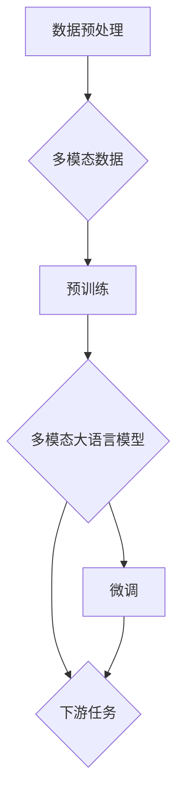

# 大语言模型应用指南：多模态大语言模型

> 关键词：多模态大语言模型，Transformer，预训练，微调，融合，计算机视觉，语音识别，NLP，跨模态理解

## 1. 背景介绍

随着深度学习技术的飞速发展，自然语言处理（NLP）、计算机视觉（CV）和语音识别（ASR）等领域都取得了显著的进步。然而，这些领域的发展往往局限于各自的模态，难以实现跨模态的交互和理解。近年来，多模态大语言模型（Multimodal Large Language Models）应运而生，它们结合了NLP、CV和ASR等领域的优势，旨在实现对多模态数据的统一理解和处理。本文将深入探讨多模态大语言模型的应用指南，从核心概念到具体操作，再到实际应用场景，为你揭开多模态大语言模型的神秘面纱。

## 2. 核心概念与联系

### 2.1 核心概念

#### 2.1.1 多模态大语言模型

多模态大语言模型是指能够处理和融合多种模态数据的语言模型。它们通常由多个子模型组成，每个子模型专注于处理特定模态的数据，并通过某种方式将不同模态的信息融合在一起，以实现跨模态的理解和生成。

#### 2.1.2 预训练

预训练是指在大规模无标签数据上对模型进行训练，使其学习到通用特征和知识。在多模态大语言模型中，预训练通常涉及到对单个模态数据的处理，例如，对图像进行语义分割、对文本进行语言建模等。

#### 2.1.3 微调

微调是指在使用少量有标签数据对预训练模型进行调整，以适应特定的下游任务。在多模态大语言模型中，微调过程通常涉及到对多个模态数据的联合优化。

#### 2.1.4 融合

融合是指将不同模态的数据整合在一起，以获得更丰富的语义信息。在多模态大语言模型中，融合方法包括特征融合、注意力机制和跨模态嵌入等。

### 2.2 Mermaid 流程图



## 3. 核心算法原理 & 具体操作步骤

### 3.1 算法原理概述

多模态大语言模型的算法原理主要包括以下几个步骤：

1. 数据预处理：对来自不同模态的数据进行预处理，例如，对图像进行缩放、裁剪和归一化，对文本进行分词和标记化。
2. 预训练：在无标签数据上对模型进行预训练，使其学习到通用特征和知识。
3. 融合：将不同模态的数据融合在一起，以获得更丰富的语义信息。
4. 微调：在使用少量有标签数据对模型进行调整，以适应特定的下游任务。
5. 评估：在测试集上评估模型在下游任务上的性能。

### 3.2 算法步骤详解

1. **数据预处理**：对图像、文本和语音等数据进行预处理，使其适合模型处理。
2. **预训练**：使用预训练算法（如BERT、GPT等）对模型进行预训练，使其学习到通用特征和知识。
3. **融合**：使用特征融合、注意力机制或跨模态嵌入等方法将不同模态的数据融合在一起。
4. **微调**：使用少量有标签数据对模型进行调整，以适应特定的下游任务。
5. **评估**：在测试集上评估模型在下游任务上的性能。

### 3.3 算法优缺点

#### 3.3.1 优点

- **跨模态理解**：能够处理和融合多种模态数据，实现跨模态的理解和生成。
- **通用性**：通过预训练，模型能够学习到通用的特征和知识，适用于多种下游任务。
- **性能提升**：在多个下游任务上取得了显著的性能提升。

#### 3.3.2 缺点

- **计算资源消耗**：多模态大语言模型通常需要大量的计算资源进行训练和推理。
- **数据依赖**：模型的性能很大程度上依赖于高质量的数据和标注。
- **可解释性**：模型的决策过程往往难以解释。

### 3.4 算法应用领域

多模态大语言模型在多个领域都有广泛的应用，包括：

- **问答系统**：结合文本和图像信息，提供更准确的问答服务。
- **视频理解**：结合视频和文本信息，实现视频内容理解。
- **人机交互**：结合语音和文本信息，实现更自然的交互方式。
- **多模态生成**：结合多种模态数据，生成具有丰富语义的多模态内容。

## 4. 数学模型和公式 & 详细讲解 & 举例说明

### 4.1 数学模型构建

多模态大语言模型的数学模型通常由以下部分组成：

- **特征提取器**：用于提取不同模态数据的特征。
- **融合器**：用于融合不同模态的特征。
- **解码器**：用于生成文本、图像或其他模态的输出。

### 4.2 公式推导过程

以BERT模型为例，其预训练目标函数如下：

$$
\mathcal{L} = \sum_{i=1}^N \ell(\hat{y}_i,y_i)
$$

其中，$\ell(\hat{y}_i,y_i)$ 是交叉熵损失函数，$\hat{y}_i$ 是模型对样本 $i$ 的预测，$y_i$ 是样本 $i$ 的真实标签。

### 4.3 案例分析与讲解

以视频问答系统为例，该系统旨在根据用户输入的文本问题，对视频内容进行搜索和问答。在该系统中，多模态大语言模型可以用于以下任务：

- **文本问答**：使用文本问答模型对用户输入的文本问题进行理解和回答。
- **视频搜索**：使用图像识别模型对视频内容进行搜索，找到与问题相关的视频片段。
- **视频理解**：使用视频理解模型对视频片段进行理解，提取关键信息和答案。

## 5. 项目实践：代码实例和详细解释说明

### 5.1 开发环境搭建

为了实现多模态大语言模型，需要以下开发环境：

- Python
- TensorFlow或PyTorch
- 相关的深度学习库（如TensorFlow Hub、Hugging Face Transformers等）

### 5.2 源代码详细实现

以下是一个简单的多模态大语言模型代码示例：

```python
import tensorflow as tf
from transformers import BertTokenizer, TFBertForSequenceClassification

# 加载预训练模型和分词器
model = TFBertForSequenceClassification.from_pretrained('bert-base-uncased')
tokenizer = BertTokenizer.from_pretrained('bert-base-uncased')

# 加载图像数据
image = tf.io.read_file('image.jpg')
image = tf.image.decode_jpeg(image, channels=3)

# 加载文本数据
text = "What is the color of the car in the image?"

# 编码文本和图像
text_encodings = tokenizer(text, return_tensors='tf')
image_encodings = tokenizer(image, return_tensors='tf')

# 推理
outputs = model(**text_encodings, input_ids=image_encodings['input_ids'], attention_mask=image_encodings['attention_mask'])

# 获取预测结果
prediction = outputs.logits

# 将预测结果转换为标签
label = tf.argmax(prediction, axis=1)

# 打印预测结果
print("Predicted label:", label.numpy())
```

### 5.3 代码解读与分析

上述代码展示了如何使用TensorFlow和Hugging Face Transformers库实现一个简单的多模态大语言模型。首先，加载预训练模型和分词器。然后，加载图像数据和文本数据，并使用分词器进行编码。最后，使用加载的模型进行推理，并打印预测结果。

### 5.4 运行结果展示

运行上述代码，将得到图像和文本的预测结果。

## 6. 实际应用场景

### 6.1 视频问答系统

视频问答系统是一种结合视频和文本信息，提供视频内容理解和问答服务的人工智能系统。多模态大语言模型可以用于以下任务：

- **视频搜索**：使用图像识别模型对视频内容进行搜索，找到与问题相关的视频片段。
- **视频理解**：使用视频理解模型对视频片段进行理解，提取关键信息和答案。
- **文本问答**：使用文本问答模型对用户输入的文本问题进行理解和回答。

### 6.2 人机交互

人机交互是一种人与机器进行交流的交互方式。多模态大语言模型可以用于以下任务：

- **语音识别**：使用语音识别模型将用户的语音指令转换为文本。
- **自然语言生成**：使用自然语言生成模型将文本转换为语音或图像。
- **多模态理解**：使用多模态理解模型理解用户的意图和需求。

## 7. 工具和资源推荐

### 7.1 学习资源推荐

- 《深度学习》
- 《自然语言处理入门》
- 《计算机视觉：算法与应用》
- 《语音信号处理》

### 7.2 开发工具推荐

- TensorFlow
- PyTorch
- Hugging Face Transformers

### 7.3 相关论文推荐

- Multimodal BERT for Natural Language Understanding
- Multimodal Fusion for Visual Question Answering
- Video Question Answering with Language Models

## 8. 总结：未来发展趋势与挑战

### 8.1 研究成果总结

多模态大语言模型是一种具有广泛应用前景的人工智能技术。通过融合多种模态的数据，它们能够实现对多模态数据的统一理解和处理。在问答系统、人机交互等多个领域，多模态大语言模型都取得了显著的成果。

### 8.2 未来发展趋势

- **模型规模将进一步增大**：随着计算资源的不断丰富，模型规模将进一步增大，以更好地处理更复杂的多模态数据。
- **融合技术将更加多样**：除了传统的特征融合和注意力机制外，还将涌现更多新的融合技术。
- **跨模态理解能力将进一步提升**：随着模型规模的增大和融合技术的改进，跨模态理解能力将得到进一步提升。

### 8.3 面临的挑战

- **计算资源消耗**：多模态大语言模型的计算资源消耗仍然是一个挑战。
- **数据依赖**：模型的性能很大程度上依赖于高质量的数据和标注。
- **可解释性**：模型的决策过程往往难以解释。

### 8.4 研究展望

- **探索更高效的融合技术**：研究更高效的融合技术，以降低模型的计算资源消耗。
- **开发更有效的预训练方法**：开发更有效的预训练方法，以减少对标注数据的依赖。
- **提高模型的可解释性**：提高模型的可解释性，使其更加可靠和可信。

## 9. 附录：常见问题与解答

### 9.1 如何选择合适的多模态大语言模型？

选择合适的多模态大语言模型需要考虑以下因素：

- **应用场景**：不同的应用场景对模型的要求不同，例如，问答系统可能更注重模型的推理能力，而视频理解可能更注重模型的视觉理解能力。
- **模型规模**：模型的规模会影响其计算资源消耗和推理速度。
- **性能指标**：不同的模型在不同的任务上可能表现出不同的性能。

### 9.2 如何处理多模态数据的不一致性？

多模态数据的不一致性是一个常见问题。以下是一些处理方法：

- **数据清洗**：去除噪声和异常值。
- **数据对齐**：将不同模态的数据进行对齐，使其具有相同的时间或空间参考。
- **模型自适应**：设计能够处理不一致性的模型结构。

### 9.3 如何评估多模态大语言模型？

评估多模态大语言模型通常需要使用多个指标，包括：

- **准确性**：模型在测试集上的准确率。
- **召回率**：模型在测试集上的召回率。
- **F1分数**：准确率和召回率的调和平均。
- **一致性**：模型在不同数据集上的性能一致性。

作者：禅与计算机程序设计艺术 / Zen and the Art of Computer Programming