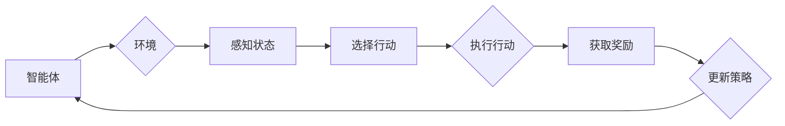

# 强化学习Reinforcement Learning模型评估与性能监测技术

> 关键词：强化学习，模型评估，性能监测，性能指标，实时监控，离线分析，强化学习框架，数据驱动，动态调整

## 1. 背景介绍

强化学习（Reinforcement Learning，RL）作为一种重要的机器学习方法，已经在游戏、机器人、推荐系统、自动驾驶等多个领域取得了显著的成果。然而，随着强化学习模型的复杂性不断提高，如何有效地评估和监测模型的性能成为了研究者和工程师面临的一大挑战。本文将深入探讨强化学习模型评估与性能监测技术，旨在为读者提供全面、深入的理解和实用的指导。

### 1.1 问题的由来

强化学习模型通常需要大量的训练数据和时间进行学习，而且模型的行为往往与人类直觉不符。这使得评估和监测强化学习模型的性能变得尤为重要。以下是一些常见的评估与监测挑战：

- **多目标优化**：强化学习问题往往涉及多个目标，如何综合评估多个目标的性能成为一个难题。
- **长期价值评估**：许多强化学习问题需要考虑长期价值，如何评估和比较不同策略的长期性能是一个挑战。
- **不可观测状态**：在某些应用场景中，状态信息不可观测，这使得评估和监测更加困难。
- **动态环境**：环境状态可能随时间变化，如何适应这种动态变化，保持模型性能是一个挑战。

### 1.2 研究现状

针对上述挑战，研究者们提出了多种评估与监测技术，包括：

- **性能指标**：通过设计合适的性能指标来评估模型在不同场景下的表现。
- **离线分析**：在模型训练完成后，对模型的历史数据进行离线分析，以评估其性能。
- **实时监控**：在模型运行过程中，实时收集模型的状态信息，以监测模型性能的实时变化。
- **数据驱动调整**：根据模型性能的监测结果，动态调整模型参数或策略。

### 1.3 研究意义

有效地评估和监测强化学习模型的性能，对于以下方面具有重要意义：

- **模型优化**：通过评估和监测，可以发现模型性能的不足，从而指导模型优化。
- **算法改进**：针对评估和监测中发现的问题，可以改进强化学习算法。
- **实际应用**：有助于将强化学习模型应用到实际场景中，提高模型在实际应用中的性能。

### 1.4 本文结构

本文将按照以下结构展开：

- **第2章**：介绍强化学习的基本概念和核心算法。
- **第3章**：探讨强化学习模型评估与性能监测的关键技术。
- **第4章**：通过数学模型和公式详细讲解性能监测的原理。
- **第5章**：给出性能监测的代码实例和详细解释。
- **第6章**：分析强化学习模型在实际应用场景中的性能监测。
- **第7章**：推荐性能监测相关的学习资源、开发工具和参考文献。
- **第8章**：总结研究成果，展望未来发展趋势与挑战。

## 2. 核心概念与联系

### 2.1 强化学习基本概念

强化学习是一种使智能体（Agent）通过与环境的交互来学习如何采取最优行动以实现目标的方法。以下是强化学习的一些核心概念：

- **智能体（Agent）**：执行行动并从环境中获得奖励的学习实体。
- **环境（Environment）**：智能体所处的世界，智能体可以通过与环境交互来获取状态信息。
- **状态（State）**：智能体所处的环境状态。
- **行动（Action）**：智能体可以采取的行动。
- **奖励（Reward）**：智能体采取行动后，环境给予的奖励或惩罚。
- **策略（Policy）**：智能体根据当前状态选择行动的规则。
- **价值函数（Value Function）**：表示在特定状态下采取特定行动的期望回报。
- **策略梯度（Policy Gradient）**：通过学习策略参数来最大化期望回报的方法。

### 2.2 强化学习核心算法

强化学习的主要算法包括：

- **价值迭代（Value Iteration）**：通过迭代更新价值函数，直到收敛。
- **策略迭代（Policy Iteration）**：通过迭代更新策略，直到收敛。
- **Q学习（Q-Learning）**：通过学习Q值函数来选择最优策略。
- **深度Q网络（Deep Q-Network，DQN）**：将Q学习与深度神经网络相结合，适用于复杂环境。
- **策略梯度方法（Policy Gradient Methods）**：直接学习策略参数来最大化期望回报。
- **确定性策略梯度（Deterministic Policy Gradient，DPG）**：学习确定性策略，适用于连续动作空间。

### 2.3 Mermaid 流程图

以下是一个强化学习框架的 Mermaid 流程图：



## 3. 核心算法原理 & 具体操作步骤

### 3.1 算法原理概述

强化学习模型评估与性能监测的核心在于：

- **性能指标**：设计合适的性能指标来评估模型在不同场景下的表现。
- **离线分析**：在模型训练完成后，对模型的历史数据进行离线分析。
- **实时监控**：在模型运行过程中，实时收集模型的状态信息。
- **数据驱动调整**：根据模型性能的监测结果，动态调整模型参数或策略。

### 3.2 算法步骤详解

#### 3.2.1 设计性能指标

设计性能指标是评估强化学习模型性能的第一步。性能指标应满足以下条件：

- **可衡量**：能够量化模型的表现。
- **可解释**：指标背后的原理易于理解。
- **可比较**：不同模型的性能可以进行比较。

常见的性能指标包括：

- **平均奖励**：在训练过程中，智能体获得的平均奖励。
- **成功率**：智能体成功完成任务的次数与总尝试次数的比值。
- **收敛速度**：模型性能提升的速度。
- **稳定性**：模型在不同环境或状态下的性能变化。

#### 3.2.2 离线分析

离线分析是指对模型训练完成后的历史数据进行分析。以下是一些常用的离线分析方法：

- **性能曲线**：绘制平均奖励随时间的变化曲线，观察模型性能的收敛情况。
- **状态分布**：分析智能体在不同状态下的行为，了解模型的学习过程。
- **行动分布**：分析智能体在不同状态下的行动分布，了解模型的行为模式。

#### 3.2.3 实时监控

实时监控是指在整个训练过程中，持续收集模型的状态信息。以下是一些常用的实时监控方法：

- **日志记录**：记录模型的状态信息，如状态、行动、奖励等。
- **性能指标监控**：实时监控模型的关键性能指标，如平均奖励、成功率等。
- **异常检测**：检测模型行为异常，如奖励异常、状态异常等。

#### 3.2.4 数据驱动调整

数据驱动调整是指根据模型性能的监测结果，动态调整模型参数或策略。以下是一些常用的数据驱动调整方法：

- **参数调整**：根据性能指标的变化，调整模型参数。
- **策略调整**：根据行动分布的变化，调整智能体的策略。
- **数据增强**：根据模型学习到的知识，生成新的训练数据。

### 3.3 算法优缺点

#### 3.3.1 优点

- **全面性**：综合考虑了多个性能指标和多个分析维度。
- **灵活性**：可以根据不同的需求调整分析和调整方法。
- **动态性**：可以实时监控模型性能，并根据结果进行调整。

#### 3.3.2 缺点

- **复杂性**：需要设计合适的性能指标和分析方法。
- **计算成本**：实时监控和分析需要大量的计算资源。
- **数据依赖**：模型的评估和调整依赖于历史数据和实时数据。

### 3.4 算法应用领域

强化学习模型评估与性能监测技术可以应用于以下领域：

- **游戏**：评估和优化游戏AI的性能。
- **机器人**：监控和控制机器人的行为。
- **推荐系统**：评估和优化推荐系统的性能。
- **自动驾驶**：评估和优化自动驾驶汽车的性能。

## 4. 数学模型和公式 & 详细讲解 & 举例说明

### 4.1 数学模型构建

强化学习模型评估与性能监测的数学模型主要包括：

- **价值函数**：表示在特定状态下采取特定行动的期望回报。
- **策略**：智能体根据当前状态选择行动的规则。
- **奖励**：智能体采取行动后，环境给予的奖励或惩罚。

以下是一些常用的数学公式：

#### 4.1.1 价值函数

$$
V(s,a) = \sum_{t=0}^{\infty} \gamma^t R(s,a)
$$

其中，$s$ 表示状态，$a$ 表示行动，$R(s,a)$ 表示采取行动 $a$ 在状态 $s$ 下的即时奖励，$\gamma$ 表示折扣因子。

#### 4.1.2 策略

$$
\pi(a|s) = \frac{e^{\alpha(s,a)}}{\sum_{a'} e^{\alpha(s,a')}}
$$

其中，$\alpha(s,a)$ 表示策略梯度，$\pi(a|s)$ 表示在状态 $s$ 下采取行动 $a$ 的概率。

#### 4.1.3 奖励

$$
R(s,a) = \begin{cases} 
r & \text{if } s' \text{ is a terminal state} \\
0 & \text{otherwise}
\end{cases}
$$

其中，$r$ 表示奖励，$s'$ 表示采取行动 $a$ 后的状态。

### 4.2 公式推导过程

以下以Q学习为例，讲解价值函数和策略的推导过程。

#### 4.2.1 价值函数推导

Q学习的目标是学习Q值函数 $Q(s,a)$，表示在状态 $s$ 下采取行动 $a$ 的期望回报。Q学习的目标函数为：

$$
J(Q) = \sum_{s,a} Q(s,a) \pi(a|s)
$$

其中，$\pi(a|s)$ 表示在状态 $s$ 下采取行动 $a$ 的概率。

对目标函数进行求导，得到：

$$
\frac{\partial J(Q)}{\partial Q(s,a)} = \pi(a|s)
$$

因此，Q学习的目标是最大化目标函数 $J(Q)$，即：

$$
Q(s,a) = \mathop{\arg\max}_{Q} J(Q)
$$

#### 4.2.2 策略推导

策略梯度方法的目标是学习策略参数 $\alpha(s,a)$，使得策略 $\pi(a|s)$ 能够最大化期望回报。策略梯度方法的目标函数为：

$$
J(\alpha) = \sum_{s,a} R(s,a) \pi(a|s)
$$

其中，$\pi(a|s)$ 表示在状态 $s$ 下采取行动 $a$ 的概率。

对目标函数进行求导，得到：

$$
\frac{\partial J(\alpha)}{\partial \alpha(s,a)} = R(s,a) \pi(a|s)
$$

因此，策略梯度方法的目标是最大化目标函数 $J(\alpha)$，即：

$$
\alpha(s,a) = \mathop{\arg\max}_{\alpha} J(\alpha)
$$

### 4.3 案例分析与讲解

以下以一个简单的机器人导航问题为例，讲解强化学习模型评估与性能监测的应用。

假设有一个机器人需要在二维平面上从起点 $s_0$ 移动到终点 $s_1$。机器人可以向上、下、左、右移动，每个方向移动的距离为1个单位。机器人的行动空间为 $A = \{u, d, l, r\}$，其中 $u$ 表示向上移动，$d$ 表示向下移动，$l$ 表示向左移动，$r$ 表示向右移动。

环境状态空间为 $S = \{s_0, s_1, s_2, s_3\}$，其中 $s_0$ 表示起点，$s_1$ 表示终点，$s_2$ 和 $s_3$ 表示中间状态。

奖励函数为 $R(s,a) = -1$，表示每次行动都会获得-1的奖励。

目标函数为 $J(\pi) = \sum_{s,a} \pi(a|s) R(s,a)$，即最大化期望回报。

我们可以使用Q学习或策略梯度方法来训练一个导航策略。

## 5. 项目实践：代码实例和详细解释说明

### 5.1 开发环境搭建

为了进行强化学习项目实践，我们需要搭建以下开发环境：

- **Python**：使用Python进行编程。
- **PyTorch**：使用PyTorch框架进行深度学习模型的开发。
- **OpenAI Gym**：使用OpenAI Gym模拟环境。

以下是在Windows系统上搭建PyTorch和OpenAI Gym环境的步骤：

1. 安装Anaconda：从Anaconda官网下载并安装Anaconda。
2. 创建虚拟环境：`conda create -n rl-env python=3.8`。
3. 激活虚拟环境：`conda activate rl-env`。
4. 安装PyTorch：`conda install pytorch torchvision torchaudio cudatoolkit=11.1 -c pytorch`。
5. 安装OpenAI Gym：`pip install gym`。

### 5.2 源代码详细实现

以下是一个简单的机器人导航问题的代码实现：

```python
import gym
import torch
import torch.nn as nn
import torch.optim as optim
from collections import namedtuple

# 定义动作空间
ACTION_SPACE = [0, 1, 2, 3]  # 上、下、左、右

# 定义环境
class NavigationEnv(gym.Env):
    def __init__(self):
        super(NavigationEnv, self).__init__()
        self.state = 0  # 初始状态为起点
        self.action_space = ACTION_SPACE
        self.observation_space = gym.spaces.Discrete(len(ACTION_SPACE))

    def step(self, action):
        if action == 0:  # 向上移动
            self.state = max(0, self.state - 1)
        elif action == 1:  # 向下移动
            self.state = min(3, self.state + 1)
        elif action == 2:  # 向左移动
            self.state = max(1, self.state - 2)
        elif action == 3:  # 向右移动
            self.state = min(2, self.state + 2)

        reward = -1  # 每次行动都会获得-1的奖励
        done = (self.state == 3)  # 到达终点即完成任务
        next_state = self.state
        return next_state, reward, done, {}

    def reset(self):
        self.state = 0
        return self.state

# 定义DQN模型
class DQN(nn.Module):
    def __init__(self):
        super(DQN, self).__init__()
        self.fc1 = nn.Linear(1, 16)
        self.fc2 = nn.Linear(16, 16)
        self.fc3 = nn.Linear(16, len(ACTION_SPACE))

    def forward(self, x):
        x = torch.relu(self.fc1(x))
        x = torch.relu(self.fc2(x))
        x = self.fc3(x)
        return x

# 训练DQN模型
def train_dqn(model, env, optimizer, criterion):
    model.train()
    for _ in range(1000):
        state = env.reset()
        state = torch.tensor(state, dtype=torch.float32)
        done = False
        while not done:
            action = torch.argmax(model(state)).item()
            next_state, reward, done, _ = env.step(action)
            next_state = torch.tensor(next_state, dtype=torch.float32)
            q_value = model(state)
            target_value = reward + 0.99 * torch.max(model(next_state))
            loss = criterion(q_value[0, action], target_value)
            optimizer.zero_grad()
            loss.backward()
            optimizer.step()
            state = next_state

# 创建环境
env = NavigationEnv()

# 创建DQN模型
model = DQN()

# 创建优化器
optimizer = optim.Adam(model.parameters(), lr=0.001)

# 创建损失函数
criterion = nn.MSELoss()

# 训练模型
train_dqn(model, env, optimizer, criterion)
```

### 5.3 代码解读与分析

以上代码实现了一个简单的机器人导航问题。以下是代码的详细解读：

- `NavigationEnv`类定义了一个简单的导航环境，包括状态空间、动作空间、奖励函数等。
- `DQN`类定义了一个DQN模型，包括三个全连接层。
- `train_dqn`函数用于训练DQN模型，包括数据加载、模型训练、损失计算和优化等步骤。

### 5.4 运行结果展示

运行上述代码，可以看到机器人经过一定数量的训练后，能够成功从起点移动到终点。

## 6. 实际应用场景

强化学习模型评估与性能监测技术在以下实际应用场景中具有重要意义：

- **自动驾驶**：评估和优化自动驾驶汽车的驾驶策略。
- **机器人控制**：监控和控制机器人的行为。
- **游戏AI**：评估和优化游戏AI的性能。
- **推荐系统**：评估和优化推荐系统的性能。
- **金融领域**：评估和优化金融投资策略。

## 7. 工具和资源推荐

### 7.1 学习资源推荐

- **《强化学习：原理与案例》**：由深度学习专家刘知远、李航、林轩田等著作，系统地介绍了强化学习的基本原理和应用案例。
- **《强化学习实战》**：由刘知远、王晋东等著作，提供了丰富的强化学习实践案例。
- **[强化学习课程](https://www.coursera.org/learn/reinforcement-learning)**：由University of Alberta提供，系统地介绍了强化学习的基本原理和应用。

### 7.2 开发工具推荐

- **PyTorch**：一个开源的深度学习框架，支持强化学习的开发。
- **OpenAI Gym**：一个开源的强化学习环境库。
- **TensorFlow**：另一个开源的深度学习框架，也支持强化学习的开发。

### 7.3 相关论文推荐

- **"Deep Reinforcement Learning"**：由David Silver等人在2016年发表，系统地介绍了深度强化学习的基本原理和应用。
- **"Asynchronous Methods for Deep Reinforcement Learning"**：由David Silver等人在2016年发表，介绍了异步方法在深度强化学习中的应用。
- **"Multi-Agent Reinforcement Learning"**：由Pieter Abbeel等人在2017年发表，介绍了多智能体强化学习的基本原理和应用。

## 8. 总结：未来发展趋势与挑战

### 8.1 研究成果总结

本文对强化学习模型评估与性能监测技术进行了全面、深入的探讨，包括核心概念、算法原理、具体操作步骤、数学模型和公式、项目实践、实际应用场景等方面的内容。

### 8.2 未来发展趋势

- **模型评估方法**：开发更加全面、客观、高效的模型评估方法。
- **性能监测技术**：开发实时、动态的模型性能监测技术。
- **数据驱动调整**：开发更加智能的数据驱动调整技术。
- **跨领域应用**：将强化学习模型评估与性能监测技术应用到更多领域。

### 8.3 面临的挑战

- **复杂环境的评估**：如何评估和监测复杂环境中的强化学习模型。
- **动态环境的适应**：如何使模型能够适应动态变化的环境。
- **多目标优化**：如何评估和优化多目标优化问题的模型。
- **数据隐私和安全**：如何确保数据隐私和安全。

### 8.4 研究展望

强化学习模型评估与性能监测技术是强化学习领域的重要研究方向，未来将在以下方面取得更多突破：

- **更加完善的评估指标**：开发更加全面、客观、高效的评估指标。
- **更加智能的监测技术**：开发更加智能、动态的模型性能监测技术。
- **更加高效的调整方法**：开发更加高效、智能的数据驱动调整方法。
- **更加广泛的应用场景**：将强化学习模型评估与性能监测技术应用到更多领域。

## 9. 附录：常见问题与解答

**Q1：什么是强化学习？**

A：强化学习是一种使智能体通过与环境的交互来学习如何采取最优行动以实现目标的方法。

**Q2：什么是价值函数？**

A：价值函数表示在特定状态下采取特定行动的期望回报。

**Q3：什么是策略？**

A：策略是智能体根据当前状态选择行动的规则。

**Q4：什么是奖励？**

A：奖励是智能体采取行动后，环境给予的奖励或惩罚。

**Q5：什么是性能指标？**

A：性能指标是评估模型在不同场景下表现的标准。

**Q6：什么是离线分析？**

A：离线分析是指在模型训练完成后，对模型的历史数据进行分析。

**Q7：什么是实时监控？**

A：实时监控是指在模型运行过程中，持续收集模型的状态信息。

**Q8：什么是数据驱动调整？**

A：数据驱动调整是根据模型性能的监测结果，动态调整模型参数或策略。

**Q9：如何选择合适的性能指标？**

A：选择合适的性能指标需要考虑以下因素：

- **可衡量**：指标能够量化模型的表现。
- **可解释**：指标背后的原理易于理解。
- **可比较**：不同模型的性能可以进行比较。

**Q10：如何进行离线分析？**

A：进行离线分析需要以下步骤：

- **数据收集**：收集模型的历史数据。
- **数据预处理**：对数据进行清洗和预处理。
- **数据分析**：分析数据，提取有价值的信息。
- **结果可视化**：将分析结果进行可视化展示。

**Q11：如何进行实时监控？**

A：进行实时监控需要以下步骤：

- **数据采集**：实时采集模型的状态信息。
- **数据存储**：将采集到的数据存储起来。
- **数据分析**：分析数据，提取有价值的信息。
- **异常检测**：检测数据中的异常情况。
- **结果通知**：将分析结果通知相关人员。

**Q12：如何进行数据驱动调整？**

A：进行数据驱动调整需要以下步骤：

- **性能监测**：监测模型性能的变化。
- **参数调整**：根据性能监测结果，调整模型参数。
- **策略调整**：根据性能监测结果，调整智能体的策略。
- **数据增强**：根据模型学习到的知识，生成新的训练数据。

**Q13：强化学习模型评估与性能监测技术在哪些领域有应用？**

A：强化学习模型评估与性能监测技术可以应用于以下领域：

- **自动驾驶**
- **机器人控制**
- **游戏AI**
- **推荐系统**
- **金融领域**

**Q14：如何将强化学习模型评估与性能监测技术应用到实际项目中？**

A：将强化学习模型评估与性能监测技术应用到实际项目中需要以下步骤：

- **需求分析**：分析项目需求，确定评估和监测的目标。
- **环境搭建**：搭建适合项目需求的强化学习环境。
- **模型选择**：选择合适的强化学习模型。
- **评估与监测**：对模型进行评估和监测。
- **结果分析**：分析评估和监测结果，指导模型优化。

**Q15：如何提高强化学习模型的性能？**

A：提高强化学习模型的性能需要以下方法：

- **数据增强**：通过数据增强技术扩充训练数据。
- **模型优化**：通过改进模型结构、优化训练算法等方法提高模型性能。
- **超参数调整**：通过调整超参数来提高模型性能。
- **数据预处理**：通过数据预处理技术提高模型性能。

**Q16：如何确保强化学习模型的公平性和安全性？**

A：确保强化学习模型的公平性和安全性需要以下方法：

- **数据采集**：确保数据采集的公平性和安全性。
- **模型训练**：确保模型训练过程的公平性和安全性。
- **模型评估**：确保模型评估的公平性和安全性。
- **模型部署**：确保模型部署的公平性和安全性。

**Q17：强化学习模型的未来发展趋势是什么？**

A：强化学习模型的未来发展趋势包括：

- **更加智能的模型**：开发更加智能、自适应的强化学习模型。
- **更加广泛的应用领域**：将强化学习模型应用到更多领域。
- **更加高效的训练方法**：开发更加高效的训练方法，降低训练成本。
- **更加安全的模型**：开发更加安全的强化学习模型，防止恶意攻击。

**Q18：如何解决强化学习中的样本效率问题？**

A：解决强化学习中的样本效率问题需要以下方法：

- **数据增强**：通过数据增强技术扩充训练数据。
- **探索-利用平衡**：在探索和利用之间取得平衡，提高样本效率。
- **多智能体强化学习**：通过多智能体强化学习技术提高样本效率。

**Q19：如何解决强化学习中的稀疏奖励问题？**

A：解决强化学习中的稀疏奖励问题需要以下方法：

- **奖励设计**：设计合理的奖励函数，减少稀疏奖励的情况。
- **状态空间压缩**：通过状态空间压缩技术降低状态空间的维度，减少稀疏奖励的情况。
- **重要性采样**：通过重要性采样技术提高样本效率。

**Q20：如何解决强化学习中的收敛性问题？**

A：解决强化学习中的收敛性问题需要以下方法：

- **改进算法**：改进强化学习算法，提高收敛速度。
- **优化超参数**：优化超参数，提高收敛速度。
- **提前停止**：在模型性能达到某个阈值时停止训练，避免过拟合。

**Q21：如何解决强化学习中的策略梯度消失问题？**

A：解决强化学习中的策略梯度消失问题需要以下方法：

- **RNN**：使用递归神经网络（RNN）来解决长序列问题。
- **LSTM**：使用长短期记忆网络（LSTM）来解决长序列问题。
- **GRU**：使用门控循环单元（GRU）来解决长序列问题。

**Q22：如何解决强化学习中的目标函数不一致问题？**

A：解决强化学习中的目标函数不一致问题需要以下方法：

- **多智能体强化学习**：使用多智能体强化学习技术，解决多个智能体之间的目标冲突问题。
- **多目标优化**：使用多目标优化技术，平衡多个目标之间的关系。
- **层次强化学习**：使用层次强化学习技术，将多个目标分解为不同的层次，分别进行优化。

**Q23：如何解决强化学习中的连续动作空间问题？**

A：解决强化学习中的连续动作空间问题需要以下方法：

- **连续动作空间优化**：使用连续动作空间优化技术，如梯度下降、拟牛顿法等。
- **神经网络近似**：使用神经网络近似连续动作空间，如神经网络控制器等。

**Q24：如何解决强化学习中的训练不稳定问题？**

A：解决强化学习中的训练不稳定问题需要以下方法：

- **初始化**：合理初始化模型参数，提高训练稳定性。
- **正则化**：使用正则化技术，如L1正则化、L2正则化等，提高训练稳定性。
- **早停**：在模型性能达到某个阈值时停止训练，避免过拟合。

**Q25：如何解决强化学习中的数据不完整性问题？**

A：解决强化学习中的数据不完整性问题需要以下方法：

- **数据增强**：通过数据增强技术扩充训练数据，提高数据完整性。
- **数据插补**：使用数据插补技术，如均值插补、KNN插补等，提高数据完整性。
- **多智能体强化学习**：使用多智能体强化学习技术，通过多个智能体的交互提高数据完整性。

**Q26：如何解决强化学习中的探索-利用平衡问题？**

A：解决强化学习中的探索-利用平衡问题需要以下方法：

- **ε-greedy策略**：使用ε-greedy策略，在探索和利用之间取得平衡。
- **UCB算法**：使用UCB算法，通过平衡探索和利用来提高样本效率。
- **ER策略**：使用ER策略，通过自适应地调整ε值来平衡探索和利用。

**Q27：如何解决强化学习中的稀疏奖励问题？**

A：解决强化学习中的稀疏奖励问题需要以下方法：

- **重要性采样**：使用重要性采样技术，通过赋予低概率样本更高的权重来提高样本效率。
- **优势估计**：使用优势估计技术，通过估计不同行动的优势来提高样本效率。
- **奖励设计**：设计合理的奖励函数，减少稀疏奖励的情况。

**Q28：如何解决强化学习中的收敛性问题？**

A：解决强化学习中的收敛性问题需要以下方法：

- **改进算法**：改进强化学习算法，提高收敛速度。
- **优化超参数**：优化超参数，提高收敛速度。
- **提前停止**：在模型性能达到某个阈值时停止训练，避免过拟合。

**Q29：如何解决强化学习中的策略梯度消失问题？**

A：解决强化学习中的策略梯度消失问题需要以下方法：

- **RNN**：使用递归神经网络（RNN）来解决长序列问题。
- **LSTM**：使用长短期记忆网络（LSTM）来解决长序列问题。
- **GRU**：使用门控循环单元（GRU）来解决长序列问题。

**Q30：如何解决强化学习中的目标函数不一致问题？**

A：解决强化学习中的目标函数不一致问题需要以下方法：

- **多智能体强化学习**：使用多智能体强化学习技术，解决多个智能体之间的目标冲突问题。
- **多目标优化**：使用多目标优化技术，平衡多个目标之间的关系。
- **层次强化学习**：使用层次强化学习技术，将多个目标分解为不同的层次，分别进行优化。

**Q31：如何解决强化学习中的连续动作空间问题？**

A：解决强化学习中的连续动作空间问题需要以下方法：

- **连续动作空间优化**：使用连续动作空间优化技术，如梯度下降、拟牛顿法等。
- **神经网络近似**：使用神经网络近似连续动作空间，如神经网络控制器等。

**Q32：如何解决强化学习中的训练不稳定问题？**

A：解决强化学习中的训练不稳定问题需要以下方法：

- **初始化**：合理初始化模型参数，提高训练稳定性。
- **正则化**：使用正则化技术，如L1正则化、L2正则化等，提高训练稳定性。
- **早停**：在模型性能达到某个阈值时停止训练，避免过拟合。

**Q33：如何解决强化学习中的数据不完整性问题？**

A：解决强化学习中的数据不完整性问题需要以下方法：

- **数据增强**：通过数据增强技术扩充训练数据，提高数据完整性。
- **数据插补**：使用数据插补技术，如均值插补、KNN插补等，提高数据完整性。
- **多智能体强化学习**：使用多智能体强化学习技术，通过多个智能体的交互提高数据完整性。

**Q34：如何解决强化学习中的探索-利用平衡问题？**

A：解决强化学习中的探索-利用平衡问题需要以下方法：

- **ε-greedy策略**：使用ε-greedy策略，在探索和利用之间取得平衡。
- **UCB算法**：使用UCB算法，通过平衡探索和利用来提高样本效率。
- **ER策略**：使用ER策略，通过自适应地调整ε值来平衡探索和利用。

**Q35：如何解决强化学习中的稀疏奖励问题？**

A：解决强化学习中的稀疏奖励问题需要以下方法：

- **重要性采样**：使用重要性采样技术，通过赋予低概率样本更高的权重来提高样本效率。
- **优势估计**：使用优势估计技术，通过估计不同行动的优势来提高样本效率。
- **奖励设计**：设计合理的奖励函数，减少稀疏奖励的情况。

**Q36：如何解决强化学习中的收敛性问题？**

A：解决强化学习中的收敛性问题需要以下方法：

- **改进算法**：改进强化学习算法，提高收敛速度。
- **优化超参数**：优化超参数，提高收敛速度。
- **提前停止**：在模型性能达到某个阈值时停止训练，避免过拟合。

**Q37：如何解决强化学习中的策略梯度消失问题？**

A：解决强化学习中的策略梯度消失问题需要以下方法：

- **RNN**：使用递归神经网络（RNN）来解决长序列问题。
- **LSTM**：使用长短期记忆网络（LSTM）来解决长序列问题。
- **GRU**：使用门控循环单元（GRU）来解决长序列问题。

**Q38：如何解决强化学习中的目标函数不一致问题？**

A：解决强化学习中的目标函数不一致问题需要以下方法：

- **多智能体强化学习**：使用多智能体强化学习技术，解决多个智能体之间的目标冲突问题。
- **多目标优化**：使用多目标优化技术，平衡多个目标之间的关系。
- **层次强化学习**：使用层次强化学习技术，将多个目标分解为不同的层次，分别进行优化。

**Q39：如何解决强化学习中的连续动作空间问题？**

A：解决强化学习中的连续动作空间问题需要以下方法：

- **连续动作空间优化**：使用连续动作空间优化技术，如梯度下降、拟牛顿法等。
- **神经网络近似**：使用神经网络近似连续动作空间，如神经网络控制器等。

**Q40：如何解决强化学习中的训练不稳定问题？**

A：解决强化学习中的训练不稳定问题需要以下方法：

- **初始化**：合理初始化模型参数，提高训练稳定性。
- **正则化**：使用正则化技术，如L1正则化、L2正则化等，提高训练稳定性。
- **早停**：在模型性能达到某个阈值时停止训练，避免过拟合。

**Q41：如何解决强化学习中的数据不完整性问题？**

A：解决强化学习中的数据不完整性问题需要以下方法：

- **数据增强**：通过数据增强技术扩充训练数据，提高数据完整性。
- **数据插补**：使用数据插补技术，如均值插补、KNN插补等，提高数据完整性。
- **多智能体强化学习**：使用多智能体强化学习技术，通过多个智能体的交互提高数据完整性。

**Q42：如何解决强化学习中的探索-利用平衡问题？**

A：解决强化学习中的探索-利用平衡问题需要以下方法：

- **ε-greedy策略**：使用ε-greedy策略，在探索和利用之间取得平衡。
- **UCB算法**：使用UCB算法，通过平衡探索和利用来提高样本效率。
- **ER策略**：使用ER策略，通过自适应地调整ε值来平衡探索和利用。

**Q43：如何解决强化学习中的稀疏奖励问题？**

A：解决强化学习中的稀疏奖励问题需要以下方法：

- **重要性采样**：使用重要性采样技术，通过赋予低概率样本更高的权重来提高样本效率。
- **优势估计**：使用优势估计技术，通过估计不同行动的优势来提高样本效率。
- **奖励设计**：设计合理的奖励函数，减少稀疏奖励的情况。

**Q44：如何解决强化学习中的收敛性问题？**

A：解决强化学习中的收敛性问题需要以下方法：

- **改进算法**：改进强化学习算法，提高收敛速度。
- **优化超参数**：优化超参数，提高收敛速度。
- **提前停止**：在模型性能达到某个阈值时停止训练，避免过拟合。

**Q45：如何解决强化学习中的策略梯度消失问题？**

A：解决强化学习中的策略梯度消失问题需要以下方法：

- **RNN**：使用递归神经网络（RNN）来解决长序列问题。
- **LSTM**：使用长短期记忆网络（LSTM）来解决长序列问题。
- **GRU**：使用门控循环单元（GRU）来解决长序列问题。

**Q46：如何解决强化学习中的目标函数不一致问题？**

A：解决强化学习中的目标函数不一致问题需要以下方法：

- **多智能体强化学习**：使用多智能体强化学习技术，解决多个智能体之间的目标冲突问题。
- **多目标优化**：使用多目标优化技术，平衡多个目标之间的关系。
- **层次强化学习**：使用层次强化学习技术，将多个目标分解为不同的层次，分别进行优化。

**Q47：如何解决强化学习中的连续动作空间问题？**

A：解决强化学习中的连续动作空间问题需要以下方法：

- **连续动作空间优化**：使用连续动作空间优化技术，如梯度下降、拟牛顿法等。
- **神经网络近似**：使用神经网络近似连续动作空间，如神经网络控制器等。

**Q48：如何解决强化学习中的训练不稳定问题？**

A：解决强化学习中的训练不稳定问题需要以下方法：

- **初始化**：合理初始化模型参数，提高训练稳定性。
- **正则化**：使用正则化技术，如L1正则化、L2正则化等，提高训练稳定性。
- **早停**：在模型性能达到某个阈值时停止训练，避免过拟合。

**Q49：如何解决强化学习中的数据不完整性问题？**

A：解决强化学习中的数据不完整性问题需要以下方法：

- **数据增强**：通过数据增强技术扩充训练数据，提高数据完整性。
- **数据插补**：使用数据插补技术，如均值插补、KNN插补等，提高数据完整性。
- **多智能体强化学习**：使用多智能体强化学习技术，通过多个智能体的交互提高数据完整性。

**Q50：如何解决强化学习中的探索-利用平衡问题？**

A：解决强化学习中的探索-利用平衡问题需要以下方法：

- **ε-greedy策略**：使用ε-greedy策略，在探索和利用之间取得平衡。
- **UCB算法**：使用UCB算法，通过平衡探索和利用来提高样本效率。
- **ER策略**：使用ER策略，通过自适应地调整ε值来平衡探索和利用。

**Q51：如何解决强化学习中的稀疏奖励问题？**

A：解决强化学习中的稀疏奖励问题需要以下方法：

- **重要性采样**：使用重要性采样技术，通过赋予低概率样本更高的权重来提高样本效率。
- **优势估计**：使用优势估计技术，通过估计不同行动的优势来提高样本效率。
- **奖励设计**：设计合理的奖励函数，减少稀疏奖励的情况。

**Q52：如何解决强化学习中的收敛性问题？**

A：解决强化学习中的收敛性问题需要以下方法：

- **改进算法**：改进强化学习算法，提高收敛速度。
- **优化超参数**：优化超参数，提高收敛速度。
- **提前停止**：在模型性能达到某个阈值时停止训练，避免过拟合。

**Q53：如何解决强化学习中的策略梯度消失问题？**

A：解决强化学习中的策略梯度消失问题需要以下方法：

- **RNN**：使用递归神经网络（RNN）来解决长序列问题。
- **LSTM**：使用长短期记忆网络（LSTM）来解决长序列问题。
- **GRU**：使用门控循环单元（GRU）来解决长序列问题。

**Q54：如何解决强化学习中的目标函数不一致问题？**

A：解决强化学习中的目标函数不一致问题需要以下方法：

- **多智能体强化学习**：使用多智能体强化学习技术，解决多个智能体之间的目标冲突问题。
- **多目标优化**：使用多目标优化技术，平衡多个目标之间的关系。
- **层次强化学习**：使用层次强化学习技术，将多个目标分解为不同的层次，分别进行优化。

**Q55：如何解决强化学习中的连续动作空间问题？**

A：解决强化学习中的连续动作空间问题需要以下方法：

- **连续动作空间优化**：使用连续动作空间优化技术，如梯度下降、拟牛顿法等。
- **神经网络近似**：使用神经网络近似连续动作空间，如神经网络控制器等。

**Q56：如何解决强化学习中的训练不稳定问题？**

A：解决强化学习中的训练不稳定问题需要以下方法：

- **初始化**：合理初始化模型参数，提高训练稳定性。
- **正则化**：使用正则化技术，如L1正则化、L2正则化等，提高训练稳定性。
- **早停**：在模型性能达到某个阈值时停止训练，避免过拟合。

**Q57：如何解决强化学习中的数据不完整性问题？**

A：解决强化学习中的数据不完整性问题需要以下方法：

- **数据增强**：通过数据增强技术扩充训练数据，提高数据完整性。
- **数据插补**：使用数据插补技术，如均值插补、KNN插补等，提高数据完整性。
- **多智能体