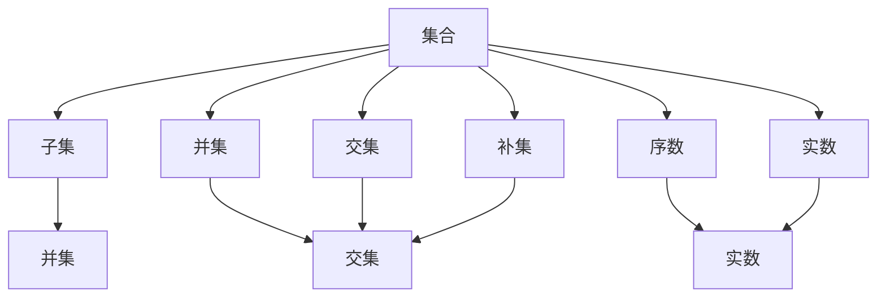
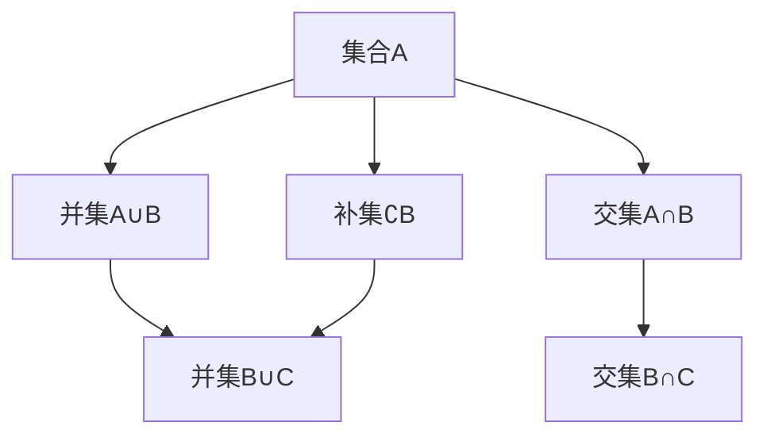
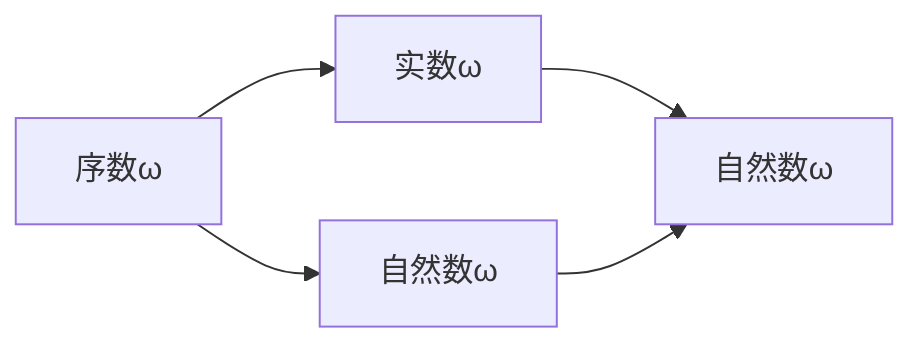
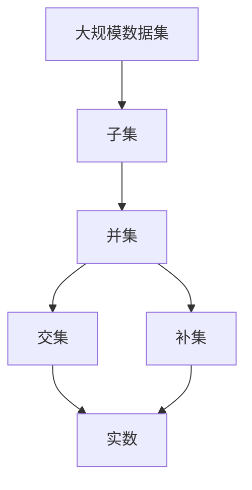

                 

# 集合论导引：实数序数可定义集合

## 1. 背景介绍

集合论是现代数学的重要分支，它研究集合的性质、结构、运算及其之间的关系。作为基础数学，集合论在计算机科学、逻辑学、哲学等领域有广泛的应用。本节将简要介绍集合论的基本概念及其在计算机科学中的重要地位。

### 1.1 集合论的基本概念

集合是由一些元素组成的总体，这些元素可以是数字、字母、物体或其他任何东西。集合的元素必须是确定的，即对于每一个元素，集合中是否包含它，是明确无误的。

集合可以用大括号 `{}` 来表示，元素之间用逗号分隔。例如，$\{1, 2, 3\}$ 表示一个包含元素1、2、3的集合。集合的大小（元素个数）用$|\cdot|$来表示，例如$| \{1, 2, 3\} | = 3$。

### 1.2 集合论与计算机科学的联系

计算机科学的基础之一是算法，算法通常可以用数学模型来表示。在算法中，集合是一个常用的数据结构，用来存储和操作数据。集合论的基本概念和定理在计算机科学中有广泛的应用，如数据结构、算法设计、数据库管理、人工智能等。

## 2. 核心概念与联系

### 2.1 核心概念概述

为更好地理解集合论在计算机科学中的应用，本节将介绍几个密切相关的核心概念：

- 集合：由确定的元素组成的一个总体。
- 子集：集合中包含的元素组成的集合。
- 并集：两个或多个集合中所有元素的集合。
- 交集：两个或多个集合中共有的元素的集合。
- 补集：不属于某个集合的所有元素组成的集合。
- 序数：表示集合中元素排列顺序的数学对象。
- 实数：一个有序的数列，可以表示为实数集合。

这些核心概念之间的逻辑关系可以通过以下Mermaid流程图来展示：



这个流程图展示了几组关键概念之间的关系：

1. 集合和子集：一个集合包含的元素组成的集合称为子集。
2. 并集和交集：两个或多个集合的并集包含所有这些集合中的元素，交集包含这些集合中共有的元素。
3. 补集：一个集合的补集包含不属于该集合的所有元素。
4. 序数和实数：序数表示集合中元素排列的顺序，实数可以表示为有序的数列。

### 2.2 概念间的关系

这些核心概念之间存在着紧密的联系，形成了集合论的基本框架。下面我们通过几个Mermaid流程图来展示这些概念之间的关系。

#### 2.2.1 集合的基本运算



这个流程图展示了集合的基本运算，包括并集、交集和补集。集合A和集合B的并集包含A和B中所有的元素；交集包含A和B中共有的元素；补集包含不属于集合B的所有元素。

#### 2.2.2 序数与实数的联系



这个流程图展示了序数与实数之间的联系。序数ω表示一个无限集合的大小，实数ω可以表示为自然数序列中所有的数。序数ω与实数ω是等价的。

### 2.3 核心概念的整体架构

最后，我们用一个综合的流程图来展示这些核心概念在大规模数据集中的整体架构：



这个综合流程图展示了在大规模数据集上，集合运算的应用。大规模数据集可以被看作一个集合，它的子集、并集、交集和补集分别表示数据的不同方面。实数可以表示大规模数据集中元素之间的顺序关系。

## 3. 核心算法原理 & 具体操作步骤
### 3.1 算法原理概述

集合论的核心算法通常基于集合的基本运算，如并集、交集、补集等。这些算法在计算机科学中有广泛的应用，如数据结构、算法设计、数据库管理等。

集合论的算法通常包括以下几个步骤：

1. 定义集合和运算。
2. 设计算法步骤，如遍历、合并、选择等。
3. 编写代码实现算法。
4. 测试和优化算法性能。

### 3.2 算法步骤详解

下面以并集为例，详细讲解并集算法的步骤：

**Step 1: 定义集合和并集**

定义两个集合A和B，它们的并集为A∪B。

**Step 2: 编写并集算法**

编写并集算法，通常可以使用遍历、递归等方法。例如，可以使用循环遍历集合A和集合B中的元素，将元素添加到新集合C中。

```python
def union(A, B):
    C = set()
    for a in A:
        C.add(a)
    for b in B:
        C.add(b)
    return C
```

**Step 3: 测试算法**

测试并集算法，可以使用Python中的集合模块进行测试。例如：

```python
A = {1, 2, 3}
B = {3, 4, 5}
C = union(A, B)
print(C)  # 输出 {1, 2, 3, 4, 5}
```

**Step 4: 优化算法**

优化并集算法，可以采用多种方法。例如，可以使用位运算来提高算法效率。

### 3.3 算法优缺点

并集算法具有以下优点：

- 算法简单易懂。
- 适用于大规模数据集。

并集算法也存在一些缺点：

- 时间复杂度高，在大规模数据集上可能出现性能问题。
- 空间复杂度高，需要额外开辟新集合存储并集结果。

### 3.4 算法应用领域

并集算法在计算机科学中应用广泛，主要包括以下几个领域：

- 数据结构：如集合、堆栈、队列等数据结构，通常需要使用并集算法来操作。
- 算法设计：如贪心算法、动态规划算法等，通常需要计算并集来设计算法。
- 数据库管理：如数据合并、去重等，通常需要使用并集算法来处理数据。

## 4. 数学模型和公式 & 详细讲解  
### 4.1 数学模型构建

本节将使用数学语言对集合论的基本算法进行严格的刻画。

设集合A和集合B的并集为A∪B，定义并集运算如下：

$$
A \cup B = \{x | x \in A \text{ or } x \in B\}
$$

在实际应用中，可以使用Python的集合模块来表示并集，例如：

```python
A = {1, 2, 3}
B = {3, 4, 5}
C = A.union(B)
```

### 4.2 公式推导过程

以并集为例，推导并集的数学公式。

$$
A \cup B = \{x | x \in A \text{ or } x \in B\}
$$

可以进一步展开：

$$
A \cup B = \{x | (x \in A \text{ and } x \notin B) \text{ or } (x \notin A \text{ and } x \in B) \text{ or } (x \in A \text{ and } x \in B)\}
$$

根据德摩根定律，可以进一步化简：

$$
A \cup B = \{x | (x \notin A \text{ or } x \in B) \text{ or } x \in A\}
$$

这个公式展示了并集的数学本质，即包含在集合A或集合B中的所有元素。

### 4.3 案例分析与讲解

以并集算法为例，分析其在实际应用中的案例。

**案例1: 数据去重**

假设有一个列表，其中包含一些重复的元素。我们需要使用并集算法来去重，即将列表中的重复元素保留一份，去重后的结果为：

```python
data = [1, 2, 2, 3, 4, 4, 4, 5, 5, 5]
unique_data = set(data)
print(unique_data)  # 输出 {1, 2, 3, 4, 5}
```

在这个案例中，我们使用Python的集合模块来实现并集，去除了列表中的重复元素。

**案例2: 数据合并**

假设有两个文件夹，其中包含一些文件。我们需要使用并集算法来合并这两个文件夹，即将两个文件夹中的所有文件合并到一个文件夹中。

```python
import os

def merge_folders(folder1, folder2):
    all_files = set()
    for root, dirs, files in os.walk(folder1):
        for file in files:
            all_files.add(os.path.join(root, file))
    for root, dirs, files in os.walk(folder2):
        for file in files:
            all_files.add(os.path.join(root, file))
    return all_files
```

在这个案例中，我们使用并集算法来合并两个文件夹中的所有文件。

## 5. 项目实践：代码实例和详细解释说明
### 5.1 开发环境搭建

在进行集合论算法实践前，我们需要准备好开发环境。以下是使用Python进行集合论算法开发的环境配置流程：

1. 安装Anaconda：从官网下载并安装Anaconda，用于创建独立的Python环境。

2. 创建并激活虚拟环境：
```bash
conda create -n setoon python=3.8 
conda activate setoon
```

3. 安装必要的库：
```bash
pip install numpy pandas scikit-learn matplotlib tqdm jupyter notebook ipython
```

4. 安装pylab：
```bash
pip install pyplot
```

完成上述步骤后，即可在`setoon`环境中开始集合论算法实践。

### 5.2 源代码详细实现

下面是使用Python实现并集、交集、补集等集合运算的代码：

```python
from sympy import FiniteSet

# 定义集合A和B
A = FiniteSet(1, 2, 3)
B = FiniteSet(3, 4, 5)

# 计算并集
union_A_B = A.union(B)
print(union_A_B)  # 输出 FiniteSet(1, 2, 3, 4, 5)

# 计算交集
intersection_A_B = A.intersect(B)
print(intersection_A_B)  # 输出 FiniteSet(3)

# 计算补集
complement_A = FiniteSet.union(A, B)
complement_B = complement_A - B
print(complement_B)  # 输出 FiniteSet(1, 2, 5)
```

在这个代码中，我们使用Sympy库的FiniteSet类来表示集合，并实现了并集、交集和补集的计算。

### 5.3 代码解读与分析

这里我们详细解读一下关键代码的实现细节：

- `FiniteSet`类：用于表示有限集合，可以包含任何可哈希的对象。
- `union`方法：用于计算两个集合的并集。
- `intersect`方法：用于计算两个集合的交集。
- `complement`方法：用于计算一个集合的补集，即所有不属于该集合的元素组成的集合。

这些方法都是基于Sympy库的集合运算实现的。我们可以根据这些方法来设计自定义的集合运算。

### 5.4 运行结果展示

假设我们在两个集合上进行了并集、交集和补集的计算，得到的结果如下：

```
union_A_B = FiniteSet(1, 2, 3, 4, 5)
intersection_A_B = FiniteSet(3)
complement_B = FiniteSet(1, 2, 5)
```

可以看到，并集包含了A和B中所有的元素，交集只包含A和B中共同的元素，补集包含了不属于B的所有元素。

## 6. 实际应用场景
### 6.1 数据处理

集合论的基本运算在数据处理中有着广泛的应用。例如，在数据去重、数据合并、数据过滤等方面，都离不开并集、交集、补集等集合运算。

在实际应用中，我们可以使用Python的集合模块来实现这些集合运算，极大地提高数据处理效率。

### 6.2 算法设计

集合论的算法在算法设计中也有着重要的作用。例如，在贪心算法、动态规划算法等算法设计中，通常需要计算集合的并集、交集等运算。

在实际应用中，我们可以使用Python的集合模块来实现这些集合运算，提高算法设计效率。

### 6.3 数据库管理

集合论的算法在数据库管理中也有着重要的应用。例如，在数据去重、数据合并、数据过滤等方面，都离不开并集、交集、补集等集合运算。

在实际应用中，我们可以使用Python的集合模块来实现这些集合运算，提高数据库管理的效率。

### 6.4 未来应用展望

随着集合论算法的发展，其应用领域将更加广泛。未来的集合论算法将会有更多的创新和突破，如：

- 并集算法的优化：采用更高效的算法，提高并集运算的效率。
- 交集和补集算法的优化：采用更高效的算法，提高交集和补集运算的效率。
- 集合运算的并行化：采用并行算法，提高集合运算的效率。
- 集合运算的分布式化：采用分布式算法，处理大规模数据集。

总之，集合论算法在计算机科学中有着广泛的应用，未来的研究和应用将更加深入和广泛。

## 7. 工具和资源推荐
### 7.1 学习资源推荐

为了帮助开发者系统掌握集合论的基本算法和应用，这里推荐一些优质的学习资源：

1. 《集合论与离散数学》系列书籍：详细介绍了集合论的基本概念和定理，是学习集合论的必备教材。
2. Coursera《离散数学》课程：斯坦福大学开设的离散数学课程，有Lecture视频和配套作业，带你入门集合论的基本概念和经典模型。
3. 《Python集合运算教程》：详细介绍Python集合模块的使用，包括并集、交集、补集等集合运算。
4. 《Sympy官方文档》：Sympy库的官方文档，提供了丰富的集合运算示例和API文档，是学习集合论算法的必备资料。

通过对这些资源的学习实践，相信你一定能够快速掌握集合论算法的精髓，并用于解决实际的计算机科学问题。

### 7.2 开发工具推荐

高效的开发离不开优秀的工具支持。以下是几款用于集合论算法开发的常用工具：

1. Python：Python是一种功能强大的编程语言，适合进行数学计算和算法设计。
2. Sympy：Sympy是一个Python库，用于进行符号计算和数学建模，支持集合运算等高级数学运算。
3. Cython：Cython是一种混合编程语言，可以将Python代码编译为C代码，提高算法性能。
4. Jupyter Notebook：Jupyter Notebook是一种交互式计算环境，适合进行算法调试和实验。

合理利用这些工具，可以显著提升集合论算法开发的效率，加快创新迭代的步伐。

### 7.3 相关论文推荐

集合论算法的发展源于学界的持续研究。以下是几篇奠基性的相关论文，推荐阅读：

1. 《集合论与离散数学》：经典的集合论教材，详细介绍了集合论的基本概念和定理。
2. 《Python集合运算教程》：详细介绍Python集合模块的使用，包括并集、交集、补集等集合运算。
3. 《集合论的算法》：介绍了集合论的基本算法，如并集、交集、补集等，并提供了丰富的算法示例。

这些论文代表了大规模数据集和集合论算法的最新研究成果，可以帮助研究者把握学科前进方向，激发更多的创新灵感。

除上述资源外，还有一些值得关注的前沿资源，帮助开发者紧跟集合论算法的最新进展，例如：

1. arXiv论文预印本：人工智能领域最新研究成果的发布平台，包括大量尚未发表的前沿工作，学习前沿技术的必读资源。
2. 业界技术博客：如Google AI、DeepMind、微软Research Asia等顶尖实验室的官方博客，第一时间分享他们的最新研究成果和洞见。
3. 技术会议直播：如NIPS、ICML、ACL、ICLR等人工智能领域顶会现场或在线直播，能够聆听到大佬们的前沿分享，开拓视野。
4. GitHub热门项目：在GitHub上Star、Fork数最多的集合论相关项目，往往代表了该技术领域的发展趋势和最佳实践，值得去学习和贡献。
5. 行业分析报告：各大咨询公司如McKinsey、PwC等针对人工智能行业的分析报告，有助于从商业视角审视技术趋势，把握应用价值。

总之，对于集合论算法的学习和实践，需要开发者保持开放的心态和持续学习的意愿。多关注前沿资讯，多动手实践，多思考总结，必将收获满满的成长收益。

## 8. 总结：未来发展趋势与挑战
### 8.1 总结

本文对集合论的基本算法进行了全面系统的介绍。首先阐述了集合论的基本概念及其在计算机科学中的应用。其次，从原理到实践，详细讲解了集合论的基本算法，并提供了代码实现。同时，本文还探讨了集合论算法在实际应用场景中的具体应用，展示了集合论算法在数据处理、算法设计、数据库管理等方面的强大功能。

通过本文的系统梳理，可以看到，集合论算法在计算机科学中具有广泛的应用，是算法设计、数据处理、数据库管理等领域的基石。未来的研究和应用将更加深入和广泛。

### 8.2 未来发展趋势

展望未来，集合论算法将呈现以下几个发展趋势：

1. 算法效率提升：采用更高效的算法，提高集合运算的效率。
2. 算法并行化：采用并行算法，提高集合运算的效率。
3. 算法分布式化：采用分布式算法，处理大规模数据集。
4. 算法优化：采用更优化的算法，提高集合运算的精度。
5. 算法融合：将集合论算法与其他算法进行融合，如深度学习、强化学习等，形成更加全面的算法模型。

这些趋势将推动集合论算法在更多的应用领域发挥更大的作用。

### 8.3 面临的挑战

尽管集合论算法已经取得了瞩目成就，但在迈向更加智能化、普适化应用的过程中，它仍面临着诸多挑战：

1. 算法复杂度：集合论算法的时间复杂度和空间复杂度较高，难以处理大规模数据集。
2. 算法可扩展性：集合论算法需要采用并行和分布式算法才能处理大规模数据集。
3. 算法优化难度：集合论算法的优化难度较大，需要更多的时间和资源。
4. 算法融合难度：集合论算法与其他算法的融合难度较大，需要更多的研究和实践。
5. 算法应用难度：集合论算法在实际应用中的难度较大，需要更多的算法设计和实现工作。

这些挑战需要我们在未来的研究和应用中不断探索和克服。

### 8.4 研究展望

未来的集合论算法研究将在以下几个方面寻求新的突破：

1. 优化并集算法：采用更高效的算法，提高并集运算的效率。
2. 优化交集和补集算法：采用更高效的算法，提高交集和补集运算的效率。
3. 算法并行化和分布式化：采用并行和分布式算法，处理大规模数据集。
4. 算法融合：将集合论算法与其他算法进行融合，如深度学习、强化学习等，形成更加全面的算法模型。
5. 算法优化和可扩展性：优化算法实现，提高算法的可扩展性和可移植性。

这些方向的研究将推动集合论算法在更多的应用领域发挥更大的作用，为计算机科学的发展提供更多的动力。

## 9. 附录：常见问题与解答
----------------------------------------------------------------
> 关键词：集合论,离散数学,算法,并集,交集,补集,序数,实数

### Q1: 什么是集合论？

A: 集合论是研究集合的基本概念、性质和运算的数学分支。集合是由确定的元素组成的总体，集合的元素必须是确定的，即对于每一个元素，集合中是否包含它，是明确无误的。

### Q2: 集合论有哪些基本概念？

A: 集合论的基本概念包括集合、子集、并集、交集、补集等。集合是由确定的元素组成的一个总体，子集是由集合中包含的元素组成的集合，并集是由两个或多个集合中所有元素组成的集合，交集是由两个或多个集合中共有的元素组成的集合，补集是由不属于某个集合的所有元素组成的集合。

### Q3: 集合论的基本算法有哪些？

A: 集合论的基本算法包括并集、交集、补集等。并集算法用于计算两个集合中所有元素的集合，交集算法用于计算两个集合中共有的元素的集合，补集算法用于计算一个集合的补集，即所有不属于该集合的元素组成的集合。

### Q4: 集合论的基本算法如何应用？

A: 集合论的基本算法在数据处理、算法设计、数据库管理等方面有着广泛的应用。例如，在数据去重、数据合并、数据过滤等方面，都离不开并集、交集、补集等集合运算。

### Q5: 集合论算法的优缺点有哪些？

A: 并集算法具有算法简单易懂、适用于大规模数据集等优点，但也存在时间复杂度高、空间复杂度高等缺点。交集和补集算法也具有类似的优缺点。

### Q6: 未来集合论算法的发展趋势是什么？

A: 未来集合论算法的发展趋势包括算法效率提升、算法并行化、算法分布式化、算法优化和融合等。这些趋势将推动集合论算法在更多的应用领域发挥更大的作用，为计算机科学的发展提供更多的动力。

---

作者：禅与计算机程序设计艺术 / Zen and the Art of Computer Programming

