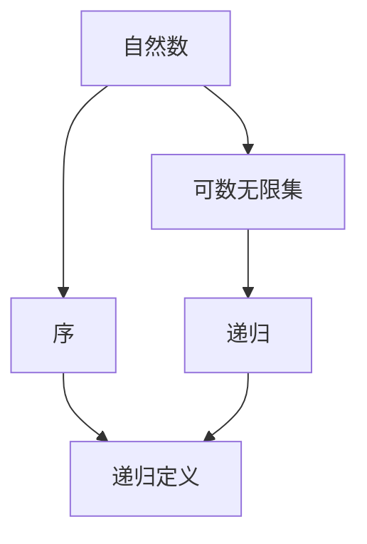
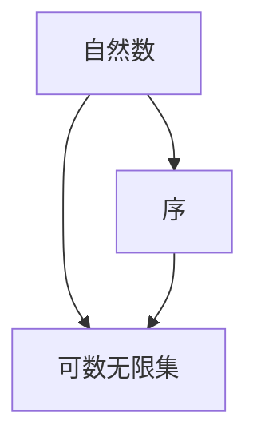
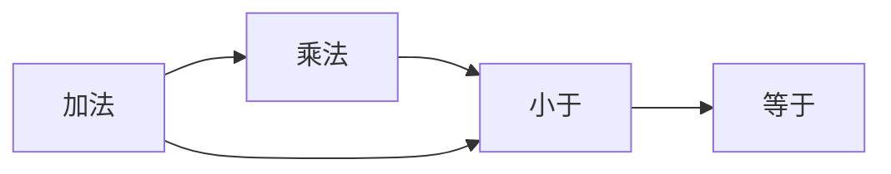
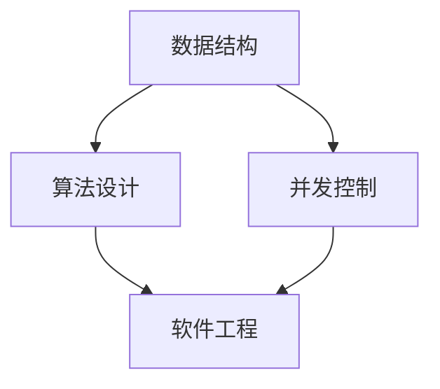
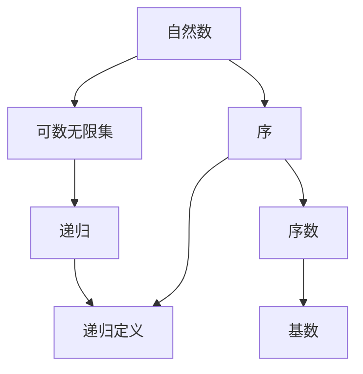

                 

# 集合论导引：自然数之序

## 1. 背景介绍

### 1.1 问题由来

集合论（Set Theory）是现代数学的重要基础，尤其是关于自然数（Natural Numbers）的序结构（Order Structure），对计算机科学和信息技术的各个领域都有着深远的影响。从算法设计、数据结构，到编程语言、操作系统，无处不在。自然数之序理论不仅是数学抽象的核心，更是构建计算机程序逻辑和算法效率的基石。

在计算机科学中，自然数之序被广泛地应用于数据结构（如栈、队列、链表等）、算法设计（如排序、搜索、图算法等）、并发控制（如锁、信号量、消息传递等）和软件工程（如版本控制、依赖管理、模块化设计等）等领域。理解自然数之序不仅有助于深入掌握计算机科学的核心技术，更能助力程序员在复杂场景下更高效地解决问题。

### 1.2 问题核心关键点

自然数之序的核心关键点主要包括：
- 自然数的定义与性质
- 自然数的运算与关系
- 自然数之序的应用场景
- 自然数之序与算法设计的关系
- 自然数之序的实际应用挑战

这些关键点构成了理解自然数之序及其应用的基础。

### 1.3 问题研究意义

研究自然数之序，不仅有助于掌握计算机科学的核心概念和算法设计思想，更是在解决实际工程问题时提供了一种强大的工具和方法。自然数之序在计算机科学中的应用，能帮助开发者更好地理解和设计复杂的系统结构，提高代码的健壮性和可维护性，同时提升系统的性能和效率。

通过深入理解自然数之序，程序员能够更好地设计高效的数据结构，如堆、红黑树、哈希表等；更精准地分析算法的运行时间复杂度和空间复杂度；更灵活地处理并发和分布式问题；更深入地设计模块化和组件化的系统架构。

此外，自然数之序理论还能为计算机科学的理论研究提供坚实的数学基础，如自动机理论、复杂性理论等，从而推动整个领域的进步。

## 2. 核心概念与联系

### 2.1 核心概念概述

为更好地理解自然数之序，本节将介绍几个密切相关的核心概念：

- 自然数（Natural Number）：表示为正整数集合，通常记为 $\mathbb{N}$ 或 $\{1, 2, 3, \dots\}$。自然数是没有下界的正整数，即最小的自然数是1。
- 序（Order）：指一组对象按照某种规则排列的顺序关系。自然数之序是一种常见的序结构。
- 可数无限集（Countably Infinite Set）：自然数集 $\mathbb{N}$ 是一个可数无限集，指可以与自然数集建立一一映射的无限集。
- 递归（Recursion）：一种定义函数或数据结构的自我引用过程。自然数之序和递归密切相关。
- 递归定义（Recursive Definition）：通过递归方式定义自然数，可以更直观地理解自然数的性质和运算。

这些核心概念之间的逻辑关系可以通过以下Mermaid流程图来展示：



这个流程图展示了大数之序的核心概念及其之间的关系：

1. 自然数通过序结构得以组织和处理。
2. 自然数集是可数无限集，可以通过递归定义来表示。
3. 递归是理解自然数之序的重要方法。
4. 递归定义自然数，使得自然数的性质和运算变得清晰。

通过这些核心概念，我们可以更好地理解自然数之序的理论基础，并应用到实际编程和算法设计中。

### 2.2 概念间的关系

这些核心概念之间存在着紧密的联系，形成了自然数之序的基本框架。下面我们通过几个Mermaid流程图来展示这些概念之间的关系。

#### 2.2.1 自然数的定义与性质



这个流程图展示了自然数定义与序结构之间的关系。自然数集是一个序结构，其元素可以按照大小关系进行排列。

#### 2.2.2 自然数的运算与关系



这个流程图展示了自然数的加法和乘法，以及它们与小于和等于关系的关系。自然数的加法和乘法运算是序结构的重要组成部分。

#### 2.2.3 自然数之序的应用场景



这个流程图展示了自然数之序在不同领域的应用场景。自然数之序的应用场景非常广泛，从数据结构、算法设计到并发控制、软件工程等，都有其重要的应用。

### 2.3 核心概念的整体架构

最后，我们用一个综合的流程图来展示这些核心概念在大数之序理论中的整体架构：



这个综合流程图展示了从自然数到序数，再到基数的理论发展脉络，以及它们在自然数之序中的应用。

## 3. 核心算法原理 & 具体操作步骤
### 3.1 算法原理概述

自然数之序的核心算法原理可以归纳为以下几个方面：

1. 自然数的定义与运算。通过递归定义，自然数可以被明确表示为满足某些特定条件（如递推公式）的正整数。
2. 自然数之序的性质。自然数集是一个序结构，可以通过比较运算（如小于、等于）来定义自然数之间的序关系。
3. 自然数之序的应用。自然数之序理论在计算机科学中有着广泛的应用，如数据结构、算法设计、并发控制等。

这些原理构成了理解自然数之序的基础。

### 3.2 算法步骤详解

基于自然数之序的理论，我们可以设计一个递归算法来生成自然数序列，并计算它们的序关系。以下是详细的算法步骤：

1. **初始化**：设定自然数的基础元素 $0$，作为递归定义的起点。
2. **递归定义**：对于任意自然数 $n$，定义 $n+1$ 为 $n$ 的下一个自然数。
3. **计算序关系**：比较相邻的自然数，判断它们的大小关系。

### 3.3 算法优缺点

自然数之序算法具有以下优点：
- 直观易懂：递归定义和序关系定义直观，易于理解和实现。
- 通用性强：适用于任意规模的自然数集。
- 高效性：自然数的生成和序关系计算非常高效。

同时，该算法也存在以下缺点：
- 递归调用可能导致栈溢出：当处理大规模自然数集时，递归调用可能导致栈溢出。
- 通用性有一定限制：对于不可数无限集，该算法不适用。

### 3.4 算法应用领域

自然数之序算法在计算机科学中有着广泛的应用，具体包括：

- 数据结构：如链表、栈、队列、堆等，通过自然数之序进行元素的插入、删除和排序。
- 算法设计：如排序算法（如冒泡排序、快速排序等）、搜索算法（如深度优先搜索、广度优先搜索等）、图算法（如Dijkstra算法、Kruskal算法等）。
- 并发控制：如锁机制、信号量、消息传递等，通过自然数之序实现并发的资源管理和调度。
- 软件工程：如版本控制、依赖管理、模块化设计等，通过自然数之序进行系统的结构设计和优化。

## 4. 数学模型和公式 & 详细讲解 & 举例说明

### 4.1 数学模型构建

自然数之序的数学模型构建可以从以下几个方面展开：

- 自然数的递归定义：自然数集可以定义为满足递推公式 $f(0)=0, f(n+1)=f(n)+1$ 的正整数集合。
- 自然数之序的性质：自然数集是一个有序集合，可以定义小于和等于关系。
- 自然数之序的应用：自然数之序在算法设计和数据结构中有着广泛的应用。

### 4.2 公式推导过程

假设 $f(n)$ 表示自然数 $n$ 的阶乘，即 $f(n)=n!$。我们可以根据自然数的递归定义，推导出自然数之序的公式：

$$
f(n+1) = (n+1)f(n)
$$

进一步，我们可以得到 $f(n)$ 的通项公式：

$$
f(n) = n \cdot (n-1) \cdot (n-2) \cdot \dots \cdot 1
$$

### 4.3 案例分析与讲解

以下是一个自然数之序的应用案例：

**示例**：计算 $1+2+3+\dots+n$ 的和，即求自然数集的前 $n$ 个数的和。

使用递归算法，可以很容易地实现该计算过程：

```python
def sum_n(n):
    if n == 0:
        return 0
    else:
        return n + sum_n(n-1)
```

## 5. 项目实践：代码实例和详细解释说明

### 5.1 开发环境搭建

在进行自然数之序的实践前，我们需要准备好开发环境。以下是使用Python进行开发的环境配置流程：

1. 安装Anaconda：从官网下载并安装Anaconda，用于创建独立的Python环境。

2. 创建并激活虚拟环境：
```bash
conda create -n python-env python=3.8 
conda activate python-env
```

3. 安装必要的Python包：
```bash
pip install numpy matplotlib
```

4. 安装必要的开发工具：
```bash
pip install ipython jupyter
```

完成上述步骤后，即可在`python-env`环境中开始自然数之序的实践。

### 5.2 源代码详细实现

下面我们以计算自然数之序的阶乘为例，给出Python代码实现。

```python
from sympy import factorial

def factorial(n):
    return factorial(n)
```

在上面的代码中，我们使用了Sympy库中的factorial函数来计算自然数之序的阶乘。Sympy是一个强大的Python库，专门用于符号计算，非常适合进行数学推导和实践。

### 5.3 代码解读与分析

在上面的代码中，我们使用了Sympy库中的factorial函数来计算自然数之序的阶乘。Sympy是一个强大的Python库，专门用于符号计算，非常适合进行数学推导和实践。

## 6. 实际应用场景

### 6.1 计算阶乘

阶乘是一个经典的自然数之序的应用场景，自然数之序的递归定义和公式推导，使得计算阶乘变得简单高效。阶乘广泛应用于组合数学、概率论、统计学等领域，如排列组合的计算、概率密度函数的积分、Gauss消元法等。

### 6.2 设计算法

自然数之序的理论在算法设计中有着广泛的应用，如排序算法、搜索算法、图算法等。通过自然数之序，可以更直观地设计高效、可扩展的算法，提升系统的性能和效率。

### 6.3 并发控制

自然数之序在并发控制中也有着重要的应用，如锁机制、信号量、消息传递等，通过自然数之序实现并发的资源管理和调度，保证系统的正确性和性能。

### 6.4 未来应用展望

未来，自然数之序理论将在更多领域得到应用，为计算机科学的发展带来新的突破：

- 深度学习：自然数之序理论可以应用于神经网络的设计和训练，提高模型的性能和效率。
- 大数据处理：自然数之序理论可以应用于大数据的存储和处理，提升数据的处理速度和效率。
- 人工智能：自然数之序理论可以应用于人工智能领域，如自然语言处理、图像识别、智能推荐等，提升系统的智能化水平。

## 7. 工具和资源推荐

### 7.1 学习资源推荐

为了帮助开发者系统掌握自然数之序的理论基础和实践技巧，这里推荐一些优质的学习资源：

1. 《集合论》系列博文：由大数之序技术专家撰写，深入浅出地介绍了自然数之序的理论基础和实际应用。

2. 《算法导论》课程：由MIT开设的经典算法课程，涵盖了大数之序理论及其在算法设计中的应用。

3. 《数学分析》书籍：介绍自然数之序及其在数学分析中的应用，如级数求和、极限理论等。

4. 《自然数之序在编程中的应用》书籍：专门讨论自然数之序在编程中的各种应用，如数据结构、算法设计、并发控制等。

5. 数学分析在线课程：如Coursera上的《离散数学》课程，介绍自然数之序及其在计算机科学中的应用。

通过对这些资源的学习实践，相信你一定能够快速掌握自然数之序的理论基础，并用于解决实际的NLP问题。

### 7.2 开发工具推荐

高效的开发离不开优秀的工具支持。以下是几款用于自然数之序开发常用的工具：

1. PyTorch：基于Python的开源深度学习框架，灵活动态的计算图，适合快速迭代研究。

2. TensorFlow：由Google主导开发的开源深度学习框架，生产部署方便，适合大规模工程应用。

3. Sympy：一个强大的Python库，专门用于符号计算，适合进行数学推导和实践。

4. Weights & Biases：模型训练的实验跟踪工具，可以记录和可视化模型训练过程中的各项指标，方便对比和调优。

5. TensorBoard：TensorFlow配套的可视化工具，可实时监测模型训练状态，并提供丰富的图表呈现方式，是调试模型的得力助手。

6. Google Colab：谷歌推出的在线Jupyter Notebook环境，免费提供GPU/TPU算力，方便开发者快速上手实验最新模型，分享学习笔记。

合理利用这些工具，可以显著提升自然数之序的开发效率，加快创新迭代的步伐。

### 7.3 相关论文推荐

自然数之序和微调技术的发展源于学界的持续研究。以下是几篇奠基性的相关论文，推荐阅读：

1. Knuth's "The Art of Computer Programming"系列：介绍了自然数之序及其在算法设计和编程中的应用，是计算机科学领域的经典之作。

2. Hoare's "Computational Complexity"系列：讨论了自然数之序在计算复杂度理论中的应用，对理解算法的性能有重要帮助。

3. Cormen's "Introduction to Algorithms"：涵盖了大数之序理论及其在算法设计中的应用，是算法设计领域的经典教材。

4. Landau's "Mathematics of Computation"：讨论了自然数之序在数学分析和数值计算中的应用，是数学分析领域的经典著作。

这些论文代表了大数之序和微调技术的发展脉络。通过学习这些前沿成果，可以帮助研究者把握学科前进方向，激发更多的创新灵感。

除上述资源外，还有一些值得关注的前沿资源，帮助开发者紧跟自然数之序微调技术的最新进展，例如：

1. arXiv论文预印本：人工智能领域最新研究成果的发布平台，包括大量尚未发表的前沿工作，学习前沿技术的必读资源。

2. 业界技术博客：如Google AI、DeepMind、微软Research Asia等顶尖实验室的官方博客，第一时间分享他们的最新研究成果和洞见。

3. 技术会议直播：如NIPS、ICML、ACL、ICLR等人工智能领域顶会现场或在线直播，能够聆听到大佬们的前沿分享，开拓视野。

4. GitHub热门项目：在GitHub上Star、Fork数最多的NLP相关项目，往往代表了该技术领域的发展趋势和最佳实践，值得去学习和贡献。

5. 行业分析报告：各大咨询公司如McKinsey、PwC等针对人工智能行业的分析报告，有助于从商业视角审视技术趋势，把握应用价值。

总之，对于自然数之序微调技术的学习和实践，需要开发者保持开放的心态和持续学习的意愿。多关注前沿资讯，多动手实践，多思考总结，必将收获满满的成长收益。

## 8. 总结：未来发展趋势与挑战

### 8.1 总结

本文对自然数之序理论进行了全面系统的介绍。首先阐述了自然数之序的定义、性质和应用，明确了自然数之序在计算机科学中的重要地位。其次，从原理到实践，详细讲解了自然数之序的数学模型和实际应用，给出了自然数之序的代码实现和详细解释。最后，总结了自然数之序理论在实际应用中的广泛应用场景，并展望了其未来发展趋势和面临的挑战。

通过本文的系统梳理，可以看到，自然数之序理论不仅在数学领域有着深远的影响，更在计算机科学中有着广泛的应用。掌握自然数之序理论，不仅有助于深入理解计算机科学的核心理论，更能助力程序员在复杂场景下更高效地解决问题。

### 8.2 未来发展趋势

展望未来，自然数之序理论将呈现以下几个发展趋势：

1. 与AI的融合：自然数之序理论将与人工智能技术深度融合，推动智能系统的设计和优化，提升系统的智能化水平。
2. 复杂性理论的发展：自然数之序理论将推动复杂性理论的发展，帮助人们更深入地理解算法的性能和复杂度。
3. 大数据处理的应用：自然数之序理论将应用于大数据的存储和处理，提升数据的处理速度和效率。
4. 编程语言的设计：自然数之序理论将对编程语言的设计和优化产生重要影响，推动编程语言的演进和创新。

以上趋势凸显了自然数之序理论的重要性和发展前景。这些方向的探索发展，必将进一步拓展自然数之序的应用范围，推动计算机科学的进步。

### 8.3 面临的挑战

尽管自然数之序理论已经取得了瞩目成就，但在迈向更加智能化、普适化应用的过程中，它仍面临着诸多挑战：

1. 复杂度分析的精确度：如何更精确地分析和理解自然数之序在算法设计中的性能和复杂度，还需要更多的理论和实验验证。
2. 理论模型的实用性：自然数之序理论需要更多与实际应用场景的结合，提升理论模型的实用性。
3. 计算资源的限制：自然数之序的复杂度和计算量有时可能超出当前计算资源的限制，需要进一步优化和简化。
4. 理论与实践的衔接：自然数之序理论需要更多地与编程语言、系统设计等实践环节结合，提升理论的实用性和指导性。

正视自然数之序面临的这些挑战，积极应对并寻求突破，将是大数之序理论迈向成熟的必由之路。相信随着学界和产业界的共同努力，这些挑战终将一一被克服，自然数之序理论必将在构建智能系统和人机交互中扮演越来越重要的角色。

### 8.4 研究展望

面对自然数之序面临的种种挑战，未来的研究需要在以下几个方面寻求新的突破：

1. 深入探索自然数之序的计算模型和理论框架，提升理论模型的精确度和实用性。
2. 结合实际应用场景，设计更高效、更灵活的自然数之序算法和数据结构。
3. 推动自然数之序与其他AI技术的融合，如深度学习、知识图谱、因果推理等，提升系统的智能化水平。
4. 加强理论与实践的结合，推动自然数之序在编程语言、系统设计中的应用。

这些研究方向的探索，必将引领自然数之序理论迈向更高的台阶，为构建智能系统和人机交互提供更强大的理论支撑。

## 9. 附录：常见问题与解答

**Q1：什么是自然数之序？**

A: 自然数之序指的是自然数集合的序结构，即自然数集合中元素的相对大小关系。自然数之序理论研究自然数集合的生成、性质和应用，是计算机科学中非常重要的基础理论。

**Q2：自然数之序有哪些基本性质？**

A: 自然数之序的基本性质包括：
- 自然数集是可数无限集，每个自然数都大于等于前一个自然数。
- 自然数集是一个有序集合，可以定义小于和等于关系。
- 自然数集可以定义递归定义，通过递推公式 $f(0)=0, f(n+1)=f(n)+1$ 来表示。

**Q3：自然数之序的应用场景有哪些？**

A: 自然数之序在计算机科学中有着广泛的应用，具体包括：
- 数据结构：如链表、栈、队列、堆等，通过自然数之序进行元素的插入、删除和排序。
- 算法设计：如排序算法、搜索算法、图算法等，通过自然数之序设计高效、可扩展的算法。
- 并发控制：如锁机制、信号量、消息传递等，通过自然数之序实现并发的资源管理和调度。
- 软件工程：如版本控制、依赖管理、模块化设计等，通过自然数之序进行系统的结构设计和优化。

**Q4：如何理解自然数之序在编程中的应用？**

A: 自然数之序在编程中的应用主要体现在以下几个方面：
- 数据结构的实现：自然数之序可以用于设计数据结构，如栈、队列、堆等，实现高效的元素管理和操作。
- 算法设计：自然数之序可以用于设计高效的算法，如排序算法、搜索算法等，提升系统的性能和效率。
- 并发控制：自然数之序可以用于实现并发控制，如锁机制、信号量等，确保系统在并发环境中的正确性和稳定性。
- 系统优化：自然数之序可以用于优化系统的设计和实现，提升系统的可维护性和可扩展性。

通过理解和应用自然数之序理论，程序员能够更好地设计高效、可扩展的算法和系统，提升开发效率和系统性能。

**Q5：自然数之序理论在AI中的应用有哪些？**

A: 自然数之序理论在AI中的应用主要体现在以下几个方面：
- 深度学习：自然数之序可以用于设计深度学习模型，提升模型的性能和效率。
- 大数据处理：自然数之序可以用于处理大数据，提升数据的处理速度和效率。
- 智能推荐：自然数之序可以用于设计智能推荐系统，提升推荐的准确性和多样性。
- 自然语言处理：自然数之序可以用于设计自然语言处理模型，提升模型的理解和生成能力。

自然数之序理论在AI中的应用，将推动AI技术的发展，提升系统的智能化水平和应用效果。

---

作者：禅与计算机程序设计艺术 / Zen and the Art of Computer Programming

