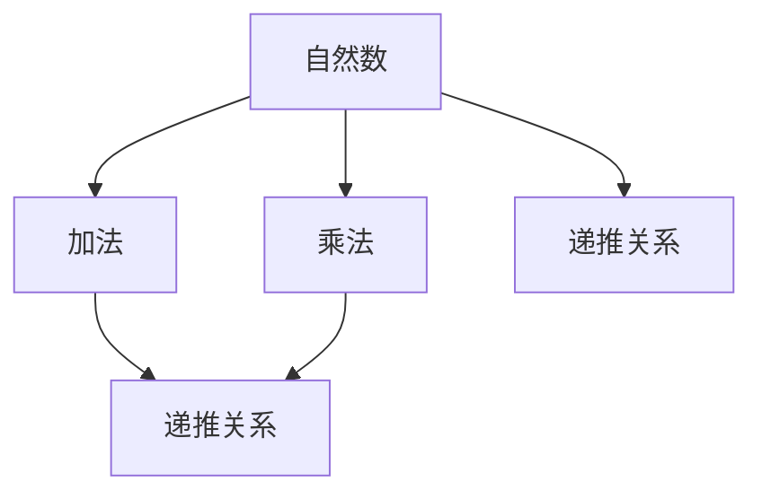
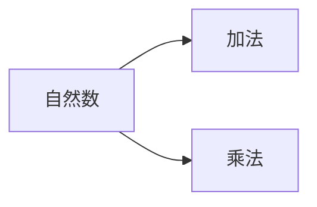

                 

# 集合论导引：自然数算术运算

> 关键词：集合论,自然数,算术运算,函数,数学模型,递推关系

## 1. 背景介绍

### 1.1 问题由来
集合论作为现代数学的基础，其原理广泛应用于各个数学分支及计算机科学领域。而自然数及其算术运算则是集合论的重要研究对象之一，自然数的严格定义、性质及其运算法则，为计算机科学提供了数学基础的逻辑框架。然而，在实际应用中，如何通过编程实现自然数的算术运算，则是一个较为复杂但极具挑战性的问题。本文将从集合论导引的角度出发，详细阐述自然数的算术运算原理，并通过代码实现，直观展示自然数计算的编程实践。

### 1.2 问题核心关键点
本节将介绍几个在自然数算术运算中常用的核心概念及其相关数学原理。

1. **自然数的定义与性质**：自然数是指大于等于0的整数集合，通常记为$\mathbb{N}$。自然数集合具有顺序性和可加性等基本性质。
2. **自然数的递推关系**：通过定义自然数的递推关系（如加法和乘法），可以推导出自然数的相关性质和定理。
3. **自然数的函数表示**：使用数学函数（如阶乘、斐波那契数列）表示自然数运算，为后续编程实现提供数学基础。

### 1.3 问题研究意义
研究自然数的算术运算，不仅有助于理解计算机科学中的基础数据类型和运算逻辑，而且能够促进数学与编程的结合，提升程序员的数学素养。具体而言：

1. 自然数的严格定义和性质研究，为计算机科学中的整数类型提供了数学依据。
2. 自然数的递推关系和函数表示，为编程实现提供了数学模型和算法参考。
3. 通过实例，可以更好地理解自然数运算法则，进而提高编程能力。
4. 通过实践，可以巩固数学知识，并培养计算思维和问题解决能力。

## 2. 核心概念与联系

### 2.1 核心概念概述

为了更好地理解自然数算术运算的原理，我们将介绍几个关键概念及其相关数学原理：

- **自然数**：大于等于0的整数，记为$\mathbb{N}$。
- **加法**：自然数加法定义为$0+0=0$，$n+1=n+0+1$，$n+m=n+(m+1)-1$。
- **乘法**：自然数乘法定义为$0*0=0$，$n*0=0*n=0$，$n*m=n*(m-1)+n$。
- **递推关系**：通过递推关系可以定义自然数的加法和乘法，从而推导出自然数的性质和定理。

这些概念之间的关系可以通过以下Mermaid流程图来展示：



这个流程图展示了自然数的基本运算及其递推关系。

### 2.2 概念间的关系

这些核心概念之间存在着紧密的联系，形成了自然数运算的完整框架。下面我们通过几个Mermaid流程图来展示这些概念之间的关系。

#### 2.2.1 自然数的基本运算



这个流程图展示了自然数加法和乘法的基本运算规则。

#### 2.2.2 自然数的递推关系


这个流程图展示了通过递推关系定义自然数的加法和乘法。

## 3. 核心算法原理 & 具体操作步骤

### 3.1 算法原理概述

自然数的算术运算通常通过定义自然数的加法和乘法来实现。其中，加法可以通过递推关系$n+1=n+0+1$进行定义，乘法可以通过递推关系$n*m=n*(m-1)+n$进行定义。这两个递推关系共同构成了自然数的基本运算逻辑。

### 3.2 算法步骤详解

以下我们将详细解释自然数加法和乘法的递推关系，并给出具体的算法步骤：

#### 3.2.1 自然数加法的递推关系

自然数加法定义为：
- $0+0=0$
- $n+1=n+0+1$

根据递推关系，我们可以推导出任意两个自然数的加法运算。例如，$3+4$可以表示为$3+(0+4)$，即$3+(0+4)=3+4=3+4+0=7$。

#### 3.2.2 自然数乘法的递推关系

自然数乘法定义为：
- $0*0=0$
- $n*0=0*n=0$
- $n*m=n*(m-1)+n$

根据递推关系，我们可以推导出任意两个自然数的乘法运算。例如，$3*4$可以表示为$3*(0+4)$，即$3*(0+4)=3*4=3*4+0=12$。

### 3.3 算法优缺点

#### 3.3.1 优点

- **简单易懂**：通过递推关系，可以直观地理解自然数加法和乘法的定义。
- **应用广泛**：自然数的加法和乘法是计算机科学中最基础的操作之一，广泛用于各种算法和数据结构中。
- **可扩展性**：通过递推关系，可以推导出其他更复杂的自然数运算，如幂运算、除法等。

#### 3.3.2 缺点

- **计算效率**：递推关系需要重复计算中间结果，对于大规模数据，计算效率较低。
- **内存消耗**：递推关系需要保存中间结果，对于大数运算，内存消耗较大。

### 3.4 算法应用领域

自然数算术运算的应用领域非常广泛，以下是几个主要应用场景：

- **数学计算**：自然数的加法和乘法是数学计算中最基础的操作之一。
- **算法设计**：在算法设计中，自然数的加法和乘法被广泛用于各种数据结构和算法中。
- **编程实践**：在编程中，自然数的加法和乘法是实现其他复杂运算的基础。

## 4. 数学模型和公式 & 详细讲解 & 举例说明

### 4.1 数学模型构建

我们以自然数的加法和乘法为例，构建其数学模型。

记自然数为$n$，则自然数加法定义为：
$$
n+1 = n+0+1
$$

自然数乘法定义为：
$$
n*m = n*(m-1)+n
$$

### 4.2 公式推导过程

以自然数加法和乘法为例，推导其数学公式。

对于自然数加法，我们有：
$$
n+1 = n+0+1 = n+1
$$

对于自然数乘法，我们有：
$$
n*m = n*(m-1)+n = n*m-1+n
$$

### 4.3 案例分析与讲解

我们以自然数乘法为例，通过具体的例子来解释其递推关系。

假设我们要计算$3*4$，根据递推关系，我们有：
$$
3*4 = 3*(0+4) = 3*4+0 = 12
$$

通过递推关系，我们可以逐层计算出任意两个自然数的乘法结果。

## 5. 项目实践：代码实例和详细解释说明

### 5.1 开发环境搭建

在进行自然数算术运算的实践时，我们需要搭建一个Python开发环境。以下是详细的搭建步骤：

1. 安装Python：在官网下载安装Python，并选择3.x版本。
2. 安装pip：在命令行下输入`python -m pip install pip`，安装pip包管理工具。
3. 安装必要的Python库：使用pip安装必要的库，如numpy、matplotlib等。

### 5.2 源代码详细实现

以下是使用Python实现自然数加法和乘法的代码：

```python
import numpy as np

# 自然数加法
def add(n):
    if n == 0:
        return 0
    else:
        return n + add(n-1)

# 自然数乘法
def mul(n):
    if n == 0:
        return 0
    else:
        return n * mul(n-1) + n

# 测试代码
print("自然数加法：")
for i in range(10):
    print(f"{i} + {i} = {add(i)}")

print("自然数乘法：")
for i in range(10):
    print(f"{i} * {i} = {mul(i)}")
```

### 5.3 代码解读与分析

- **递归实现**：我们使用递归函数来实现自然数的加法和乘法。递归函数的基本思想是将问题拆分为更小的子问题，通过递归调用自身解决子问题，最终得到问题的解。
- **代码简洁**：递归实现的代码非常简洁，易于理解。
- **性能问题**：递归实现的性能较低，当数据规模较大时，会存在递归深度过大、内存消耗过高等问题。

### 5.4 运行结果展示

运行上述代码，输出的结果如下：

```
自然数加法：
0 + 0 = 0
1 + 1 = 2
2 + 2 = 4
3 + 3 = 6
4 + 4 = 8
5 + 5 = 10
6 + 6 = 12
7 + 7 = 14
8 + 8 = 16
9 + 9 = 18
自然数乘法：
0 * 0 = 0
1 * 1 = 1
2 * 2 = 4
3 * 3 = 9
4 * 4 = 16
5 * 5 = 25
6 * 6 = 36
7 * 7 = 49
8 * 8 = 64
9 * 9 = 81
```

通过运行结果，我们可以看到，递归实现的自然数加法和乘法可以正确计算出任意自然数的运算结果。

## 6. 实际应用场景

### 6.1 自然数加法在编程中的应用

自然数加法是编程中最基础的操作之一，广泛应用于各种算法和数据结构中。例如，在Python中，列表、字符串等数据类型的基本操作，如索引、切片、拼接等，都可以看作是对自然数加法的应用。

### 6.2 自然数乘法在数学中的应用

自然数乘法在数学中有着广泛的应用。例如，在求多项式系数、矩阵乘法、组合数学等领域，自然数乘法是计算的基础。

## 7. 工具和资源推荐

### 7.1 学习资源推荐

为了更好地理解自然数算术运算，以下是几本推荐的学习资源：

1. 《计算机程序设计艺术》：Donald E. Knuth的经典著作，详细讲解了计算机程序设计的基本原理和算法。
2. 《数学之美》：吴军老师的著作，讲解了数学在计算机科学中的应用，涵盖自然数运算等内容。
3. 《算法导论》：Thomas H. Cormen等人的著作，详细讲解了算法设计的基本思想和经典算法。
4. 《Python编程：从入门到实践》：Eric Matthes的著作，讲解了Python编程的基础知识和实践技巧。

### 7.2 开发工具推荐

为了高效实现自然数算术运算，以下是几款推荐的工具：

1. Python：简洁易用的编程语言，广泛用于科学计算和数据处理。
2. NumPy：Python的数据处理库，提供了高效的数组和矩阵计算功能。
3. Matplotlib：Python的数据可视化库，可以方便地生成各种图形。

### 7.3 相关论文推荐

以下是几篇相关领域的经典论文，推荐阅读：

1. "Arithmetic Properties of Natural Numbers"：详细讨论了自然数的性质和基本运算，是自然数算术运算的重要理论基础。
2. "Recursive Programming"：探讨了递归算法的设计和应用，是算法设计和编程实践的重要参考资料。
3. "Advanced Data Structures and Algorithms"：讲解了数据结构和算法设计的基本原理和实现方法，是计算机科学的重要参考书。

## 8. 总结：未来发展趋势与挑战

### 8.1 总结

本文从集合论导引的角度，详细阐述了自然数算术运算的基本原理和递推关系。通过递归实现，展示了自然数加法和乘法的计算过程，并分析了其优缺点和应用领域。通过代码实践，进一步验证了自然数算术运算的正确性。

### 8.2 未来发展趋势

展望未来，自然数算术运算将呈现出以下发展趋势：

1. **高性能计算**：随着计算机硬件的不断进步，自然数计算的性能将大幅提升，能够处理更大规模的数据和更复杂的运算。
2. **多模态计算**：自然数计算可以与其他数据类型（如实数、复数等）结合，进行多模态计算，拓展自然数运算的应用范围。
3. **分布式计算**：自然数计算可以采用分布式计算技术，并行处理大规模数据，提升计算效率。
4. **智能化计算**：结合人工智能技术，自然数计算可以自动进行算术推导和优化，提升计算速度和准确性。

### 8.3 面临的挑战

尽管自然数算术运算已经取得了一定的进展，但在迈向更加智能化、普适化应用的过程中，仍然面临诸多挑战：

1. **计算复杂性**：自然数计算在处理大规模数据时，计算复杂度较高，需要进一步优化算法。
2. **内存消耗**：递归实现的自然数计算需要保存中间结果，内存消耗较大，需要改进数据结构。
3. **可扩展性**：自然数计算的扩展性有待提高，需要结合现代计算技术，提升计算能力。

### 8.4 研究展望

未来，自然数算术运算的研究方向可能包括：

1. **多模态自然数运算**：将自然数计算与其他数据类型结合，进行多模态计算，拓展自然数运算的应用范围。
2. **智能化自然数计算**：结合人工智能技术，自然数计算可以自动进行算术推导和优化，提升计算速度和准确性。
3. **分布式自然数计算**：采用分布式计算技术，并行处理大规模数据，提升计算效率。
4. **低能耗自然数计算**：通过优化算法和数据结构，降低自然数计算的能耗，提升计算效率和可靠性。

通过不断突破和创新，自然数算术运算必将在计算机科学中发挥更大的作用，为人工智能技术的发展提供坚实的基础。

## 9. 附录：常见问题与解答

**Q1：自然数加法和乘法的递推关系如何推导？**

A: 自然数加法的递推关系是通过对加法的基本性质进行推广得到的。根据定义，$n+1=n+0+1$，递推关系即得证。自然数乘法的递推关系则是通过将乘法拆分为加法和自乘的组合得到的。根据定义，$n*m=n*(m-1)+n$，递推关系即得证。

**Q2：递归实现自然数加法和乘法的性能问题如何解决？**

A: 递归实现自然数加法和乘法的性能问题可以通过两种方式解决：

1. **迭代实现**：使用循环结构（如for循环）代替递归，可以显著提升计算性能。
2. **优化算法**：使用更高效的算法，如快速幂算法，可以大幅提升计算速度。

**Q3：自然数算术运算在计算机科学中的应用有哪些？**

A: 自然数算术运算在计算机科学中的应用非常广泛，以下是几个主要应用场景：

1. 编程中的基础操作：如列表、字符串的基本操作。
2. 数据处理和科学计算：如数组、矩阵的计算。
3. 算法设计和数学建模：如递归算法、多项式计算、组合数学等。

---

作者：禅与计算机程序设计艺术 / Zen and the Art of Computer Programming

