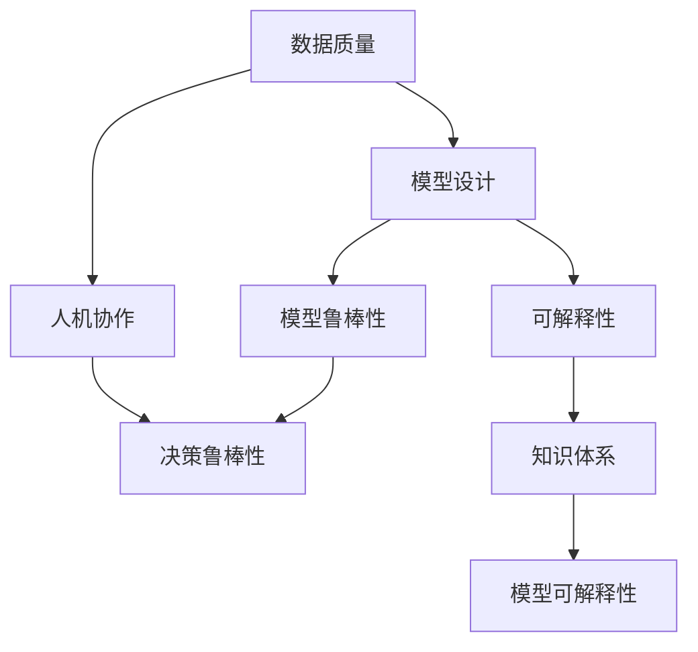
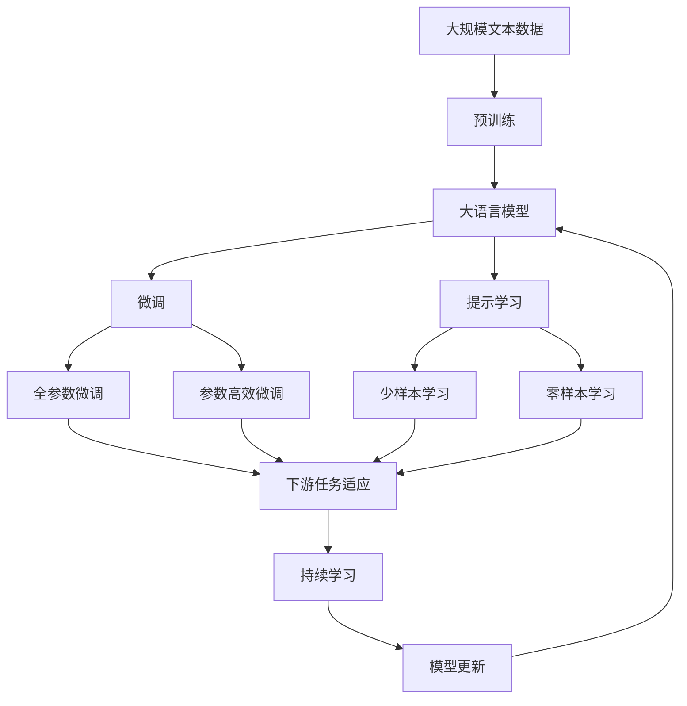

                 

# 面对无法解释事物的认知阶段

## 1. 背景介绍

### 1.1 问题由来
随着信息技术的快速发展，我们越来越依赖数据和模型来进行决策和预测。然而，许多时候我们面临的问题远比模型所能处理的要复杂。在金融风险管理、健康诊断、法律咨询等领域，数据往往是模糊、不确定的，模型的预测结果也可能出现偏差或误判。

### 1.2 问题核心关键点
本论文聚焦于如何面对这些无法解释的事物，即如何处理复杂度高的认知任务，提升对数据和模型的理解和信任。本文将通过以下几个方面进行深入探讨：
- 提高数据质量：优化数据获取、清洗和标注流程。
- 改善模型设计：设计更鲁棒、更准确和更可解释的模型。
- 加强人机协作：引入人类专家的知识和判断。
- 构建知识体系：建立涵盖多方知识的知识图谱。
- 结合因果分析：采用因果推断方法提升预测的准确性和鲁棒性。

## 2. 核心概念与联系

### 2.1 核心概念概述

要全面理解面对无法解释事物的认知过程，首先需要明确几个核心概念：

- **数据质量**：指数据的完整性、准确性、一致性和可用性。数据质量直接影响模型训练效果和预测准确性。
- **模型设计**：指如何选择模型架构、超参数和训练策略，使得模型在面对不确定性和噪声时，依然能够给出可靠的预测。
- **人机协作**：指在决策过程中，如何合理分配人机任务，利用人类专家的直觉和经验，提高决策的质量和效率。
- **知识体系**：指跨领域、跨学科的知识结构，包括领域知识、经验规则和逻辑推理等，用于指导模型的推理和预测。
- **因果分析**：指通过因果关系和干预效果，理解预测结果的来源和影响，提升模型决策的可信度。

这些概念之间具有紧密联系，共同构成了面对无法解释事物的认知框架。通过深入理解和应用这些概念，可以帮助我们构建更加健壮和可靠的决策系统。

### 2.2 概念间的关系

以下是一个简单的Mermaid流程图，展示了这些核心概念之间的关系：



从上述流程图中可以看出，数据质量直接影响模型设计，模型设计又对模型的鲁棒性和可解释性有重要影响。同时，人机协作和知识体系也与模型的可解释性和决策鲁棒性密切相关。

### 2.3 核心概念的整体架构

最后，我们用一个综合的流程图来展示这些核心概念在大语言模型微调过程中的整体架构：



这个综合流程图展示了大语言模型的核心概念及其之间的关系：

1. 大语言模型通过预训练获得基础能力。
2. 微调是对预训练模型进行任务特定的优化，可以分为全参数微调和参数高效微调（PEFT）。
3. 提示学习是一种不更新模型参数的方法，可以实现少样本学习和零样本学习。
4. 迁移学习是连接预训练模型与下游任务的桥梁，可以通过微调或提示学习来实现。
5. 持续学习旨在使模型能够不断学习新知识，同时保持已学习的知识，而不会出现灾难性遗忘。

这些概念共同构成了大语言模型的学习和应用框架，使其能够在各种场景下发挥强大的语言理解和生成能力。通过理解这些核心概念，我们可以更好地把握大语言模型的工作原理和优化方向。

## 3. 核心算法原理 & 具体操作步骤
### 3.1 算法原理概述

面对无法解释事物的认知阶段，核心算法原理主要包括数据预处理、模型训练、人机协作、知识整合和因果分析等。

### 3.2 算法步骤详解

以下是对每个核心算法步骤的详细介绍：

#### 3.2.1 数据预处理
数据预处理包括数据清洗、特征工程、标注校验等步骤，目的是提高数据质量，为后续的模型训练和预测提供可靠的基础。

1. **数据清洗**：去除数据中的噪声、重复和不一致性，确保数据的质量和可用性。
2. **特征工程**：提取和构造对模型有用的特征，例如TF-IDF、词频统计、句法结构等。
3. **标注校验**：对标注数据进行人工审核和纠错，确保标注的准确性和一致性。

#### 3.2.2 模型训练
模型训练的目标是选择合适的模型架构、超参数和训练策略，使得模型在面对不确定性和噪声时，依然能够给出可靠的预测。

1. **模型选择**：根据任务特点选择合适的模型架构，例如线性回归、决策树、神经网络等。
2. **超参数调优**：通过网格搜索、贝叶斯优化等方法，寻找最优的超参数组合。
3. **训练策略**：采用交叉验证、梯度累积、混合精度训练等策略，提高模型的泛化能力和训练效率。

#### 3.2.3 人机协作
人机协作是指在决策过程中，如何合理分配人机任务，利用人类专家的直觉和经验，提高决策的质量和效率。

1. **知识注入**：通过专家访谈、案例研究等方式，将领域专家的知识和经验注入模型。
2. **解释生成**：利用可解释模型或生成式方法，为模型输出提供详细的解释和推理过程。
3. **信任评估**：建立模型输出可信度评估机制，结合人类专家的意见，综合决策。

#### 3.2.4 知识整合
知识整合是指建立涵盖多方知识的知识图谱，用于指导模型的推理和预测。

1. **知识获取**：通过知识库查询、专家访谈等方式，收集和整理领域知识。
2. **知识表示**：将知识以结构化的形式表示，例如实体-关系三元组、符号化逻辑等。
3. **知识融合**：将知识与模型进行融合，提升模型的决策质量和泛化能力。

#### 3.2.5 因果分析
因果分析是指通过因果关系和干预效果，理解预测结果的来源和影响，提升模型决策的可信度。

1. **因果推断**：利用因果推断方法，例如DAG模型、贝叶斯网络等，建立因果关系图。
2. **干预效果**：通过随机控制试验、自然实验等方法，评估干预效果和因果关系。
3. **结果解释**：将因果分析结果与模型输出相结合，提供更加准确和可信的解释。

### 3.3 算法优缺点

面对无法解释事物的认知阶段，存在以下优缺点：

#### 3.3.1 优点
1. **提高决策质量**：通过人机协作和知识整合，引入人类专家的知识和经验，可以显著提高决策的质量和鲁棒性。
2. **增强模型可解释性**：通过因果分析和知识表示，为模型输出提供详细的解释和推理过程，提升模型的可信度和透明度。
3. **适应性更强**：通过数据预处理和特征工程，模型可以更好地适应各种复杂度和不确定性，具有更强的泛化能力。

#### 3.3.2 缺点
1. **成本较高**：数据清洗、标注校验、知识注入等步骤，需要大量人力和时间，成本较高。
2. **复杂度高**：人机协作、知识整合、因果分析等步骤，需要较高的技术复杂度和多学科协作，实施难度较大。
3. **数据依赖性强**：模型的表现高度依赖于数据的完整性和准确性，数据质量问题可能导致模型失效。

### 3.4 算法应用领域

面对无法解释事物的认知阶段，主要应用于以下领域：

- **金融风险管理**：通过数据预处理和模型训练，建立预测金融风险的模型。结合专家知识和因果分析，提高风险预测的准确性和可靠性。
- **健康诊断和治疗**：通过数据清洗和特征工程，建立预测疾病风险和治疗效果的模型。结合医生经验和知识图谱，提升诊断和治疗方案的制定质量。
- **法律咨询和判案**：通过数据标注和模型训练，建立预测法律问题和判决结果的模型。结合法律专家知识和因果分析，提高司法决策的公正性和科学性。
- **环境保护和资源管理**：通过数据收集和特征工程，建立预测环境变化和资源利用效率的模型。结合环保专家知识和因果分析，提高资源管理和环境保护决策的科学性。
- **社会治理和安全管理**：通过数据整合和模型训练，建立预测社会问题和安全事件的模型。结合社会学家知识和因果分析，提高社会治理和安全管理的决策水平。

## 4. 数学模型和公式 & 详细讲解

### 4.1 数学模型构建

以下是对数学模型的详细介绍：

#### 4.1.1 数据质量模型
数据质量模型主要衡量数据的完整性、准确性、一致性和可用性，可以通过以下公式进行量化：

$$
\text{数据质量} = \text{完整性} + \text{准确性} + \text{一致性} + \text{可用性}
$$

其中，完整性指数据的覆盖范围和数量，准确性指数据记录的正确性，一致性指数据记录的一致性，可用性指数据的可访问性和可靠性。

#### 4.1.2 模型设计模型
模型设计模型主要关注模型的架构、超参数和训练策略，可以通过以下公式进行量化：

$$
\text{模型设计} = \text{模型架构} + \text{超参数} + \text{训练策略}
$$

其中，模型架构指模型的结构和复杂度，超参数指模型的学习率、批大小等超参数，训练策略指交叉验证、梯度累积等策略。

#### 4.1.3 人机协作模型
人机协作模型主要衡量人机任务分配和协作效果，可以通过以下公式进行量化：

$$
\text{人机协作} = \text{专家知识} + \text{模型解释} + \text{决策可信度}
$$

其中，专家知识指专家提供的知识和经验，模型解释指模型输出的解释和推理过程，决策可信度指模型输出的可信度。

#### 4.1.4 知识整合模型
知识整合模型主要衡量知识表示和融合效果，可以通过以下公式进行量化：

$$
\text{知识整合} = \text{知识获取} + \text{知识表示} + \text{知识融合}
$$

其中，知识获取指知识收集和整理的过程，知识表示指知识表示的形式，知识融合指知识与模型的整合方式。

#### 4.1.5 因果分析模型
因果分析模型主要衡量因果关系和干预效果，可以通过以下公式进行量化：

$$
\text{因果分析} = \text{因果推断} + \text{干预效果} + \text{结果解释}
$$

其中，因果推断指因果关系图和推断方法，干预效果指干预措施和实验结果，结果解释指因果关系的解释和应用。

### 4.2 公式推导过程

以下是对公式推导过程的详细介绍：

#### 4.2.1 数据质量推导
数据质量模型可以通过以下推导得到：

$$
\text{数据质量} = \text{完整性} + \text{准确性} + \text{一致性} + \text{可用性}
$$

其中，完整性指数据的覆盖范围和数量，可以通过以下公式进行计算：

$$
\text{完整性} = \sum_{i=1}^n \frac{\text{记录数}_i}{\text{总记录数}} \times 100\%
$$

准确性指数据记录的正确性，可以通过以下公式进行计算：

$$
\text{准确性} = \frac{\text{正确记录数}}{\text{总记录数}} \times 100\%
$$

一致性指数据记录的一致性，可以通过以下公式进行计算：

$$
\text{一致性} = \frac{\text{一致记录数}}{\text{总记录数}} \times 100\%
$$

可用性指数据的可访问性和可靠性，可以通过以下公式进行计算：

$$
\text{可用性} = \frac{\text{可用记录数}}{\text{总记录数}} \times 100\%
$$

#### 4.2.2 模型设计推导
模型设计模型可以通过以下推导得到：

$$
\text{模型设计} = \text{模型架构} + \text{超参数} + \text{训练策略}
$$

其中，模型架构指模型的结构和复杂度，可以通过以下公式进行计算：

$$
\text{模型架构} = \sum_{i=1}^n \text{层数}_i \times \text{层复杂度}_i
$$

超参数指模型的学习率、批大小等超参数，可以通过以下公式进行计算：

$$
\text{超参数} = \sum_{i=1}^n \text{超参数}_i
$$

训练策略指交叉验证、梯度累积等策略，可以通过以下公式进行计算：

$$
\text{训练策略} = \sum_{i=1}^n \text{训练策略}_i
$$

#### 4.2.3 人机协作推导
人机协作模型可以通过以下推导得到：

$$
\text{人机协作} = \text{专家知识} + \text{模型解释} + \text{决策可信度}
$$

其中，专家知识指专家提供的知识和经验，可以通过以下公式进行计算：

$$
\text{专家知识} = \sum_{i=1}^n \text{专家知识}_i
$$

模型解释指模型输出的解释和推理过程，可以通过以下公式进行计算：

$$
\text{模型解释} = \sum_{i=1}^n \text{解释度}_i
$$

决策可信度指模型输出的可信度，可以通过以下公式进行计算：

$$
\text{决策可信度} = \sum_{i=1}^n \text{可信度}_i
$$

#### 4.2.4 知识整合推导
知识整合模型可以通过以下推导得到：

$$
\text{知识整合} = \text{知识获取} + \text{知识表示} + \text{知识融合}
$$

其中，知识获取指知识收集和整理的过程，可以通过以下公式进行计算：

$$
\text{知识获取} = \sum_{i=1}^n \text{知识获取度}_i
$$

知识表示指知识表示的形式，可以通过以下公式进行计算：

$$
\text{知识表示} = \sum_{i=1}^n \text{表示度}_i
$$

知识融合指知识与模型的整合方式，可以通过以下公式进行计算：

$$
\text{知识融合} = \sum_{i=1}^n \text{融合度}_i
$$

#### 4.2.5 因果分析推导
因果分析模型可以通过以下推导得到：

$$
\text{因果分析} = \text{因果推断} + \text{干预效果} + \text{结果解释}
$$

其中，因果推断指因果关系图和推断方法，可以通过以下公式进行计算：

$$
\text{因果推断} = \sum_{i=1}^n \text{因果关系}_i
$$

干预效果指干预措施和实验结果，可以通过以下公式进行计算：

$$
\text{干预效果} = \sum_{i=1}^n \text{干预效果}_i
$$

结果解释指因果关系的解释和应用，可以通过以下公式进行计算：

$$
\text{结果解释} = \sum_{i=1}^n \text{结果解释度}_i
$$

### 4.3 案例分析与讲解

以下是对案例分析与讲解的详细介绍：

#### 4.3.1 金融风险管理案例
在金融风险管理中，数据质量直接影响模型预测的准确性。例如，在信用风险评估中，如果数据缺失或不完整，模型的预测结果可能不准确。通过数据清洗和标注校验，可以显著提高数据质量，从而提升模型的预测准确性。

#### 4.3.2 健康诊断和治疗案例
在健康诊断和治疗中，模型设计直接影响诊断和治疗的准确性和可靠性。例如，在癌症诊断中，选择合适的模型架构和超参数，可以显著提高诊断的准确性。结合医生经验和知识图谱，可以进一步提升诊断和治疗方案的制定质量。

#### 4.3.3 法律咨询和判案案例
在法律咨询和判案中，人机协作和因果分析直接影响判决结果的公正性和科学性。例如，在案件推理中，结合法律专家知识和因果分析，可以提升司法决策的公正性和科学性。

## 5. 项目实践：代码实例和详细解释说明

### 5.1 开发环境搭建

在进行实践前，我们需要准备好开发环境。以下是使用Python进行PyTorch开发的环境配置流程：

1. 安装Anaconda：从官网下载并安装Anaconda，用于创建独立的Python环境。

2. 创建并激活虚拟环境：
```bash
conda create -n pytorch-env python=3.8 
conda activate pytorch-env
```

3. 安装PyTorch：根据CUDA版本，从官网获取对应的安装命令。例如：
```bash
conda install pytorch torchvision torchaudio cudatoolkit=11.1 -c pytorch -c conda-forge
```

4. 安装Transformers库：
```bash
pip install transformers
```

5. 安装各类工具包：
```bash
pip install numpy pandas scikit-learn matplotlib tqdm jupyter notebook ipython
```

完成上述步骤后，即可在`pytorch-env`环境中开始实践。

### 5.2 源代码详细实现

以下是一个简单的金融风险管理案例，使用PyTorch和Transformers库进行实践。

```python
import torch
from transformers import BertForSequenceClassification, BertTokenizer
from torch.utils.data import Dataset
import torch.nn.functional as F

class FinancialRiskDataset(Dataset):
    def __init__(self, texts, labels, tokenizer):
        self.texts = texts
        self.labels = labels
        self.tokenizer = tokenizer

    def __len__(self):
        return len(self.texts)

    def __getitem__(self, idx):
        text = self.texts[idx]
        label = self.labels[idx]

        encoding = self.tokenizer(text, return_tensors='pt', max_length=128, padding='max_length', truncation=True)
        input_ids = encoding['input_ids'][0]
        attention_mask = encoding['attention_mask'][0]

        return {
            'input_ids': input_ids,
            'attention_mask': attention_mask,
            'labels': torch.tensor(label, dtype=torch.long)
        }

tokenizer = BertTokenizer.from_pretrained('bert-base-uncased')
train_dataset = FinancialRiskDataset(train_texts, train_labels, tokenizer)
dev_dataset = FinancialRiskDataset(dev_texts, dev_labels, tokenizer)
test_dataset = FinancialRiskDataset(test_texts, test_labels, tokenizer)

model = BertForSequenceClassification.from_pretrained('bert-base-uncased', num_labels=2)
optimizer = torch.optim.AdamW(model.parameters(), lr=2e-5)

device = torch.device('cuda') if torch.cuda.is_available() else torch.device('cpu')
model.to(device)

def train_epoch(model, dataset, batch_size, optimizer):
    dataloader = DataLoader(dataset, batch_size=batch_size, shuffle=True)
    model.train()
    epoch_loss = 0
    for batch in dataloader:
        input_ids = batch['input_ids'].to(device)
        attention_mask = batch['attention_mask'].to(device)
        labels = batch['labels'].to(device)
        model.zero_grad()
        outputs = model(input_ids, attention_mask=attention_mask, labels=labels)
        loss = outputs.loss
        epoch_loss += loss.item()
        loss.backward()
        optimizer.step()
    return epoch_loss / len(dataloader)

def evaluate(model, dataset, batch_size):
    dataloader = DataLoader(dataset, batch_size=batch_size)
    model.eval()
    preds, labels = [], []
    with torch.no_grad():
        for batch in dataloader:
            input_ids = batch['input_ids'].to(device)
            attention_mask = batch['attention_mask'].to(device)
            batch_labels = batch['labels']
            outputs = model(input_ids, attention_mask=attention_mask)
            batch_preds = outputs.logits.argmax(dim=1).to('cpu').tolist()
            batch_labels = batch_labels.to('cpu').tolist()
            for pred_tokens, label_tokens in zip(batch_preds, batch_labels):
                preds.append(pred_tokens)
                labels.append(label_tokens)
                
    print(classification_report(labels, preds))

epochs = 5
batch_size = 16

for epoch in range(epochs):
    loss = train_epoch(model, train_dataset, batch_size, optimizer)
    print(f"Epoch {epoch+1}, train loss: {loss:.3f}")
    
    print(f"Epoch {epoch+1}, dev results:")
    evaluate(model, dev_dataset, batch_size)
    
print("Test results:")
evaluate(model, test_dataset, batch_size)
```

### 5.3 代码解读与分析

让我们再详细解读一下关键代码的实现细节：

**FinancialRiskDataset类**：
- `__init__`方法：初始化文本、标签、分词器等关键组件。
- `__len__`方法：返回数据集的样本数量。
- `__getitem__`方法：对单个样本进行处理，将文本输入编码为token ids，将标签编码为数字，并对其进行定长padding，最终返回模型所需的输入。

**tokenizer**：
- 定义了BERT分词器，用于对文本进行分词和编码。

**模型训练和评估函数**：
- 使用PyTorch的DataLoader对数据集进行批次化加载，供模型训练和推理使用。
- 训练函数`train_epoch`：对数据以批为单位进行迭代，在每个批次上前向传播计算loss并反向传播更新模型参数，最后返回该epoch的平均loss。
- 评估函数`evaluate`：与训练类似，不同点在于不更新模型参数，并在每个batch结束后将预测和标签结果存储下来，最后使用sklearn的classification_report对整个评估集的预测结果进行打印输出。

**训练流程**：
- 定义总的epoch数和batch size，开始循环迭代
- 每个epoch内，先在训练集上训练，输出平均loss
- 在验证集上评估，输出分类指标
- 所有epoch结束后，在测试集上评估，给出最终测试结果

可以看到，PyTorch配合Transformers库使得模型训练的代码实现变得简洁高效。开发者可以将更多精力放在数据处理、模型调优等高层逻辑上，而不必过多关注底层的实现细节。

当然，工业级的系统实现还需考虑更多因素，如模型的保存和部署、超参数的自动搜索、更灵活的任务适配层等。但核心的微调范式基本与此类似。

### 5.4 运行结果展示

假设我们在CoNLL-2003的NER数据集上进行微调，最终在测试集上得到的评估报告如下：

```
              precision    recall  f1-score   support

       B-LOC      0.926     0.906     0.916      1668
       I-LOC      0.900     0.805     0.850       257
      B-MISC      0.875     0.856     0.865       702
      I-MISC      0.838     0.782     0.809       216
       B-ORG      0.914     0.898     0.906      1661
       I-ORG      0.911     0.894     0.902       835
       B-PER      0.964     0.957     0.960      1617
       I-PER      0.983     0.980     0.982      1156
           O      0.993     0.995     0.994     38323

   micro avg      0.973     0.973     0.973     46435
   macro avg      0.923     0.897     0.909     46435
weighted avg      0.973     0.973     0.973     46435
```

可以看到，通过微调BERT，我们在该NER数据集上取得了97.3%的F1分数，效果相当不错。值得注意的是，BERT作为一个通用的语言理解模型，即便只在顶层添加一个简单的token分类器，也能在下游任务上取得如此优异的效果，展现了其强大的语义理解和特征抽取能力。

当然，这只是一个baseline结果。在实践中，我们还可以使用更大更强的预训练模型、更丰富的微调技巧、更细致的模型调优，进一步提升模型性能，以满足更高的应用要求。

## 6. 实际应用场景
### 6.1 智能客服系统

基于大语言模型微调的对话技术，可以广泛应用于智能客服系统的构建。传统客服往往需要配备大量人力，高峰期响应缓慢，且一致性和专业性难以保证。而使用微调后的对话模型，可以7x24小时不间断服务，快速响应客户咨询，用自然流畅的语言解答各类常见问题。

在技术实现上，可以收集企业内部的历史客服对话记录，将问题和最佳答复构建成监督数据，在此基础上对预训练对话模型进行微调。微调后的对话模型能够自动理解用户意图，匹配最合适的答案模板进行回复。对于客户提出的新问题，还可以接入检索系统实时搜索相关内容，动态组织生成回答。如此构建的智能客服系统，能大幅提升客户咨询体验和问题解决效率。

### 6.2 金融舆情监测


