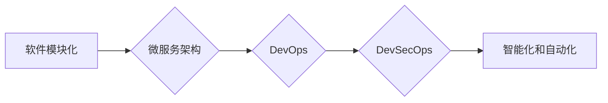

> 软件 2.0, 效率提升, 价值创造, 模块化, 微服务, DevOps, DevSecOps, 智能化, 自动化, 用户体验

# 软件 2.0 的价值：提升效率、创造价值

软件 2.0 是软件发展的一个新阶段，它不仅仅是代码和功能的迭代，更是软件开发和运维方式的革新。在这个阶段，软件的价值不再仅仅是执行任务，更是提升效率、创造价值的强大工具。本文将深入探讨软件 2.0 的核心概念、原理、实践以及未来发展趋势。

## 1. 背景介绍

### 1.1 软件发展的历史

从早期的系统软件到应用软件，再到如今的互联网软件，软件的发展经历了多个阶段。每个阶段都伴随着技术的进步和用户需求的变化。

- **系统软件**：早期的软件主要集中在操作系统、数据库、编译器等系统级应用上，目的是提供基本的服务和功能。
- **应用软件**：随着计算机的普及，软件开始转向应用领域，如办公软件、设计软件、企业管理软件等。
- **互联网软件**：互联网的兴起推动了软件向网络化和服务化方向发展，如电商平台、社交媒体、在线游戏等。

### 1.2 软件发展的趋势

随着技术的不断进步，软件发展呈现出以下趋势：

- **模块化**：软件系统越来越模块化，便于扩展和维护。
- **微服务**：微服务架构将大型应用程序拆分成小的、独立的服务，提高了系统的可扩展性和可维护性。
- **DevOps**：DevOps文化的兴起，将开发和运维紧密结合，实现了快速交付和持续集成。
- **DevSecOps**：DevSecOps将安全贯穿于整个软件开发和运维流程，确保软件的安全性。
- **智能化和自动化**：人工智能和机器学习技术被广泛应用于软件开发和运维，提高了效率和自动化水平。

### 1.3 本文结构

本文将围绕以下结构展开：

- **核心概念与联系**：介绍软件 2.0 的核心概念，并使用 Mermaid 流程图展示其架构。
- **核心算法原理 & 具体操作步骤**：探讨软件 2.0 的核心算法原理和具体操作步骤。
- **数学模型和公式 & 详细讲解 & 举例说明**：介绍软件 2.0 相关的数学模型和公式，并进行案例分析。
- **项目实践：代码实例和详细解释说明**：提供软件 2.0 的代码实例，并对关键代码进行解读。
- **实际应用场景**：探讨软件 2.0 在实际应用场景中的应用。
- **未来应用展望**：展望软件 2.0 的未来发展趋势。
- **工具和资源推荐**：推荐软件 2.0 相关的学习资源、开发工具和论文。
- **总结：未来发展趋势与挑战**：总结软件 2.0 的发展趋势和挑战。
- **附录：常见问题与解答**：解答读者可能提出的问题。

## 2. 核心概念与联系

### 2.1 软件模块化

软件模块化是将软件系统分解为一系列独立的模块，每个模块负责特定的功能。模块化有以下优点：

- **可重用性**：模块可以重用于不同的系统和项目。
- **可维护性**：模块化使得代码更容易维护和更新。
- **可扩展性**：可以方便地添加或移除模块，以适应需求的变化。

### 2.2 软件微服务

微服务架构将大型应用程序拆分成小的、独立的服务，每个服务都有自己的数据库和API。微服务有以下优点：

- **可扩展性**：可以独立扩展每个服务，提高系统的整体性能。
- **可维护性**：可以独立开发、测试和部署服务，提高开发效率。
- **可部署性**：可以独立部署服务，提高系统的可靠性。

### 2.3 软件DevOps

DevOps是一种软件开发和运维的文化和流程，旨在缩短软件开发周期，提高软件质量。DevOps的核心原则包括：

- **自动化**：通过自动化工具和流程提高效率。
- **协作**：加强开发和运维团队的协作。
- **持续交付**：实现快速、可靠的软件交付。

### 2.4 软件DevSecOps

DevSecOps将安全贯穿于整个软件开发和运维流程，确保软件的安全性。DevSecOps的核心原则包括：

- **安全第一**：将安全视为软件开发和运维的优先事项。
- **自动化安全测试**：使用自动化工具进行安全测试。
- **安全培训和意识提升**：提高开发者和运维人员的安全意识。

### 2.5 Mermaid 流程图

以下是一个 Mermaid 流程图，展示了软件 2.0 的核心概念和联系：



## 3. 核心算法原理 & 具体操作步骤

### 3.1 算法原理概述

软件 2.0 的核心算法包括模块化、微服务、DevOps、DevSecOps 和智能化自动化。

- **模块化**：通过设计模式和编程语言特性实现代码的模块化。
- **微服务**：使用容器化技术（如Docker）和API网关实现服务的拆分和通信。
- **DevOps**：使用CI/CD工具（如Jenkins、GitLab CI）实现自动化构建、测试和部署。
- **DevSecOps**：使用自动化安全测试工具（如SonarQube）实现安全测试和漏洞扫描。
- **智能化自动化**：使用人工智能和机器学习技术实现自动化决策和操作。

### 3.2 算法步骤详解

#### 3.2.1 模块化

1. 分析软件需求，确定模块的划分。
2. 使用设计模式（如MVC、MVVM）实现模块的隔离。
3. 编写模块接口，确保模块之间的解耦。

#### 3.2.2 微服务

1. 分析软件架构，确定服务的拆分。
2. 使用容器化技术部署服务。
3. 使用API网关实现服务的通信。

#### 3.2.3 DevOps

1. 设置CI/CD流程，实现自动化构建、测试和部署。
2. 使用持续集成工具（如Jenkins）实现代码的自动化测试和集成。
3. 使用持续部署工具（如Docker Swarm）实现自动化部署。

#### 3.2.4 DevSecOps

1. 使用自动化安全测试工具进行安全测试和漏洞扫描。
2. 在代码审查和测试过程中引入安全检查。
3. 建立安全培训和意识提升计划。

#### 3.2.5 智能化自动化

1. 使用机器学习技术实现自动化决策。
2. 使用人工智能技术实现自动化操作。
3. 使用自动化工具提高工作效率。

### 3.3 算法优缺点

#### 3.3.1 模块化

优点：

- 提高代码的可重用性和可维护性。
- 提高代码的模块化和可扩展性。

缺点：

- 模块之间的接口设计需要谨慎。
- 模块的独立性需要保证。

#### 3.3.2 微服务

优点：

- 提高系统的可扩展性和可维护性。
- 提高系统的可靠性和容错性。

缺点：

- 需要管理更多的服务实例。
- 需要处理服务之间的通信问题。

#### 3.3.3 DevOps

优点：

- 提高软件交付速度。
- 提高软件质量。

缺点：

- 需要学习和使用新的工具和流程。
- 需要协调开发和运维团队。

#### 3.3.4 DevSecOps

优点：

- 提高软件安全性。
- 提高安全意识。

缺点：

- 需要增加安全测试和检查的成本。
- 需要培训开发者和运维人员的安全知识。

#### 3.3.5 智能化自动化

优点：

- 提高工作效率。
- 减少人为错误。

缺点：

- 需要投入资金购买和开发人工智能和机器学习模型。
- 需要维护和更新模型。

### 3.4 算法应用领域

软件 2.0 的算法可以应用于以下领域：

- **Web应用开发**：提高开发效率、维护性和可扩展性。
- **移动应用开发**：提高开发效率、维护性和可扩展性。
- **云计算服务**：提高服务质量和可靠性。
- **物联网应用**：提高设备管理和数据分析能力。

## 4. 数学模型和公式 & 详细讲解 & 举例说明

### 4.1 数学模型构建

软件 2.0 的数学模型主要包括以下内容：

- **模块化模型**：用于描述模块之间的关系和功能。
- **微服务模型**：用于描述服务之间的关系和通信。
- **DevOps模型**：用于描述软件开发和运维的流程。
- **DevSecOps模型**：用于描述软件开发、运维和安全之间的协同。

### 4.2 公式推导过程

由于软件 2.0 的数学模型涉及多个方面，以下仅以模块化模型为例进行说明。

假设软件系统由 $n$ 个模块组成，模块 $i$ 的功能由 $f_i$ 表示，模块之间的关系由 $R_{ij}$ 表示。则模块化模型可以表示为：

$$
M = \{f_i, R_{ij}\}_{i=1}^n
$$

其中，$f_i$ 表示模块 $i$ 的功能，$R_{ij}$ 表示模块 $i$ 和模块 $j$ 之间的关系。

### 4.3 案例分析与讲解

以下是一个简单的模块化模型案例：

- **模块 1**：用户登录模块，功能为验证用户身份。
- **模块 2**：用户注册模块，功能为注册新用户。
- **模块 3**：用户信息模块，功能为存储和查询用户信息。
- **模块之间的关系**：模块 1 和模块 2 通过模块 3 进行交互。

在这个案例中，模块化模型可以表示为：

$$
M = \{f_1, f_2, f_3, R_{12}, R_{13}, R_{23}\}
$$

其中，$f_1$ 表示模块 1 的功能，$f_2$ 表示模块 2 的功能，$f_3$ 表示模块 3 的功能，$R_{12}$ 表示模块 1 和模块 2 之间的关系，$R_{13}$ 表示模块 1 和模块 3 之间的关系，$R_{23}$ 表示模块 2 和模块 3 之间的关系。

## 5. 项目实践：代码实例和详细解释说明

### 5.1 开发环境搭建

为了演示软件 2.0 的实践，我们需要搭建一个简单的Web应用开发环境。以下是使用Python和Django框架搭建开发环境的步骤：

1. 安装Python和pip。
2. 安装Django：
```bash
pip install django
```
3. 创建一个新的Django项目：
```bash
django-admin startproject myproject
cd myproject
```
4. 创建一个新的Django应用：
```bash
python manage.py startapp myapp
```

### 5.2 源代码详细实现

以下是一个简单的Django应用示例，展示了如何实现用户登录和注册功能：

```python
# myapp/models.py
from django.db import models

class User(models.Model):
    username = models.CharField(max_length=100)
    password = models.CharField(max_length=100)
    email = models.EmailField()

# myapp/views.py
from django.shortcuts import render, redirect
from django.contrib.auth import authenticate, login
from .models import User

def login_view(request):
    if request.method == 'POST':
        username = request.POST['username']
        password = request.POST['password']
        user = authenticate(request, username=username, password=password)
        if user is not None:
            login(request, user)
            return redirect('home')
        else:
            return render(request, 'login.html', {'error': 'Invalid username or password'})
    else:
        return render(request, 'login.html')

def register_view(request):
    if request.method == 'POST':
        username = request.POST['username']
        password = request.POST['password']
        email = request.POST['email']
        user = User.objects.create_user(username, password, email)
        user.save()
        return redirect('login')
    else:
        return render(request, 'register.html')
```

### 5.3 代码解读与分析

以上代码实现了用户登录和注册功能。首先，我们定义了`User`模型，用于存储用户信息。然后，在`views.py`中定义了`login_view`和`register_view`两个视图函数，分别用于处理登录和注册请求。

在`login_view`中，我们使用`authenticate`函数验证用户名和密码，如果验证成功，则使用`login`函数将用户登录到系统中，并重定向到主页。如果验证失败，则返回错误信息。

在`register_view`中，我们同样使用`authenticate`函数验证用户名和密码，然后创建一个新的`User`对象并将其保存到数据库中。最后，将用户重定向到登录页面。

### 5.4 运行结果展示

运行Django项目后，可以访问`/login`和`/register`页面，进行用户登录和注册操作。

## 6. 实际应用场景

软件 2.0 的应用场景非常广泛，以下是一些典型的应用场景：

- **电商平台**：使用软件 2.0 技术构建高效的电商平台，提高用户体验和运营效率。
- **企业级应用**：使用软件 2.0 技术构建可扩展、可维护的企业级应用，满足企业业务需求。
- **物联网应用**：使用软件 2.0 技术构建智能化的物联网应用，提高设备管理和数据分析能力。
- **移动应用**：使用软件 2.0 技术构建高效、可扩展的移动应用，提升用户满意度。

## 7. 工具和资源推荐

### 7.1 学习资源推荐

- 《软件开发的艺术》
- 《敏捷软件开发》
- 《持续集成与持续部署》
- 《DevOps实践指南》
- 《人工智能与机器学习》

### 7.2 开发工具推荐

- **Python**：通用编程语言，适用于Web开发、数据分析和科学计算等领域。
- **Django**：Python Web框架，适合构建大型Web应用。
- **Docker**：容器化技术，用于简化应用部署和运维。
- **Jenkins**：持续集成和持续部署工具。
- **Kubernetes**：容器编排工具，用于自动化部署和管理容器。

### 7.3 相关论文推荐

- **"Microservices: A Vision for the Future of Software Architecture" by Martin Fowler**
- **"DevOps and the Cloud: A marriage made in heaven" by Jez Humble and David Farley**
- **"The Art of Secure Software Development" by Gary McGraw**
- **"The Practice of Cloud System Administration" by Thomas A. Limoncelli, Strata R. Chalup, and Christina J. Hogan**

## 8. 总结：未来发展趋势与挑战

### 8.1 研究成果总结

软件 2.0 的发展成果主要体现在以下几个方面：

- **模块化**：软件系统更加模块化，便于扩展和维护。
- **微服务**：微服务架构提高了系统的可扩展性和可维护性。
- **DevOps**：DevOps文化提高了软件交付速度和质量。
- **DevSecOps**：DevSecOps确保了软件的安全性。
- **智能化和自动化**：人工智能和机器学习技术提高了软件开发和运维的效率。

### 8.2 未来发展趋势

软件 2.0 的未来发展趋势包括：

- **更加模块化和组件化**：软件系统将更加模块化和组件化，便于快速开发和部署。
- **更加智能化和自动化**：人工智能和机器学习技术将进一步提高软件开发和运维的效率。
- **更加安全可靠**：DevSecOps将更加普及，软件的安全性将得到进一步保障。

### 8.3 面临的挑战

软件 2.0 面临的挑战包括：

- **复杂性**：软件系统变得更加复杂，需要更高效的开发和管理方法。
- **安全性**：随着软件的普及，安全性问题日益突出，需要建立更加完善的安全体系。
- **人才短缺**：软件 2.0 需要更多具备多方面技能的人才。

### 8.4 研究展望

未来，软件 2.0 将朝着更加模块化、智能化、安全可靠的方向发展。同时，需要不断探索新的开发和管理方法，以应对软件系统的复杂性、安全性和人才短缺等挑战。

## 9. 附录：常见问题与解答

**Q1：软件 2.0 与软件 1.0 的区别是什么？**

A：软件 1.0 侧重于功能实现，而软件 2.0 侧重于提升效率、创造价值。

**Q2：软件 2.0 的核心价值是什么？**

A：软件 2.0 的核心价值在于提高效率、创造价值，帮助企业和个人更好地应对挑战。

**Q3：如何构建软件 2.0 应用？**

A：构建软件 2.0 应用需要采用模块化、微服务、DevOps、DevSecOps 和智能化自动化等技术。

**Q4：软件 2.0 对企业意味着什么？**

A：软件 2.0 可以帮助企业提高效率、降低成本、提升竞争力。

**Q5：软件 2.0 对个人意味着什么？**

A：软件 2.0 可以帮助个人提高工作效率、提升生活质量。

---

作者：禅与计算机程序设计艺术 / Zen and the Art of Computer Programming