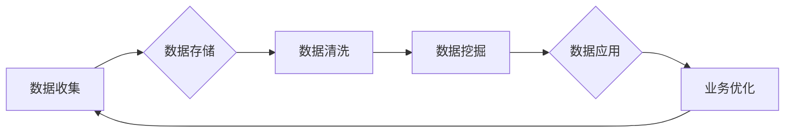

> 数据驱动，软件2.0，机器学习，人工智能，数字化转型，业务智能

# 软件 2.0 的时代：数据驱动一切

随着互联网的普及和大数据时代的到来，软件行业正经历着从软件1.0向软件2.0的转型。这一转型不仅仅是一次技术革新，更是一场深刻的商业和社会变革。在软件2.0时代，数据成为了驱动一切的引擎，它不仅改变了软件的开发和部署方式，也重塑了企业的运营模式和市场竞争格局。

## 1. 背景介绍

### 1.1 软件1.0到软件2.0的演变

软件1.0时代，软件主要以功能为导向，开发周期长，成本高，更新换代慢。随着计算机硬件的快速发展，软件的功能日益丰富，但用户的需求也在不断变化。为了满足这些需求，软件行业开始向软件2.0时代迈进。

软件2.0时代，软件以用户为中心，注重用户体验，强调敏捷开发和持续集成。更重要的是，软件2.0时代的数据驱动力使得软件能够自我学习和优化，实现智能化和个性化。

### 1.2 数据成为核心资产

在软件2.0时代，数据不再是单纯的副产品，而是企业最重要的核心资产之一。通过对数据的收集、分析、挖掘和应用，企业能够更好地了解用户需求，优化业务流程，提高运营效率。

### 1.3 数字化转型的需求

随着全球经济的发展，企业面临着日益激烈的市场竞争。数字化转型成为了企业提升竞争力、实现可持续发展的关键。软件2.0时代的数据驱动特性，为企业的数字化转型提供了强有力的技术支撑。

## 2. 核心概念与联系

### 2.1 数据驱动

数据驱动是指企业通过收集、分析和应用数据，以数据为基础进行决策和管理的过程。在软件2.0时代，数据驱动已经成为企业运营的核心。

#### Mermaid 流程图



### 2.2 机器学习和人工智能

机器学习和人工智能是数据驱动的核心技术。通过机器学习算法，可以从海量数据中提取有价值的信息，实现数据的智能化应用。人工智能则进一步将机器学习应用于更广泛的领域，如语音识别、图像识别、自然语言处理等。

### 2.3 业务智能

业务智能是指将数据和分析工具应用于业务流程，以提高业务效率和决策质量。业务智能是软件2.0时代的重要特征，它使得企业能够更好地应对市场变化，实现业务创新。

## 3. 核心算法原理 & 具体操作步骤

### 3.1 算法原理概述

数据驱动的核心算法主要包括：

- 数据采集：从各种数据源收集数据。
- 数据存储：将采集到的数据存储在数据库或数据湖中。
- 数据清洗：去除数据中的噪声和异常值。
- 数据挖掘：使用统计分析和机器学习算法从数据中提取有价值的信息。
- 数据可视化：将数据以图形、图表等形式呈现，便于理解和分析。
- 业务智能：将数据分析结果应用于业务流程，实现业务优化。

### 3.2 算法步骤详解

数据驱动的具体操作步骤如下：

1. **明确业务目标**：确定数据分析的目标，如提高销售额、降低成本、提升客户满意度等。
2. **数据采集**：根据业务目标，确定需要采集的数据类型和来源。
3. **数据存储**：选择合适的数据存储方案，如关系型数据库、NoSQL数据库、数据湖等。
4. **数据清洗**：使用数据清洗工具和脚本，去除数据中的噪声和异常值。
5. **数据挖掘**：使用统计分析和机器学习算法，从数据中提取有价值的信息。
6. **数据可视化**：将数据分析结果以图形、图表等形式呈现，便于理解和分析。
7. **业务智能**：将数据分析结果应用于业务流程，实现业务优化。

### 3.3 算法优缺点

#### 优点

- **提高决策质量**：数据驱动可以帮助企业做出更加科学、合理的决策。
- **优化业务流程**：数据驱动可以帮助企业发现业务流程中的瓶颈，并进行优化。
- **提升客户满意度**：数据驱动可以帮助企业更好地了解客户需求，提供更加个性化的产品和服务。

#### 缺点

- **数据质量要求高**：数据驱动依赖于高质量的数据，数据质量问题会影响分析结果。
- **技术门槛高**：数据驱动需要掌握数据分析、机器学习等技术，对人才要求较高。
- **实施成本高**：数据驱动需要投入大量的资金和人力，实施成本较高。

### 3.4 算法应用领域

数据驱动算法在各个领域都有广泛的应用，以下列举一些典型应用：

- **金融领域**：风险控制、信用评估、欺诈检测、投资决策等。
- **零售领域**：客户关系管理、精准营销、供应链优化等。
- **医疗领域**：疾病预测、药物研发、医疗诊断等。
- **制造领域**：生产线优化、质量控制、设备维护等。

## 4. 数学模型和公式 & 详细讲解 & 举例说明

### 4.1 数学模型构建

数据驱动的数学模型通常包括以下部分：

- **输入层**：数据输入。
- **隐藏层**：进行数据特征提取和转换。
- **输出层**：输出分析结果。

#### 示例：线性回归模型

线性回归模型是一种常见的预测模型，其公式如下：

$$
y = \beta_0 + \beta_1 x_1 + \beta_2 x_2 + \ldots + \beta_n x_n + \epsilon
$$

其中，$y$ 是预测值，$x_1, x_2, \ldots, x_n$ 是特征值，$\beta_0, \beta_1, \ldots, \beta_n$ 是模型参数，$\epsilon$ 是误差项。

### 4.2 公式推导过程

线性回归模型的推导过程如下：

1. **最小二乘法**：使用最小二乘法求解模型参数。
2. **梯度下降法**：使用梯度下降法优化模型参数。

### 4.3 案例分析与讲解

假设我们要预测一家电商平台的月销售额，特征包括历史销售额、用户数量、季节性因素等。

我们可以使用线性回归模型进行预测，首先收集历史数据，然后进行数据清洗和特征工程，最后使用线性回归模型进行训练和预测。

## 5. 项目实践：代码实例和详细解释说明

### 5.1 开发环境搭建

1. 安装Python和Jupyter Notebook。
2. 安装必要的库，如NumPy、Pandas、Scikit-learn等。

### 5.2 源代码详细实现

```python
import numpy as np
import pandas as pd
from sklearn.linear_model import LinearRegression

# 加载数据
data = pd.read_csv('sales_data.csv')

# 数据预处理
X = data[['historical_sales', 'user_count', 'seasonality']]
y = data['monthly_sales']

# 训练线性回归模型
model = LinearRegression()
model.fit(X, y)

# 预测
new_data = np.array([[1000, 500, 1]])
prediction = model.predict(new_data)

print(f"预测的月销售额为：{prediction[0]}")
```

### 5.3 代码解读与分析

1. **加载数据**：使用Pandas读取CSV文件中的数据。
2. **数据预处理**：将特征和标签分离，并进行必要的预处理。
3. **训练模型**：使用Scikit-learn的线性回归模型进行训练。
4. **预测**：使用训练好的模型对新数据进行预测。

### 5.4 运行结果展示

运行代码后，将输出预测的月销售额。

## 6. 实际应用场景

### 6.1 金融风控

金融风控是数据驱动的典型应用场景。通过分析借款人的信用记录、还款历史、消费行为等数据，金融机构可以评估借款人的信用风险，降低坏账率。

### 6.2 个性化推荐

个性化推荐是数据驱动的另一个重要应用场景。通过对用户的浏览记录、购买记录、搜索历史等数据进行分析，推荐系统可以向用户推荐其可能感兴趣的商品或内容。

### 6.3 智能制造

智能制造是数据驱动的又一重要应用场景。通过收集生产过程中的数据，可以实时监控设备状态、优化生产流程、提高生产效率。

## 7. 工具和资源推荐

### 7.1 学习资源推荐

- 《数据科学入门》
- 《Python数据分析》
- 《机器学习实战》
- 《深度学习》

### 7.2 开发工具推荐

- Jupyter Notebook
- Pandas
- NumPy
- Scikit-learn
- TensorFlow
- PyTorch

### 7.3 相关论文推荐

- 《The Hundred-Page Machine Learning Book》
- 《Understanding Deep Learning》
- 《Hands-On Machine Learning with Scikit-Learn, Keras, and TensorFlow》

## 8. 总结：未来发展趋势与挑战

### 8.1 研究成果总结

软件2.0时代的数据驱动特性，已经深刻地改变了软件行业和企业的运营模式。数据驱动不仅提高了企业的运营效率，也为企业的创新提供了强大的动力。

### 8.2 未来发展趋势

- 数据驱动将继续成为软件行业和企业的核心竞争力。
- 数据分析、机器学习、人工智能等技术将更加成熟，为数据驱动提供更加强大的技术支撑。
- 跨行业的数据共享和协同将成为趋势，推动数据驱动应用的进一步发展。

### 8.3 面临的挑战

- 数据安全和隐私保护：数据驱动应用需要确保数据的安全和隐私。
- 数据质量：数据驱动应用依赖于高质量的数据，数据质量问题会影响分析结果。
- 技术门槛：数据驱动需要掌握数据分析、机器学习等技术，对人才要求较高。

### 8.4 研究展望

未来，数据驱动将推动软件行业和企业的进一步发展。我们需要关注以下研究方向：

- 开发更加高效、可靠的数据驱动应用。
- 提高数据质量和数据可用性。
- 降低数据驱动的技术门槛，让更多人能够应用数据驱动技术。

## 9. 附录：常见问题与解答

**Q1：数据驱动的主要优势是什么？**

A：数据驱动可以提高企业的运营效率，优化业务流程，提升客户满意度，为企业创造更大的价值。

**Q2：数据驱动的主要挑战是什么？**

A：数据驱动的主要挑战包括数据安全、数据质量、技术门槛等。

**Q3：如何提高数据质量？**

A：提高数据质量需要从数据采集、数据存储、数据清洗等环节进行严格控制。

**Q4：如何降低数据驱动的技术门槛？**

A：降低数据驱动的技术门槛需要开发更加易于使用的工具和平台，并提供相关的培训和教育。

作者：禅与计算机程序设计艺术 / Zen and the Art of Computer Programming