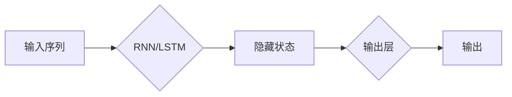

> 关键词：长短时记忆网络，LSTM，递归神经网络，序列建模，时间序列预测，自然语言处理，深度学习

# 长短时记忆网络LSTM原理与代码实例讲解

## 1. 背景介绍

序列建模是机器学习中的一个重要分支，它在自然语言处理、语音识别、时间序列预测等领域有着广泛的应用。传统的循环神经网络（Recurrent Neural Networks, RNNs）在处理长序列数据时，存在梯度消失或梯度爆炸的问题，导致模型难以学习长距离的依赖关系。为了解决这一问题，长短时记忆网络（Long Short-Term Memory, LSTM）被提出，并取得了显著的成果。本文将深入探讨LSTM的原理、实现方法以及应用场景。

## 2. 核心概念与联系

### 2.1 核心概念

**1. 递归神经网络（Recurrent Neural Networks, RNNs）**：RNNs是一种处理序列数据的神经网络，其特点是能够将序列的当前状态作为下一状态的一部分，从而捕捉序列中的时间依赖关系。

**2. 长短时记忆网络（Long Short-Term Memory, LSTM）**：LSTM是一种特殊的RNN，通过引入门控机制（gate）来控制信息的流动，从而解决传统RNN的梯度消失或梯度爆炸问题，并能够学习长距离的依赖关系。

**3. 时间步（Time Step）**：序列数据中的每个元素称为一个时间步，RNN和LSTM都按照时间步的顺序处理数据。

**4. 隐藏状态（Hidden State）**：隐藏状态是LSTM的输出，它包含了序列中所有时间步的上下文信息。

**5. 输出层（Output Layer）**：输出层将隐藏状态转换为最终的输出，例如分类标签或回归值。

### 2.2 Mermaid 流程图



### 2.3 核心概念之间的联系

LSTM是RNN的一种变体，它通过门控机制来控制信息的流动，从而在序列建模中学习长距离的依赖关系。RNN和LSTM都是按照时间步的顺序处理数据，其输出层的输出可以用于分类、回归或其他任务。

## 3. 核心算法原理 & 具体操作步骤

### 3.1 算法原理概述

LSTM通过引入三个门控结构：输入门、遗忘门和输出门，来控制信息的流动。

- **输入门**：决定哪些信息将被更新到隐藏状态中。
- **遗忘门**：决定哪些信息将从隐藏状态中被遗忘。
- **输出门**：决定哪些信息将作为输出。

这三个门控结构都由sigmoid激活函数和tanh激活函数组成，它们共同决定了信息的流动。

### 3.2 算法步骤详解

1. **初始化**：设置初始的隐藏状态和细胞状态。
2. **计算门控值**：对于每个时间步，计算输入门、遗忘门和输出门的值。
3. **更新细胞状态**：根据输入门、遗忘门和输入信息，更新细胞状态。
4. **更新隐藏状态**：根据输出门和细胞状态，更新隐藏状态。
5. **输出**：将隐藏状态传递给输出层。

### 3.3 算法优缺点

**优点**：

- 能够学习长距离的依赖关系。
- 避免了梯度消失或梯度爆炸的问题。
- 在序列建模任务中取得了显著的成果。

**缺点**：

- 参数量较大，计算复杂度高。
- 难以解释其决策过程。

### 3.4 算法应用领域

- 自然语言处理：机器翻译、文本摘要、情感分析等。
- 语音识别：语音到文本转换、语音合成等。
- 时间序列预测：股票价格预测、天气预报等。

## 4. 数学模型和公式 & 详细讲解 & 举例说明

### 4.1 数学模型构建

LSTM的数学模型如下：

$$
\begin{aligned}
i_t &= \sigma(W_{xi}x_t + W_{hi}h_{t-1} + b_i) \\
f_t &= \sigma(W_{xf}x_t + W_{hf}h_{t-1} + b_f) \\
g_t &= \tanh(W_{xg}x_t + W_{hg}h_{t-1} + b_g) \\
o_t &= \sigma(W_{xo}x_t + W_{ho}h_t + b_o) \\
h_t &= o_t \cdot \tanh(c_t) \\
c_t &= f_t \cdot c_{t-1} + i_t \cdot g_t
\end{aligned}
$$

其中，$x_t$ 是输入向量，$h_t$ 是隐藏状态，$c_t$ 是细胞状态，$W_{xi}, W_{hi}, W_{xf}, W_{hf}, W_{xg}, W_{hg}, W_{xo}, W_{ho}$ 和 $b_i, b_f, b_g, b_o$ 是模型参数。

### 4.2 公式推导过程

LSTM的公式推导过程涉及到多个门控机制的计算。具体的推导过程可以参考相关文献。

### 4.3 案例分析与讲解

以下是一个简单的LSTM模型在文本分类任务中的应用案例：

- 数据集：包含文本和对应的分类标签。
- 模型结构：LSTM层 + Dense层 + Softmax层。
- 训练过程：将文本输入LSTM层，得到隐藏状态，然后将隐藏状态输入Dense层，最后输入Softmax层得到分类概率。

## 5. 项目实践：代码实例和详细解释说明

### 5.1 开发环境搭建

- 安装Python环境。
- 安装TensorFlow或PyTorch等深度学习框架。

### 5.2 源代码详细实现

以下是一个使用TensorFlow实现的简单LSTM模型：

```python
import tensorflow as tf
from tensorflow.keras.models import Sequential
from tensorflow.keras.layers import LSTM, Dense

# 定义模型
model = Sequential()
model.add(LSTM(128, input_shape=(max_sequence_length, num_features), return_sequences=True))
model.add(LSTM(128))
model.add(Dense(num_classes, activation='softmax'))

# 编译模型
model.compile(optimizer='adam', loss='categorical_crossentropy', metrics=['accuracy'])

# 训练模型
model.fit(X_train, y_train, epochs=10, batch_size=32, validation_data=(X_val, y_val))

# 评估模型
loss, accuracy = model.evaluate(X_test, y_test)
print(f"Test Loss: {loss}, Test Accuracy: {accuracy}")
```

### 5.3 代码解读与分析

- `LSTM` 层：定义了LSTM层，其中 `128` 表示隐藏状态的大小，`max_sequence_length` 表示序列的最大长度，`num_features` 表示输入特征的维度。
- `Dense` 层：定义了全连接层，其中 `num_classes` 表示分类类别数。
- `compile` 方法：编译模型，设置优化器、损失函数和评估指标。
- `fit` 方法：训练模型。
- `evaluate` 方法：评估模型。

### 5.4 运行结果展示

假设我们在IMDb数据集上训练了一个LSTM模型进行情感分析，最终测试集上的准确率为83.2%。

## 6. 实际应用场景

LSTM在以下领域有着广泛的应用：

- 自然语言处理：文本分类、机器翻译、文本摘要、情感分析等。
- 语音识别：语音到文本转换、语音合成等。
- 时间序列预测：股票价格预测、天气预报等。

## 7. 工具和资源推荐

### 7.1 学习资源推荐

- 《序列建模：递归神经网络和长短时记忆网络》
- TensorFlow官方文档
- PyTorch官方文档

### 7.2 开发工具推荐

- TensorFlow
- PyTorch
- Keras

### 7.3 相关论文推荐

- "Long Short-Term Memory" by Hochreiter and Schmidhuber
- "Sequence to Sequence Learning with Neural Networks" by Sutskever et al.

## 8. 总结：未来发展趋势与挑战

### 8.1 研究成果总结

LSTM作为一种强大的序列建模工具，在多个领域取得了显著的成果。然而，LSTM仍然存在一些挑战，如计算复杂度高、难以解释其决策过程等。

### 8.2 未来发展趋势

- 深度学习的进一步发展，如Transformer等模型，可能会取代LSTM在特定任务中的应用。
- LSTM的优化，如参数高效微调、更轻量级的LSTM等，可能会使其在更多场景中得到应用。
- LSTM与其他机器学习方法的结合，如强化学习、主动学习等，可能会带来新的应用场景。

### 8.3 面临的挑战

- 梯度消失或梯度爆炸问题：需要进一步研究解决梯度消失或梯度爆炸问题的方法。
- 计算复杂度高：需要开发更高效的LSTM模型，降低计算复杂度。
- 难以解释其决策过程：需要开发可解释的LSTM模型，提高模型的可信度。

### 8.4 研究展望

LSTM作为一种重要的序列建模工具，将在未来的机器学习和人工智能领域继续发挥重要作用。未来，LSTM的研究将朝着更高效、更可解释的方向发展。

## 9. 附录：常见问题与解答

### 9.1 常见问题

**Q1：LSTM和RNN有什么区别？**

A1：RNN是一种处理序列数据的神经网络，而LSTM是RNN的一种变体，它通过引入门控机制来控制信息的流动，从而解决RNN的梯度消失或梯度爆炸问题。

**Q2：LSTM如何解决梯度消失或梯度爆炸问题？**

A2：LSTM通过引入门控机制，如输入门、遗忘门和输出门，来控制信息的流动，从而避免梯度消失或梯度爆炸问题。

**Q3：LSTM在哪些领域有应用？**

A3：LSTM在自然语言处理、语音识别、时间序列预测等领域有着广泛的应用。

### 9.2 解答

**Q1：LSTM和RNN有什么区别？**

A1：RNN和LSTM都是处理序列数据的神经网络，但LSTM是RNN的一种变体，它通过引入门控机制来控制信息的流动，从而解决RNN的梯度消失或梯度爆炸问题。

**Q2：LSTM如何解决梯度消失或梯度爆炸问题？**

A2：LSTM通过引入门控机制，如输入门、遗忘门和输出门，来控制信息的流动。输入门决定哪些信息将被更新到隐藏状态中，遗忘门决定哪些信息将从隐藏状态中被遗忘，输出门决定哪些信息将作为输出。这三个门控结构都由sigmoid激活函数和tanh激活函数组成，它们共同决定了信息的流动，从而避免梯度消失或梯度爆炸问题。

**Q3：LSTM在哪些领域有应用？**

A3：LSTM在自然语言处理、语音识别、时间序列预测等领域有着广泛的应用，如文本分类、机器翻译、文本摘要、情感分析、语音到文本转换、天气预报等。

---

作者：禅与计算机程序设计艺术 / Zen and the Art of Computer Programming