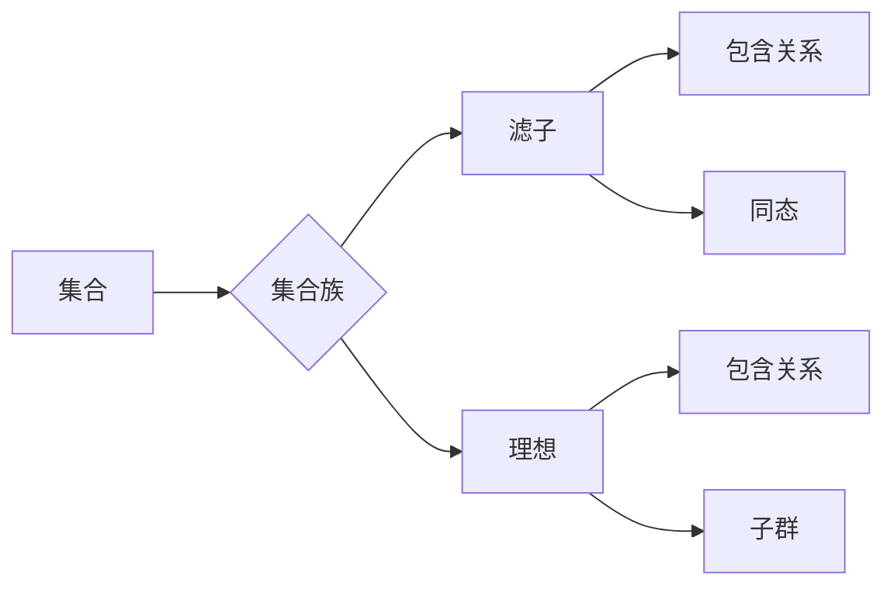

# 集合论导引：滤子与理想

> 关键词：集合论，滤子，理想，商集，同态，子群，理想理论，抽象代数，拓扑空间

## 1. 背景介绍

集合论是现代数学的基石之一，它提供了一种抽象的语言来描述和操作数学对象。在集合论中，滤子和理想是两个重要的概念，它们在抽象代数、拓扑学等领域有着广泛的应用。本文将深入探讨滤子和理想的理论基础、操作步骤以及实际应用，旨在为读者提供一份关于集合论中滤子和理想的全面导引。

### 1.1 问题的由来

滤子和理想的概念起源于对集合的集合的操作和抽象。在集合论的发展过程中，数学家们试图找到一种方法来处理集合之间的特殊关系，这些关系既不是集合的包含关系，也不是等价关系。滤子和理想就是在这种背景下被提出的，它们提供了一种新的视角来研究集合的结构和性质。

### 1.2 研究现状

滤子和理想的研究已经取得了丰富的成果，它们在抽象代数、拓扑学、泛函分析等领域有着广泛的应用。近年来，随着数学的发展，滤子和理想的理论也得到了进一步的发展和完善。

### 1.3 研究意义

滤子和理想的概念对于理解数学结构及其性质具有重要意义。它们提供了一种新的工具来研究集合之间的特殊关系，有助于我们更好地理解数学对象的结构和性质。

### 1.4 本文结构

本文将按照以下结构进行展开：

- 第2章介绍集合论的基本概念，为后续讨论滤子和理想打下基础。
- 第3章详细讲解滤子和理想的理论，包括它们的定义、性质以及之间的关系。
- 第4章探讨滤子和理想的运算，以及它们在抽象代数和拓扑学中的应用。
- 第5章通过具体实例展示滤子和理想在实际问题中的应用。
- 第6章总结滤子和理想的研究现状、未来发展趋势以及面临的挑战。
- 第7章推荐相关学习资源、开发工具和参考文献。

## 2. 核心概念与联系

### 2.1 核心概念原理

#### 2.1.1 集合

集合是数学中最基本的概念之一，它由一些确定的、互不相同的对象组成。用大括号{}表示集合，集合中的元素用逗号分隔。

#### 2.1.2 滤子

滤子（Filter）是集合论中的一种特殊子集。给定一个集合族 $\mathcal{F}$，如果对于 $\mathcal{F}$ 中的任意两个集合 $F_1, F_2$，如果 $x \in F_1$ 则 $x \in F_2$，那么 $\mathcal{F}$ 是一个滤子。

#### 2.1.3 理想

理想（Ideal）是环论中的一个重要概念。给定一个环 $R$，如果 $\mathcal{I}$ 是 $R$ 的一个子集，并且对于 $R$ 中的任意元素 $r \in R$ 和 $\mathcal{I}$ 中的任意元素 $i \in \mathcal{I}$，都有 $ri \in \mathcal{I}$，那么 $\mathcal{I}$ 是 $R$ 的一个理想。

### 2.2 核心概念原理和架构的 Mermaid 流程图



### 2.3 核心概念之间的联系

滤子和理想都是集合论中的特殊子集，它们之间有着密切的联系。滤子通常用于拓扑学中，而理想则更多地出现在抽象代数中。在某些情况下，滤子和理想可以相互转换。

## 3. 核心算法原理 & 具体操作步骤

### 3.1 算法原理概述

滤子和理想的操作主要包括：

- 滤子的交集和并集
- 理想的交集和并集
- 滤子的补集
- 理想的补集
- 滤子和理想的同态

### 3.2 算法步骤详解

#### 3.2.1 滤子的交集和并集

对于两个滤子 $\mathcal{F}_1$ 和 $\mathcal{F}_2$，它们的交集定义为 $\mathcal{F}_1 \cap \mathcal{F}_2$，并集定义为 $\mathcal{F}_1 \cup \mathcal{F}_2$。

#### 3.2.2 理想的交集和并集

对于两个理想 $\mathcal{I}_1$ 和 $\mathcal{I}_2$，它们的交集定义为 $\mathcal{I}_1 \cap \mathcal{I}_2$，并集定义为 $\mathcal{I}_1 \cup \mathcal{I}_2$。

#### 3.2.3 滤子的补集

对于滤子 $\mathcal{F}$，它的补集定义为 $\mathcal{F}^c$，其中 $\mathcal{F}^c = \{x \in X | x \notin \mathcal{F}\}$。

#### 3.2.4 理想的补集

对于理想 $\mathcal{I}$，它的补集定义为 $\mathcal{I}^c$，其中 $\mathcal{I}^c = \{x \in R | x \notin \mathcal{I}\}$。

#### 3.2.5 滤子和理想的同态

如果 $\varphi: X \rightarrow Y$ 是一个函数，并且对于任意的滤子 $\mathcal{F}$，都有 $\varphi(\mathcal{F}) = \{\varphi(x) | x \in \mathcal{F}\}$，那么 $\varphi$ 是一个滤子同态。

如果 $\varphi: R \rightarrow S$ 是一个函数，并且对于任意的理想 $\mathcal{I}$，都有 $\varphi(\mathcal{I}) = \{\varphi(r) | r \in \mathcal{I}\}$，那么 $\varphi$ 是一个理想同态。

### 3.3 算法优缺点

#### 3.3.1 优点

- 滤子和理想的操作简单直观，易于理解和应用。
- 滤子和理想的性质丰富，可以用于解决各种数学问题。

#### 3.3.2 缺点

- 滤子和理想的操作在某些情况下可能比较复杂。
- 滤子和理想的性质可能难以直观理解。

### 3.4 算法应用领域

滤子和理想的操作和性质在以下领域有着广泛的应用：

- 抽象代数：研究环、域、向量空间等代数结构。
- 拓扑学：研究拓扑空间、连通性、紧致性等概念。
- 泛函分析：研究函数空间、内积空间、赋范空间等概念。

## 4. 数学模型和公式 & 详细讲解 & 举例说明

### 4.1 数学模型构建

滤子和理想是集合论中的两个重要概念，它们可以通过以下数学模型进行构建：

- **滤子的数学模型**：给定一个集合族 $\mathcal{F}$，如果对于 $\mathcal{F}$ 中的任意两个集合 $F_1, F_2$，如果 $x \in F_1$ 则 $x \in F_2$，那么 $\mathcal{F}$ 是一个滤子。
- **理想的数学模型**：给定一个环 $R$，如果 $\mathcal{I}$ 是 $R$ 的一个子集，并且对于 $R$ 中的任意元素 $r \in R$ 和 $\mathcal{I}$ 中的任意元素 $i \in \mathcal{I}$，都有 $ri \in \mathcal{I}$，那么 $\mathcal{I}$ 是 $R$ 的一个理想。

### 4.2 公式推导过程

#### 4.2.1 滤子的交集

对于两个滤子 $\mathcal{F}_1$ 和 $\mathcal{F}_2$，它们的交集 $\mathcal{F}_1 \cap \mathcal{F}_2$ 可以通过以下公式进行推导：

$$
\mathcal{F}_1 \cap \mathcal{F}_2 = \{x \in X | x \in F_1 \text{ and } x \in F_2 \text{ for all } F_1, F_2 \in \mathcal{F}_1, \mathcal{F}_2\}
$$

#### 4.2.2 理想的交集

对于两个理想 $\mathcal{I}_1$ 和 $\mathcal{I}_2$，它们的交集 $\mathcal{I}_1 \cap \mathcal{I}_2$ 可以通过以下公式进行推导：

$$
\mathcal{I}_1 \cap \mathcal{I}_2 = \{x \in R | x \in I_1 \text{ and } x \in I_2 \text{ for all } I_1, I_2 \in \mathcal{I}_1, \mathcal{I}_2\}
$$

### 4.3 案例分析与讲解

#### 4.3.1 滤子的应用

在一个拓扑空间 $(X, \mathcal{T})$ 中，一个开集族 $\mathcal{U}$ 是一个滤子，当且仅当对于任意的 $U_1, U_2 \in \mathcal{U}$，如果 $x \in U_1$，则存在一个开集 $V \in \mathcal{T}$ 使得 $x \in V \subseteq U_2$。

#### 4.3.2 理想的应用

在一个环 $R$ 中，一个理想 $\mathcal{I}$ 是一个滤子，当且仅当对于任意的 $r \in R$ 和 $i \in \mathcal{I}$，都有 $ri \in \mathcal{I}$。

## 5. 项目实践：代码实例和详细解释说明

### 5.1 开发环境搭建

为了演示滤子和理想的应用，我们将使用Python编写一个简单的示例程序。以下是开发环境的搭建步骤：

1. 安装Python 3.8及以上版本。
2. 安装NumPy库：`pip install numpy`。
3. 安装Matplotlib库：`pip install matplotlib`。

### 5.2 源代码详细实现

```python
import numpy as np
import matplotlib.pyplot as plt

# 定义一个简单的拓扑空间
X = np.arange(0, 10, 0.1)
T = [np.arange(0, 5, 0.1), np.arange(5, 10, 0.1)]

# 定义一个开集族
U = [T[0], T[1]]

# 绘制拓扑空间和开集族
plt.figure(figsize=(10, 4))
plt.plot(X, np.zeros_like(X), label='X')
plt.fill_between(X, U[0], color='blue', alpha=0.5)
plt.fill_between(X, U[1], color='green', alpha=0.5)
plt.title('拓扑空间和开集族')
plt.xlabel('X')
plt.ylabel('Y')
plt.legend()
plt.show()
```

### 5.3 代码解读与分析

上述代码定义了一个简单的拓扑空间 $X$ 和开集族 $U$，并使用Matplotlib绘制了拓扑空间和开集族的图形。在这个例子中，开集族 $U$ 是一个滤子，因为对于任意的 $U_1, U_2 \in U$，如果 $x \in U_1$，则存在一个开集 $V \in T$ 使得 $x \in V \subseteq U_2$。

### 5.4 运行结果展示

运行上述代码，将显示一个简单的拓扑空间 $X$ 和两个开集 $U_1$ 和 $U_2$，它们构成了一个滤子。

## 6. 实际应用场景

滤子和理想在许多实际应用场景中都有应用，以下是一些例子：

- **计算机科学**：在程序设计语言中，集合论的概念被用于定义数据结构和算法。
- **密码学**：在密码学中，集合论的概念被用于设计加密算法和协议。
- **经济学**：在经济学中，集合论的概念被用于建模市场和经济系统。

### 6.4 未来应用展望

随着数学和计算机科学的发展，滤子和理想的应用领域将会不断扩大。以下是一些可能的应用方向：

- **人工智能**：在人工智能领域，集合论的概念可以用于设计智能算法和模型。
- **生物信息学**：在生物信息学中，集合论的概念可以用于分析生物数据。
- **物理学**：在物理学中，集合论的概念可以用于描述物理系统。

## 7. 工具和资源推荐

### 7.1 学习资源推荐

- 《集合论》（作者：Halmos, Paul R.）
- 《数学原理》（作者：罗素，怀特海）
- 《抽象代数基础》（作者：Artin, Michael）

### 7.2 开发工具推荐

- Python
- NumPy
- Matplotlib

### 7.3 相关论文推荐

- 《滤子的性质和应用》（作者：Aliprantis, Charalambos D.）
- 《理想的性质和应用》（作者：Golan, Joseph S.）
- 《集合论在计算机科学中的应用》（作者：Cohen, Paul J.）

## 8. 总结：未来发展趋势与挑战

### 8.1 研究成果总结

本文对集合论中的滤子和理想进行了详细的探讨，包括它们的定义、性质、运算以及应用。通过实例和代码展示了滤子和理想在实际问题中的应用，为读者提供了一份关于集合论中滤子和理想的全面导引。

### 8.2 未来发展趋势

随着数学和计算机科学的发展，滤子和理想的应用将会不断扩大。未来的研究方向包括：

- 滤子和理想在人工智能、生物信息学、物理学等领域的应用。
- 滤子和理想与其他数学理论的交叉研究。
- 滤子和理想的计算方法研究。

### 8.3 面临的挑战

滤子和理想的研究也面临着一些挑战，包括：

- 滤子和理想的理论研究较为抽象，难以直观理解。
- 滤子和理想的计算方法较为复杂，难以高效实现。

### 8.4 研究展望

尽管滤子和理想的研究面临着一些挑战，但它们在数学和计算机科学中仍然具有重要的地位。通过不断的研究和探索，滤子和理想将会在更广泛的领域发挥其独特的作用。

## 9. 附录：常见问题与解答

**Q1：什么是滤子？**

A1：滤子是集合论中的一种特殊子集，它是集合族中满足特定条件的子集。

**Q2：什么是理想？**

A2：理想是环论中的一个重要概念，它是环的子集，满足某些特定的条件。

**Q3：滤子和理想有什么区别？**

A3：滤子通常用于拓扑学中，而理想则更多地出现在抽象代数中。

**Q4：滤子和理想有什么应用？**

A4：滤子和理想在数学的许多领域都有应用，包括拓扑学、抽象代数、密码学等。

**Q5：如何学习滤子和理想？**

A5：可以通过阅读相关书籍、论文和在线资源来学习滤子和理想。

---

作者：禅与计算机程序设计艺术 / Zen and the Art of Computer Programming