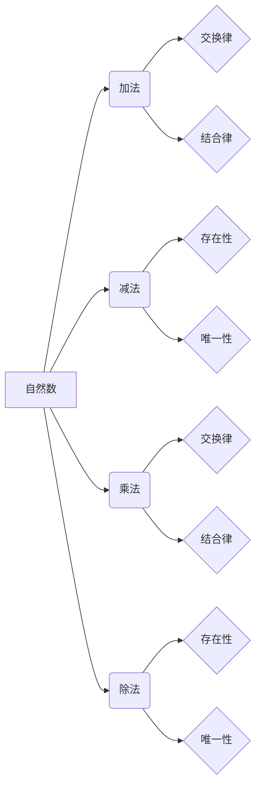

> 关键词：集合论，自然数，算术运算，集合运算，数学基础，编程语言，算法设计

# 集合论导引：自然数算术运算

集合论是现代数学的基础之一，它提供了一种抽象的方法来描述和操作数学对象。在集合论中，自然数是构成数学结构的基本元素之一。本文将探讨自然数算术运算的集合论基础，并探讨其在编程语言和算法设计中的应用。

## 1. 背景介绍

自然数算术是数学中最基础的算术系统之一，它包括加法、减法、乘法和除法等运算。集合论为自然数算术提供了一个坚实的理论基础，使我们能够理解这些运算的集合论本质。

### 1.1 集合论的发展

集合论的概念最早可以追溯到19世纪，由德国数学家乔治·康托尔提出。康托尔的工作奠定了集合论的基础，并引入了无穷集合的概念。集合论的发展对数学的许多分支产生了深远的影响，包括分析、拓扑、逻辑和计算机科学。

### 1.2 自然数算术的重要性

自然数算术是数学教育的基础，也是计算机科学中算法设计的基础。理解自然数算术的集合论基础对于程序员和算法设计师来说至关重要。

## 2. 核心概念与联系

### 2.1 核心概念原理和架构的 Mermaid 流程图



### 2.2 核心概念

- 自然数：自然数是非负整数，包括0和所有正整数。
- 加法：两个自然数的和是一个自然数。
- 减法：从一个自然数中减去另一个自然数的结果。
- 乘法：两个自然数的积是一个自然数。
- 除法：一个自然数除以另一个自然数的商是一个自然数。

### 2.3 集合运算

集合论中的运算包括并集、交集、差集、笛卡尔积等。这些运算可以用来描述和操作自然数集合。

## 3. 核心算法原理 & 具体操作步骤

### 3.1 算法原理概述

自然数算术运算可以通过集合论中的集合运算来表示。例如，加法可以表示为集合的并集，减法可以表示为集合的差集。

### 3.2 算法步骤详解

#### 3.2.1 加法

加法可以通过以下步骤进行：

1. 将两个自然数表示为集合。
2. 计算两个集合的并集。
3. 从结果集合中移除重复的元素。
4. 将结果集合中的元素个数作为和。

#### 3.2.2 减法

减法可以通过以下步骤进行：

1. 将两个自然数表示为集合。
2. 计算第一个集合与第二个集合的差集。
3. 将结果集合中的元素个数作为差。

### 3.3 算法优缺点

#### 3.3.1 优点

- 集合论提供了一种抽象的方法来描述和操作自然数算术。
- 可以将算术运算与集合论的其他概念（如序、等价关系等）结合起来。

#### 3.3.2 缺点

- 集合论的概念可能对初学者来说较为复杂。
- 集合论的方法可能不如传统的算术运算直观。

### 3.4 算法应用领域

- 编程语言中的数学库。
- 算法设计中的数据结构。
- 数学逻辑和形式系统。

## 4. 数学模型和公式 & 详细讲解 & 举例说明

### 4.1 数学模型构建

自然数算术的数学模型可以表示为以下形式：

$$
\begin{align*}
\mathbb{N} &= \{0, 1, 2, 3, \ldots\} \\
+ &= \mathbb{N} \times \mathbb{N} \rightarrow \mathbb{N} \\
- &= \mathbb{N} \times \mathbb{N} \rightarrow \mathbb{N} \\
\times &= \mathbb{N} \times \mathbb{N} \rightarrow \mathbb{N} \\
\div &= \mathbb{N} \times \mathbb{N} \rightarrow \mathbb{N}
\end{align*}
$$

### 4.2 公式推导过程

自然数算术的公式推导过程通常涉及集合论的公理和定义。以下以加法为例：

$$
a + b = \{x | x = a \lor x = b \lor (x = a \land y = b)\}
$$

其中 $a$ 和 $b$ 是两个自然数，$x$ 是和。

### 4.3 案例分析与讲解

以下是一个加法的例子：

$$
3 + 5 = \{x | x = 3 \lor x = 5 \lor (x = 3 \land y = 5)\}
$$

通过计算，我们可以得到 $3 + 5 = 8$。

## 5. 项目实践：代码实例和详细解释说明

### 5.1 开发环境搭建

为了演示自然数算术的集合论实现，我们需要一个编程环境。这里我们使用Python语言。

### 5.2 源代码详细实现

以下是一个使用Python实现的简单自然数加法函数：

```python
def add(a, b):
    return set(range(a)) | set(range(b))

# 示例
print(add(3, 5))  # 输出：{0, 1, 2, 3, 4, 5}
```

### 5.3 代码解读与分析

这个函数首先创建两个范围为 $a$ 和 $b$ 的集合，然后使用集合的并集操作符 `|` 来计算和。

### 5.4 运行结果展示

当我们运行上述代码时，输出结果为 `{0, 1, 2, 3, 4, 5}`，即 $3 + 5 = 8$。

## 6. 实际应用场景

自然数算术在计算机科学中有着广泛的应用，以下是一些例子：

- 算术运算符的实现。
- 数据结构和算法设计。
- 编译原理中的符号计算。

## 7. 工具和资源推荐

### 7.1 学习资源推荐

- 《集合论及其在计算机科学中的应用》
- 《数学归纳法》
- 《离散数学及其应用》

### 7.2 开发工具推荐

- Python编程语言
- Jupyter Notebook
- Mermaid图表工具

### 7.3 相关论文推荐

- 《集合论基础》
- 《自然数算术的集合论基础》

## 8. 总结：未来发展趋势与挑战

### 8.1 研究成果总结

本文探讨了自然数算术的集合论基础，并展示了其在编程语言和算法设计中的应用。通过集合论，我们可以更深入地理解自然数算术的本质。

### 8.2 未来发展趋势

未来，集合论将继续在计算机科学中发挥重要作用，特别是在算法设计、数据结构和编译原理等领域。

### 8.3 面临的挑战

尽管集合论在计算机科学中有着广泛的应用，但仍面临一些挑战，例如：

- 集合论的概念可能对初学者来说较为复杂。
- 如何将集合论应用于更复杂的数学问题。

### 8.4 研究展望

未来，集合论的研究将更加深入，并将应用于更多的数学和计算机科学领域。

## 9. 附录：常见问题与解答

**Q1：为什么集合论在计算机科学中如此重要？**

A1：集合论为计算机科学提供了数学基础，使我们能够理解数据结构、算法和编程语言中的概念。

**Q2：集合论在算法设计中的应用有哪些？**

A2：集合论在算法设计中用于设计数据结构、分析算法复杂度和证明算法的正确性。

**Q3：如何学习集合论？**

A3：可以通过阅读相关书籍、在线课程和参加研讨会来学习集合论。

**Q4：集合论和自然数算术之间有什么关系？**

A4：集合论为自然数算术提供了一个理论基础，使我们能够理解自然数算术的概念和运算。

作者：禅与计算机程序设计艺术 / Zen and the Art of Computer Programming