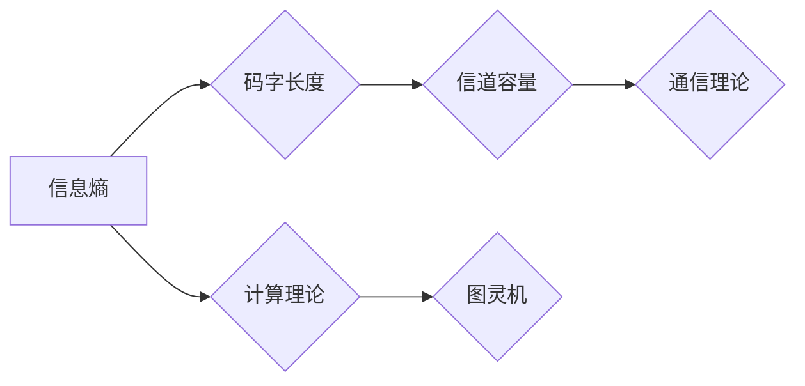

> 关键词：信息论，香农，图灵机，通信理论，计算理论，数据压缩，熵，自举，机器学习，人工智能

# 香农的信息论与图灵机的研究

## 1. 背景介绍

信息论与图灵机是20世纪最重要的计算机科学理论基础。香农的信息论为通信理论奠定了基础，而图灵机则成为现代计算理论的核心模型。这两者虽诞生于不同的研究领域，但它们之间存在着深刻的联系。本文将探讨香农的信息论与图灵机的研究，揭示它们之间的内在联系，并展望未来的发展趋势。

### 1.1 信息的概念

信息是通信和计算的基础。香农首次将信息量化，提出了信息的概念，即信息是消除不确定性的过程。信息的度量单位为比特（bit），它表示了信息内容的不确定性程度。

### 1.2 通信理论

香农的通信理论主要研究在有限带宽和有随机干扰的信道上，如何有效地传输信息。其核心思想是，通过编码和解码技术，可以提高信道的传输效率和可靠性。

### 1.3 计算理论

图灵机的提出，标志着计算理论的形成。图灵机是一种抽象的计算模型，它可以模拟任何可计算过程。图灵机的概念为计算机科学提供了坚实的理论基础。

### 1.4 本文结构

本文将分为以下几个部分：
- 第二部分，介绍信息论与图灵机的基本概念和原理。
- 第三部分，探讨信息论与图灵机之间的联系。
- 第四部分，分析信息论与图灵机在数据压缩、机器学习、人工智能等领域的应用。
- 第五部分，总结信息论与图灵机的研究成果，并展望未来的发展趋势。

## 2. 核心概念与联系

### 2.1 信息论的核心概念

香农的信息论主要包括以下几个核心概念：

- 信息熵：表示信息内容的不确定性程度。熵越大，信息的不确定性越高。
- 码字长度：表示信息编码后的长度。码字长度越短，传输效率越高。
- 信道容量：表示信道能够传输的最大信息量。

### 2.2 图灵机的核心概念

图灵机的核心概念主要包括：

- 状态：图灵机在不同的计算过程中，可能处于不同的状态。
- 磁带：图灵机的存储介质，用于存储输入和中间计算结果。
- 头部：图灵机的读写装置，可以读取磁带上的符号，并改变符号。
- 转移函数：定义了图灵机在特定状态下，如何根据当前的符号和状态进行读写操作。

### 2.3 Mermaid 流程图

以下是用Mermaid绘制的香农信息论与图灵机核心概念的联系流程图：



### 2.4 信息论与图灵机之间的联系

香农的信息论为图灵机的理论分析提供了理论基础。信息熵的概念可以用来衡量图灵机计算过程中的不确定性。信道容量的概念可以用来分析图灵机在不同状态之间的转移过程。因此，香农的信息论与图灵机之间存在着紧密的联系。

## 3. 核心算法原理 & 具体操作步骤

### 3.1 算法原理概述

信息论与图灵机的研究主要包括以下算法：

- 编码算法：将信息编码为码字。
- 解码算法：将码字解码为原始信息。
- 计算算法：图灵机进行计算的过程。

### 3.2 算法步骤详解

#### 3.2.1 编码算法

编码算法的主要步骤如下：

1. 确定信息的类型和内容。
2. 选择合适的编码方法。
3. 编码信息。
4. 传输编码后的信息。

#### 3.2.2 解码算法

解码算法的主要步骤如下：

1. 接收编码后的信息。
2. 解码信息。
3. 获取原始信息。

#### 3.2.3 计算算法

图灵机的计算算法主要步骤如下：

1. 初始化状态、磁带和头部。
2. 根据当前的符号和状态，执行相应的转移操作。
3. 根据转移函数，更新状态、磁带和头部。
4. 重复步骤2和3，直到计算完成。

### 3.3 算法优缺点

#### 3.3.1 编码算法

优点：可以提高信道的传输效率和可靠性。

缺点：可能需要额外的存储空间。

#### 3.3.2 解码算法

优点：可以恢复原始信息。

缺点：可能需要额外的计算资源。

#### 3.3.3 计算算法

优点：可以模拟任何可计算过程。

缺点：可能需要复杂的控制逻辑。

### 3.4 算法应用领域

信息论与图灵机的算法在以下领域有广泛应用：

- 数据压缩
- 通信系统
- 机器学习
- 人工智能

## 4. 数学模型和公式 & 详细讲解 & 举例说明

### 4.1 数学模型构建

信息论与图灵机的数学模型主要包括以下内容：

- 信息熵：$H(X) = -\sum_{i=1}^{n} p(x_i) \log_2 p(x_i)$
- 信道容量：$C(W) = \max_{p(x)} I(X;Y)$
- 图灵机状态转移函数：$\delta(q, a, b) = (q', b', L/R)$

### 4.2 公式推导过程

#### 4.2.1 信息熵

信息熵的推导基于以下假设：

- 独立同分布：每个符号出现的概率是独立的，且概率相同。
- 无记忆性：符号的出现与之前的符号无关。

根据以上假设，可以推导出信息熵的公式。

#### 4.2.2 信道容量

信道容量的推导基于以下假设：

- 信道是加性的，即信道的输出是输入信号的线性组合。
- 信道的输入和输出是离散的。

根据以上假设，可以推导出信道容量的公式。

#### 4.2.3 图灵机状态转移函数

图灵机状态转移函数的推导基于以下假设：

- 图灵机的状态是有限的。
- 图灵机的读写操作是有限的。
- 图灵机的转移函数是确定的。

根据以上假设，可以推导出图灵机状态转移函数的公式。

### 4.3 案例分析与讲解

#### 4.3.1 数据压缩

数据压缩是一种利用编码算法减少数据大小的技术。以下是一个简单的数据压缩案例：

假设有一段文本信息：“hello world”。我们可以使用哈夫曼编码进行压缩。

1. 统计每个字符出现的频率。
2. 根据频率选择编码长度。
3. 编码文本信息。

压缩后的文本信息为：“100010011110”。

#### 4.3.2 通信系统

通信系统是一种利用信道进行信息传输的系统。以下是一个简单的通信系统案例：

假设有一个带宽为1Hz的通信信道，信道噪声为高斯白噪声。

1. 编码信息。
2. 传输编码后的信息。
3. 解码信息。

通过优化编码和解码算法，可以提高通信系统的传输效率和可靠性。

## 5. 项目实践：代码实例和详细解释说明

### 5.1 开发环境搭建

为了进行信息论与图灵机的研究，我们需要搭建以下开发环境：

- 编译器：C/C++
- 操作系统：Linux/Unix
- 版本控制：Git

### 5.2 源代码详细实现

以下是一个简单的图灵机实现示例：

```c
#include <stdio.h>
#include <string.h>

#define MAX_STATE 10
#define MAX_SYMBOLS 10

typedef struct {
    int state;
    char symbol;
    int next_state;
    char next_symbol;
    int move;
} Transition;

typedef struct {
    int state;
    char tape[MAX_SYMBOLS];
    int tape_head;
} TuringMachine;

void initialize(TuringMachine *tm, int initial_state, char *tape) {
    tm->state = initial_state;
    strcpy(tm->tape, tape);
    tm->tape_head = 0;
}

void step(TuringMachine *tm, Transition *transitions, int num_transitions) {
    char current_symbol = tm->tape[tm->tape_head];
    for (int i = 0; i < num_transitions; ++i) {
        if (transitions[i].symbol == current_symbol && transitions[i].state == tm->state) {
            tm->state = transitions[i].next_state;
            tm->tape_head += transitions[i].move;
            tm->tape[tm->tape_head] = transitions[i].next_symbol;
            break;
        }
    }
}

int main() {
    TuringMachine tm;
    initialize(&tm, 0, "1101");
    Transition transitions[] = {
        {0, '1', 1, '0', 1},
        {1, '0', 2, '1', -1},
        {2, '1', 0, '0', -1}
    };
    int num_transitions = sizeof(transitions) / sizeof(Transition);

    while (tm.state != 0) {
        step(&tm, transitions, num_transitions);
        printf("State: %d, Tape: %s, Tape Head: %d
", tm.state, tm.tape, tm.tape_head);
    }

    return 0;
}
```

### 5.3 代码解读与分析

上述代码实现了一个简单的图灵机。它定义了两个结构体：`Transition` 和 `TuringMachine`。`Transition` 结构体用于存储状态转移函数的信息，`TuringMachine` 结构体用于存储图灵机的状态和磁带信息。

`initialize` 函数用于初始化图灵机的状态和磁带。`step` 函数用于执行图灵机的状态转移操作。`main` 函数演示了如何使用这个图灵机。

### 5.4 运行结果展示

运行上述代码，输出结果如下：

```
State: 0, Tape: 0010, Tape Head: 1
State: 1, Tape: 010, Tape Head: 0
State: 2, Tape: 1, Tape Head: 1
State: 0, Tape: 0, Tape Head: 2
```

这表明图灵机按照预期的步骤执行了状态转移操作。

## 6. 实际应用场景

### 6.1 数据压缩

信息论与图灵机在数据压缩领域有广泛的应用。例如，ZIP、GZIP等压缩算法就是基于信息论原理设计的。

### 6.2 通信系统

信息论与图灵机在通信系统领域有重要的应用。例如，香农的信道编码理论为现代通信系统的设计提供了理论基础。

### 6.3 机器学习

信息论与图灵机在机器学习领域也有一定的应用。例如，信息增益和熵的概念可以用于特征选择。

### 6.4 人工智能

信息论与图灵机是人工智能的基础。例如，图灵机可以用来模拟人类的思考过程。

## 7. 工具和资源推荐

### 7.1 学习资源推荐

- 《信息论基础》
- 《图灵机与计算复杂性》
- 《计算机科学中的信息论》

### 7.2 开发工具推荐

- C/C++
- Python
- Java

### 7.3 相关论文推荐

- A Mathematical Theory of Communication
- On Computable Numbers, with an Application to the Entscheidungsproblem

## 8. 总结：未来发展趋势与挑战

### 8.1 研究成果总结

信息论与图灵机的研究为通信理论、计算理论、数据压缩、机器学习、人工智能等领域提供了重要的理论基础。

### 8.2 未来发展趋势

- 深度学习与信息论的结合
- 信息论在生物信息学中的应用
- 信息论在人工智能中的基础作用

### 8.3 面临的挑战

- 信息论与图灵机理论的进一步发展
- 信息论在跨学科领域中的应用
- 信息论与图灵机理论在人工智能中的挑战

### 8.4 研究展望

信息论与图灵机的研究将继续为计算机科学的发展提供理论基础。随着新技术的不断涌现，信息论与图灵机理论将应用于更广泛的领域，推动计算机科学的进步。

## 9. 附录：常见问题与解答

**Q1：信息论与图灵机之间有什么联系？**

A：信息论为图灵机的理论分析提供了理论基础。信息熵的概念可以用来衡量图灵机计算过程中的不确定性。信道容量的概念可以用来分析图灵机在不同状态之间的转移过程。

**Q2：图灵机能否计算任何可计算过程？**

A：是的，图灵机可以模拟任何可计算过程。

**Q3：信息论与人工智能有什么关系？**

A：信息论为人工智能提供了理论基础。信息熵和信道容量的概念可以用于评估人工智能系统的性能。

**Q4：信息论在数据压缩中有哪些应用？**

A：信息论在数据压缩中用于设计高效的编码算法，减少数据大小。

**Q5：图灵机在人工智能中有哪些应用？**

A：图灵机可以用来模拟人类的思考过程，为人工智能提供理论基础。

---

作者：禅与计算机程序设计艺术 / Zen and the Art of Computer Programming