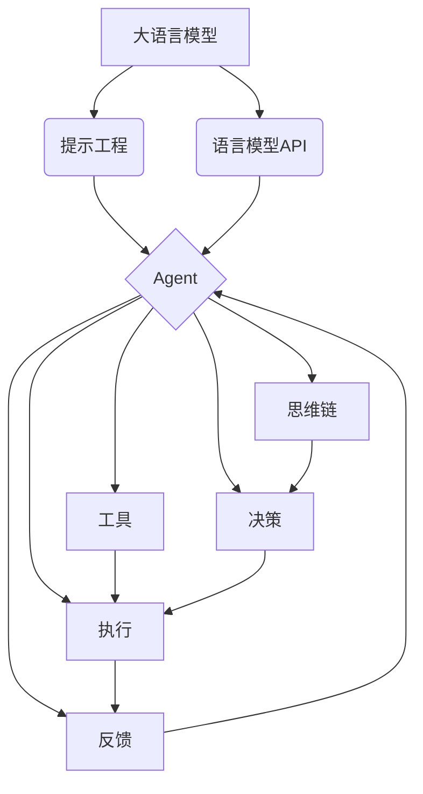

# 【大模型应用开发 动手做AI Agent】计划与执行

作者：禅与计算机程序设计艺术 / Zen and the Art of Computer Programming

## 1. 背景介绍

### 1.1 问题的由来

随着人工智能技术的飞速发展,尤其是大语言模型的出现,AI已经开始在各个领域展现出巨大的潜力。从ChatGPT到Anthropic Claude,从Midjourney到Stable Diffusion,AI正在以前所未有的速度改变着人们的生活和工作方式。在这个大语言模型和生成式AI大行其道的时代,如何利用这些强大的AI模型来开发实用的应用,已经成为了业界关注的焦点。

### 1.2 研究现状

目前,业界已经出现了许多基于大语言模型的AI应用,比如智能客服、虚拟助手、智能写作助手等。这些应用大多采用了prompt engineering的方式,通过设计精巧的prompt来引导语言模型生成所需的内容。但是,这种方式往往需要大量的人工参与,可扩展性和灵活性都比较有限。

同时,随着Langchain、AutoGPT等项目的兴起,AI Agent这一概念开始进入大众视野。所谓AI Agent,就是一个能够自主执行任务、自主学习和推理的AI系统。与传统的pipeline式AI应用不同,AI Agent具有更强的自主性和适应性,能够根据环境的变化动态调整自己的行为。这为大模型的应用开发带来了新的思路和方向。

### 1.3 研究意义

开发基于大模型的AI Agent,对于推动人工智能技术的发展和应用具有重要意义:

1. 探索大模型的应用边界,充分发挥大模型的潜力
2. 降低AI应用开发的门槛,让更多人能够参与到AI开发中来
3. 提高AI系统的自主性和适应性,使其能够更好地服务于人类
4. 加速人工智能在各行各业的落地应用,释放AI的商业价值

### 1.4 本文结构

本文将围绕"大模型应用开发 动手做AI Agent"这一主题,详细阐述AI Agent的核心概念、关键技术、开发流程和最佳实践。全文分为9个章节:

1. 背景介绍
2. 核心概念与联系
3. 核心算法原理 & 具体操作步骤
4. 数学模型和公式 & 详细讲解 & 举例说明
5. 项目实践:代码实例和详细解释说明
6. 实际应用场景
7. 工具和资源推荐
8. 总结:未来发展趋势与挑战
9. 附录:常见问题与解答

## 2. 核心概念与联系

在开始介绍AI Agent的技术细节之前,我们有必要先明确几个核心概念:

- 大语言模型(Large Language Model):以Transformer为基础架构,在海量文本语料上训练得到的语言模型,具有强大的语言理解和生成能力,代表模型有GPT-3、PaLM、LLaMA等。

- 提示工程(Prompt Engineering):通过设计精巧的提示(Prompt)来引导语言模型生成所需的内容,是目前大模型应用开发的主要范式。

- 语言模型API:将大语言模型包装成API服务,以RESTful API或者SDK的形式提供给开发者使用,代表有OpenAI API、Anthropic API等。

- 代理(Agent):一个能够感知环境、执行动作、优化目标的自主实体,常见的有反应式Agent、目标导向型Agent等。

- 工具(Tool):Agent执行任务时可以调用的外部函数或API,用于扩展Agent的认知和行动能力。

- 思维链(Chain of Thought):一种Prompt技术,通过引导模型进行逐步推理,来提高语言模型在复杂推理任务上的表现。

- 决策(Decision):Agent根据当前的观察和目标,从备选动作中选择最优动作的过程。

- 执行(Execution):Agent调用工具执行选定的动作,改变自身状态或影响环境。

- 反馈(Feedback):Agent根据动作的执行结果,更新自身的知识和策略,用于指导后续决策。

这些概念之间的关系可以用下图来表示:



从图中可以看出,大语言模型是AI Agent的核心,通过提示工程和API的方式为Agent提供认知和决策能力。Agent通过思维链进行逻辑推理,并根据观察和目标进行决策。决策的结果通过调用工具来执行,执行的效果又反馈给Agent,用于更新Agent的知识和策略。这是一个闭环的、持续学习和进化的过程。

## 3. 核心算法原理 & 具体操作步骤

### 3.1 算法原理概述

基于大模型的AI Agent的核心算法,可以概括为"观察-思考-决策-执行-反馈"的循环。其中,观察和执行主要依赖Agent对环境的感知和工具的调用,而思考、决策、反馈则主要依赖大语言模型的推理和生成能力。

具体来说,思考部分主要采用思维链(Chain of Thought)的Prompt方法。通过引导语言模型进行逐步推理,将复杂的决策过程分解为一系列简单的中间步骤,从而显著提高模型的推理和决策能力。

决策部分主要采用基于价值(Value Based)的方法。Agent根据当前的观察和知识,预估每个可能动作的价值,并选择价值最大的动作。这里的价值评估主要通过语言模型在相关领域的知识来实现。

反馈部分主要采用基于评价(Critique Based)的方法。Agent根据动作的执行效果,对之前的决策进行评价,并调整相应的知识和策略。这种自我评价和改进的能力,是Agent能够持续进化的关键。

### 3.2 算法步骤详解

基于大模型的AI Agent的完整工作流程,可以分为以下几个步骤:

1. 接收用户输入的任务描述,对任务进行理解和分解。
2. 根据任务形成明确的目标,并将其表示为一个Prompt。
3. 根据当前的观察(Observation)和任务目标,生成一系列可能的动作(Action)。
4. 对每个动作生成一个思维链,预估该动作的效果和价值。
5. 选择价值最大的动作,并通过调用相应的工具(Tool)来执行。
6. 根据动作的执行结果,对之前的决策进行评价和反馈。
7. 基于反馈更新Agent的知识和策略,并进入下一轮决策。
8. 重复3-7步,直到任务目标达成或达到最大迭代次数。

用伪代码表示如下:

```python
def ai_agent(task):
    goal = understand_task(task)
    observation = get_initial_observation()
    for i in range(max_iterations):
        actions = generate_actions(observation, goal)
        values = evaluate_actions(actions, observation, goal)
        best_action = select_best_action(actions, values)
        result = execute_action(best_action)
        observation = update_observation(observation, result)
        feedback = get_feedback(best_action, result, goal)
        update_agent(feedback)
        if is_goal_achieved(observation, goal):
            break
    return observation
```

### 3.3 算法优缺点

该算法的主要优点包括:

1. 利用了大语言模型强大的知识和推理能力,使Agent具备一定的常识和领域知识。
2. 采用思维链的方式进行决策,使得决策过程更加透明和可解释。
3. 引入了反馈机制,使得Agent能够不断地自我完善和提高。
4. 通过工具的扩展,Agent可以执行多样化的任务,适用范围广。

同时,该算法也存在一些局限和挑战:

1. 大模型的推理和决策能力仍然有限,尤其在需要深度领域知识的任务上表现不足。
2. Agent的行为可解释性有待进一步提高,在一些场景下可能难以理解Agent的决策逻辑。
3. 反馈和学习机制还比较初级,远未达到真正的持续学习的水平。
4. 缺乏成熟的工具体系,不同工具之间的兼容性和互操作性有待加强。

### 3.4 算法应用领域

尽管还存在诸多挑战,但基于大模型的AI Agent在许多领域已经展现出了巨大的应用前景,比如:

1. 智能办公:自动完成日程管理、邮件处理、文档撰写等办公任务。
2. 客户服务:7x24小时提供智能客服和售后支持,提高服务质量和效率。
3. 教育培训:提供个性化的学习助手和智能导师,优化学习路径和效果。
4. 金融分析:协助进行投资决策、风险评估、异常检测等金融分析工作。
5. 医疗健康:辅助医生进行病情诊断、治疗方案制定、健康管理等。

未来,随着大模型和Agent技术的不断发展,AI Agent必将在更多领域得到广泛应用,为人类的生活和工作带来巨大变革。

## 4. 数学模型和公式 & 详细讲解 & 举例说明

### 4.1 数学模型构建

为了更好地理解AI Agent的工作原理,我们可以尝试从数学角度对其进行建模。一个简单的数学模型如下:

我们用 $S$ 表示Agent的状态空间,用 $A$ 表示Agent的动作空间,用 $R$ 表示反馈或奖励。Agent的决策过程可以看作一个函数 $\pi: S \rightarrow A$,即根据当前状态选择一个动作。

Agent的目标是最大化累积奖励,可以表示为:

$$\max_{\pi} \mathbb{E}\left[\sum_{t=0}^{\infty} \gamma^t R_t \mid \pi \right]$$

其中,$\gamma \in [0,1]$ 是折扣因子,用于平衡短期和长期利益。$R_t$ 表示在 $t$ 时刻采取动作 $a_t$ 后获得的奖励。

在实际应用中,Agent通常无法直接求解这个优化问题,而是通过不断的试错和学习来逐步逼近最优策略。一种常见的方法是Q-learning,其核心思想是学习一个Q函数 $Q(s,a)$,表示在状态 $s$ 下采取动作 $a$ 的长期价值。Q函数的更新公式为:

$$Q(s,a) \leftarrow Q(s,a) + \alpha \left[r + \gamma \max_{a'} Q(s',a') - Q(s,a)\right]$$

其中,$\alpha \in (0,1]$ 是学习率,$s'$ 是在状态 $s$ 下采取动作 $a$ 后转移到的新状态。

### 4.2 公式推导过程

Q-learning的收敛性可以通过Bellman方程来证明。我们用 $V^*(s)$ 表示状态 $s$ 的最优价值函数,它满足如下的Bellman最优方程:

$$V^*(s) = \max_a \left[ R(s,a) + \gamma \sum_{s'} P(s'|s,a) V^*(s') \right]$$

其中,$R(s,a)$ 是在状态 $s$ 下采取动作 $a$ 的期望即时奖励,$P(s'|s,a)$ 是在状态 $s$ 下采取动作 $a$ 后转移到状态 $s'$ 的概率。

相应地,最优Q函数 $Q^*(s,a)$ 满足如下的Bellman最优方程:

$$Q^*(s,a) = R(s,a) + \gamma \sum_{s'} P(s'|s,a) \max_{a'} Q^*(s',a')$$

可以证明,对于任意的Q函数 $Q(s,a)$,反复应用如下的更新规则:

$$Q(s,a) \leftarrow R(s,a) + \gamma \sum_{s'} P(s'|s,a) \max_{a'} Q(s',a')$$

Q函数最终会收敛到 $Q^*(s,a)$。这就是Q-learning的理论基础。

### 4.3 案例分析与讲解

下面我们用一个简单的例子来说明Q-learning的具体应用。假设一个Agent需要在一个网格世界中寻找宝藏,如下