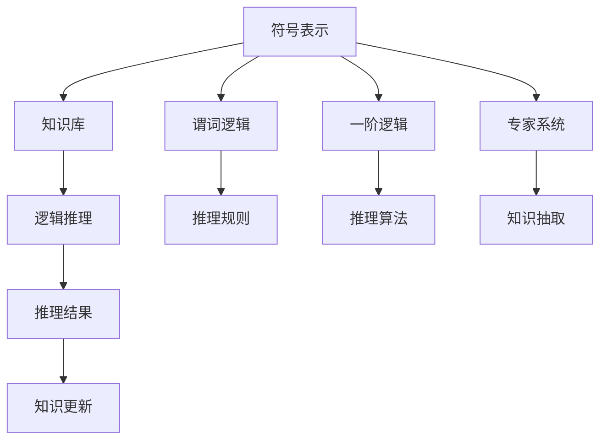

                 

# 人工智能的符号推理模型

## 1. 背景介绍

### 1.1 问题由来
在人工智能的发展过程中，符号推理模型（Symbolic Reasoning Model）一直是一个重要的研究领域。传统的符号逻辑推理与现代深度学习技术有着显著的区别，但各自有其独特的优势和应用场景。符号推理模型通过构建规则化的知识库和逻辑推理引擎，可以处理结构化、有明确逻辑关系的任务，如逻辑推理、定理证明、自然语言理解等。而深度学习模型则擅长处理大规模数据和复杂模式识别，但在解释性和推理能力上存在不足。

本文将聚焦于符号推理模型在人工智能中的应用，探讨其原理、实现技术及未来的发展方向。通过介绍符号推理模型的基本概念和核心算法，希望能够帮助读者理解其在人工智能领域的重要性和应用潜力。

## 2. 核心概念与联系

### 2.1 核心概念概述
符号推理模型主要依赖于符号计算和逻辑推理。其核心概念包括：

- **符号表示**：通过符号（如变量、常量、函数等）来表示问题和数据。
- **知识库**：包含一系列事实、规则、公理等知识，用于推理和决策。
- **逻辑推理**：通过逻辑规则和推理策略，从已知事实推导出新的结论。
- **命题逻辑**：使用符号逻辑表达和推理，如谓词逻辑、一阶逻辑等。

符号推理模型的目标是将人类知识用规则化、形式化的方式表达，通过自动化推理系统实现复杂的逻辑推理和决策。

### 2.2 核心概念原理和架构的 Mermaid 流程图


这个流程图展示了符号推理模型的基本架构。符号表示提供问题的形式化表达，知识库存储已有的知识事实，逻辑推理通过推理规则和算法从已知事实推导出新的结论，最后推理结果用于更新知识库。

## 3. 核心算法原理 & 具体操作步骤
### 3.1 算法原理概述
符号推理模型的核心算法包括谓词逻辑推理、一阶逻辑推理、专家系统推理等。这些算法主要依赖于符号表示和逻辑推理规则，通过自动化推理系统实现推理任务。

- **谓词逻辑推理**：使用谓词和谓词函数来表示和推理问题。例如，若$P(x)$表示“$x$是偶数”，$Q(x)$表示“$x$是质数”，则$P(x) \land \lnot Q(x)$表示“$x$是偶数但不是质数”。
- **一阶逻辑推理**：使用变量和函数来表示和推理问题，如$\forall x P(x) \land \exists x Q(x)$表示“所有$x$都是$P(x)$且存在$x$为$Q(x)$”。
- **专家系统推理**：构建规则化的知识库，利用规则引擎进行推理和决策。例如，在医疗诊断中，专家系统通过一系列的规则判断症状，得出可能的疾病诊断。

### 3.2 算法步骤详解
符号推理模型的核心步骤如下：

1. **符号表示**：将问题转换为符号表达式。
2. **知识库构建**：收集整理相关领域的知识事实和规则，构建知识库。
3. **逻辑推理**：根据已有的知识和规则，通过推理算法得出结论。
4. **结果验证**：验证推理结果的正确性，必要时修正知识库。
5. **推理优化**：通过反馈机制不断优化推理过程，提高推理效率和准确性。

### 3.3 算法优缺点
**优点**：
- **可解释性**：符号推理模型的推理过程是形式化和可解释的，便于理解和调试。
- **精确性**：逻辑推理具有高度的精确性，能够处理严格的逻辑关系。
- **可扩展性**：通过添加新的规则和知识，可以扩展模型处理的能力。

**缺点**：
- **复杂性**：符号推理模型的构建和维护较为复杂，需要领域专家和知识工程师的参与。
- **数据依赖**：依赖于高质量的知识库，数据获取和知识库构建是关键。
- **推理效率**：逻辑推理过程较为繁琐，适用于小规模、结构化问题的处理。

### 3.4 算法应用领域
符号推理模型在多个领域有广泛应用，包括：

- **人工智能规划**：用于生成最优解决方案，如路径规划、资源分配等。
- **自然语言处理**：处理自然语言理解、语义分析等任务，如问答系统、机器翻译等。
- **医疗诊断**：构建医疗诊断专家系统，进行疾病诊断和治疗方案推荐。
- **金融风险管理**：用于量化风险评估、欺诈检测等。
- **机器人控制**：用于路径规划、避障等。

## 4. 数学模型和公式 & 详细讲解 & 举例说明

### 4.1 数学模型构建
符号推理模型的数学模型通常基于逻辑代数和谓词逻辑。

- **谓词逻辑**：使用谓词和谓词函数来表示问题，如$P(x)$表示“$x$是偶数”，$Q(x)$表示“$x$是质数”。
- **一阶逻辑**：使用变量和函数来表示问题，如$\forall x P(x) \land \exists x Q(x)$表示“所有$x$都是$P(x)$且存在$x$为$Q(x)$”。

### 4.2 公式推导过程
以谓词逻辑为例，假设已知$P(x)$表示“$x$是偶数”，$Q(x)$表示“$x$是质数”，则推理规则$P(x) \land \lnot Q(x)$表示“$x$是偶数但不是质数”。其推导过程如下：

- $P(x)$表示“$x$是偶数”
- $Q(x)$表示“$x$是质数”
- $P(x) \land \lnot Q(x)$表示“$x$是偶数但不是质数”

推理过程可以通过逻辑代数公式$(P \land \lnot Q)$来表示，其中$\land$表示逻辑与，$\lnot$表示逻辑非。

### 4.3 案例分析与讲解
以一个简单的数学问题为例，说明符号推理模型的应用。

**问题**：求解方程$x^2 + 2x - 3 = 0$的根。

**解决方法**：

1. **符号表示**：将方程转换为符号表达式$x^2 + 2x - 3 = 0$。
2. **知识库构建**：将已知的数学规则如“二次方程求根公式”构建为知识库。
3. **逻辑推理**：使用求根公式$x = \frac{-b \pm \sqrt{b^2 - 4ac}}{2a}$进行推理。
4. **结果验证**：验证推理结果的正确性。

## 5. 项目实践：代码实例和详细解释说明

### 5.1 开发环境搭建
符号推理模型的开发通常使用Python，需要安装Sympy等符号计算库。

```python
pip install sympy
```

### 5.2 源代码详细实现
以谓词逻辑推理为例，实现一个简单的逻辑推理系统。

```python
from sympy import symbols, And, Or, Not

# 定义符号
x = symbols('x')
P = symbols('P')
Q = symbols('Q')

# 构建逻辑表达式
expr = And(P, Not(Q))

# 输出逻辑表达式
print(expr)
```

### 5.3 代码解读与分析
在上述代码中，我们使用Sympy库定义了符号$x$、$P$和$Q$，构建了逻辑表达式$P(x) \land \lnot Q(x)$。`And`函数表示逻辑与，`Not`函数表示逻辑非。

### 5.4 运行结果展示
运行上述代码，输出结果为：

```
And(P, Not(Q))
```

## 6. 实际应用场景

### 6.1 自然语言处理
符号推理模型在自然语言处理中具有重要应用。例如，在问答系统中，可以使用谓词逻辑推理来理解自然语言问题和上下文，从而生成准确的答案。

### 6.2 金融风险管理
符号推理模型可以用于量化风险评估和欺诈检测。通过构建知识库，模型可以推理出潜在风险和异常行为。

### 6.3 医疗诊断
符号推理模型可以构建医疗诊断专家系统，用于疾病诊断和治疗方案推荐。例如，根据病人的症状和医疗知识库，推理出可能的疾病。

### 6.4 未来应用展望
符号推理模型在未来仍有广泛的应用前景，例如：

- **多模态推理**：结合视觉、听觉等多种模态的信息进行推理。
- **自适应推理**：根据推理结果动态调整推理规则和知识库。
- **混合推理**：结合符号推理和深度学习，实现更强的推理能力。

## 7. 工具和资源推荐

### 7.1 学习资源推荐
- **书籍**：《人工智能导论》：详细介绍了符号推理模型及其应用，是理解符号推理模型的经典入门书籍。
- **在线课程**：Coursera上的《符号逻辑与推理》课程，提供系统性的符号推理学习。
- **社区**：SymbolicAI社区，汇集了符号推理领域的研究者、开发者，提供交流和学习平台。

### 7.2 开发工具推荐
- **Sympy**：符号计算库，提供丰富的符号计算功能，适用于符号推理模型的开发。
- **Prolog**：基于逻辑编程的语言，用于构建专家系统和推理引擎。

### 7.3 相关论文推荐
- **"Symbolic and Subsymbolic Approaches to AI"**：David E. Rumelhart等，探讨符号和子符号方法在人工智能中的应用。
- **"Expert Systems: Shifting the Paradigm for Knowledge-Based Systems"**：Gerald Leveson，探讨专家系统在知识表示和推理中的应用。

## 8. 总结：未来发展趋势与挑战

### 8.1 研究成果总结
符号推理模型在人工智能领域具有重要的应用价值，但其复杂的构建和维护是主要挑战。未来的研究将注重以下方面：

- **知识库自动化**：利用机器学习和数据挖掘技术，自动构建高质量的知识库。
- **推理算法优化**：开发高效的推理算法，提高推理效率。
- **混合推理方法**：结合符号推理和深度学习，实现更强的推理能力。

### 8.2 未来发展趋势
未来符号推理模型将朝着以下几个方向发展：

- **自动化构建**：利用机器学习技术，自动构建和优化知识库。
- **多模态推理**：结合视觉、听觉等多种模态的信息进行推理。
- **混合推理**：结合符号推理和深度学习，实现更强的推理能力。

### 8.3 面临的挑战
符号推理模型面临的主要挑战包括：

- **知识库构建**：高质量的知识库是符号推理模型的基础，但其构建和维护复杂。
- **推理算法复杂性**：逻辑推理过程繁琐，需要高效的算法支持。
- **混合推理**：符号推理和深度学习相结合的方法，仍需深入研究。

### 8.4 研究展望
符号推理模型在人工智能领域具有广阔的应用前景。未来的研究将探索以下方向：

- **自动化构建**：利用机器学习和数据挖掘技术，自动构建和优化知识库。
- **混合推理**：结合符号推理和深度学习，实现更强的推理能力。
- **多模态推理**：结合视觉、听觉等多种模态的信息进行推理。

## 9. 附录：常见问题与解答

**Q1: 符号推理模型与深度学习模型有何区别？**

A: 符号推理模型依赖于符号表示和逻辑推理，具有高度的精确性和可解释性。深度学习模型依赖于神经网络和数据驱动的训练，能够处理大规模数据和复杂模式识别，但缺乏符号推理的精确性和可解释性。

**Q2: 符号推理模型在哪些领域有应用？**

A: 符号推理模型在人工智能规划、自然语言处理、医疗诊断、金融风险管理、机器人控制等领域有广泛应用。

**Q3: 如何构建高质量的知识库？**

A: 构建高质量的知识库需要领域专家和知识工程师的参与，通过收集整理相关领域的知识事实和规则，不断迭代优化。

**Q4: 符号推理模型的推理效率如何？**

A: 逻辑推理过程繁琐，符号推理模型适用于小规模、结构化问题的处理。在处理大规模数据和复杂模式识别方面，深度学习模型更为高效。

**Q5: 符号推理模型与深度学习模型能否结合？**

A: 符号推理模型和深度学习模型可以结合使用，通过混合推理方法，实现更强的推理能力。

---

作者：禅与计算机程序设计艺术 / Zen and the Art of Computer Programming

