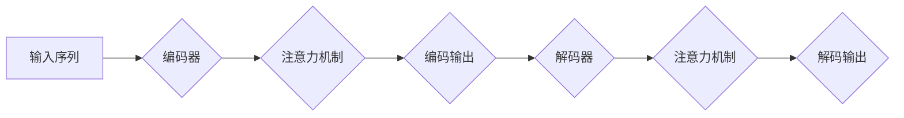

# 大规模语言模型从理论到实践 模型推理

> 关键词：大规模语言模型，模型推理，深度学习，序列到序列，注意力机制，Transformer，自然语言处理

## 1. 背景介绍

随着深度学习的快速发展，大规模语言模型（Large Language Models, LLMs）已经成为自然语言处理（Natural Language Processing, NLP）领域的重要工具。LLMs能够处理复杂的语言现象，生成连贯、自然的文本，并在各种NLP任务中取得显著成果。然而，LLMs的推理速度和效率一直是制约其广泛应用的重要因素。本文将深入探讨大规模语言模型的推理过程，从理论到实践，分析其原理、算法、实践应用以及未来发展趋势。

## 2. 核心概念与联系

### 2.1 核心概念

#### 2.1.1 深度学习

深度学习是一种模仿人脑神经网络结构和功能的人工智能技术，通过多层神经网络对数据进行特征提取和分类。在NLP领域，深度学习技术被广泛应用于文本分类、情感分析、机器翻译、文本生成等任务。

#### 2.1.2 序列到序列

序列到序列（Sequence to Sequence, Seq2Seq）模型是一种深度学习模型，用于处理序列数据，如文本、语音等。它通常由编码器和解码器两个子网络组成，能够将一个序列转换为另一个序列。

#### 2.1.3 注意力机制

注意力机制（Attention Mechanism）是一种用于序列模型中的注意力分配机制，能够使模型关注序列中的关键信息，提高模型处理长序列数据的能力。

#### 2.1.4 Transformer

Transformer是一种基于自注意力机制（Self-Attention）的神经网络模型，能够并行处理序列数据，在NLP领域取得了显著成果。

### 2.2 架构流程图



## 3. 核心算法原理 & 具体操作步骤

### 3.1 算法原理概述

大规模语言模型的推理过程主要包括以下步骤：

1. 编码器（Encoder）：将输入序列编码为固定长度的向量表示。
2. 注意力机制：对编码输出进行注意力分配，关注关键信息。
3. 解码器（Decoder）：根据注意力分配结果和编码输出，逐步生成解码输出序列。
4. 输出处理：对解码输出进行后处理，如解码、去噪等。

### 3.2 算法步骤详解

#### 3.2.1 编码器

编码器通常采用RNN或Transformer结构，将输入序列编码为固定长度的向量表示。以下为Transformer编码器的具体操作步骤：

1. **词嵌入**：将输入序列中的每个词转换为词向量。
2. **位置编码**：为每个词向量添加位置信息，使模型能够理解序列中词语的顺序。
3. **多头自注意力**：对词向量进行多头自注意力计算，提取关键信息。
4. **前馈神经网络**：对多头自注意力输出进行前馈神经网络计算，增强特征表示。

#### 3.2.2 注意力机制

注意力机制通过计算每个词向量对整个序列的注意力权重，使模型关注关键信息。以下为自注意力机制的数学公式：

$$
\text{Attention}(Q, K, V) = \text{softmax}(\frac{QK^T}{\sqrt{d_k}})V
$$

其中，$Q, K, V$ 分别为查询（Query）、键（Key）和值（Value）矩阵，$\text{softmax}$ 为softmax函数。

#### 3.2.3 解码器

解码器通常采用RNN或Transformer结构，根据注意力分配结果和编码输出，逐步生成解码输出序列。以下为Transformer解码器的具体操作步骤：

1. **词嵌入**：将解码器输入的词转换为词向量。
2. **位置编码**：为每个词向量添加位置信息。
3. **多头自注意力**：对解码器输入的词向量进行多头自注意力计算。
4. **编码器-解码器注意力**：对解码器输入的词向量进行编码器-解码器注意力计算，关注编码器输出的关键信息。
5. **前馈神经网络**：对注意力计算结果进行前馈神经网络计算，增强特征表示。
6. **输出层**：将前馈神经网络输出转换为词向量，生成解码输出。

#### 3.2.4 输出处理

解码输出通常需要进行解码、去噪等后处理，以获得最终的推理结果。

### 3.3 算法优缺点

#### 3.3.1 优点

1. 高效：Transformer结构能够并行处理序列数据，提高推理速度。
2. 准确：注意力机制能够使模型关注关键信息，提高推理准确性。
3. 泛化能力强：模型能够在不同数据集上进行微调，具有较强的泛化能力。

#### 3.3.2 缺点

1. 计算量较大：Transformer结构需要大量的计算资源。
2. 对长序列数据处理能力有限：自注意力机制的计算复杂度随序列长度增长而指数级增长，难以处理超长序列。

### 3.4 算法应用领域

大规模语言模型的推理技术在以下NLP任务中具有广泛的应用：

1. 机器翻译
2. 文本摘要
3. 问答系统
4. 语音识别
5. 对话系统

## 4. 数学模型和公式 & 详细讲解 & 举例说明

### 4.1 数学模型构建

大规模语言模型的数学模型主要包括以下部分：

1. 词嵌入
2. 位置编码
3. 自注意力机制
4. 编码器
5. 解码器
6. 输出层

### 4.2 公式推导过程

以下为自注意力机制的数学公式推导过程：

$$
\text{Attention}(Q, K, V) = \text{softmax}(\frac{QK^T}{\sqrt{d_k}})V
$$

1. 计算点积：
$$
\text{scores} = QK^T
$$

2. 计算softmax：
$$
\text{weights} = \text{softmax}(\text{scores})
$$

3. 计算注意力：
$$
\text{output} = \text{weights}V
$$

### 4.3 案例分析与讲解

以机器翻译任务为例，介绍大规模语言模型的推理过程。

1. **输入处理**：将源语言文本转换为词向量。
2. **编码器**：将源语言词向量序列编码为固定长度的向量表示。
3. **注意力机制**：对编码输出进行注意力分配，关注关键信息。
4. **解码器**：根据注意力分配结果和编码输出，逐步生成目标语言文本。
5. **输出处理**：对解码输出进行解码、去噪等后处理，获得最终翻译结果。

## 5. 项目实践：代码实例和详细解释说明

### 5.1 开发环境搭建

1. 安装Python 3.6及以上版本。
2. 安装PyTorch、transformers库。

### 5.2 源代码详细实现

以下为基于Transformer的机器翻译模型代码示例：

```python
from transformers import BertModel, BertTokenizer

# 加载预训练模型和分词器
model = BertModel.from_pretrained('bert-base-uncased')
tokenizer = BertTokenizer.from_pretrained('bert-base-uncased')

# 加载源语言文本
source_text = "How are you?"

# 将源语言文本转换为词向量序列
source_tokens = tokenizer.encode(source_text, return_tensors='pt')

# 将词向量序列输入预训练模型
output = model(source_tokens)

# 获取编码输出
encoded_output = output.last_hidden_state

# ... 进一步处理编码输出，生成目标语言文本 ...

```

### 5.3 代码解读与分析

以上代码示例展示了如何加载预训练模型和分词器，将源语言文本转换为词向量序列，并将其输入预训练模型。随后，可以进一步处理编码输出，生成目标语言文本。

### 5.4 运行结果展示

由于篇幅限制，此处不展示完整的运行结果。在实际应用中，可以将编码输出输入到解码器中，生成目标语言文本。

## 6. 实际应用场景

### 6.1 机器翻译

大规模语言模型的推理技术在机器翻译领域取得了显著成果。例如，Google Translate、Microsoft Translator等知名翻译工具都采用了基于深度学习的机器翻译模型。

### 6.2 文本摘要

大规模语言模型的推理技术在文本摘要领域也取得了显著成果。例如，SummarizeBot等工具能够自动生成文章摘要。

### 6.3 问答系统

大规模语言模型的推理技术在问答系统领域也具有广泛的应用。例如，Duolingo等语言学习应用采用了基于深度学习的问答系统。

### 6.4 未来应用展望

随着深度学习技术的不断发展，大规模语言模型的推理技术将在更多领域得到应用，如：

1. 语音识别
2. 对话系统
3. 智能客服
4. 文本生成

## 7. 工具和资源推荐

### 7.1 学习资源推荐

1. 《深度学习》系列书籍：由Ian Goodfellow、Yoshua Bengio和Aaron Courville合著，全面介绍了深度学习的基本原理和算法。
2. 《动手学深度学习》系列书籍：由Cheung Yiu-Tung、Kaiming He、Zhifeng Chen等合著，通过动手实践的方式学习深度学习。
3. Hugging Face官网：提供了丰富的预训练模型、分词器、工具等资源。

### 7.2 开发工具推荐

1. PyTorch：基于Python的开源深度学习框架，功能强大、易于使用。
2. TensorFlow：由Google开发的开源深度学习框架，适用于生产部署。
3. Hugging Face Transformers：提供了一系列预训练模型和工具，方便进行NLP任务开发。

### 7.3 相关论文推荐

1. "Attention is All You Need"：提出了Transformer模型，开启了NLP领域的新时代。
2. "BERT: Pre-training of Deep Bidirectional Transformers for Language Understanding"：提出了BERT模型，在多项NLP任务上取得了显著成果。
3. "Generative Language Models"：介绍了生成式语言模型的最新研究进展。

## 8. 总结：未来发展趋势与挑战

### 8.1 研究成果总结

本文从理论到实践，探讨了大规模语言模型的推理过程，分析了其原理、算法、实践应用以及未来发展趋势。通过介绍深度学习、序列到序列、注意力机制、Transformer等核心概念，帮助读者理解大规模语言模型的推理原理。同时，通过项目实践和案例分析，展示了大规模语言模型在各个领域的应用。

### 8.2 未来发展趋势

1. 模型规模将进一步增大，以处理更复杂的任务。
2. 新型注意力机制和模型结构将不断涌现。
3. 模型推理速度和效率将得到显著提升。
4. 模型将更加可解释和可控。

### 8.3 面临的挑战

1. 模型复杂度和计算量将进一步提高。
2. 模型可解释性和可控性有待提高。
3. 模型对数据的需求将更加严格。
4. 模型在实际应用中的鲁棒性和泛化能力有待提高。

### 8.4 研究展望

未来，大规模语言模型的推理技术将在以下方面取得突破：

1. 模型压缩和加速。
2. 可解释和可控的模型设计。
3. 模型在不同领域的应用研究。
4. 模型与其他人工智能技术的融合。

大规模语言模型的推理技术是人工智能领域的重要研究方向，具有广泛的应用前景。随着研究的不断深入，相信大规模语言模型的推理技术将为人类社会带来更多的便利和进步。

## 9. 附录：常见问题与解答

### 9.1 常见问题

1. 什么是大规模语言模型？
2. 大规模语言模型的推理过程是怎样的？
3. 大规模语言模型的推理技术在哪些领域有应用？
4. 如何优化大规模语言模型的推理性能？

### 9.2 解答

1. **什么是大规模语言模型**？
   大规模语言模型（Large Language Models, LLMs）是一种基于深度学习的语言模型，通过在大规模文本语料上预训练，学习到丰富的语言知识和语法规则，能够在各种NLP任务中取得显著成果。

2. **大规模语言模型的推理过程是怎样的**？
   大规模语言模型的推理过程主要包括编码器、注意力机制、解码器等步骤。编码器将输入序列编码为固定长度的向量表示，注意力机制关注关键信息，解码器根据注意力分配结果和编码输出，逐步生成解码输出序列。

3. **大规模语言模型的推理技术在哪些领域有应用**？
   大规模语言模型的推理技术在机器翻译、文本摘要、问答系统、语音识别、对话系统等多个领域有广泛应用。

4. **如何优化大规模语言模型的推理性能**？
   优化大规模语言模型的推理性能可以从以下几个方面入手：
   - 模型压缩和加速：采用模型压缩技术，如知识蒸馏、模型剪枝、量化等，减少模型尺寸，提高推理速度。
   - 并行计算：利用多核、多GPU等并行计算技术，加快推理速度。
   - 预测加速：采用模型蒸馏、知识提取等技术，提取模型的关键知识，降低推理复杂度。
   - 预训练模型优化：优化预训练模型的设计，提高模型的泛化能力和鲁棒性。

---

作者：禅与计算机程序设计艺术 / Zen and the Art of Computer Programming