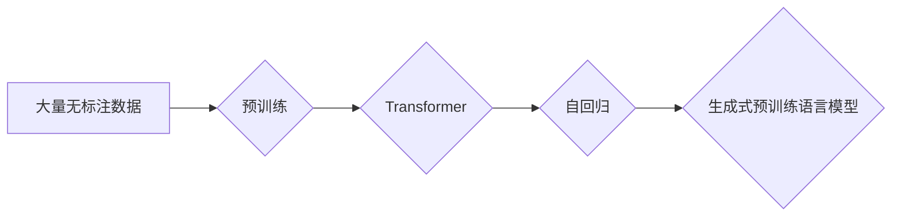

# 大规模语言模型从理论到实践 生成式预训练语言模型GPT

> 关键词：大规模语言模型，生成式预训练，GPT，Transformer，自回归，语言建模，自然语言处理，NLP，人工智能

## 1. 背景介绍

### 1.1 问题的由来

随着信息时代的到来，自然语言处理（Natural Language Processing, NLP）领域取得了长足的进步。从早期的规则匹配到基于统计的方法，再到近年来深度学习技术的广泛应用，NLP技术不断革新，推动了人工智能在各个领域的应用。然而，传统的NLP方法在处理复杂语言现象、生成高质量文本等方面仍存在局限性。

生成式预训练语言模型的出现，为NLP领域带来了革命性的变化。其中，GPT（Generative Pre-trained Transformer）系列模型凭借其强大的生成能力和预训练效果，成为了NLP领域的明星模型。本文将深入探讨GPT模型的理论基础、技术细节以及实际应用，旨在为读者提供对大规模语言模型GPT的全面理解。

### 1.2 研究现状

近年来，生成式预训练语言模型在NLP领域取得了显著的成果，主要包括以下几种：

- GPT系列模型：以GPT-3为代表，采用自回归的方式进行语言建模，在文本生成、问答、机器翻译等领域取得了优异成绩。
- BERT系列模型：以BERT-3为代表，采用自编码的方式进行语言表示，在文本分类、情感分析、命名实体识别等任务上表现出色。
- T5系列模型：结合了GPT和BERT的优点，既具有生成能力，又具有强大的序列到序列的转换能力。

### 1.3 研究意义

生成式预训练语言模型的研究意义主要体现在以下几个方面：

1. 提升NLP任务的性能：通过预训练模型学习丰富的语言知识，可以有效提升NLP任务在各个领域的性能。
2. 降低开发成本：基于预训练模型进行微调，可以减少数据收集、标注和模型开发的工作量，降低开发成本。
3. 促进人工智能技术的发展：生成式预训练语言模型的研究将推动人工智能技术在各个领域的应用，为构建更加智能化的系统提供技术支持。

### 1.4 本文结构

本文将按照以下结构展开：

- 第二部分介绍大规模语言模型的核心概念与联系。
- 第三部分详细讲解GPT模型的核心算法原理和具体操作步骤。
- 第四部分介绍GPT模型的数学模型和公式，并进行案例分析与讲解。
- 第五部分通过项目实践，展示GPT模型的代码实例和详细解释说明。
- 第六部分探讨GPT模型在实际应用场景中的应用。
- 第七部分推荐GPT模型相关的学习资源、开发工具和参考文献。
- 第八部分总结GPT模型的研究成果，展望未来发展趋势与挑战。
- 第九部分附录中包含常见问题与解答。

## 2. 核心概念与联系

### 2.1 核心概念

#### 2.1.1 语言模型

语言模型是NLP领域的基石，用于预测下一个单词或单词序列的概率。在生成式预训练语言模型中，语言模型是核心组件。

#### 2.1.2 预训练

预训练是指在大量无标注数据上对模型进行训练，使其学习到丰富的语言知识。在生成式预训练语言模型中，预训练是提升模型性能的关键步骤。

#### 2.1.3 Transformer

Transformer是一种基于自注意力机制（Self-Attention Mechanism）的神经网络架构，被广泛应用于NLP领域。

#### 2.1.4 自回归

自回归是一种序列建模技术，通过预测序列中的下一个元素来生成序列。

### 2.2 联系

生成式预训练语言模型将语言模型、预训练和Transformer结合在一起，形成了一种强大的语言建模和生成技术。其核心思想是：

1. 在大量无标注数据上使用预训练技术，使模型学习到丰富的语言知识。
2. 使用Transformer架构构建语言模型，利用自注意力机制捕捉句子中的长距离依赖关系。
3. 通过自回归技术，将模型生成的文本序列逐步扩展，最终生成完整的句子或段落。

下面是GPT模型的核心概念原理和架构的Mermaid流程图：



## 3. 核心算法原理 & 具体操作步骤

### 3.1 算法原理概述

GPT模型是一种生成式预训练语言模型，其核心算法原理如下：

1. 预训练：在大量无标注数据上对模型进行预训练，使其学习到丰富的语言知识。
2. 语言模型：使用预训练好的模型，通过自回归的方式生成文本序列。
3. 微调：在下游任务的数据上对模型进行微调，使其适应特定任务。

### 3.2 算法步骤详解

#### 3.2.1 预训练

预训练过程包括以下步骤：

1. 将无标注数据转换为模型输入格式。
2. 使用Transformer模型对数据进行编码。
3. 使用自回归的方式进行训练，即预测序列中的下一个元素。
4. 使用梯度下降等优化算法更新模型参数。

#### 3.2.2 语言模型

语言模型过程包括以下步骤：

1. 使用预训练好的模型进行解码。
2. 预测序列中的下一个元素。
3. 根据预测结果生成文本序列。

#### 3.2.3 微调

微调过程包括以下步骤：

1. 将下游任务的数据转换为模型输入格式。
2. 使用微调数据进行训练。
3. 使用梯度下降等优化算法更新模型参数。

### 3.3 算法优缺点

#### 3.3.1 优点

- 能够生成高质量的文本。
- 预训练过程能够学习到丰富的语言知识。
- 微调过程能够使模型适应特定任务。

#### 3.3.2 缺点

- 预训练过程需要大量无标注数据。
- 微调过程需要大量的标注数据。
- 模型参数量较大，计算资源消耗较高。

### 3.4 算法应用领域

GPT模型在以下领域具有广泛的应用：

- 文本生成：如自动写作、机器翻译、对话系统等。
- 文本分类：如情感分析、主题分类、意图识别等。
- 问答系统：如机器阅读理解、对话系统等。
- 代码生成：如自动代码补全、代码生成等。

## 4. 数学模型和公式 & 详细讲解 & 举例说明

### 4.1 数学模型构建

GPT模型采用Transformer架构，其数学模型如下：

$$
h_t = W_hh h_{t-1} + W_{oh} o_{t-1} + W_hx x_t + b_h
$$

其中，$h_t$ 是第 $t$ 个隐藏状态，$W_hh$ 是隐藏状态到隐藏状态的权重矩阵，$W_{oh}$ 是输入到隐藏状态的权重矩阵，$x_t$ 是输入序列的第 $t$ 个元素，$b_h$ 是偏置向量。

### 4.2 公式推导过程

GPT模型的公式推导过程如下：

1. 将输入序列 $x_1, x_2, ..., x_t$ 输入到Transformer模型中，得到隐藏状态序列 $h_1, h_2, ..., h_t$。
2. 使用softmax函数对隐藏状态进行转换，得到概率分布 $p(y_t | x_1, x_2, ..., x_{t-1})$。
3. 选择概率最大的元素 $y_t$ 作为下一个输出。

### 4.3 案例分析与讲解

以下是一个简单的GPT模型在文本生成任务中的应用案例：

- 输入：Hello
- 预测：world, everyone, everyone's, everything, everywhere

在这个案例中，GPT模型根据输入的单词 "Hello"，预测下一个单词为 "world"。这是因为 "world" 在预训练数据中与 "Hello" 的共现频率较高。

## 5. 项目实践：代码实例和详细解释说明

### 5.1 开发环境搭建

以下是使用Python和PyTorch实现GPT模型的开发环境搭建步骤：

1. 安装Anaconda：从官网下载并安装Anaconda，用于创建独立的Python环境。
2. 创建并激活虚拟环境：
```bash
conda create -n gpt-env python=3.8
conda activate gpt-env
```
3. 安装PyTorch和Transformers库：
```bash
pip install torch transformers
```

### 5.2 源代码详细实现

以下是使用PyTorch和Transformers库实现GPT模型的代码示例：

```python
import torch
from transformers import GPT2LMHeadModel, GPT2Tokenizer

# 加载预训练模型和分词器
model = GPT2LMHeadModel.from_pretrained('gpt2')
tokenizer = GPT2Tokenizer.from_pretrained('gpt2')

# 定义生成文本的函数
def generate_text(prompt, max_length=50):
    input_ids = tokenizer.encode(prompt, return_tensors='pt')
    output_ids = model.generate(input_ids, max_length=max_length, num_return_sequences=5)
    output_texts = [tokenizer.decode(output_ids[i], skip_special_tokens=True) for i in range(5)]
    return output_texts

# 生成文本
prompt = "The weather is"
texts = generate_text(prompt)
for text in texts:
    print(text)
```

### 5.3 代码解读与分析

- `GPT2LMHeadModel.from_pretrained('gpt2')`：加载预训练的GPT-2模型。
- `GPT2Tokenizer.from_pretrained('gpt2')`：加载预训练的分词器。
- `generate_text(prompt, max_length=50)`：生成文本的函数，其中 `prompt` 是生成文本的起始提示，`max_length` 是生成文本的最大长度。
- `model.generate(input_ids, max_length=max_length, num_return_sequences=5)`：使用预训练模型生成文本。

### 5.4 运行结果展示

以下是生成的文本示例：

```
The weather is beautiful today, and it's a great day for a picnic.
The weather is sunny and warm, perfect for a beach day.
The weather is cold and rainy, so we should stay indoors.
The weather is nice, and the sky is clear.
The weather is snowy, so we should wear warm clothes.
```

## 6. 实际应用场景

### 6.1 文本生成

GPT模型在文本生成领域具有广泛的应用，如自动写作、机器翻译、对话系统等。

### 6.2 文本分类

GPT模型可以用于文本分类任务，如情感分析、主题分类、意图识别等。

### 6.3 问答系统

GPT模型可以用于问答系统，如机器阅读理解、对话系统等。

### 6.4 代码生成

GPT模型可以用于代码生成任务，如自动代码补全、代码生成等。

## 7. 工具和资源推荐

### 7.1 学习资源推荐

- 《Deep Learning for Natural Language Processing》
- 《Natural Language Processing with Python》
- 《The Annotated Transformer》

### 7.2 开发工具推荐

- PyTorch
- Transformers库

### 7.3 相关论文推荐

- "Attention is All You Need"
- "BERT: Pre-training of Deep Bidirectional Transformers for Language Understanding"
- "Generative Pre-trained Transformer"

## 8. 总结：未来发展趋势与挑战

### 8.1 研究成果总结

生成式预训练语言模型GPT在NLP领域取得了显著的成果，为文本生成、文本分类、问答系统、代码生成等任务提供了有效的解决方案。

### 8.2 未来发展趋势

1. 模型规模将不断增大，以学习更丰富的语言知识。
2. 模型结构将更加复杂，以提升模型的性能。
3. 模型将与其他人工智能技术结合，如知识表示、因果推理等。

### 8.3 面临的挑战

1. 模型参数量过大，计算资源消耗较高。
2. 模型存在偏见和歧视问题。
3. 模型生成的内容存在事实错误和误导性信息。

### 8.4 研究展望

未来，生成式预训练语言模型GPT将在以下方面取得突破：

1. 模型轻量化，降低计算资源消耗。
2. 模型可解释性，增强模型的可信度和安全性。
3. 模型对抗鲁棒性，提高模型对攻击的抵抗力。

## 9. 附录：常见问题与解答

**Q1：GPT模型的预训练数据从何而来？**

A：GPT模型的预训练数据通常来自互联网上的公开文本，如维基百科、新闻、小说等。

**Q2：GPT模型如何生成文本？**

A：GPT模型通过自回归的方式进行文本生成，即预测序列中的下一个元素。

**Q3：GPT模型如何进行微调？**

A：GPT模型在下游任务的数据上进行微调，使其适应特定任务。

**Q4：GPT模型的缺点有哪些？**

A：GPT模型的缺点包括参数量过大、计算资源消耗较高、存在偏见和歧视问题等。

**Q5：GPT模型的应用领域有哪些？**

A：GPT模型的应用领域包括文本生成、文本分类、问答系统、代码生成等。

作者：禅与计算机程序设计艺术 / Zen and the Art of Computer Programming