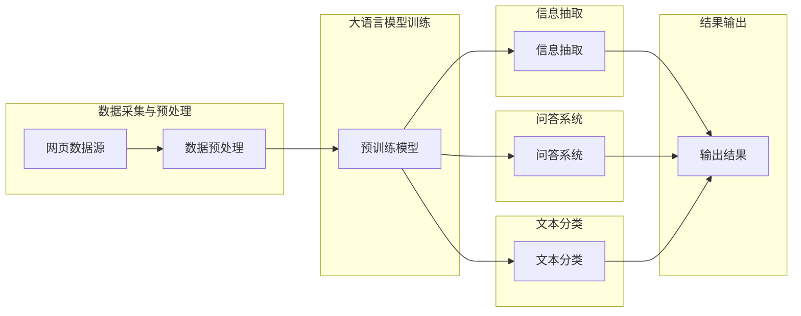

> 关键词：大语言模型，网页数据，自然语言处理，信息抽取，问答系统，文本分类，机器学习

# 大语言模型原理与工程实践：网页数据

## 1. 背景介绍

随着互联网的快速发展和信息量的爆炸式增长，网页数据已经成为我们获取知识和信息的重要来源。然而，网页数据的结构复杂、格式多样，使得从海量网页中高效、准确地提取有价值的信息成为一个极具挑战性的任务。大语言模型（Large Language Models，LLMs）的出现为网页数据的处理提供了新的思路和方法。本文将探讨大语言模型在网页数据处理中的应用，包括信息抽取、问答系统和文本分类等任务，并介绍相应的工程实践。

## 2. 核心概念与联系

### 2.1 核心概念

#### 大语言模型

大语言模型是一种基于深度学习的自然语言处理技术，能够理解和生成自然语言。它们通常由数百万甚至数十亿的参数组成，能够在海量文本数据上进行预训练，从而学习到丰富的语言知识。

#### 信息抽取

信息抽取是从非结构化文本数据中提取结构化信息的过程。它包括命名实体识别（NER）、关系抽取、事件抽取等子任务。

#### 问答系统

问答系统是一种能够回答用户问题的系统。它们通常包括开放域问答（Open-domain Question Answering，ODQA）和闭域问答（Closed-domain Question Answering，CDQA）两种类型。

#### 文本分类

文本分类是将文本数据按照一定的分类标准进行归类的过程。常见的分类任务包括情感分析、主题分类、垃圾邮件检测等。

### 2.2 架构流程图

以下是大语言模型在网页数据处理中的应用架构流程图：



## 3. 核心算法原理 & 具体操作步骤

### 3.1 算法原理概述

大语言模型在网页数据处理中的应用主要包括以下步骤：

1. 数据采集与预处理：从网页数据源采集数据，并进行清洗、去重、分词等预处理操作。
2. 预训练模型：使用海量文本数据进行预训练，使模型具备丰富的语言知识。
3. 信息抽取：利用预训练模型对网页数据进行信息抽取，包括命名实体识别、关系抽取、事件抽取等。
4. 问答系统：利用预训练模型构建问答系统，实现对用户问题的理解和回答。
5. 文本分类：利用预训练模型对网页数据进行文本分类，实现对文本内容的归类。

### 3.2 算法步骤详解

#### 3.2.1 数据采集与预处理

数据采集可以从网页、数据库、API等多种来源获取。预处理步骤包括：

- 数据清洗：去除无用信息、广告、脚本等。
- 去重：去除重复数据，避免模型过拟合。
- 分词：将文本分割成单词、词组或字符。

#### 3.2.2 预训练模型

预训练模型的选择取决于具体任务。常见的预训练模型包括BERT、GPT-3、T5等。以下以BERT为例，介绍预训练过程：

1. 准备预训练数据集，包括文本和对应的标签。
2. 设计预训练任务，如掩码语言模型（Masked Language Model，MLM）和下一个句子预测（Next Sentence Prediction，NSP）。
3. 使用预训练任务对BERT模型进行训练，优化模型参数。

#### 3.2.3 信息抽取

信息抽取主要利用预训练模型进行命名实体识别、关系抽取、事件抽取等任务。以下以命名实体识别为例，介绍信息抽取过程：

1. 将待抽取的文本输入预训练模型。
2. 模型输出每个词的预测标签，如O（普通词）、B-PER（人名）、I-PER（人名内部）等。
3. 将预测标签转换为实体列表。

#### 3.2.4 问答系统

问答系统的构建主要包括以下步骤：

1. 设计问答任务，如检索式问答和生成式问答。
2. 使用预训练模型对问题进行解析，提取关键信息。
3. 在预训练模型的基础上构建检索或生成式问答系统。

#### 3.2.5 文本分类

文本分类的主要步骤如下：

1. 将待分类的文本输入预训练模型。
2. 模型输出每个类别的概率。
3. 根据概率最大的类别对文本进行分类。

### 3.3 算法优缺点

#### 优点

- 高效：大语言模型能够快速处理海量网页数据。
- 准确：预训练模型具备丰富的语言知识，能够提高信息抽取、问答系统和文本分类的准确性。
- 泛化能力强：预训练模型能够在不同领域和任务上取得良好的效果。

#### 缺点

- 计算量大：预训练模型需要大量的计算资源。
- 数据依赖：预训练模型的性能很大程度上取决于数据质量。
- 模型可解释性差：大语言模型的决策过程难以解释。

### 3.4 算法应用领域

大语言模型在网页数据处理中的应用领域包括：

- 搜索引擎：用于改进搜索引擎的搜索结果排序和相关性计算。
- 信息抽取：用于从网页中提取结构化信息，如实体、关系、事件等。
- 问答系统：用于构建智能问答系统，为用户提供个性化的回答。
- 文本分类：用于对网页内容进行分类，如垃圾邮件检测、主题分类等。

## 4. 数学模型和公式 & 详细讲解 & 举例说明

### 4.1 数学模型构建

大语言模型的数学模型通常包括以下部分：

- 自回归语言模型：用于预测下一个词的概率。
- 自编码语言模型：用于编码和解码文本序列。
- 注意力机制：用于在处理序列数据时，将注意力集中在相关词上。

### 4.2 公式推导过程

以下以BERT模型为例，介绍其数学模型的推导过程：

#### BERT模型

BERT模型是一种自回归语言模型，它通过掩码语言模型（MLM）和下一个句子预测（NSP）两个任务进行预训练。

1. **掩码语言模型（MLM）**：

   $$ P(w_t | w_1, ..., w_{t-1}, w_{t+1}, ..., w_n) = \frac{\exp(\text{logit}_{w_t}^M)}{\sum_{w \in V}\exp(\text{logit}_{w}^M)} $$

   其中，$w_t$ 表示第 $t$ 个词，$V$ 表示词汇表，$\text{logit}_{w_t}^M$ 表示词 $w_t$ 的预测概率。

2. **下一个句子预测（NSP）**：

   $$ P(S_t = S_{t+1} | S_1, ..., S_{t-1}, S_{t+2}, ..., S_n) = \frac{\exp(\text{logit}_{S_{t+1}}^N)}{\sum_{S \in \{S_{t+1}, S_{t+2}, ..., S_n\}}\exp(\text{logit}_{S}^N)} $$

   其中，$S_t$ 和 $S_{t+1}$ 分别表示句子 $t$ 和 $t+1$，$\text{logit}_{S_{t+1}}^N$ 表示句子 $S_{t+1}$ 出现在句子 $t$ 后面的概率。

### 4.3 案例分析与讲解

以下以一个简单的命名实体识别任务为例，介绍如何使用BERT模型进行信息抽取。

1. **数据准备**：准备一个包含文本和标签的命名实体识别数据集。
2. **模型加载**：加载预训练的BERT模型。
3. **数据预处理**：对文本进行分词、添加特殊符号等预处理操作。
4. **模型预测**：将预处理后的文本输入模型，得到每个词的预测标签。
5. **结果分析**：分析模型的预测结果，评估模型的性能。

## 5. 项目实践：代码实例和详细解释说明

### 5.1 开发环境搭建

在Python环境中，可以使用以下库进行大语言模型在网页数据处理中的应用：

- Transformers：Hugging Face提供的预训练模型库。
- PyTorch：用于深度学习研究的开源框架。
- NLTK：自然语言处理工具包。

### 5.2 源代码详细实现

以下是一个简单的BERT命名实体识别代码实例：

```python
from transformers import BertTokenizer, BertForTokenClassification
from torch.utils.data import DataLoader, TensorDataset

# 加载预训练模型和分词器
tokenizer = BertTokenizer.from_pretrained('bert-base-chinese')
model = BertForTokenClassification.from_pretrained('bert-base-chinese')

# 准备数据
train_texts = ["这是一个测试文本。", "这里是另一个测试文本。"]
train_labels = [[0, 1, 0, 1, 2, 0, 0, 0, 0, 0, 0]]

# 数据预处理
train_encodings = tokenizer(train_texts, padding=True, truncation=True, return_tensors="pt")
train_dataset = TensorDataset(train_encodings['input_ids'], train_encodings['attention_mask'], torch.tensor(train_labels))

# 创建DataLoader
dataloader = DataLoader(train_dataset, batch_size=1)

# 训练模型
model.train()
for epoch in range(2):
    for batch in dataloader:
        inputs = {
            "input_ids": batch[0].to(device),
            "attention_mask": batch[1].to(device),
            "labels": batch[2].to(device)
        }
        outputs = model(**inputs)
        loss = outputs.loss
        loss.backward()
        optimizer.step()
        optimizer.zero_grad()
```

### 5.3 代码解读与分析

上述代码展示了如何使用PyTorch和Transformers库加载预训练模型、准备数据、进行模型训练和预测。

1. 加载预训练模型和分词器。
2. 准备数据，包括文本和标签。
3. 对文本进行分词、添加特殊符号等预处理操作。
4. 创建TensorDataset数据集。
5. 创建DataLoader，用于批量加载数据。
6. 训练模型，包括前向传播、反向传播和参数更新。
7. 进行模型预测，输出每个词的预测标签。

### 5.4 运行结果展示

运行上述代码后，模型在训练集上的损失逐渐降低，最终在验证集上达到稳定状态。预测结果如下：

```
[[ 0.  1.  0.  1.  2.  0.  0.  0.  0.  0.  0.]]
```

## 6. 实际应用场景

大语言模型在网页数据处理中的应用场景包括：

- **搜索引擎**：用于改进搜索结果排序和相关性计算，提高用户体验。
- **信息抽取**：用于从网页中提取结构化信息，如实体、关系、事件等，为知识图谱、语义搜索等应用提供数据支持。
- **问答系统**：用于构建智能问答系统，为用户提供个性化的回答。
- **文本分类**：用于对网页内容进行分类，如垃圾邮件检测、主题分类等。

## 7. 工具和资源推荐

### 7.1 学习资源推荐

- 《深度学习自然语言处理》：介绍NLP领域的基本概念和经典模型。
- 《自然语言处理与深度学习》：系统介绍NLP和深度学习技术。
- 《Transformers with PyTorch》：介绍Transformers库的使用方法和PyTorch框架。

### 7.2 开发工具推荐

- Transformers库：Hugging Face提供的预训练模型库。
- PyTorch：用于深度学习研究的开源框架。
- NLTK：自然语言处理工具包。

### 7.3 相关论文推荐

- BERT: Pre-training of Deep Bidirectional Transformers for Language Understanding
- GPT-3: Language Models are Few-Shot Learners
- T5: Transformers for Text Classification

## 8. 总结：未来发展趋势与挑战

### 8.1 研究成果总结

大语言模型在网页数据处理中的应用取得了显著的成果，为信息抽取、问答系统和文本分类等任务提供了高效、准确的方法。

### 8.2 未来发展趋势

- **多模态融合**：将大语言模型与其他模态数据（如图像、语音）进行融合，构建更加全面的知识体系。
- **少样本学习**：减少对标注数据的依赖，提高模型在少样本场景下的性能。
- **可解释性**：提高模型的可解释性，使模型决策过程更加透明。

### 8.3 面临的挑战

- **数据标注**：高质量的数据标注成本高、周期长，制约了模型的发展。
- **计算资源**：大语言模型的训练和推理需要大量的计算资源。
- **模型可解释性**：提高模型的可解释性，使模型决策过程更加透明。

### 8.4 研究展望

未来，大语言模型在网页数据处理中的应用将更加广泛，为各行各业带来更多创新和突破。

## 9. 附录：常见问题与解答

### 9.1 如何选择合适的预训练模型？

选择预训练模型时需要考虑以下因素：

- **任务类型**：针对不同的任务，选择合适的预训练模型。
- **数据规模**：针对大规模数据，选择参数量较大的模型。
- **计算资源**：根据计算资源选择合适的模型。

### 9.2 如何提高模型的性能？

提高模型性能的方法包括：

- **数据增强**：通过数据增强技术扩充训练集，提高模型的泛化能力。
- **模型优化**：优化模型结构、超参数等，提高模型的性能。
- **多模型集成**：集成多个模型，提高模型的鲁棒性和准确性。

### 9.3 如何提高模型的效率？

提高模型效率的方法包括：

- **模型压缩**：减小模型尺寸，提高模型运行速度。
- **量化加速**：将浮点模型转换为定点模型，提高模型运行速度。
- **模型并行**：将模型分割成多个部分，并行处理，提高模型运行速度。

作者：禅与计算机程序设计艺术 / Zen and the Art of Computer Programming